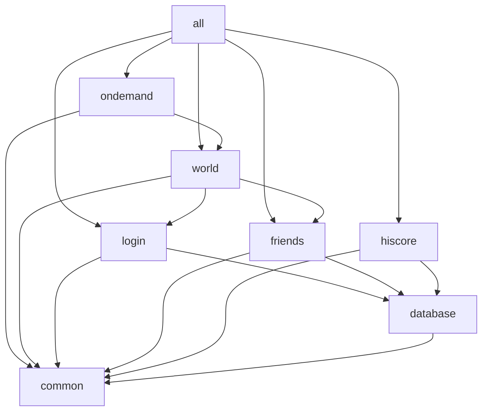

# Administrator's Guide

goscape is a RuneScape server engine that ships as a **single binary**. That one
process can run every part of the server, or just one part, depending on how you
configure it. This page explains what those parts are, how they depend on one
another, how the process starts and stops, and where it listens and stores data.
The remaining pages in this guide cover the practical details:
[Quick start](quickstart.md), [Configuration](configuration.md),
[Deployment scenarios](deployment.md), and the [Operations runbook](operations.md).

## Modules and the `--target` flag

Inside the binary, functionality is split into named **modules**. You choose which
modules run with the `--target` flag (or the equivalent `target:` key in the config
file). The selectable targets are:

| Target | What it runs |
|--------|--------------|
| `ondemand` | HTTP OnDemand server only (serves the game cache to clients) |
| `world` | TCP game server only |
| `login` | gRPC login service only |
| `friends` | Friends server only |
| `hiscore` | HTTP hiscores API only |
| `all` | All of the above (this is the default) |

Running `all` in one process gives you a self-contained server that needs no
external services. Selecting a single target lets you split the server across
several processes or hosts — for example, running the `login` service on its own
machine. Two of the modules, `common` and `database`, are internal: they exist to
wire the others together and are not meant to be chosen as a target directly.

## Module dependency graph

Modules declare dependencies on one another. When a module is selected, every module
it depends on is started first, in the correct order. The graph below shows those
dependencies exactly as they are declared in the source. **An arrow from A to B means
"A depends on B", so B starts before A.**



Reading the graph:

- **`common`** has no dependencies. It is an internal, invisible module that exists
  only to anchor the graph — a common root that everything else can depend on.
- **`database`** depends on `common`. It is also internal: it brings the central
  database schema up to date (runs migrations) before any database-using module
  starts. It holds no long-lived connection of its own.
- **`login`** and **`friends`** each depend on `common` and `database`. They are the
  two modules that read and write the central database, and each opens its own
  connection pool.
- **`world`** depends on `common`, `login`, and `friends` — the game server needs the
  login and friends services available before it accepts players.
- **`ondemand`** depends on `common` and `world`.
- **`all`** is a composite target that depends on `ondemand`, `friends`, `login`, and
  `world`; pulling those in transitively pulls in `common` and `database` as well.

## Service lifecycle

Every long-running module is wrapped as a **service**. Services follow a strict state
machine borrowed from Grafana's dskit library:

```
New → Starting → Running → Stopping → Terminated
```

A service that hits a problem in any of the `Starting`, `Running`, or `Stopping`
states instead moves to a terminal **`Failed`** state. So the full set of end states
is `Terminated` (stopped cleanly) or `Failed` (stopped because of an error).

Two behaviours are important to operators:

- **One failure stops the whole process.** The App root watches every service. If any
  single service enters the `Failed` state, the App stops the entire group of
  services, which cascades a shutdown to the rest and brings the process down. There
  is no partial, half-running state left behind.
- **One signal handler drives shutdown.** A single operating-system signal handler
  lives at the top level of the App. When it receives a stop signal (for example
  `SIGINT`/`Ctrl-C` or `SIGTERM`), it asks the service group to stop, and every
  service shuts down through its `Stopping` state in reverse dependency order —
  each module waits for the modules that depend on it to stop first. Individual
  modules do not install their own signal handlers.

!!! note "What this means in practice"
    A misconfiguration that prevents one module from starting — a bad cache path, an
    unreachable database — will fail that module and take the whole process down at
    startup, rather than leaving a degraded server running. Check the logs of the
    module named in the failure message.

## Network surfaces and ports

A full `all` deployment exposes five network listeners. The ports below are the ones
the bundled example config ends up with — the OnDemand and login ports are set
explicitly in it, while the world, friends, and hiscore ports come from built-in
defaults. Every port and bind address is configurable.

| Listener | Module | Protocol | Default port |
|----------|--------|----------|--------------|
| OnDemand | `ondemand` | HTTP | 8080 |
| Login | `login` | gRPC | 2004 |
| Friends | `friends` | gRPC | 2005 |
| Game world | `world` | TCP | 43594 |
| Hiscores API | `hiscore` | HTTP | 8082 |

The OnDemand HTTP server delivers the game cache to connecting clients. The login
service is a gRPC endpoint that authenticates players. The friends service is a
second gRPC endpoint serving friends and ignore lists; the world module consults it —
game clients never talk to it directly. The world server is a raw TCP listener that
carries live gameplay; its port is the one a game client connects to.

Behind these listeners is the **central database**, shared by the `login` and
`friends` modules. By default this is a local SQLite database file, which is why the
bundled configuration needs no external services. The backend can instead be set to
PostgreSQL, which allows `login` and `friends` to run on different hosts against one
shared network database. See [Configuration](configuration.md) for the `database:`
section.

## Data layout

With the bundled configuration, a running server keeps its state under a local `data`
directory:

| Path | Contents |
|------|----------|
| `./data/pack` | The packed game cache (the `main_file_cache.dat` and `idx` files). The OnDemand server serves cache archives from here, and the world server reads map data from it. This is the default cache location. |
| `data/goscape.db` | The central SQLite database, created on first run. Both `login` and `friends` are clients of it. |
| `data/players/` | Player save files, one per account. |

These locations are all configurable; the paths above are the defaults used by the
bundled preset. For the full set of options — every key at its default — see the
[Config reference](config-reference.md), and for host-level packaging see
[Deployment scenarios](deployment.md).
