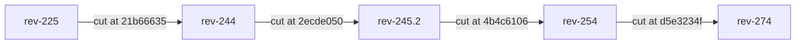

# Branch model

goscape ships **one Go port per game revision, and one branch per revision**.
There is no single "latest" engine branch that accumulates every revision;
instead each supported revision has its own long-lived branch that is a complete,
self-contained server for exactly that revision. This page explains how those
branches relate to one another and how each is tied to its upstream sources.

## One port per revision, cut from the nearest prior

A new revision branch is **cut from the nearest prior revision branch** and then
brought forward by translating the upstream Engine-TS delta for that gap (the
mechanics are in [Porting a new revision](porting.md)). The port of revision *N*
is, by construction, the port of revision *N−1* plus the translated TS diff — so
branching is the natural operation.

The supported revisions form a single lineage. Each arrow below points from a
branch to the branch cut from it, labelled with the exact commit on the parent
branch where the cut was made:

Reading the chain: `rev-244` was cut from `rev-225` at commit `21b66635`;
`rev-245.2` from `rev-244` at `2ecde050`; `rev-254` from `rev-245.2` at
`4b4c6106`; and `rev-274` from `rev-254` at `d5e3234f`. `rev-225` is the root of
the lineage and carries the full initial-port history.

Each branch stands on its own: it has its own engine code, its own tooling, and
its own CI. Revision branches deliberately **do not share code packages** — a
fix that applies to several revisions is translated into each branch
independently rather than factored into a shared library, because each branch is
a faithful translation of a *different* upstream revision and must be free to
diverge with it.

## "The pin is the commit hash"

Every revision branch is anchored to a precise set of upstream commits — the
Engine-TS translation source plus the Content, client, and compiler references
that the port was built against. These are recorded in the
[References & pins](references-pins.md) page (assembled from the repository's
`REFERENCES.md`), which is treated as a **lockfile** for the port.

The governing rule there is that **branch names move, so the commit hash is the
real pin.** Upstream branches like Engine-TS `274` advance over time; the number
in a table cell is only a label. What actually defines "the revision this port
corresponds to" is the pinned 40-character commit hash. When you need to know
what a goscape branch was translated from — to reproduce a diff, to audit a
region, or to advance a pin deliberately — you read the commit hash from the
pins page, never the upstream branch tip.

For the actual per-revision pin tables (Engine-TS, Content, Client-Java, the
compiler, and the gzip/renderer references), and for the notes that explain each
revision's toolchain and lineage quirks, see
[References & pins](references-pins.md).
