<!-- GENERATED by tools/docsgen — do not edit; regenerate instead. -->

# Items — page 1 (Knife – Goblin mail)

| Icon | Name | Description | Cost | Members | Stackable | Options |
|---|---|---|---|---|---|---|
|  | Knife | A dangerous looking knife. | 6 |  |  |  |
|  | Fur | This would make warm clothing. | 10 |  |  |  |
|  | Silk | It's a sheet of silk. | 30 |  |  |  |
| 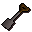 | Spade | A slightly muddy spade. | 3 |  |  | Dig |
| 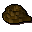 | Rope | A coil of rope. | 18 |  |  |  |
|  | Flier | Get your axes from Bob's Axes. | 1 |  |  |  |
|  | Grey wolf fur | This would make warm clothing. | 50 | yes |  |  |
| 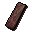 | Plank | A plank of wood! | 0 |  |  |  |
| 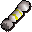 | Christmas cracker | I need to pull this | 0 |  |  |  |
|  | Skull | Ooooh spooky! | 0 |  |  |  |
|  | Tile | A fraction of a roof. | 0 |  |  |  |
| 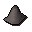 | Rock | A rock | 0 |  |  |  |
|  | Papyrus | Used for making notes. | 10 | yes |  |  |
| 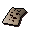 | Papyrus |  | 0 | yes |  |  |
|  | Charcoal | A lump of charcoal. | 45 |  |  |  |
| 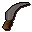 | Machete | A jungle specific slashing device. | 40 | yes |  | Wield |
| 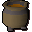 | Cooking pot |  | 0 |  |  |  |
|  | highwayman_mask |  | 0 |  |  |  |
|  | Disk of returning | Used to get out of Thordur's blackhole | 12 |  |  |  |
|  | Brass key | A mysterious key made of brass. | 0 |  |  |  |
| 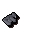 | Half of a key | A very shiny key. | 0 | yes |  |  |
| 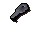 | Half of a key | A very shiny key. | 0 | yes |  |  |
| 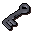 | Crystal key | A very rare and mysterious key. | 0 | yes |  |  |
| 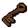 | Muddy key | It looks like a key to a chest. | 0 |  |  |  |
|  | Sinister key | You get a sense of dread from this key. | 0 | yes |  |  |
|  | Coins | Lovely money! | 0 |  | yes |  |
| 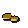 | coins_2 |  | 0 |  | yes |  |
|  | coins_3 |  | 0 |  | yes |  |
|  | coins_4 |  | 0 |  | yes |  |
| 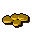 | coins_5 |  | 0 |  | yes |  |
|  | coins_25 |  | 0 |  | yes |  |
|  | coins_100 |  | 0 |  | yes |  |
|  | coins_250 |  | 0 |  | yes |  |
|  | coins_1000 |  | 0 |  | yes |  |
|  | coins_10000 |  | 0 |  | yes |  |
|  | White apron | A mostly clean apron. | 2 |  |  | Wear |
|  | Brass necklace | I'd prefer a gold one. | 30 |  |  | Wear |
|  | Blue skirt | Leg covering favoured by women and wizards. | 2 |  |  | Wear |
| 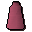 | Pink skirt | A ladies skirt. | 2 |  |  | Wear |
| 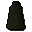 | Black skirt | Clothing favoured by women and dark wizards. | 2 |  |  | Wear |
|  | Eye patch | A black piece of cloth on a string. | 2 | yes |  | Wear |
|  | Robe of zamorak | A robe worn by worshippers of Zamorak. | 30 | yes |  | Wear |
|  | Robe of zamorak | A robe worn by worshippers of Zamorak. | 40 | yes |  | Wear |
| 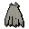 | Cape of legends | The cape worn by members of the Legends Guild. | 450 | yes |  | Wear |
|  | Staff of iban | A Magical staff., A highly magical staff. | 42500 | yes |  | Wield |
|  | Broken iban staff | The staff is unusable in this state. | 20 | yes |  |  |
|  | Farmers fork |  | 0 |  |  |  |
| 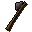 | Halberd |  | 0 |  |  |  |
| 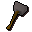 | Warhammer |  | 0 |  |  |  |
|  | Javelin |  | 0 |  |  |  |
|  | Scythe |  | 0 |  |  | Wield |
|  | Archery ticket | I can exchange this for equipment. | 25 | yes | yes |  |
|  | Weapon poison | For use on daggers and projectiles. | 11 | yes |  |  |
| 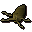 | Sea slug | A rather nasty looking crustacean. | 4 | yes |  |  |
|  | Damp sticks | Some damp wooden sticks. | 0 | yes |  |  |
|  | Dry sticks | Some dry wooden sticks. | 0 | yes |  | Rub-together |
|  | Broken glass | Smashed glass. | 0 | yes |  |  |
|  | Amulet of accuracy | It increases my aim. | 100 |  |  | Wear |
|  | Lockpick |  | 20 | yes |  |  |
|  | Garlic | A clove of garlic. | 3 |  |  |  |
| 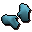 | Ice gloves | These will keep my hands cold! | 6 | yes |  | Wear |
|  | Oily fishing rod | Useful for catching lava eels. | 15 | yes |  |  |
|  | obj_1589 |  | 0 |  |  |  |
|  | Dusty key | I wonder what this unlocks? | 0 | yes |  |  |
|  | Jail key | Key to a cell. | 0 | yes |  |  |
|  | Desert shirt | A cool, light desert shirt. | 40 | yes |  | Wear |
|  | Desert robe | A cool, light desert robe. | 40 | yes |  | Wear |
| 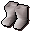 | Desert boots | Comfortable desert shoes. | 20 | yes |  | Wear |
| 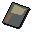 | Shantay pass | Allows you to pass through the Shantay pass into the Kharid Desert. | 5 | yes | yes |  |
| 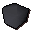 | Rock | Looks like a plain rock, must have some ore in it? | 0 | yes |  |  |
|  | obj_2420 |  | 0 |  |  |  |
|  | obj_2422 |  | 0 |  |  |  |
|  | obj_2425 |  | 0 |  |  |  |
|  | obj_2480 |  | 0 |  |  |  |
|  | newbieshrimp |  | 0 |  |  |  |
|  | obj_2513 |  | 0 |  |  |  |
|  | Rotten tomato | Pretty smelly. | 1 | yes |  |  |
|  | Toy horsey | A brown toy horse. | 100 |  |  | Play-with |
|  | Toy horsey | A white toy horse. | 100 |  |  | Play-with |
| 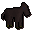 | Toy horsey | A black toy horse. | 100 |  |  | Play-with |
| 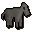 | Toy horsey | A grey toy horse. | 100 |  |  | Play-with |
|  | Worm | Ugh! It's wriggling! | 0 | yes |  |  |
| 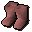 | Boots | They're soft and silky. | 200 | yes |  | Wear |
|  | Boots | They're soft and silky. | 200 | yes |  | Wear |
|  | Boots | They're soft and silky. | 200 | yes |  | Wear |
| 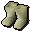 | Boots | They're soft and silky. | 200 | yes |  | Wear |
|  | Boots | They're soft and silky. | 200 | yes |  | Wear |
|  | Robe top | The ultimate in gnome design. | 180 | yes |  | Wear |
|  | Robe top | The ultimate in gnome design. | 180 | yes |  | Wear |
| 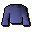 | Robe top | The ultimate in gnome design. | 180 | yes |  | Wear |
| 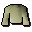 | Robe top | The ultimate in gnome design. | 180 | yes |  | Wear |
|  | Robe top | The ultimate in gnome design. | 180 | yes |  | Wear |
|  | Robe bottoms | Made by Tree Gnomes. | 180 | yes |  | Wear |
| 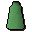 | Robe bottoms | Made by Tree Gnomes. | 180 | yes |  | Wear |
| 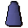 | Robe bottoms | Made by Tree Gnomes. | 180 | yes |  | Wear |
| 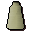 | Robe bottoms | Made by Tree Gnomes. | 180 | yes |  | Wear |
| 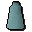 | Robe bottoms | Made by Tree Gnomes. | 180 | yes |  | Wear |
|  | Hat | A silly pointed hat. | 160 | yes |  | Wear |
|  | Hat | A silly pointed hat. | 160 | yes |  | Wear |
| 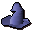 | Hat | A silly pointed hat. | 160 | yes |  | Wear |
|  | Hat | A silly pointed hat. | 160 | yes |  | Wear |
| 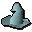 | Hat | A silly pointed hat. | 160 | yes |  | Wear |
| 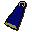 | Cape of saradomin | A cape from the almighty god Saradomin. | 100 | yes |  | Wear |
|  | Cape of guthix | A cape from the almighty god Guthix. | 100 | yes |  | Wear |
|  | Cape of zamorak | A cape from the almighty god Zamorak. | 100 | yes |  | Wear |
|  | Staff of saradomin | It's a stick of the gods. | 80000 | yes |  | Wield |
| 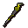 | Staff of guthix | It's a stick of the gods. | 80000 | yes |  | Wield |
|  | Staff of zamorak | It's a stick of the gods. | 80000 | yes |  | Wield |
|  | Insect repellent | Drives away all known 6 legged creatures. | 3 | yes |  |  |
|  | Bucket of wax | It's a bucket of wax. | 6 | yes |  |  |
|  | Poison chalice | A cup of a strange brew... | 20 | yes |  | Drink |
|  | Paramaya ticket | Allows you to rest in the luxurious Paramayer Inn. | 5 | yes |  |  |
|  | Ship ticket | Allows you passage on the 'Lady of the waves' ship. | 5 | yes |  |  |
| 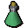 | Potion | This is meant to be good for spots. | 0 |  |  |  |
| 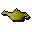 | Lamp | Wonder what happens if I rub it... | 0 |  |  | Rub |
|  | template_for_cert |  | 0 |  | yes |  |
|  | Flowers | A posy of flowers. | 100 | yes |  | Wield |
|  | Flowers | A posy of flowers. | 100 | yes |  | Wield |
| 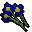 | Flowers | A posy of flowers. | 100 | yes |  | Wield |
| 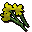 | Flowers | A posy of flowers. | 100 | yes |  | Wield |
|  | Flowers | A posy of flowers. | 100 | yes |  | Wield |
|  | Flowers | A posy of flowers. | 100 | yes |  | Wield |
| 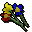 | Flowers | A posy of flowers. | 100 | yes |  | Wield |
| 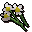 | Flowers | A posy of flowers. | 100 | yes |  | Wield |
|  | Flowers | A posy of flowers. | 100 | yes |  | Wield |
| 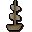 | War ship | A model of a Karamja warship. | 2 | yes |  |  |
|  | Bunny ears | A rabbit-like adornment. | 0 |  |  | Wear |
|  | Red partyhat | A nice hat from a cracker. | 0 |  |  | Wear |
|  | Yellow partyhat | A nice hat from a cracker. | 0 |  |  | Wear |
|  | Blue partyhat | A nice hat from a cracker. | 0 |  |  | Wear |
|  | Green partyhat | A nice hat from a cracker. | 0 |  |  | Wear |
|  | Purple partyhat | A nice hat from a cracker. | 0 |  |  | Wear |
|  | White partyhat | A nice hat from a cracker. | 0 |  |  | Wear |
| 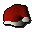 | Santa hat |  | 160 |  |  | Wear, Wear |
| 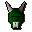 | Halloween mask | Aaaarrrghhh ... i'm a monster. | 15 |  |  | Wear |
|  | Halloween mask | Aaaarrrghhh ... i'm a monster. | 15 |  |  | Wear |
|  | Halloween mask | Aaaarrrghhh ... i'm a monster. | 15 |  |  | Wear |
|  | Newcomer map | Issued by RuneScape Council to all new citizens. | 1 |  |  | Read |
| 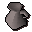 | Jug | This jug is empty. | 1 |  |  |  |
| 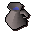 | Jug of water | It's full of water. | 1 |  |  |  |
|  | Bucket | It's a wooden bucket. | 2 |  |  |  |
|  | Bucket of water | It's a bucket of water. | 6 |  |  |  |
| 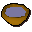 | Bowl of water | It's a bowl of water. | 4 |  |  |  |
|  | Bowl | Useful for mixing things. | 4 |  |  |  |
|  | Waterskin(4) | A full waterskin with four portions of water. | 30 | yes |  |  |
|  | Waterskin(3) | A nearly full waterskin with three portions of water. | 27 | yes |  |  |
|  | Waterskin(2) | A half empty waterskin with two portions of water. | 24 | yes |  |  |
|  | Waterskin(1) | A nearly empty waterskin with one portion of water. | 18 | yes |  |  |
|  | Waterskin(0) | A totaly empty waterskin - you'll need to fill it up. | 15 | yes |  |  |
|  | Strange fruit | I wonder what this tastes like? | 0 | yes |  | Eat |
|  | Pickaxe handle | Useless without the head. | 1 |  |  |  |
|  | Broken pickaxe | Nurmof can fix this for me. | 0 |  |  |  |
|  | Broken pickaxe | Nurmof can fix this for me. | 0 |  |  |  |
|  | Broken pickaxe | Nurmof can fix this for me. | 17 |  |  |  |
|  | Broken pickaxe | Nurmof can fix this for me. | 43 |  |  |  |
|  | Broken pickaxe | Nurmof can fix this for me. | 107 |  |  |  |
|  | Broken pickaxe | Nurmof can fix this for me. | 1100 |  |  |  |
|  | Pickaxe head | It's missing a handle. | 1 |  |  |  |
|  | Pickaxe head | It's missing a handle. | 139 |  |  |  |
|  | Pickaxe head | It's missing a handle. | 499 |  |  |  |
|  | Pickaxe head | It's missing a handle. | 1299 |  |  |  |
|  | Pickaxe head | It's missing a handle. | 3199 |  |  |  |
|  | Pickaxe head | It's missing a handle. | 31999 |  |  |  |
|  | Axe handle | Useless without the head. | 1 |  |  |  |
|  | Broken axe | Bob can fix this for me. | 0 |  |  |  |
|  | Broken axe | Bob can fix this for me. | 0 |  |  |  |
|  | Broken axe | Bob can fix this for me. | 0 |  |  |  |
|  | Broken axe | Bob can fix this for me. | 10 |  |  |  |
|  | Broken axe | Bob can fix this for me. | 18 |  |  |  |
|  | Broken axe | Bob can fix this for me. | 43 |  |  |  |
|  | Broken axe | Bob can fix this for me. | 427 |  |  |  |
|  | Axe head | It's missing a handle. | 15 |  |  |  |
|  | Axe head | It's missing a handle. | 55 |  |  |  |
|  | Axe head | It's missing a handle. | 199 |  |  |  |
|  | Axe head | It's missing a handle. | 383 |  |  |  |
|  | Axe head | It's missing a handle. | 519 |  |  |  |
|  | Axe head | It's missing a handle. | 1279 |  |  |  |
|  | Axe head | It's missing a handle. | 12799 |  |  |  |
|  | Gnomeball | A ball from the game Gnomeball | 0 | yes |  | Hold |
|  | Chart | A navigator's chart of RuneScape. | 2 | yes |  |  |
|  | Watch | A fine looking time piece. | 100 | yes |  |  |
|  | Sextant | Used by navigators to find their position in RuneScape. | 50 | yes |  | Look through |
|  | Casket | I hope there's treasure in it. | 50 | yes |  | Open |
|  | Casket | I hope there's treasure in it. | 50 | yes | yes | Open |
|  | Casket | I hope there's treasure in it. | 50 | yes |  | Open |
|  | Casket | I hope there's treasure in it. | 50 | yes | yes | Open |
|  | Casket | I hope there's treasure in it. | 50 | yes |  | Open |
|  | Casket | I hope there's treasure in it. | 50 | yes | yes | Open |
|  | Casket | I hope there's treasure in it. | 50 | yes |  | Open |
|  | Casket | I hope there's treasure in it. | 50 | yes |  | Open |
|  | Casket | I hope there's treasure in it. | 50 | yes |  | Open |
|  | Casket | I hope there's treasure in it. | 50 | yes |  | Open |
|  | Casket | I hope there's treasure in it. | 50 | yes |  | Open |
|  | Casket | I hope there's treasure in it. | 50 | yes |  | Open |
|  | Casket | I hope there's treasure in it. | 50 | yes |  | Open |
|  | Casket | I hope there's treasure in it. | 50 | yes |  | Open |
|  | Casket | I hope there's treasure in it. | 50 | yes |  | Open |
|  | Casket | I hope there's treasure in it. | 50 | yes |  | Open |
|  | Sliding piece |  | 0 | yes |  | Move |
|  | Sliding piece |  | 0 | yes |  | Move |
|  | Sliding piece |  | 0 | yes |  | Move |
|  | Sliding piece |  | 0 | yes |  | Move |
|  | Sliding piece |  | 0 | yes |  | Move |
|  | Sliding piece |  | 0 | yes |  | Move |
|  | Sliding piece |  | 0 | yes |  | Move |
|  | Sliding piece |  | 0 | yes |  | Move |
|  | Sliding piece |  | 0 | yes |  | Move |
|  | Sliding piece |  | 0 | yes |  | Move |
|  | Sliding piece |  | 0 | yes |  | Move |
|  | Sliding piece |  | 0 | yes |  | Move |
|  | Sliding piece |  | 0 | yes |  | Move |
|  | Sliding piece |  | 0 | yes |  | Move |
|  | Sliding piece |  | 0 | yes |  | Move |
|  | Sliding piece |  | 0 | yes |  | Move |
|  | Sliding piece |  | 0 | yes |  | Move |
|  | Sliding piece |  | 0 | yes |  | Move |
|  | Sliding piece |  | 0 | yes |  | Move |
|  | Sliding piece |  | 0 | yes |  | Move |
|  | Sliding piece |  | 0 | yes |  | Move |
|  | Sliding piece |  | 0 | yes |  | Move |
|  | Sliding piece |  | 0 | yes |  | Move |
|  | Sliding piece |  | 0 | yes |  | Move |
|  | Casket | I hope there's treasure in it. | 50 | yes |  | Open |
|  | Casket | I hope there's treasure in it. | 50 | yes |  | Open |
|  | Casket | I hope there's treasure in it. | 50 | yes |  | Open |
|  | Casket | I hope there's treasure in it. | 50 | yes |  | Open |
|  | Casket | I hope there's treasure in it. | 50 | yes |  | Open |
|  | Casket | I hope there's treasure in it. | 50 | yes |  | Open |
|  | Casket | I hope there's treasure in it. | 50 | yes |  | Open |
|  | Casket | I hope there's treasure in it. | 50 | yes |  | Open |
|  | Puzzle box | I need to solve this! | 100 | yes |  | Open |
|  | Puzzle box | I need to solve this! | 100 | yes |  | Open |
|  | Puzzle box | I need to solve this! | 100 | yes |  | Open |
|  | Casket | I hope there's treasure in it. | 50 | yes |  | Open |
|  | Casket | I hope there's treasure in it. | 50 | yes |  | Open |
|  | Casket | I hope there's treasure in it. | 50 | yes |  | Open |
|  | Casket | I hope there's treasure in it. | 50 | yes |  | Open |
|  | Casket | I hope there's treasure in it. | 50 | yes |  | Open |
|  | Casket | I hope there's treasure in it. | 50 | yes |  | Open |
|  | Casket | I hope there's treasure in it. | 50 | yes |  | Open |
|  | Casket | I hope there's treasure in it. | 50 | yes |  | Open |
|  | Casket | I hope there's treasure in it. | 50 | yes |  | Open |
|  | Casket | I hope there's treasure in it. | 50 | yes |  | Open |
|  | Casket | I hope there's treasure in it. | 50 | yes |  | Open |
|  | Casket | I hope there's treasure in it. | 50 | yes |  | Open |
|  | Casket | I hope there's treasure in it. | 50 | yes |  | Open |
|  | Casket | I hope there's treasure in it. | 50 | yes |  | Open |
|  | Casket | I hope there's treasure in it. | 50 | yes |  | Open |
|  | Key | A key to unlock a treasure chest. | 1 | yes |  |  |
|  | Key | A key to some drawers. | 1 | yes |  |  |
|  | Key | A key to some drawers. | 1 | yes |  |  |
|  | Key | A key to some drawers. | 1 | yes |  |  |
|  | Key | A key to some drawers. | 1 | yes |  |  |
|  | Casket | I hope there's treasure in it. | 50 | yes |  | Open |
|  | Casket | I hope there's treasure in it. | 50 | yes |  | Open |
|  | Casket | I hope there's treasure in it. | 50 | yes |  | Open |
|  | Clue scroll | Part of the world map, but where? | 1 | yes |  | Read |
|  | Clue scroll | Part of the world map, but where? | 1 | yes |  | Read |
|  | Clue scroll | Part of the world map, but where? | 1 | yes |  | Read |
|  | Clue scroll | A clue! | 1 | yes |  | Read |
|  | Clue scroll | A clue! | 1 | yes |  | Read |
|  | Clue scroll | A clue! | 1 | yes |  | Read |
|  | Clue scroll | A clue! | 1 | yes |  | Read |
|  | Clue scroll | A clue! | 1 | yes |  | Read |
|  | Clue scroll | A clue! | 1 | yes |  | Read |
|  | Clue scroll | A clue! | 1 | yes |  | Read |
|  | Clue scroll | A clue! | 1 | yes |  | Read |
|  | Clue scroll | A clue! | 1 | yes |  | Read |
|  | Clue scroll | A clue! | 1 | yes |  | Read |
|  | Clue scroll | A clue! | 1 | yes |  | Read |
|  | Clue scroll | A clue! | 1 | yes |  | Read |
|  | Clue scroll | A clue! | 1 | yes |  | Read |
|  | Clue scroll | A clue! | 1 | yes |  | Read |
|  | Clue scroll | A clue! | 1 | yes |  | Read |
|  | Clue scroll | A clue! | 1 | yes |  | Read |
|  | Clue scroll | A clue! | 1 | yes |  | Read |
|  | Clue scroll | A clue! | 1 | yes |  | Read |
|  | Clue scroll | A clue! | 1 | yes |  | Read |
|  | Clue scroll | A clue! | 1 | yes |  | Read |
|  | Clue scroll | A clue! | 1 | yes |  | Read |
|  | Clue scroll | A clue! | 1 | yes |  | Read |
|  | Clue scroll | A clue! | 1 | yes |  | Read |
|  | Clue scroll | A clue! | 1 | yes |  | Read |
|  | Clue scroll | A clue! | 1 | yes |  | Read |
|  | Clue scroll | A clue! | 1 | yes |  | Read |
|  | Clue scroll | A clue! | 1 | yes |  | Read |
|  | Clue scroll | A clue! | 1 | yes |  | Read |
|  | Clue scroll | A clue! | 1 | yes |  | Read |
|  | Clue scroll | A clue! | 1 | yes |  | Read |
|  | Clue scroll | A clue! | 1 | yes |  | Read |
|  | Clue scroll | A clue! | 1 | yes |  | Read |
|  | Clue scroll | A clue! | 1 | yes |  | Read |
|  | Clue scroll | A clue! | 1 | yes |  | Read |
|  | Clue scroll | A clue! | 1 | yes |  | Read |
|  | Clue scroll | A clue! | 1 | yes |  | Read |
|  | Clue scroll | Part of the world map, but where? | 1 | yes |  | Read |
|  | Clue scroll | Perhaps someone at the observatory can teach me to navigate? | 1 | yes |  | Read |
|  | Clue scroll | Perhaps someone at the observatory can teach me to navigate? | 1 | yes |  | Read |
|  | Clue scroll | Perhaps someone at the observatory can teach me to navigate? | 1 | yes |  | Read |
|  | Clue scroll | Perhaps someone at the observatory can teach me to navigate? | 1 | yes |  | Read |
|  | Clue scroll | Perhaps someone at the observatory can teach me to navigate? | 1 | yes |  | Read |
|  | Clue scroll | Perhaps someone at the observatory can teach me to navigate? | 1 | yes |  | Read |
|  | Clue scroll | Perhaps someone at the observatory can teach me to navigate? | 1 | yes |  | Read |
|  | Clue scroll | Perhaps someone at the observatory can teach me to navigate? | 1 | yes |  | Read |
|  | Clue scroll | Perhaps someone at the observatory can teach me to navigate? | 1 | yes |  | Read |
|  | Clue scroll | Perhaps someone at the observatory can teach me to navigate? | 1 | yes |  | Read |
|  | Clue scroll | Perhaps someone at the observatory can teach me to navigate? | 1 | yes |  | Read |
|  | Clue scroll | Perhaps someone at the observatory can teach me to navigate? | 1 | yes |  | Read |
|  | Clue scroll | Perhaps someone at the observatory can teach me to navigate? | 1 | yes |  | Read |
|  | Clue scroll | A clue! | 1 | yes |  | Read |
|  | Clue scroll | A clue! | 1 | yes |  | Read |
|  | Clue scroll | A clue! | 1 | yes |  | Read |
|  | Clue scroll | A clue! | 1 | yes |  | Read |
|  | Clue scroll | A clue! | 1 | yes |  | Read |
|  | Clue scroll | A clue! | 1 | yes |  | Read |
|  | Clue scroll | A clue! | 1 | yes |  | Read |
|  | Clue scroll | A clue! | 1 | yes |  | Read |
|  | Clue scroll | A clue! | 1 | yes |  | Read |
|  | Clue scroll | A clue! | 1 | yes |  | Read |
|  | Clue scroll | A clue! | 1 | yes |  | Read |
|  | Clue scroll | A clue! | 1 | yes |  | Read |
|  | Clue scroll | A clue! | 1 | yes |  | Read |
|  | Clue scroll | A clue! | 1 | yes |  | Read |
|  | Clue scroll | A clue! | 1 | yes |  | Read |
|  | Clue scroll | A clue! | 1 | yes |  | Read |
|  | Clue scroll | A clue! | 1 | yes |  | Read |
|  | Clue scroll | Part of the world map, but where? | 1 | yes |  | Read |
|  | Clue scroll | Part of the world map, but where? | 1 | yes |  | Read |
|  | Clue scroll | Perhaps someone at the observatory can teach me to navigate? | 1 | yes |  | Read |
|  | Clue scroll | Perhaps someone at the observatory can teach me to navigate? | 1 | yes |  | Read |
|  | Clue scroll | Perhaps someone at the observatory can teach me to navigate? | 1 | yes |  | Read |
|  | Clue scroll | Perhaps someone at the observatory can teach me to navigate? | 1 | yes |  | Read |
|  | Clue scroll | Perhaps someone at the observatory can teach me to navigate? | 1 | yes |  | Read |
|  | Clue scroll | Perhaps someone at the observatory can teach me to navigate? | 1 | yes |  | Read |
|  | Clue scroll | Perhaps someone at the observatory can teach me to navigate? | 1 | yes |  | Read |
|  | Clue scroll | Perhaps someone at the observatory can teach me to navigate? | 1 | yes |  | Read |
|  | Clue scroll | Perhaps someone at the observatory can teach me to navigate? | 1 | yes |  | Read |
|  | Clue scroll | Perhaps someone at the observatory can teach me to navigate? | 1 | yes |  | Read |
|  | Clue scroll | Perhaps someone at the observatory can teach me to navigate? | 1 | yes |  | Read |
|  | Clue scroll | Perhaps someone at the observatory can teach me to navigate? | 1 | yes |  | Read |
|  | Clue scroll | Perhaps someone at the observatory can teach me to navigate? | 1 | yes |  | Read |
|  | Clue scroll | A clue! | 1 | yes |  | Read |
|  | Clue scroll | A clue! | 1 | yes |  | Read |
|  | Clue scroll | A clue! | 1 | yes |  | Read |
|  | Clue scroll | A clue! | 1 | yes |  | Read |
|  | Clue scroll | A clue! | 1 | yes |  | Read |
|  | Clue scroll | A clue! | 1 | yes |  | Read |
|  | Clue scroll | A clue! | 1 | yes |  | Read |
|  | Clue scroll | A clue! | 1 | yes |  | Read |
|  | Clue scroll | A clue! | 1 | yes |  | Read |
|  | Clue scroll | A clue! | 1 | yes |  | Read |
|  | Clue scroll | A clue! | 1 | yes |  | Read |
|  | Clue scroll | A clue! | 1 | yes |  | Read |
|  | Clue scroll | A clue! | 1 | yes |  | Read |
|  | Clue scroll | A clue! | 1 | yes |  | Read |
|  | Clue scroll | A clue! | 1 | yes |  | Read |
|  | Clue scroll | A clue! | 1 | yes |  | Read |
|  | Clue scroll | A clue! | 1 | yes |  | Read |
|  | Challenge scroll | I need to answer this correctly. | 1 | yes |  | Read |
|  | Challenge scroll | I need to answer this correctly. | 1 | yes |  | Read |
|  | Challenge scroll | I need to answer this correctly. | 1 | yes |  | Read |
|  | Challenge scroll | I need to answer this correctly. | 1 | yes |  | Read |
|  | Challenge scroll | I need to answer this correctly. | 1 | yes |  | Read |
|  | Challenge scroll | I need to answer this correctly. | 1 | yes |  | Read |
|  | Bailing bucket | It's a bailing bucket. | 10 | yes |  | Bail-with |
|  | Bailing bucket | It's a bailing bucket full of salty water. | 10 | yes |  | Empty |
|  | Khazard helmet | A helmet, as worn by the minions of General Khazard. | 10 | yes |  | Wear |
|  | Khazard armour | Armour, as worn by the minions of General Khazard. | 12 | yes |  | Wear |
|  | Khazard cell keys | These keys open the cells at the Khazard fight arena. | 0 | yes |  |  |
|  | Khali brew | A bottle of Khazard's worst brew. | 5 | yes |  |  |
|  | Lit black candle | A lit spooky candle. | 3 | yes |  |  |
|  | Lit candle | A lit candle. | 3 | yes |  |  |
|  | Excalibur | This used to belong to King Arthur. | 200 | yes |  | Wield |
|  | Candle | A candle. | 3 | yes |  |  |
|  | Black candle | A spooky candle. | 3 | yes |  |  |
|  | Ball | A childs' ball. | 1 | yes |  |  |
|  | Diary | A daily journal. | 0 | yes |  | Read |
|  | Door key | A key to the Witches' house front door. | 0 | yes |  |  |
|  | Magnet | A very attractive magnet. | 3 | yes |  |  |
|  | Key | A key to the Witches' shed. | 0 | yes |  |  |
|  | Barcrawl card | The official Alfred Grimhand bar crawl card. | 10 | yes |  | Read |
|  | Ethanea | An expensive colourless liquid. | 10 | yes |  |  |
|  | Liquid honey | This isn't worth much. | 0 | yes |  |  |
|  | Sulphuric broline | It's highly poisonous. | 1 | yes |  |  |
|  | Plague sample | Probably best I don't keep this too long. | 1 | yes |  |  |
|  | Touch paper | A special kind of paper. | 1 | yes |  |  |
|  | Distillator | Apparently it distills. | 1 | yes |  |  |
|  | Lathas' amulet | Yup. It's an amulet. | 10 | yes |  | Wear |
|  | Bird feed | Birds love this stuff! | 1 | yes |  |  |
|  | Key | Opens things. | 1 | yes |  |  |
|  | Pigeon cage | It's full of pigeons. | 1 | yes |  | Open |
|  | Pigeon cage | It's empty... | 1 | yes |  |  |
|  | Priest gown | Top half of a priest suit. | 5 |  |  | Wear |
|  | Priest gown | Bottom half of a priest suit. | 5 |  |  | Wear |
|  | Doctors' gown | Medical looking. | 40 | yes |  | Wear |
|  | Book | The Shield of Arrav by A R Wright. | 0 |  |  | Read |
|  | Key | The key to get into the Phoenix Gang HQ. | 0 |  |  |  |
|  | Key | The key to the Phoenix Gang's weapons store. | 0 |  |  |  |
|  | Scroll | An intelligence report. | 5 |  |  |  |
|  | Broken shield | Half of the Shield of Arrav. | 0 |  |  |  |
|  | Broken shield | Half of the Shield of Arrav. | 0 |  |  |  |
|  | Phoenix crossbow | Former property of the Phoenix Gang. | 4 |  |  | Wield |
|  | Certificate | I can use this to claim a reward from the King. | 0 |  |  |  |
|  | Ogre bellows | A large pair of ogre bellows. | 0 | yes |  |  |
|  | Ogre bellows (3) | A large pair of ogre bellows, it has three loads of swamp gas in it. | 0 | yes |  |  |
|  | Ogre bellows (2) | A large pair of ogre bellows, it has two loads of swamp gas in it. | 0 | yes |  |  |
|  | Ogre bellows (1) | A large pair of ogre bellows, it has one load of swamp gas in it. | 0 | yes |  |  |
|  | Bloated toad | An inflated toad. | 0 | yes |  | Drop, Release All, Release |
|  | Raw chompy | I need to cook this first. | 5 | yes |  |  |
|  | Cooked chompy | It might look delicious to an ogre. | 10 | yes |  | Eat |
|  | Ruined chompy | It's really burnt. | 0 | yes |  |  |
|  | Seasoned chompy | It has been deliciously seasoned to taste wonderful for ogres. | 10 | yes |  |  |
|  | chompy_bird_obj |  | 0 |  |  |  |
|  | Cog | A cog from some machinery. | 0 | yes |  |  |
|  | Cog | A cog from some machinery. | 0 | yes |  |  |
|  | Cog | A cog from some machinery. | 0 | yes |  |  |
|  | Cog | A cog from some machinery. | 0 | yes |  |  |
|  | Rat poison | Doesn't look very tasty. | 0 | yes |  |  |
|  | 'perfect' ring | A perfect ruby ring. | 2025 | yes |  | Wear |
|  | 'perfect' necklace | A perfect ruby necklace. | 2175 | yes |  | Wear |
|  | Cooking gauntlets | These gauntlets empower with a greater ability to cook fish. | 0 | yes |  | Wear |
|  | Goldsmith gauntlet | These gauntlets empower the bearer whilst making gold. | 0 | yes |  | Wear |
|  | Chaos gauntlets | These gauntlets empower spell casters. | 0 | yes |  | Wear |
|  | Steel gauntlets | My reward for assisting the Fitzharmon family. | 0 | yes |  | Wear |
|  | Crest part | A fragment of the Fitzharmon family crest. | 0 | yes |  |  |
|  | Crest part | A fragment of the Fitzharmon family crest. | 0 | yes |  |  |
|  | Crest part | A fragment of the Fitzharmon family crest. | 0 | yes |  |  |
|  | Family crest | The Fitzharmon family crest. | 0 | yes |  |  |
|  | Key | A key given to me by Wizard Traiborn. | 0 |  |  |  |
|  | Key | A key given to me by Captain Rovin. | 0 |  |  |  |
|  | Key | A key I found in a drain. | 0 |  |  |  |
|  | Silverlight | The magical sword 'Silverlight'. | 50 |  |  | Wield |
|  | Metal key | A metal key, it's very crudely constructed. | 1 |  |  |  |
|  | Cell door key | A metalic key, usually used by prison guards. | 1 | yes |  |  |
|  | Barrel | An empty mining barrel. | 1 | yes |  |  |
|  | Ana in a barrel | A mining barrel with Ana in it. | 1 | yes |  | Look |
|  | Wrought iron key | This key unlocks a very sturdy gate of some sort. | 1 | yes |  |  |
|  | Slaves' shirt | A filthy, smelly, flea infested shirt. | 40 | yes |  | Wear |
|  | Slave robe | A filthy, smelly, flea infested robe. | 40 | yes |  | Wear |
|  | Slave boots | Comfortable desert shoes. | 1 | yes |  | Wear |
|  | Scrumpled paper | A piece of paper with barely legible writing - looks like a recipe! | 10 | yes |  | Read |
|  | Shantay disclaimer | Very important information. | 1 | yes |  | Read |
|  | Prototype dart | An experimental type of weapon., A prototype throwing dart. | 70, 2 | yes | yes |  |
|  | Technical plans | Plans of a technical nature. | 1 | yes |  | Read |
|  | Tenti pineapple | The most delicious of pineapples. | 1 |  |  |  |
|  | Bedobin key | A key to the chest in Captain Siad's room. | 1 | yes |  |  |
|  | Prototype dart tip | A protoype dart tip - it looks deadly. | 1 | yes | yes |  |
|  | Map part | An incomplete map piece. | 0 |  |  | Study |
|  | Map part | An incomplete map piece. | 0 |  |  | Study |
|  | Map part | An incomplete map piece. | 0 |  |  | Study |
|  | Crandor map | A map to Crandor. | 0 |  |  | Study |
|  | Nails | Keeps things in place fairly permanently. | 3 |  | yes |  |
|  | Maze key | A key to Melzars' Maze. | 1 |  |  |  |
|  | Key | A red key. | 0 |  |  |  |
|  | Key | An orange key. | 0 |  |  |  |
|  | Key | A yellow key. | 0 |  |  |  |
|  | Key | A blue key. | 0 |  |  |  |
|  | Key | A magenta key. | 0 |  |  |  |
|  | Key | A green key. | 0 |  |  |  |
|  | Enchanted beef | I don't fancy eating this now. | 1 | yes |  |  |
|  | Enchanted rat | I don't fancy eating this now. | 1 | yes |  |  |
|  | Enchanted bear | I don't fancy eating this now. | 1 | yes |  |  |
|  | Enchanted chicken | I don't fancy eating this now. | 1 | yes |  |  |
|  | Child's blanket | It's very soft! | 5 | yes |  |  |
|  | Book | Turnip growing for beginners. | 1 | yes |  |  |
|  | Gas mask | Stops me from breathing nasty stuff! | 2 | yes |  | Wear |
|  | Hangover cure | It doesn't look very tasty. | 2 | yes |  |  |
|  | A small key | Quite a small key. | 1 | yes |  |  |
|  | A scruffy note | It seems to say "hongorer lure"... | 2 | yes |  | Read |
|  | Picture | A picture of a lady called Elena. | 1 | yes |  |  |
|  | A magic scroll | Maybe I should read it... | 1 | yes |  | Read |
|  | Warrant | A search warrant for a house in Ardougne. | 5 | yes |  |  |
|  | Red vine worm | Wormy. | 0 | yes | yes |  |
|  | Fishing trophy | Hemenster fishing contest trophy. | 0 | yes |  |  |
|  | Fishing pass | Pass to the Hemenster fishing contest. | 0 | yes |  |  |
|  | Doogle leaves | A tasty herb good for seasoning. | 2 | yes |  |  |
|  | Seasoned sardine | Sardine flavoured with doogle leaves. | 10 | yes |  |  |
|  | Cat training medal | For feline training expertise. | 350 | yes |  | Wear |
|  | Fluffs' kitten | It looks like it's lost. | 0 | yes |  | Use |
|  | Pet kitten | This kitten seems to like you. | 0 | yes |  |  |
|  | Pet kitten | This kitten seems to like you. | 0 | yes |  |  |
|  | Pet kitten | This kitten seems to like you. | 0 | yes |  |  |
|  | Pet kitten | This kitten seems to like you. | 0 | yes |  |  |
|  | Pet kitten | This kitten seems to like you. | 0 | yes |  |  |
|  | Pet kitten | This kitten seems to like you. | 0 | yes |  |  |
|  | Pet cat | This cat definitely likes you. | 0 | yes |  |  |
|  | Pet cat | This cat definitely likes you. | 0 | yes |  |  |
|  | Pet cat | This cat definitely likes you. | 0 | yes |  |  |
|  | Pet cat | This cat definitely likes you. | 0 | yes |  |  |
|  | Pet cat | This cat definitely likes you. | 0 | yes |  |  |
|  | Pet cat | This cat definitely likes you. | 0 | yes |  |  |
|  | Pet cat | This cat is so well fed it can hardly move. | 0 | yes |  |  |
|  | Pet cat | This cat is so well fed it can hardly move. | 0 | yes |  |  |
|  | Pet cat | This cat is so well fed it can hardly move. | 0 | yes |  |  |
|  | Pet cat | This cat is so well fed it can hardly move. | 0 | yes |  |  |
|  | Pet cat | This cat is so well fed it can hardly move. | 0 | yes |  |  |
|  | Pet cat | This cat is so well fed it can hardly move. | 0 | yes |  |  |
|  | Orange goblin mail | Armour designed to fit goblins. | 40 |  |  |  |
|  | Blue goblin mail | Armour designed to fit goblins. | 40 |  |  |  |
|  | Goblin mail | Armour designed to fit goblins. | 40 |  |  |  |
