<!-- GENERATED by tools/docsgen — do not edit; regenerate instead. -->

# Items — page 2 (Holy table napkin – Adamnt warhammer)

| Icon | Name | Description | Cost | Members | Stackable | Options |
|---|---|---|---|---|---|---|
|  | Holy table napkin | A cloth given to me by Sir Galahad. | 10 | yes |  |  |
| 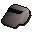 | Magic whistle | A small tin whistle. | 10 | yes |  | Blow |
|  | Grail bell | I wonder what happens when I ring it? | 10 | yes |  | Ring |
|  | Magic gold feather | It will point the way for me. | 2 | yes |  | Blow-on |
|  | Holy grail | A holy and powerful artifact. | 3 | yes |  |  |
|  | Bark sample | A sample of the bark from the Grand Tree. | 2 | yes |  |  |
|  | Translation book | A book to translate the ancient gnome language into English. | 2 | yes |  | Read |
| 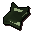 | Glough's journal | Perhaps I should read it and see what Glough is up to! | 2 | yes |  | Read |
|  | Hazelmere's scroll | Hazelmere wrote something down on this scroll. | 2 | yes |  | Read |
|  | Lumber order | An order from the Karamja shipyard. | 2 | yes |  | Read |
|  | Glough's key | The key to Glough's chest. | 0 | yes |  |  |
|  | Twigs | Twigs bound together in the shape of a T. | 0 | yes |  |  |
| 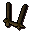 | Twigs | Twigs bound together in the shape of a U. | 0 | yes |  |  |
| 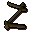 | Twigs | Twigs bound together in the shape of a Z. | 0 | yes |  |  |
|  | Twigs | Twigs bound together in the shape of a O. | 0 | yes |  |  |
|  | Daconia rock | An ancient rock with strange magical properties. | 0 | yes |  |  |
|  | Invasion plans | This is plans for an invasion! | 2 | yes |  | Read |
| 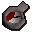 | Pressure gauge | It looks like part of a machine. | 0 |  |  |  |
|  | Fish food | Keeps your pet fish strong and healthy. | 0 |  |  |  |
|  | Poison | This stuff looks nasty. | 0 |  |  |  |
|  | Poisoned fish food | Doesn't seem very nice to the poor fishes. | 0 |  |  |  |
|  | Key | A slightly smelly key. | 0 |  |  |  |
|  | Rubber tube | Its slightly charred. | 3 |  |  |  |
| 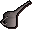 | Oil can | It's pretty full. | 3 |  |  |  |
| 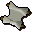 | Scroll of hazeel | Scroll containing a powerful enchantment of restoration. | 0 | yes |  |  |
|  | Key | This key opens a chest in the Carnillean household. | 0 | yes |  |  |
| 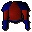 | Carnillean armour | Decorative armour; an heirloom of the Carnillean family. | 65 | yes |  | Wear |
| 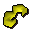 | Mark of hazeel | Sign of my commitment to Hazeel. | 0 | yes |  | Wear |
|  | Grips' keyring | Some keys on a keyring. | 0 | yes |  |  |
|  | Id papers | Apparently my name is Hartigen. | 0 | yes |  |  |
|  | Miscellaneous key | I wonder what this unlocks? | 0 | yes |  |  |
| 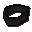 | Thieves' armband | This denotes a Master Thief. | 2 | yes |  |  |
|  | Pete's candlestick | Scarface Pete's Candlestick. | 5 | yes |  |  |
| 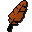 | Fire feather | Firebird feather. | 2 | yes |  |  |
|  | Rats tail | A bit of rat. | 3 |  |  |  |
|  | Karamjan rum | A very strong spirit brewed in Karamja. | 30 |  |  |  |
|  | Chest key | A key to One eyed Hector's chest. | 1 |  |  |  |
|  | Pirate message | Pirates don't have the best handwriting... | 1 |  |  | Read |
|  | Ice arrows | Can only be fired with yew or magic bows. | 2 | yes | yes | Wield |
| 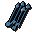 | ice_arrow_4 |  | 0 |  | yes |  |
|  | ice_arrow_3 |  | 0 |  | yes |  |
|  | ice_arrow_2 |  | 0 |  | yes |  |
|  | ice_arrow_5 |  | 0 |  | yes |  |
|  | Lever | A lever to open something perhaps? | 15 | yes |  |  |
| 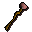 | Staff of armadyl | The power in this staff causes it to vibrate gently. | 15 | yes |  |  |
|  | Shiny key | It catches the light! | 1 | yes |  |  |
|  | Pendant of lucien | The amulet that Lucien gave you. | 12 | yes |  | Wear |
|  | Armadyl pendant | Yet another amulet. | 12 | yes |  | Wear |
|  | Boots of lightness | Magic boots that make you lighter than normal. | 6 | yes |  | Wear |
|  | Boots of lightness | Magic boots that make you lighter than normal. | 6 | yes |  | Wear |
|  | Red bead | A small round red bead. | 4 |  |  |  |
| 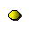 | Yellow bead | A small round yellow bead. | 4 |  |  |  |
|  | Black bead | A small round black bead. | 4 |  |  |  |
|  | White bead | A small round white bead. | 4 |  |  |  |
| 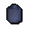 | Specimen jar | A receptacle for specimens! | 0 | yes |  |  |
|  | Specimen brush | A small brush used to clean rock samples. | 0 | yes |  |  |
|  | Rock sample 1 | A carefully kept safe rock sample. | 0 | yes |  |  |
|  | Rock sample 2 | A carefully kept safe rock sample. | 0 | yes |  |  |
|  | Rock sample 3 | A carefully kept safe rock sample. | 0 | yes |  |  |
|  | Rock sample | A rough shaped piece of rock. | 0 | yes |  |  |
|  | Rock pick | A small pick for cracking rock samples. | 0 | yes |  |  |
|  | Trowel | Used for digging! | 0 | yes |  |  |
| 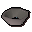 | Panning tray | An empty tray for panning. | 0 | yes |  | Search |
| 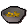 | Panning tray | This tray contains gold. | 0 | yes |  | Search |
| 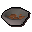 | Panning tray | This tray contains mud. | 0 | yes |  | Search |
| 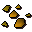 | Nuggets | Pure, lovely gold! | 0 | yes | yes |  |
|  | Talisman of zaros | An unusual symbol of a lesser-known god. | 0 | yes |  |  |
|  | Unstamped letter | A scroll waiting to be stamped. | 0 | yes |  |  |
|  | Stamped letter | A stamped scroll of recommendation. | 0 | yes |  |  |
| 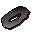 | Belt buckle | Used to hold up trousers! | 0 | yes |  |  |
|  | Old boot | Phew! | 0 | yes |  |  |
|  | Rusty sword | A decent enough weapon gone rusty. | 0 | yes |  |  |
| 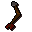 | Broken arrow | This must have been shot at high speed. | 0 | yes |  |  |
| 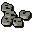 | Buttons | Not Dick Whittingtons' helper at all! | 0 | yes |  |  |
|  | Broken staff | I pity the poor person beaten with this! | 0 | yes |  |  |
|  | Broken glass | Watch those feet! | 0 | yes |  |  |
|  | Level 1 certificate | The owner has passed earth sciences level 1 exam. | 0 | yes |  |  |
|  | Level 2 certificate | The owner has passed earth sciences level 2 exam. | 0 | yes |  |  |
|  | Level 3 certificate | The owner has passed earth sciences level 3 exam. | 0 | yes |  |  |
|  | Ceramic remains | Smashing! | 0 | yes |  |  |
|  | Old tooth | Now if I can just find a tooth fairy to sell this to... | 0 | yes |  |  |
|  | Invitation letter | A letter inviting me to use the private digshafts. | 0 | yes |  | Read |
| 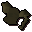 | Damaged armour | Beyond repair. | 0 | yes |  |  |
|  | Broken armour | No use to me... | 0 | yes |  |  |
| 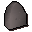 | Stone tablet | An old stone slab with writing on it. | 0 | yes |  | Read |
|  | Chemical powder | An acrid chemical. | 0 | yes |  |  |
|  | Ammonium nitrate | An acrid chemical. | 0 | yes |  |  |
|  | Unidentified liquid | A strong chemical. | 0 | yes |  |  |
| 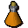 | Nitroglycerin | A strong chemical. | 0 | yes |  |  |
| 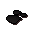 | Ground charcoal | Charcoal, crushed to small pieces! | 0 | yes |  |  |
|  | Mixed chemicals | A mixture of strong chemicals. | 0 | yes |  |  |
| 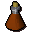 | Mixed chemicals | A mixture of strong chemicals. | 0 | yes |  |  |
| 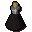 | Chemical compound | A mixture of strong chemicals. | 0 | yes |  |  |
|  | Arcenia root | The root of an Arcenia plant. | 0 | yes |  |  |
|  | Chest key | This fits a chest. | 0 | yes |  |  |
|  | Vase | A vessel for holding plants. | 0 | yes |  |  |
|  | Book on chemicals | It's about chemicals, judging from its' cover. | 0 | yes |  | Read |
|  | Cup of tea | A refreshing cuppa. | 0 | yes |  | Drink |
|  | obj_713 |  | 0 |  |  |  |
|  | Astrology book | A book on the history of Astrology in RuneScape. | 0 | yes |  | Read |
| 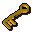 | Keep key | A small key for a jail door. | 0 | yes |  |  |
| 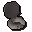 | Lens mould | An unusual clay mould in the shape of a disc. | 0 | yes |  |  |
|  | Lens | A perfectly circular disc of glass. | 0 | yes |  |  |
|  | explodingvial |  | 0 |  |  |  |
|  | Ogre relic | An old statue of an ogre warrior. | 0 | yes |  |  |
| 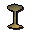 | Relic part 1 | Part of an ogre relic. | 0 | yes |  |  |
|  | Relic part 2 | Part of an ogre relic. | 0 | yes |  |  |
|  | Relic part 3 | Part of an ogre relic. | 0 | yes |  |  |
| 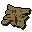 | Skavid map | It's a map. | 0 | yes |  |  |
|  | Ogre tooth | Very tooth like. | 0 | yes |  |  |
|  | Toban key |  | 0 | yes |  |  |
| 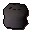 | Rock cake |  | 0 | yes |  | Eat |
| 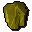 | Crystal |  | 0 | yes |  |  |
| 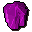 | Crystal |  | 0 | yes |  |  |
|  | Crystal |  | 0 | yes |  |  |
| 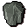 | Crystal |  | 0 | yes |  |  |
|  | Finger nails | Eeeeyeeew! | 0 | yes |  |  |
|  | Old robe | I can't wear this old thing. | 0 | yes |  |  |
|  | Unusual armour | Looks kind of useless... | 0 | yes |  |  |
|  | Damaged dagger | Pointy. | 0 | yes |  |  |
|  | Tattered eye patch | Useless as an eyepatch. | 0 | yes |  |  |
| 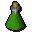 | Vial | An infusion of water and jangerberries. | 0 | yes |  |  |
| 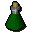 | Vial | A mixture of jangerberries and guam leaves in a vial. | 0 | yes |  |  |
| 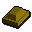 | Gold | It's a stolen bar of gold. | 300 | yes |  |  |
| 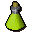 | Potion | A strange brew. | 120 | yes |  |  |
|  | Magic ogre potion | A dangerous magical liquid. | 120 | yes |  |  |
|  | Spell scroll | A spell is written on this parchment. | 5 | yes |  | Read |
|  | Shaman robe | A tattered old robe. | 40 | yes |  | Search |
|  | Nightshade | Deadly! | 30 | yes |  | Eat |
|  | Radimus notes | Notes given to you by Radimus Erkle, it includes a partially completed map. | 0 | yes |  | Read, Complete |
|  | Radimus notes | Notes given to you by Radimus Erkle, it includes a partially completed map. | 0 | yes |  | Read |
|  | Bull roarer | It makes a loud but interesting sound when swung in the air. | 0 | yes |  | Swing |
|  | Scrawled note | A scrawled note with spidery writing on it. | 0 | yes |  | Read |
| 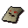 | A scribbled note | A scrawled note with spidery writing on it. | 0 | yes |  | Read |
|  | Scrumpled note | A scrawled note with spidery writing on it. | 0 | yes |  | Read |
|  | Sketch | A rough sketch of a bowl shaped vessel given to you by Gujuo. | 10 | yes |  | Look |
|  | Gold bowl | A specially made bowl constructed out of pure gold. | 700 | yes |  |  |
|  | Blessed gold bowl | A specially made bowl constructed out of pure gold and blessed. | 700 | yes |  |  |
|  | Golden bowl | A specially made golden bowl with water. | 700 | yes |  | Empty |
|  | Golden bowl | A specially made bowl constructed out of pure gold. It has pure water in it. | 700 | yes |  | Empty |
|  | Golden bowl | A blessed golden bowl. It has water in it. | 700 | yes |  | Empty |
|  | Golden bowl | A blessed golden bowl. It has pure sacred water in it. | 700 | yes |  | Empty |
|  | Hollow reed | One of nature's pipes. | 2 | yes |  |  |
|  | Shamans tome | It looks like the Shamans personal notes... | 0 | yes |  | Read |
| 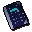 | Book of binding | An ancient tome on Demonology. | 0 | yes |  | Read |
| 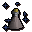 | Enchanted vial | An enchanted empty glass vial. | 0 | yes |  |  |
| 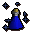 | Holy water | A vial of holy water, good against certain demons. | 0 | yes | yes | Wield |
|  | Smashed glass | Fragments of a broken container. | 1 | yes |  |  |
|  | Yommi tree seeds | These need to be germinated before they can be used. | 0 | yes | yes | Look |
| 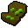 | Yommi tree seeds | These are germinated and ready to be planted in fertile soil. | 0 | yes | yes | Look |
| 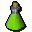 | Snakeweed mixture | It's a mixture of Snakeweed and water, I need another ingredient to finish this potion. | 0 | yes |  |  |
|  | Ardrigal mixture | It's a mixture of Ardrigal and water, I need another ingredient to finish this potion. | 0 | yes |  |  |
|  | Bravery potion | A bravery potion which Gujuo gave you the details for, let's hope it works. | 0 | yes |  | Drink |
|  | Blue hat | A strange blue wizards hat. | 2 | yes |  | Wear |
|  | Chunk of crystal | It looks like it's been snapped off of something. | 0 | yes |  |  |
|  | Hunk of crystal | It looks like it's been snapped off of something. | 0 | yes |  |  |
|  | Lump of crystal | It looks like it's been snapped off of something. | 0 | yes |  |  |
|  | Heart crystal | A heart shaped crystal. | 0 | yes |  | Look-at |
|  | Heart crystal | A heart shaped crystal. | 0 | yes |  | Look-at |
|  | Black dagger | A black obsidian dagger, it has a strange aura about it. | 0 | yes |  | Wield |
|  | Glowing dagger | A black obsidian dagger, it has a strange aura about it - it seems to be glowing. | 0 | yes |  | Wield |
| 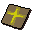 | Holy force | A powerful spell for good. | 0 | yes |  | Cast Spell |
|  | Yommi totem | A well carved totem pole made from the trunk of a Yommi tree. | 0 | yes |  |  |
| 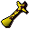 | Gilded totem | A gilded totem pole from the Kharazi tribe. | 0 | yes |  |  |
|  | Dwarf remains | The body of a Dwarf savaged by Goblins. | 0 | yes |  |  |
| 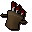 | Tool kit | These could be handy. | 0 | yes |  |  |
|  | Cannonball | Ammo for the Dwarf Cannon. | 5 | yes | yes |  |
|  | Nulodion's notes. | Construction notes for Dwarf cannon ammo. | 0 | yes |  | Read |
|  | Ammo mould | Used to make cannon ammunition. | 5 | yes |  |  |
|  | Instruction manual | An old note book. | 10 | yes |  | Read |
|  | Cannon base | The cannon is built on this. | 187500 | yes |  | Set-up |
| 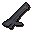 | Cannon stand | The mounting for the muticannon. | 187500 | yes |  |  |
|  | Cannon barrels | The barrels of the multicannon. | 187500 | yes |  |  |
|  | Cannon furnace | Used to make the cannon's ammo. | 187500 | yes |  |  |
|  | Railing | A metal railing replacement. | 0 | yes |  |  |
|  | Silver necklace | Annas' shiny silver coated necklace. | 0 | yes |  | Wear |
|  | Silver necklace | Annas' shiny silver coated necklace coated with a thin layer of flour. | 0 | yes |  | Wear |
|  | Silver cup | Bobs' shiny silver coated tea cup. | 0 | yes |  |  |
|  | Silver cup | Bobs' shiny silver coated tea cup coated with a thin layer of flour. | 0 | yes |  |  |
|  | Silver bottle | Carols' shiny silver coated bottle. | 0 | yes |  |  |
|  | Silver bottle | Carols' shiny silver coated bottle coated with a thin layer of flour. | 0 | yes |  |  |
|  | Silver book | Davids' shiny silver coated book. | 0 | yes |  |  |
|  | Silver book | Davids' shiny silver coated book coated with a thin layer of flour. | 0 | yes |  |  |
|  | Silver needle | Elizabeths' shiny silver coated needle. | 0 | yes |  |  |
|  | Silver needle | Elizabeths' shiny silver coated needle coated with a thin layer of flour. | 0 | yes |  |  |
|  | Silver pot | Franks' shiny silver coated pot. | 0 | yes |  |  |
|  | Silver pot | Franks' shiny silver coated pot coated with a thin layer of flour. | 0 | yes |  |  |
|  | Criminals' thread | Some red thread found at the murder scene. | 0 | yes |  |  |
|  | Criminals' thread | Some green thread found at the murder scene. | 0 | yes |  |  |
|  | Criminals' thread | Some blue thread found at the murder scene. | 0 | yes |  |  |
|  | Flypaper | A piece of fly paper. It's sticky. | 0 | yes |  |  |
|  | Pungent pot | A pot found at the murder scene, with a sickly odour. | 0 | yes |  |  |
|  | Criminals' dagger | A flimsy looking dagger found at the crime scene. | 0 | yes |  |  |
|  | Criminals' dagger | A flimsy looking dagger found at the crime scene coated with a thin layer of flour. | 0 | yes |  |  |
|  | Killers' print | The fingerprints of the murderer. | 0 | yes |  |  |
|  | Annas' print | An imprint of Annas' fingerprint. | 0 | yes |  |  |
|  | Bobs' print | An imprint of Bobs' fingerprint. | 0 | yes |  |  |
|  | Carols' print | An imprint of Carols' fingerprint. | 0 | yes |  |  |
|  | Davids' print | An imprint of Davids' fingerprint. | 0 | yes |  |  |
|  | Elizabeths' print | An imprint of Elizabeths' fingerprint. | 0 | yes |  |  |
|  | Franks' print | An imprint of Franks' fingerprint. | 0 | yes |  |  |
|  | Unknown print | An unidentified fingerprint taken from the murder weapon. | 0 | yes |  |  |
|  | Ghostspeak amulet | It lets me talk to ghosts. | 35 |  |  | Wear |
|  | Skull | Ooooh spooky! | 0 |  |  |  |
|  | Key print | An imprint of a key in a lump of clay. | 0 |  |  |  |
|  | Wig | A grey woollen wig. | 0 |  |  |  |
|  | Wig | A wig that has been dyed slightly blonde. | 0 |  |  |  |
|  | Paste | A bottle of skin coloured paste. | 5 |  |  |  |
|  | Bronze key | A heavy key made of bronze. | 0 |  |  |  |
|  | Cadaver berries | Poisonous berries. | 0 |  |  |  |
|  | Message | A message from Juliet to Romeo. | 5 |  |  |  |
|  | Cadaver | I'm meant to give this to Juliet. | 0 |  |  |  |
|  | Research package | This contains some vital research results. | 2 |  |  |  |
|  | Notes | It seems to be written in some kind of code. | 5 |  |  |  |
|  | Scorpion cage | It's empty! | 10 | yes |  |  |
|  | Scorpion cage | There is 1 scorpion inside. | 10 | yes |  |  |
|  | Scorpion cage | There are 2 scorpions inside. | 10 | yes |  |  |
|  | Scorpion cage | There are 2 scorpions inside. | 10 | yes |  |  |
|  | Scorpion cage | There is 1 scorpion inside. | 10 | yes |  |  |
|  | Scorpion cage | There are 2 scorpions inside. | 10 | yes |  |  |
|  | Scorpion cage | There is 1 scorpion inside. | 10 | yes |  |  |
|  | Scorpion cage | There are 3 scorpions inside. | 10 | yes |  |  |
|  | Prod | An old cattle prod. | 3 | yes |  | Equip |
|  | Feed | This looks nasty. | 3 | yes |  |  |
|  | Bones | These sheep remains are infected. | 0 | yes |  |  |
|  | Bones | These sheep remains are infected. | 0 | yes |  |  |
|  | Bones | These sheep remains are infected. | 0 | yes |  |  |
|  | Bones | These sheep remains are infected. | 0 | yes |  |  |
|  | Plague jacket | A thick heavy leather top. | 50 | yes |  | Wear |
|  | Plague trousers | A thick pair of leather trousers. | 50 | yes |  | Wear |
|  | Portrait | Picture of a posing Paladin. | 3 |  |  |  |
|  | Blurite sword | A Faladian Knight's sword. | 200 |  |  | Wield |
|  | Blurite ore | Definitely blue. | 3 |  |  |  |
|  | Totem | The Rantuki tribes' totem. | 10 | yes |  |  |
|  | Address label | It says 'To Lord Handelmort, Handelmort Mansion'. | 10 | yes |  |  |
|  | Guide book | 'A Tourists Guide To Ardougne'. | 0 | yes |  | Read |
|  | Orb of protection | A strange glowing green orb. | 0 | yes |  |  |
|  | Orb of protection | Two strange glowing green orbs. | 0 | yes |  |  |
|  | Gnome amulet | It's an emerald protection amulet given to me by the gnomes. | 0 | yes |  | Wear |
|  | throwingrope |  | 0 |  |  |  |
|  | Rocks | Some rocks. | 0 | yes |  |  |
|  | Orb of light | A magical sphere that glimmers within. | 10 | yes |  |  |
|  | Orb of light | A magical sphere that glimmers within. | 10 | yes |  |  |
|  | Orb of light | A magical sphere that glimmers within. | 10 | yes |  |  |
|  | Orb of light | A magical sphere that glimmers within. | 20 | yes |  |  |
|  | Damp cloth | A damp, wet cloth. | 10 | yes |  |  |
|  | Piece of railing | A broken piece of railing. | 10 | yes |  |  |
|  | Unicorn horn | A withered unicorn horn. | 20 | yes |  |  |
|  | Paladin's badge | A coat of arms of the Ardougne Paladins. | 10 | yes |  |  |
|  | Paladin's badge | A coat of arms of the Ardougne Paladins. | 10 | yes |  |  |
|  | Paladin's badge | A coat of arms of the Ardougne Paladins. | 10 | yes |  |  |
|  | Witches cat | A cat. | 0 | yes |  |  |
|  | Doll of iban | A simple doll with Iban's likeness. | 2 | yes |  | Search |
|  | Old journal | An account of the last times of someone. | 1 | yes |  | Read |
|  | History of iban | The tale of Iban. | 1 | yes |  | Read |
|  | Klank's gauntlets | Strong dwarvish gloves. | 6 | yes |  | Wear |
|  | Iban's dove | I thought you only saw these in pairs? | 1 | yes |  |  |
|  | Amulet of othanian | A mystical demonic amulet. | 0 | yes |  |  |
|  | Amulet of doomion | A mystical demonic amulet. | 0 | yes |  |  |
|  | Amulet of holthion | A mystical demonic amulet. | 0 | yes |  |  |
|  | Iban's shadow | A strange dark liquid. | 2 | yes |  |  |
|  | Dwarf brew | Smells stronger than most spirits. | 2 | yes |  |  |
|  | Iban's ashes | The burnt remains of Iban. | 2 | yes |  |  |
|  | Orb of light | A magical sphere that glimmers within. | 1 | yes |  |  |
|  | Stake | A very pointy stick. | 8 |  |  |  |
|  | Book on baxtorian | A book on elven history in north runescape. | 2 | yes |  | Read |
|  | A key | This will unlock something | 0 | yes |  |  |
|  | Glarials pebble | A small pebble with elven inscription. | 0 | yes |  |  |
|  | Glarials amulet | A bright green gem set in a necklace. | 0 | yes |  | Wear |
|  | Glarials urn | An urn containing glarials ashes | 0 | yes |  |  |
|  | Glarials urn | An empty urn made for glarials ashes | 0 | yes |  |  |
|  | A key | This will unlock something | 0 | yes |  |  |
|  | Mithril seeds | Magical seeds in a mithril case. | 200 | yes | yes | Plant |
|  | Dramen branch | A limb of the fabled Dramen tree. | 15 | yes |  |  |
|  | Dramen staff | Crafted from a Dramen tree branch. | 15 | yes |  | Wield |
|  | Bone shard | A slender bone shard given to you by Zadimus. | 0 | yes |  | Inspect |
|  | Bone key | A bone key fashioned from a shard of bone. | 0 | yes |  |  |
|  | Stone-plaque | A stone plaque with carved letters in it. | 0 | yes |  | Read |
|  | Tattered scroll | An ancient tattered scroll. | 0 | yes |  | Read |
|  | Crumpled scroll | An ancient crumpled scroll. | 0 | yes |  | Read |
|  | Rashiliya corpse | The remains of the Zombie Queen. | 0 | yes |  |  |
|  | Zadimus corpse | The remains of Zadimus. | 0 | yes |  | Bury |
|  | Locating crystal | A magical crystal sphere. | 0 | yes |  | Activate |
|  | Locating crystal | A magical crystal sphere. | 0 | yes |  |  |
|  | Locating crystal | A magical crystal sphere. | 1 | yes |  |  |
|  | Locating crystal | A magical crystal sphere. | 1 | yes |  |  |
|  | Locating crystal | A magical crystal sphere. | 1 | yes |  |  |
|  | Beads of the dead | A curious looking neck ornament. | 1 | yes |  | Wear |
|  | Coins | Lovely money! | 1 | yes |  |  |
|  | Bone beads | Beads carved out of a bone. | 0 | yes |  |  |
|  | Sword pommel | An ivory sword pommel. | 1 | yes |  |  |
|  | Bervirius notes | Notes taken from the tomb of Bervirius. | 1 | yes |  | Read |
|  | Wampum belt | A decorated belt used to trade information between distant villages. | 5 | yes |  |  |
|  | Battlestaff | It's a slightly magical stick. | 7000 | yes |  | Wield |
|  | Fire battlestaff | It's a slightly magical stick. | 15500 | yes |  | Wield |
|  | Water battlestaff | It's a slightly magical stick. | 15500 | yes |  | Wield |
|  | Air battlestaff | It's a slightly magical stick. | 15500 | yes |  | Wield |
|  | Earth battlestaff | It's a slightly magical stick. | 15500 | yes |  | Wield |
|  | Mystic fire staff | It's a slightly magical stick. | 42500 | yes |  | Wield |
|  | Mystic water staff | It's a slightly magical stick. | 42500 | yes |  | Wield |
|  | Mystic air staff | It's a slightly magical stick. | 42500 | yes |  | Wield |
|  | Mystic earth staff | It's a slightly magical stick. | 42500 | yes |  | Wield |
|  | Staff | It's a slightly magical stick. | 15 |  |  | Wield |
|  | Staff of air | A Magical staff. | 1500 |  |  | Wield |
|  | Staff of water | A Magical staff. | 1500 |  |  | Wield |
|  | Staff of earth | A Magical staff. | 1500 |  |  | Wield |
|  | Staff of fire | A Magical staff. | 1500 |  |  | Wield |
|  | Magic staff | A Magical staff. | 200 |  |  | Wield |
|  | Bronze 2h sword | A two handed sword. | 80 |  |  | Wield |
|  | Iron 2h sword | A two handed sword. | 280 |  |  | Wield |
|  | Steel 2h sword | A two handed sword. | 1000 |  |  | Wield |
|  | Black 2h sword | A two handed sword. | 1920 |  |  | Wield |
|  | Mithril 2h sword | A two handed sword. | 2600 |  |  | Wield |
|  | Adamant 2h sword | A two handed sword. | 6400 |  |  | Wield |
|  | Rune 2h sword | A two handed sword. | 64000 |  |  | Wield |
|  | Iron battleaxe | A vicious looking axe. | 182 |  |  | Wield |
|  | Steel battleaxe | A vicious looking axe. | 650 |  |  | Wield |
|  | Black battleaxe | A vicious looking axe. | 1248 |  |  | Wield |
|  | Mithril battleaxe | A vicious looking axe. | 1690 |  |  | Wield |
|  | Adamant battleaxe | A vicious looking axe. | 4160 |  |  | Wield |
|  | Rune battleaxe | A vicious looking axe. | 41600 |  |  | Wield |
|  | Bronze battleaxe | A vicious looking axe. | 52 |  |  | Wield |
|  | Dragon battleaxe | A vicious looking axe. | 200000 | yes |  | Wield |
|  | Iron chainbody | A series of connected metal rings. | 210 |  |  | Wear |
|  | Bronze chainbody | A series of connected metal rings. | 60 |  |  | Wear |
|  | Steel chainbody | A series of connected metal rings. | 750 |  |  | Wear |
|  | Black chainbody | A series of connected metal rings. | 1440 |  |  | Wear |
|  | Mithril chainbody | A series of connected metal rings. | 1950 |  |  | Wear |
|  | Adamant chainbody | A series of connected metal rings. | 4800 |  |  | Wear |
|  | Rune chainbody | A series of connected metal rings. | 50000 |  |  | Wear |
|  | Iron dagger | Short but pointy. | 35 |  |  | Wield |
|  | Bronze dagger | Short but pointy. | 10 |  |  | Wield |
|  | Steel dagger | Short but pointy. | 125 |  |  | Wield |
|  | Mithril dagger | A dangerous dagger. | 325 |  |  | Wield |
|  | Adamant dagger | Short and deadly. | 800 |  |  | Wield |
|  | Rune dagger | A powerful dagger. | 8000 |  |  | Wield |
|  | Dragon dagger | A powerful dagger. | 30000 | yes |  | Wield |
|  | Black dagger | A vicious black dagger. | 240 |  |  | Wield |
|  | Iron dagger(p) | The blade is covered with poison. | 35 | yes |  | Wield |
|  | Bronze dagger(p) | This dagger is poisoned. | 10 | yes |  | Wield |
|  | Steel dagger(p) | The blade has been poisoned. | 125 | yes |  | Wield |
|  | Mithril dagger(p) | A poisoned Mithril dagger. | 325 | yes |  | Wield |
|  | Adamant dagger(p) | A very dangerous poisoned dagger. | 800 | yes |  | Wield |
|  | Rune dagger(p) | The blade is covered with a nasty poison. | 8000 | yes |  | Wield |
|  | Dragon dagger(p) | A powerful dagger. | 24000 | yes |  | Wield |
|  | Black dagger(p) | This dagger is poisoned. | 240 | yes |  | Wield |
|  | Poisoned dagger(p) | The blade is covered with poison. | 565 | yes |  | Wield |
|  | Iron full helm | A full face helmet. | 154 |  |  | Wear |
|  | Bronze full helm | A full face helmet. | 44 |  |  | Wear |
|  | Steel full helm | A full face helmet. | 550 |  |  | Wear |
|  | Mithril full helm | A full face helmet. | 1430 |  |  | Wear |
|  | Adamant full helm | A full face helmet. | 3520 |  |  | Wear |
|  | Rune full helm | A full face helmet. | 35200 |  |  | Wear |
|  | Black full helm | A full face helmet. | 1056 |  |  | Wear |
|  | Bronze kiteshield | A large metal shield. | 68 |  |  | Wear |
|  | Iron kiteshield | A large metal shield. | 238 |  |  | Wear |
|  | Steel kiteshield | A large metal shield. | 850 |  |  | Wear |
|  | Black kiteshield | A large metal shield. | 1632 |  |  | Wear |
|  | Mithril kiteshield | A large metal shield. | 2210 |  |  | Wear |
|  | Adamant kiteshield | A large metal shield. | 5440 |  |  | Wear |
|  | Rune kiteshield | A large metal shield. | 54400 |  |  | Wear |
|  | Bronze longsword | A razor sharp longsword. | 40 |  |  | Wield |
|  | Iron longsword | A razor sharp longsword. | 140 |  |  | Wield |
|  | Steel longsword | A razor sharp longsword. | 500 |  |  | Wield |
|  | Black longsword | A razor sharp longsword. | 960 |  |  | Wield |
|  | Mithril longsword | A razor sharp longsword. | 1300 |  |  | Wield |
|  | Adamant longsword | A razor sharp longsword. | 3200 |  |  | Wield |
|  | Rune longsword | A razor sharp longsword. | 32000 |  |  | Wield |
|  | Dragon longsword | A very powerful sword. | 100000 | yes |  | Wield |
|  | Iron mace | A spiky mace. | 63 |  |  | Wield |
|  | Bronze mace | A spiky mace. | 18 |  |  | Wield |
|  | Steel mace | A spiky mace. | 225 |  |  | Wield |
|  | Black mace | A spiky mace. | 432 |  |  | Wield |
|  | Mithril mace | A spiky mace. | 585 |  |  | Wield |
|  | Adamant mace | A spiky mace. | 1440 |  |  | Wield |
|  | Rune mace | A spiky mace. | 14400 |  |  | Wield |
|  | Dragon mace | A spiky mace. | 50000 | yes |  | Wield |
|  | Iron med helm | A medium sized helmet. | 84 |  |  | Wear |
|  | Bronze med helm | A medium sized helmet. | 24 |  |  | Wear |
|  | Steel med helm | A medium sized helmet. | 300 |  |  | Wear |
|  | Mithril med helm | A medium sized helmet. | 780 |  |  | Wear |
|  | Adamant med helm | A medium sized helmet. | 1920 |  |  | Wear |
|  | Rune med helm | A medium sized helmet. | 19200 |  |  | Wear |
|  | Dragon med helm | Makes the wearer pretty intimidating. | 100000 | yes |  | Wear |
|  | Black med helm | A medium sized helmet. | 576 |  |  | Wear |
|  | Iron platebody | Provides excellent protection. | 560 |  |  | Wear |
|  | Bronze platebody | Provides excellent protection. | 160 |  |  | Wear |
|  | Steel platebody | Provides excellent protection. | 2000 |  |  | Wear |
|  | Mithril platebody | Provides excellent protection. | 5200 |  |  | Wear |
|  | Adamant platebody | Provides excellent protection. | 12800 |  |  | Wear |
|  | Black platebody | Provides excellent protection. | 3840 |  |  | Wear |
|  | Rune platebody |  | 65000 |  |  | Wear |
|  | Iron platelegs | These look pretty heavy. | 280 |  |  | Wear |
|  | Steel platelegs | These look pretty heavy. | 1000 |  |  | Wear |
|  | Mithril platelegs | These look pretty heavy. | 2600 |  |  | Wear |
|  | Adamant platelegs | These look pretty heavy. | 6400 |  |  | Wear |
|  | Bronze platelegs | These look pretty heavy. | 80 |  |  | Wear |
|  | Black platelegs | Big, black and heavy looking. | 1920 |  |  | Wear |
|  | Rune platelegs | These look pretty heavy. | 64000 |  |  | Wear |
|  | Iron plateskirt | Designer leg protection. | 280 |  |  | Wear |
|  | Steel plateskirt | Designer leg protection. | 1000 |  |  | Wear |
|  | Mithril plateskirt | Designer leg protection. | 2600 |  |  | Wear |
|  | Bronze plateskirt | Designer leg protection. | 80 |  |  | Wear |
|  | Black plateskirt | Big, black and heavy looking. | 1920 |  |  | Wear |
|  | Adamant plateskirt | Designer leg protection. | 6400 |  |  | Wear |
|  | Rune plateskirt | Designer leg protection. | 64000 |  |  | Wear |
|  | Bronze scimitar | A vicious curved sword. | 32 |  |  | Wield |
|  | Iron scimitar | A vicious curved sword. | 112 |  |  | Wield |
|  | Steel scimitar | A vicious curved sword. | 400 |  |  | Wield |
|  | Black scimitar | A vicious curved sword. | 768 |  |  | Wield |
|  | Mithril scimitar | A vicious curved sword. | 1040 |  |  | Wield |
|  | Adamant scimitar | A vicious curved sword. | 2560 |  |  | Wield |
|  | Rune scimitar | A vicious curved sword. | 25600 |  |  | Wield |
|  | Wooden shield | A solid wooden shield. | 20 |  |  | Wield |
|  | Bronze sq shield | A medium square shield. | 48 |  |  | Wield |
|  | Iron sq shield | A medium square shield. | 168 |  |  | Wield |
|  | Steel sq shield | A medium square shield. | 600 |  |  | Wield |
|  | Black sq shield | A medium square shield. | 1152 |  |  | Wield |
|  | Mithril sq shield | A medium square shield. | 1560 |  |  | Wield |
|  | Adamant sq shield | A medium square shield. | 3840 |  |  | Wield |
|  | Rune sq shield | A medium square shield. | 38400 |  |  | Wield |
|  | Dragon sq shield | An ancient and powerful looking Dragon Square shield. | 500000 | yes |  | Wield |
|  | Dragonfire shield | This shield is said to have magical properties against dragon flames. | 20 |  |  | Wear |
|  | Bronze spear | A bronze tipped spear. | 26 | yes |  | Wield |
|  | Iron spear | An iron tipped spear. | 91 | yes |  | Wield |
|  | Steel spear | A steel tipped spear. | 325 | yes |  | Wield |
|  | Mithril spear | A mithril tipped spear. | 845 | yes |  | Wield |
|  | Adamant spear | An adamantite tipped spear. | 2080 | yes |  | Wield |
|  | Rune spear | A rune tipped spear. | 20800 | yes |  | Wield |
|  | Dragon spear | A dragon tipped spear. | 62400 | yes |  | Wield |
|  | Bronze spear(p) | A bronze tipped spear. | 26 | yes |  | Wield |
|  | Iron spear(p) | An iron tipped spear. | 91 | yes |  | Wield |
|  | Steel spear(p) | A steel tipped spear. | 325 | yes |  | Wield |
|  | Mithril spear(p) | A mithril tipped spear. | 845 | yes |  | Wield |
|  | Adamant spear(p) | An adamantite tipped spear. | 2080 | yes |  | Wield |
|  | Rune spear(p) | A rune tipped spear. | 20800 | yes |  | Wield |
|  | Dragon spear(p) | A dragon tipped spear. | 62400 | yes |  | Wield |
|  | Bronze sword | A razor sharp sword. | 26 |  |  | Wield |
|  | Iron sword | A razor sharp sword. | 91 |  |  | Wield |
|  | Steel sword | A razor sharp sword. | 325 |  |  | Wield |
|  | Black sword | A razor sharp sword. | 624 |  |  | Wield |
|  | Mithril sword | A razor sharp sword. | 845 |  |  | Wield |
|  | Adamant sword | A razor sharp sword. | 2080 |  |  | Wield |
|  | Rune sword | A razor sharp sword. | 20800 |  |  | Wield |
|  | Ranger boots | Lightweight boots ideal for rangers. | 200 | yes |  | Wear |
|  | Wizard's boots | Slightly magical boots. | 200 | yes |  | Wear |
|  | Robin hood hat | Endorsed by Robin Hood. | 450 | yes |  | Wear |
|  | Highwayman mask | Your money or your life! | 40 | yes |  | Wear |
|  | Berret | Pouvez-vous parler francais? | 80 | yes |  | Wear |
|  | Berret | Pouvez-vous parler francais? | 80 | yes |  | Wear |
|  | Berret | Pouvez-vous parler francais? | 80 | yes |  | Wear |
|  | Cavalier | All for one and one for all! | 200 | yes |  | Wear |
|  | Cavalier | All for one and one for all! | 200 | yes |  | Wear |
|  | Cavalier | All for one and one for all! | 200 | yes |  | Wear |
|  | Headband | A minimilist's hat. | 40 | yes |  | Wear |
|  | Headband | A minimilist's hat. | 40 | yes |  | Wear |
|  | Headband | A minimilist's hat. | 40 | yes |  | Wear |
|  | Pirate's hat | Shiver me timbers! | 180 | yes |  | Wear |
|  | Zamorak platebody | Rune platebody in the colours of Zamorak. | 65000 |  |  | Wear |
|  | Zamorak platelegs | Rune platelegs in the colours of zamorak. | 64000 |  |  | Wear |
|  | Zamorak full helm | Rune full helm in the colours of Zamorak. | 35200 |  |  | Wear |
|  | Zamorak kiteshield | Rune kiteshield in the colours of Zamorak. | 54400 |  |  | Wear |
|  | Saradomin plate | Rune platebody in the colours of Saradomin. | 65000 |  |  | Wear |
|  | Saradomin legs | Rune platelegs in the colours of Saradomin. | 64000 |  |  | Wear |
|  | Saradomin full | Rune full helm in the colours of Saradomin. | 35200 |  |  | Wear |
|  | Saradomin kite | Rune kiteshield in the colours of Saradomin. | 54400 |  |  | Wear |
|  | Guthix platebody | Rune plate body in the colours of Guthix. | 65000 |  |  | Wear |
|  | Guthix platelegs | Rune plate legs in the colours of Guthix. | 64000 |  |  | Wear |
|  | Guthix full helm | A rune full face helmet in the colours of Guthix. | 35200 |  |  | Wear |
|  | Guthix kiteshield | Rune kiteshield in the colours of Guthix. | 54400 |  |  | Wear |
|  | Black platebody (t) | Black plate body with trim. | 3840 |  |  | Wear |
|  | Black platelegs (t) | Black platelegs with trim. | 1920 |  |  | Wear |
|  | Black full helm (t) | Black full helm with trim. | 1056 |  |  | Wear |
|  | Black kiteshield (t) | Black kiteshield with trim. | 1632 |  |  | Wear |
|  | Black platebody (g) | Black platebody with gold trim. | 3840 |  |  | Wear |
|  | Black platelegs (g) | Black platelegs with gold trim. | 1920 |  |  | Wear |
|  | Black full helm (g) | Black full helm with gold trim. | 1056 |  |  | Wear |
|  | Black kiteshield (g) | Black kiteshield with gold trim. | 1632 |  |  | Wear |
|  | Adam platebody (t) | Adamant platebody with trim. | 12800 |  |  | Wear |
|  | Adam platelegs (t) | Adamant platelegs with trim. | 6400 |  |  | Wear |
|  | Adam kiteshield (t) | Adamant kiteshield with trim. | 5440 |  |  | Wear |
|  | Adam full helm (t) | Adamant full helm with trim. | 3520 |  |  | Wear |
|  | Adam platebody (g) | Adamant platebody with gold trim. | 12800 |  |  | Wear |
|  | Adam platelegs (g) | Adamant platelegs with gold trim. | 6400 |  |  | Wear |
|  | Adam kiteshield (g) | Adamant kiteshield with gold trim. | 5440 |  |  | Wear |
|  | Adam full helm (g) | Adamant full helm with gold trim. | 3520 |  |  | Wear |
|  | Rune platebody (g) | Rune plate body with gold trim. | 65000 |  |  | Wear |
|  | Rune platelegs (g) | Rune platelegs with gold trim. | 64000 |  |  | Wear |
|  | Rune full helm (g) | Rune full helm with gold trim. | 35200 |  |  | Wear |
|  | Rune kiteshield (g) | Rune kiteshield with gold trim. | 54400 |  |  | Wear |
|  | Rune platebody (t) | Rune platebody with trim. | 65000 |  |  | Wear |
|  | Rune platelegs (t) | Rune platelegs with trim. | 64000 |  |  | Wear |
|  | Rune full helm (t) | Rune full helm with trim. | 35200 |  |  | Wear |
|  | Rune kiteshield (t) | Rune kiteshield with trim. | 54400 |  |  | Wear |
|  | Iron warhammer | I don't think it's intended for joinery. | 173 |  |  | Wield |
|  | Bronze warhammer | I don't think it's intended for joinery. | 47 |  |  | Wield |
|  | Steel warhammer | I don't think it's intended for joinery. | 640 |  |  | Wield |
|  | Black warhammer | I don't think it's intended for joinery. | 640 |  |  | Wield |
|  | Mithril warhammer | I don't think it's intended for joinery. | 1660 |  |  | Wield |
|  | Adamnt warhammer | I don't think it's intended for joinery. | 4120 |  |  | Wield |
