<!-- GENERATED by tools/docsgen — do not edit; regenerate instead. -->

# Items — page 3 (Rune warhammer – Leather gloves)

| Icon | Name | Description | Cost | Members | Stackable | Options |
|---|---|---|---|---|---|---|
|  | Rune warhammer | I don't think it's intended for joinery. | 41500 |  |  | Wield |
|  | Bronze arrow | Arrows with bronze heads. | 1 |  | yes | Wield |
|  | Bronze arrow(p) | Venomous looking arrows. | 1 | yes | yes | Wield |
| 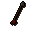 | Iron arrow | Arrows with iron heads. | 3 |  | yes | Wield |
|  | Iron arrow(p) | Venomous looking arrows. | 3 | yes | yes | Wield |
|  | Steel arrow | Arrows with steel heads. | 12 |  | yes | Wield |
|  | Steel arrow(p) | Venomous looking arrows. | 12 | yes | yes | Wield |
| 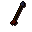 | Mithril arrow | Arrows with mithril heads. | 32 | yes | yes | Wield |
|  | Mithril arrow(p) | Venomous looking arrows. | 32 | yes | yes | Wield |
|  | Adamant arrow | Arrows with Adamantite heads. | 80 | yes | yes | Wield |
|  | Adamant arrow(p) | Venomous looking arrows. | 80 | yes | yes | Wield |
| 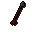 | Rune arrow | Arrows with Rune heads. | 400 | yes | yes | Wield |
|  | Rune arrow(p) | Venomous looking arrows. | 400 | yes | yes | Wield |
| 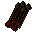 | bronze_arrow_4 |  | 0 |  | yes |  |
|  | bronze_arrow_3 |  | 0 |  | yes |  |
| 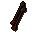 | bronze_arrow_2 |  | 0 |  | yes |  |
|  | bronze_arrow_5 |  | 0 |  | yes |  |
| 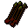 | bronze_arrow_p_4 |  | 0 |  | yes |  |
| 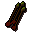 | bronze_arrow_p_3 |  | 0 |  | yes |  |
| 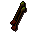 | bronze_arrow_p_2 |  | 0 |  | yes |  |
| 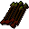 | bronze_arrow_p_5 |  | 0 |  | yes |  |
| 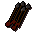 | iron_arrow_4 |  | 0 |  | yes |  |
| 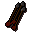 | iron_arrow_3 |  | 0 |  | yes |  |
| 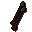 | iron_arrow_2 |  | 0 |  | yes |  |
|  | iron_arrow_5 |  | 0 |  | yes |  |
| 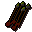 | iron_arrow_p_4 |  | 0 |  | yes |  |
|  | iron_arrow_p_3 |  | 0 |  | yes |  |
| 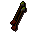 | iron_arrow_p_2 |  | 0 |  | yes |  |
| 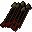 | iron_arrow_p_5 |  | 0 |  | yes |  |
| 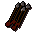 | steel_arrow_4 |  | 0 |  | yes |  |
| 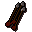 | steel_arrow_3 |  | 0 |  | yes |  |
| 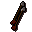 | steel_arrow_2 |  | 0 |  | yes |  |
|  | steel_arrow_5 |  | 0 |  | yes |  |
|  | steel_arrow_p_4 |  | 0 |  | yes |  |
|  | steel_arrow_p_3 |  | 0 |  | yes |  |
| 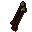 | steel_arrow_p_2 |  | 0 |  | yes |  |
| 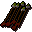 | steel_arrow_p_5 |  | 0 |  | yes |  |
|  | mithril_arrow_4 |  | 0 |  | yes |  |
|  | mithril_arrow_3 |  | 0 |  | yes |  |
|  | mithril_arrow_2 |  | 0 |  | yes |  |
| 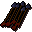 | mithril_arrow_5 |  | 0 |  | yes |  |
| 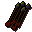 | mithril_arrow_p_4 |  | 0 |  | yes |  |
| 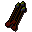 | mithril_arrow_p_3 |  | 0 |  | yes |  |
| 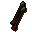 | mithril_arrow_p_2 |  | 0 |  | yes |  |
|  | mithril_arrow_p_5 |  | 0 |  | yes |  |
| 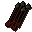 | adamant_arrow_4 |  | 0 |  | yes |  |
|  | adamant_arrow_3 |  | 0 |  | yes |  |
|  | adamant_arrow_2 |  | 0 |  | yes |  |
| 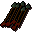 | adamant_arrow_5 |  | 0 |  | yes |  |
|  | adamant_arrow_p_4 |  | 0 |  | yes |  |
| 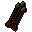 | adamant_arrow_p_3 |  | 0 |  | yes |  |
| 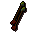 | adamant_arrow_p_2 |  | 0 |  | yes |  |
|  | adamant_arrow_p_5 |  | 0 |  | yes |  |
|  | rune_arrow_4 |  | 0 |  | yes |  |
| 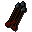 | rune_arrow_3 |  | 0 |  | yes |  |
|  | rune_arrow_2 |  | 0 |  | yes |  |
|  | rune_arrow_5 |  | 0 |  | yes |  |
| 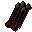 | rune_arrow_p_4 |  | 0 |  | yes |  |
| 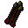 | rune_arrow_p_3 |  | 0 |  | yes |  |
| 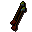 | rune_arrow_p_2 |  | 0 |  | yes |  |
| 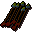 | rune_arrow_p_5 |  | 0 |  | yes |  |
|  | Lit arrows | These arrows are ablaze with fire. | 10 | yes | yes | Wield |
|  | Iron fire arrows | Arrows with iron heads and oil soaked cloth. | 3 | yes | yes | Wield |
|  | Iron fire arrows | These iron headed arrows are ablaze with fire. | 10 | yes | yes | Wield |
|  | Steel fire arrows | Arrows with steel heads and oil soaked cloth. | 3 | yes | yes | Wield |
|  | Steel fire arrows | These steel headed arrows are ablaze with fire. | 10 | yes | yes | Wield |
|  | Mithril fire arrows | Arrows with mithril heads and oil soaked cloth. | 3 | yes | yes | Wield |
| 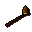 | Mithril fire arrows | These mithril headed arrows are ablaze with fire. | 10 | yes | yes | Wield |
|  | Adamnt fire arrows | Arrows with adamant heads and oil soaked cloth. | 3 | yes | yes | Wield |
|  | Adamnt fire arrows | These adamant headed arrows are ablaze with fire. | 10 | yes | yes | Wield |
|  | Rune fire arrows | Arrows with rune heads and oil soaked cloth. | 3 | yes | yes | Wield |
|  | Rune fire arrows | These rune headed arrows are ablaze with fire. | 10 | yes | yes | Wield |
| 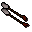 | unlitarrow_2 |  | 0 |  | yes |  |
| 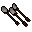 | unlitarrow_3 |  | 0 |  | yes |  |
|  | unlitarrow_4 |  | 0 |  | yes |  |
| 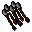 | unlitarrow_5 |  | 0 |  | yes |  |
| 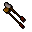 | litarrow_2 |  | 0 |  | yes |  |
|  | litarrow_3 |  | 0 |  | yes |  |
|  | litarrow_4 |  | 0 |  | yes |  |
| 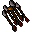 | litarrow_5 |  | 0 |  | yes |  |
|  | Bolt | Good if you have a crossbow! | 3 |  | yes | Wield |
|  | Bolt(p) | Vicious poisoned bolts. | 3 | yes | yes | Wield |
| 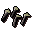 | Opal bolt | Great if you have a crossbow! | 60 | yes | yes | Wield |
| 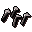 | Pearl bolt | Great if you have a crossbow! | 110 | yes | yes | Wield |
|  | Barbed bolt | Great if you have a crossbow! | 200 | yes | yes | Wield |
|  | Longbow | A nice sturdy bow. | 80 |  |  | Wield |
| 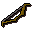 | Shortbow | Short but effective. | 50 |  |  | Wield |
|  | Oak shortbow | A shortbow made out of oak, still effective. | 100 |  |  | Wield |
|  | Oak longbow | A nice sturdy bow made out of oak. | 160 |  |  | Wield |
| 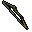 | Willow longbow | A nice sturdy bow made out of willow. | 320 | yes |  | Wield |
|  | Willow shortbow | A shortbow made out of willow, still effective. | 200 | yes |  | Wield |
|  | Maple longbow | A nice sturdy bow made out of Maple. | 640 | yes |  | Wield |
| 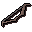 | Maple shortbow | A shortbow made out of Maple, still effective. | 400 | yes |  | Wield |
|  | Yew longbow | A nice sturdy bow made out of yew. | 1280 | yes |  | Wield |
| 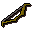 | Yew shortbow | A shortbow made out of yew, still effective. | 800 | yes |  | Wield |
| 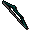 | Magic longbow | A nice sturdy magical bow. | 2560 | yes |  | Wield |
|  | Magic shortbow | Short and magical, but still effective. | 1600 | yes |  | Wield |
|  | Ogre bow | More powerful than a normal bow, useful against large game birds. | 500 | yes |  | Wield, Check kills |
| 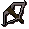 | Crossbow | This fires crossbow bolts. | 70 |  |  | Wield |
| 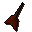 | Bronze dart | A deadly throwing dart with a bronze tip. | 1 | yes | yes | Wield |
|  | Iron dart | A deadly throwing dart with an iron tip. | 2 | yes | yes | Wield |
| 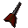 | Steel dart | A deadly throwing dart with a steel tip. | 10 | yes | yes | Wield |
|  | Mithril dart | A deadly throwing dart with a mithril tip. | 25 | yes | yes | Wield |
| 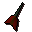 | Adamant dart | A deadly throwing dart with an adamantite tip. | 65 | yes | yes | Wield |
|  | Rune dart | A deadly throwing dart with a rune tip. | 350 | yes | yes | Wield |
|  | Bronze dart(p) | A deadly poisoned dart with a bronze tip. | 1 | yes | yes | Wield |
|  | Iron dart(p) | A deadly poisoned dart with an iron tip. | 2 | yes | yes | Wield |
|  | Steel dart(p) | A deadly poisoned dart with a steel tip. | 10 | yes | yes | Wield |
|  | Mithril dart(p) | A deadly poisoned dart with a mithril tip. | 25 | yes | yes | Wield |
|  | Adamant dart(p) | A deadly poisoned dart with an adamantite tip. | 65 | yes | yes | Wield |
|  | Rune dart(p) | A deadly poisoned dart with a rune tip. | 350 | yes | yes | Wield |
|  | Poisoned dart(p) | A deadly throwing dart with a poisoned tip. | 0 | yes | yes | Wield |
|  | Bronze javelin | A bronze tipped javelin. | 4 | yes | yes | Wield |
|  | Iron javelin | An iron tipped javelin. | 6 | yes | yes | Wield |
|  | Steel javelin | A steel tipped javelin. | 24 | yes | yes | Wield |
|  | Mithril javelin | A mithril tipped javelin. | 64 | yes | yes | Wield |
|  | Adamant javelin | An adamantite tipped javelin. | 160 | yes | yes | Wield |
|  | Rune javelin | A rune tipped javelin. | 400 | yes | yes | Wield |
|  | Bronze javelin(p) | A bronze tipped javelin. | 4 | yes | yes | Wield |
|  | Iron javelin(p) | An iron tipped javelin. | 6 | yes | yes | Wield |
|  | Steel javelin(p) | A steel tipped javelin. | 24 | yes | yes | Wield |
|  | Mithril javelin(p) | A mithril tipped javelin. | 64 | yes | yes | Wield |
|  | Adamant javelin(p) | An adamantite tipped javelin. | 160 | yes | yes | Wield |
|  | Rune javelin(p) | A rune tipped javelin. | 400 | yes | yes | Wield |
|  | Iron knife | A finely balanced throwing knife. | 3 | yes | yes | Wield |
|  | Bronze knife | A finely balanced throwing knife. | 1 | yes | yes | Wield |
|  | Steel knife | A finely balanced throwing knife. | 11 | yes | yes | Wield |
|  | Mithril knife | A finely balanced throwing knife. | 27 | yes | yes | Wield |
|  | Adamant knife | A finely balanced throwing knife. | 66 | yes | yes | Wield |
|  | Rune knife | A finely balanced throwing knife. | 167 | yes | yes | Wield |
|  | Black knife | A finely balanced throwing knife. | 19 | yes | yes | Wield |
|  | Bronze knife(p) | A finely balanced throwing knife. | 1 | yes | yes | Wield |
|  | Iron knife(p) | A finely balanced throwing knife. | 3 | yes | yes | Wield |
|  | Steel knife(p) | A finely balanced throwing knife. | 10 | yes | yes | Wield |
|  | Mithril knife(p) | A finely balanced throwing knife. | 27 | yes | yes | Wield |
|  | Black knife(p) | A finely balanced throwing knife. | 18 | yes | yes | Wield |
|  | Adamant knife(p) | A finely balanced throwing knife. | 66 | yes | yes | Wield |
|  | Rune knife(p) | A finely balanced throwing knife. | 166 | yes | yes | Wield |
|  | Bronze thrownaxe | A finely balanced throwing axe. | 3 | yes | yes | Wield |
|  | Iron thrownaxe | A finely balanced throwing axe. | 7 | yes | yes | Wield |
|  | Steel thrownaxe | A finely balanced throwing axe. | 26 | yes | yes | Wield |
|  | Mithril thrownaxe | A finely balanced throwing axe. | 70 | yes | yes | Wield |
|  | Adamnt thrownaxe | A finely balanced throwing axe. | 176 | yes | yes | Wield |
|  | Rune thrownaxe | A finely balanced throwing axe. | 440 | yes | yes | Wield |
|  | Asgarnian ale | Probably the finest ale in Asgarnia. | 2 |  |  | Drink |
|  | Wizard's mind bomb | It's got strange bubbles in it. | 2 |  |  | Drink |
|  | Greenman's ale | A glass of frothy ale. | 2 | yes |  | Drink |
|  | Dragon bitter | A glass of bitter. | 2 | yes |  | Drink |
|  | Dwarven stout | A pint of thick dark beer. | 2 |  |  | Drink |
|  | Grog | A murky glass of some sort of drink. | 3 | yes |  | Drink |
|  | Beer | A glass of frothy ale. | 2 |  |  | Drink |
|  | Beer glass | I need to fill this with beer. | 2 |  |  |  |
|  | Swamp tar | A foul smelling thick tar like substance. | 1 | yes | yes |  |
|  | Raw swamp paste | A thick tar like substance mixed with flour. | 1 | yes | yes |  |
|  | Swamp paste | A tar like substance mixed with flour and warmed. | 30 | yes | yes |  |
|  | Chef's hat | What a silly hat. | 2 |  |  | Wear |
|  | Pumpkin | Happy Halloween. | 30 |  |  | Eat |
|  | Easter egg | Happy Easter. | 10 |  |  | Eat |
|  | Banana | Mmm this looks tasty. | 2 |  |  | Eat |
|  | Cabbage | Yuck I don't like cabbage. | 1 |  |  | Eat |
|  | Cabbage | Yuck I don't like cabbage. | 1 |  |  | Eat |
|  | Spinach roll | A home made spinach thing. | 1 |  |  | Eat |
|  | Kebab | A meaty kebab. | 3 |  |  | Eat |
|  | Chocolaty milk | Milk with chocolate in it. | 2 | yes |  | Drink |
|  | Cup of tea | A nice cup of tea. | 10 | yes |  | Drink |
|  | Empty cup | An empty cup. | 2 | yes |  |  |
|  | Rotten apples | Rotten! | 1 | yes |  | Eat |
|  | Onion | A strong smelling onion. | 3 |  |  |  |
|  | Chocolate dust | It's ground up chocolate. | 2 | yes |  |  |
|  | Pot | This pot is empty. | 1 |  |  |  |
|  | Flour | A little heap of flour. | 2 |  |  |  |
|  | Grain | Some wheat heads. | 2 |  |  |  |
|  | Burnt chicken | Oh dear, it's totally burnt! | 1 |  |  |  |
|  | Burnt meat | Oh dear, it's totally burnt! | 1 |  |  |  |
|  | Ugthanki meat | Freshly cooked ugthanki meat. | 5 | yes |  | Eat |
|  | Cooked chicken | Mmm this looks tasty. | 4 |  |  | Eat |
|  | Cooked meat | Mmm this looks tasty. | 4 |  |  | Eat |
|  | Lava eel | Strange, it looks cooler now it's been cooked. | 150 | yes |  | Eat |
|  | Raw ugthanki meat | I need to cook this first. | 2 | yes |  |  |
|  | Raw beef | I need to cook this first. | 1 |  |  |  |
|  | Raw rat meat | I need to cook this first. | 1 |  |  |  |
|  | Raw bear meat | I need to cook this first. | 1 |  |  |  |
|  | Raw chicken | I need to cook this first. | 1 |  |  |  |
|  | Raw lava eel | A very strange eel. | 150 | yes |  |  |
|  | Cake | A plain sponge cake. | 50 |  |  | Eat |
|  | 2/3 cake | Someone has eaten a big chunk of this cake. | 30 |  |  | Eat |
|  | Slice of cake | I'd rather have a whole cake. | 10 |  |  | Eat |
|  | Chocolate cake | This looks very tasty. | 70 |  |  | Eat |
|  | 2/3 chocolate cake | Someone has eaten a big chunk of this cake. | 50 |  |  | Eat |
|  | Chocolate slice | I'd rather have a whole cake. | 30 |  |  | Eat |
|  | Burnt cake | Argh what a mess! | 1 |  |  |  |
|  | Pot of flour | There is flour in this pot. | 10 |  |  |  |
|  | Bucket of milk | It's a bucket of milk. | 6 |  |  |  |
|  | Egg | A nice fresh egg. | 4 |  |  |  |
|  | Chocolate bar | Mmmmmmm chocolate. | 10 |  |  | Eat |
|  | Pastry dough | Potentially pastry. | 1 |  |  |  |
|  | Cake tin | Useful for baking cakes. | 10 |  |  |  |
|  | Uncooked cake | Now all I need to do is cook it. | 20 |  |  |  |
|  | Pitta dough | I need to cook this. | 4 | yes |  |  |
|  | Bread dough | Some uncooked dough. | 4 |  |  |  |
|  | Pitta bread | Mmmm, I need to add some other ingredients yet. | 10 | yes |  |  |
|  | Bread | Nice crispy bread. | 12 |  |  | Eat |
|  | Burnt pitta bread | It's all burnt. | 1 | yes |  |  |
|  | Burnt bread | Nice crispy bread.  Possibly too crispy. | 1 |  |  |  |
|  | Raw oomlie | Raw meat from the oomlie bird. | 10 | yes |  |  |
|  | Palm leaf | A thick green palm leaf used by natives to cook meat in. | 5 | yes |  |  |
|  | Burnt oomlie wrap | Burnt oomlie meat in a palm leaf pouch. | 1 | yes |  |  |
|  | Burnt oomlie | Oh dear, it's totally burnt! | 1 | yes |  |  |
|  | Cooked oomlie wrap | Deliciously cooked oomlie meat in a palm leaf pouch. | 35 | yes |  | Eat |
|  | Wrapped oomlie | Oomlie meat in a palm leaf pouch.  It just needs to be cooked. | 16 | yes |  |  |
|  | Apple pie | Mmm Apple pie. | 30 |  |  | Eat |
|  | Redberry pie | Looks tasty. | 12 |  |  | Eat |
|  | Meat pie | Not for vegetarians. | 15 |  |  | Eat |
|  | Half a meat pie | Half of it is suitable for vegetarians. | 8 |  |  | Eat |
|  | Half a redberry pie | So tasty I kept some for later. | 6 |  |  | Eat |
|  | Half an apple pie | Mmm half an apple pie. | 15 |  |  | Eat |
|  | Burnt pie | I think I left it on the stove too long. | 1 |  |  | Empty Dish |
|  | Redberries | Very bright red berries. | 3 |  |  |  |
|  | Pie shell | I need to find a filling for this pie. | 4 |  |  |  |
|  | Cooking apple | Keeps the doctor away. | 1 |  |  |  |
|  | Pie dish | Deceptively pie shaped. | 3 |  |  |  |
|  | Uncooked apple pie | This would be much tastier cooked. | 16 |  |  |  |
|  | Uncooked meat pie | This would be much healthier cooked. | 8 |  |  |  |
|  | Uncooked berry pie | This would be much more appetising cooked. | 6 |  |  |  |
|  | 1/2 plain pizza | Half of this pizza has been eaten. | 20 |  |  | Eat |
|  | Meat pizza | A pizza with bits of meat on it. | 50 |  |  | Eat |
|  | 1/2 meat pizza | Half of this pizza has been eaten. | 25 |  |  | Eat |
|  | Anchovy pizza | A pizza with anchovies. | 60 |  |  | Eat |
|  | 1/2 anchovy pizza | Half of this pizza has been eaten. | 30 |  |  | Eat |
|  | Pineapple pizza | A tropicana pizza. | 100 | yes |  | Eat |
|  | 1/2pineapple pizza | Half of this pizza has been eaten. | 50 | yes |  | Eat |
|  | Plain pizza | A cheese and tomato pizza. | 40 |  |  | Eat |
|  | Burnt pizza | Oh dear! | 1 |  |  |  |
|  | Tomato | This would make good ketchup. | 4 |  |  | Eat |
|  | Cheese | It's got holes in it. | 4 |  |  | Eat |
|  | Pizza base | I need to add some tomato next. | 4 |  |  |  |
|  | Incomplete pizza | I need to add some cheese next. | 10 |  |  |  |
|  | Uncooked pizza | This needs cooking. | 25 |  |  |  |
|  | Incomplete stew | I need to add some meat too. | 4 |  |  |  |
|  | Incomplete stew | I need to add some potato too. | 4 |  |  |  |
|  | Burnt stew | Eew, it's horribly burnt. | 1 |  |  | Empty Bowl |
|  | Burnt curry | Eew, it's horribly burnt. | 1 | yes |  | Empty Bowl |
|  | Potato | This could be used to make a good stew. | 1 |  |  |  |
|  | Stew | It's a meat and potato stew. | 20 |  |  | Eat |
|  | Curry | It's a spicy hot curry. | 20 | yes |  | Eat |
|  | Uncooked stew | I need to cook this. | 10 |  |  |  |
|  | Uncooked curry | I need to cook this. | 10 | yes |  |  |
|  | Chopped tomato | A mixture of tomatoes in a bowl. | 3 | yes |  |  |
|  | Chopped onion | A mixture of onions in a bowl. | 3 | yes |  |  |
|  | Chopped ugthanki | Strips of ugthanki meat in a bowl. | 5 | yes |  |  |
|  | Onion & tomato | A mixture of chopped onions and tomatoes in a bowl. | 5 | yes |  |  |
|  | Ugthanki & onion | A mixture of chopped onions and ugthanki meat in a bowl. | 7 | yes |  |  |
|  | Ugthanki & tomato | A mixture of chopped tomatoes and ugthanki meat in a bowl. | 7 | yes |  |  |
|  | Kebab mix | A mixture of chopped tomatoes, onions and ugthanki meat in a bowl. | 9 | yes |  |  |
|  | Ugthanki kebab | A strange smelling kebab made from ugthanki meat. | 20 | yes |  | Eat |
|  | Ugthanki kebab | A fresh kebab made from ugthanki meat. | 20 | yes |  | Eat |
|  | Jug of bad wine | Oh dear, this wine is terrible! | 1 |  |  | Drink |
|  | Grapes | Good grapes for wine making. | 1 |  |  |  |
|  | Jug of wine | It's full of wine. | 1 |  |  | Drink |
|  | Half full wine jug | An optimist would say it's half full. | 1 |  |  | Drink |
|  | Unfermented wine | This wine needs to ferment before it can be drunk. | 10 |  |  |  |
|  | Worm batta | It actually smells quite good. | 120 | yes |  | Eat |
|  | Toad batta | It actually smells quite good. | 120 | yes |  | Eat |
|  | Cheese+tom batta | This smells really good. | 120 | yes |  | Eat |
|  | Fruit batta | It actually smells quite good. | 120 | yes |  | Eat |
|  | Vegetable batta | Well... it looks healthy. | 120 | yes |  | Eat |
|  | Odd batta | This batta doesn't look very appetising. | 2 | yes |  | Eat |
|  | Burnt batta | This batta has been burnt to a cinder. | 1 | yes |  |  |
|  | Half baked batta | This gnome batta is in the early stages of preparation. | 2 | yes |  | Inspect |
|  | Raw batta | This gnome batta needs cooking. | 2 | yes |  |  |
|  | Unfinished batta | This batta is just missing those little finishing touches. | 0 | yes |  | Eat |
|  | Worm batta | It actually smells quite good. | 0 | yes |  | Eat |
|  | Toad batta | It actually smells quite good. | 2 | yes |  | Eat |
|  | Unfinished batta | This batta is just missing those little finishing touches. | 0 | yes |  | Eat |
|  | Cheese+tom batta | This smells really good. | 2 | yes |  | Eat |
|  | Unfinished batta | This batta is just missing those little finishing touches. | 0 | yes |  | Eat |
|  | Unfinished batta | This batta is just missing those little finishing touches. | 0 | yes |  | Eat |
|  | Unfinished batta | This batta is just missing those little finishing touches. | 0 | yes |  | Eat |
|  | Unfinished batta | This batta is just missing those little finishing touches. | 0 | yes |  | Eat |
|  | Unfinished batta | This batta is just missing those little finishing touches. | 0 | yes |  | Eat |
|  | Unfinished batta | This batta is just missing those little finishing touches. | 0 | yes |  | Eat |
|  | Unfinished batta | This batta is just missing those little finishing touches. | 0 | yes |  | Eat |
|  | Unfinished batta | This batta is just missing those little finishing touches. | 0 | yes |  | Eat |
|  | Fruit batta | It actually smells quite good. | 2 | yes |  | Eat |
|  | Unfinished batta | This batta is just missing those little finishing touches. | 0 | yes |  | Eat |
|  | Vegetable batta | Well... it looks healthy. | 2 | yes |  | Eat |
|  | Vodka | A strong spirit. | 5 | yes |  | Drink |
|  | Whisky | A bottle of Draynor Malt. | 5 | yes |  | Drink |
|  | Gin | A strong spirit. | 5 | yes |  | Drink |
|  | Brandy | A strong spirit. | 5 | yes |  | Drink |
|  | Cocktail guide | A book on tree gnome cocktails. | 2 | yes |  | Read |
|  | Cocktail shaker | Used for mixing cocktails. | 2 | yes |  | Inspect |
|  | Cocktail glass | For sipping cocktails. | 1 | yes |  |  |
|  | Blurberry special | Looks good... smells strong. | 30 | yes |  | Drink |
|  | Choc saturday | A warm creamy alcoholic beverage. | 30 | yes |  | Drink |
|  | Drunk dragon | A warm creamy alcoholic beverage. | 30 | yes |  | Drink |
|  | Fruit blast | A cool refreshing fruit mix. | 30 | yes |  | Drink |
|  | Pineapple punch | A fresh healthy fruit mix. | 30 | yes |  | Drink |
|  | Sgg | A Short Green Guy... looks good. | 30 | yes |  | Drink |
|  | Wizard blizzard | This looks like a strange mix. | 30 | yes |  | Drink |
|  | Unfinished cocktail | This cocktail is just missing those little finishing touches. | 2 | yes |  | Drink |
|  | Unfinished cocktail | This cocktail is just missing those little finishing touches. | 2 | yes |  | Drink |
|  | Unfinished cocktail | This cocktail is just missing those little finishing touches. | 2 | yes |  | Drink |
|  | Pineapple punch | A fresh healthy fruit mix. | 30 | yes |  | Drink |
|  | Unfinished cocktail | This cocktail is just missing those little finishing touches. | 2 | yes |  | Drink |
|  | Unfinished cocktail | This cocktail is just missing those little finishing touches. | 2 | yes |  | Drink |
|  | Wizard blizzard | This looks like a strange mix. | 30 | yes |  | Drink |
|  | Unfinished cocktail | This cocktail is just missing those little finishing touches. | 2 | yes |  | Drink |
|  | Unfinished cocktail | This cocktail is just missing those little finishing touches. | 2 | yes |  | Drink |
|  | Unfinished cocktail | This cocktail is just missing those little finishing touches. | 2 | yes |  | Drink |
|  | Unfinished cocktail | This cocktail is just missing those little finishing touches. | 2 | yes |  | Drink |
|  | Blurberry special | Looks good... smells strong. | 30 | yes |  | Drink |
|  | Unfinished cocktail | This cocktail is just missing those little finishing touches. | 2 | yes |  | Drink |
|  | Unfinished cocktail | This cocktail is just missing those little finishing touches. | 2 | yes |  | Drink |
|  | Unfinished cocktail | This cocktail is just missing those little finishing touches. | 2 | yes |  | Drink |
|  | Unfinished cocktail | This cocktail is just missing those little finishing touches. | 2 | yes |  | Drink |
|  | Choc saturday | A warm creamy alcoholic beverage. | 30 | yes |  | Drink |
|  | Unfinished cocktail | This cocktail is just missing those little finishing touches. | 2 | yes |  | Drink |
|  | Unfinished cocktail | This cocktail is just missing those little finishing touches. | 2 | yes |  | Drink |
|  | Sgg | A Short Green Guy... looks good. | 30 | yes |  | Drink |
|  | Unfinished cocktail | This cocktail is just missing those little finishing touches. | 2 | yes |  | Drink |
|  | Fruit blast | A cool refreshing fruit mix. | 30 | yes |  | Drink |
|  | Unfinished cocktail | This cocktail is just missing those little finishing touches. | 2 | yes |  | Drink |
|  | Unfinished cocktail | This cocktail is just missing those little finishing touches. | 2 | yes |  | Drink |
|  | Unfinished cocktail | This cocktail is just missing those little finishing touches. | 2 | yes |  | Drink |
|  | Drunk dragon | A warm creamy alcoholic beverage. | 30 | yes |  | Drink |
|  | Odd cocktail | I'm not completely sure what this contains. | 2 | yes |  | Empty, Drink |
|  | Odd cocktail | I'm not completely sure what this contains. | 2 | yes |  | Empty, Drink |
|  | Odd cocktail | I'm not completely sure what this contains. | 2 | yes |  | Empty, Drink |
|  | Odd cocktail | I'm not completely sure what this contains. | 2 | yes |  | Empty, Drink |
|  | Lemon | A fresh lemon. | 2 | yes |  | Eat |
|  | Lemon chunks | Fresh chunks of lemon. | 2 | yes |  | Eat |
|  | Lemon slices | Fresh lemon slices. | 2 | yes |  | Eat |
|  | Orange | A fresh orange. | 2 | yes |  | Eat |
|  | Orange chunks | Fresh chunks of orange. | 2 | yes |  | Eat |
|  | Orange slices | Fresh orange slices. | 2 | yes |  | Eat |
|  | Pineapple | It can be cut up into something more manageable with a knife. | 1 | yes |  | Eat |
|  | Pineapple chunks | Fresh chunks of pineapple. | 1 | yes |  | Eat |
|  | Pineapple ring | Exotic fruit. | 1 | yes |  | Eat |
|  | Lime | A fresh lime. | 2 | yes |  | Eat |
|  | Lime chunks | Fresh chunks of lime. | 1 | yes |  | Eat |
|  | Lime slices | Fresh lime slices. | 2 | yes |  | Eat |
|  | Worm crunchies | It actually smells quite good. | 85 | yes |  | Eat |
|  | Chocchip crunchies | Yum... smells good. | 85 | yes |  | Eat |
|  | Spicy crunchies | Yum... smells good. | 85 | yes |  | Eat |
|  | Toad crunchies | It actually smells quite good. | 85 | yes |  | Eat |
|  | Odd crunchies | These crunchies don't look very appetising. | 2 | yes |  | Eat |
|  | Burnt crunchies | These crunchies have been burnt to a cinder. | 1 | yes |  |  |
|  | Half baked crunchy | This crunchy is in the early stages of preparation. | 2 | yes |  | Inspect |
|  | Raw crunchies | These crunchies need cooking. | 2 | yes |  |  |
|  | Unfinished crunchy | These crunchies are just missing those little finishing touches. | 0 | yes |  | Eat |
|  | Worm crunchies | It actually smells quite good. | 2 | yes |  | Eat |
|  | Unfinished crunchy | These crunchies are just missing those little finishing touches. | 0 | yes |  | Eat |
|  | Chocchip crunchies | Yum... smells good. | 2 | yes |  | Eat |
|  | Unfinished crunchy | These crunchies are just missing those little finishing touches. | 0 | yes |  | Eat |
|  | Spicy crunchies | Yum... smells good. | 2 | yes |  | Eat |
|  | Unfinished crunchy | These crunchies are just missing those little finishing touches. | 0 | yes |  | Eat |
|  | Toad crunchies | It actually smells quite good. | 2 | yes |  | Eat |
|  | Spice | This could liven up an otherwise bland stew. | 230 | yes |  |  |
|  | Dwellberries | Some rather pretty blue berries. | 4 | yes |  | Eat |
|  | Equa leaves | Small sweet smelling leaves. | 2 | yes |  | Eat |
|  | Pot of cream | Fresh cream. | 2 | yes |  | Eat |
|  | Swamp toad | A slippery little blighter. | 2 | yes |  | Remove-legs |
|  | Toad's legs | They're a gnome delicacy apparently. | 2 | yes |  | Eat |
|  | Equa toad's legs | They're a gnome delicacy apparently. | 2 | yes |  | Eat |
|  | Spicy toad's legs | They're a gnome delicacy apparently. | 2 | yes |  | Eat |
|  | Seasoned legs | They're a gnome delicacy apparently. | 2 | yes |  | Eat |
|  | Spicy worm | They're a gnome delicacy apparently. | 2 | yes |  | Eat |
|  | King worm | They're a gnome delicacy apparently. | 2 | yes |  | Eat |
|  | Batta tin | A deep tin used for baking gnome battas in. | 0 | yes |  |  |
|  | Crunchy tray | A shallow tray used for baking crunchies in. | 0 | yes |  |  |
|  | Gnomebowl mould | A large ovenproof bowl. | 0 | yes |  |  |
|  | Gianne's cook book | Aluft Gianne's favorite dishes. | 2 | yes |  | Read |
|  | Gnome spice | It's Aluft Gianne's secret mix of spices. | 2 | yes |  |  |
|  | Gianne dough | It's made from a secret recipe. | 2 | yes |  |  |
|  | Chocolate bomb | Looks great! | 2 | yes |  | Eat |
|  | Tangled toad's legs | It actually smells quite good. | 2 | yes |  | Eat |
|  | Worm hole | It actually smells quite good. | 2 | yes |  | Eat |
|  | Veg ball | This looks pretty healthy. | 2 | yes |  | Eat |
|  | Chocolate bomb | Looks great! | 160 | yes |  | Eat |
|  | Tangled toad's legs | It actually smells quite good. | 160 | yes |  | Eat |
|  | Worm hole | It actually smells quite good. | 150 | yes |  | Eat |
|  | Veg ball | This looks pretty healthy. | 150 | yes |  | Eat |
|  | Odd gnomebowl | This gnome bowl doesn't look very appetising. | 2 | yes |  | Eat |
|  | Burnt gnomebowl | This gnome bowl has been burnt to a cinder. | 1 | yes |  |  |
|  | Half baked bowl | This gnome bowl is in the early stages of preparation. | 2 | yes |  | Inspect |
|  | Raw gnomebowl | This gnome bowl needs cooking. | 2 | yes |  |  |
|  | Unfinished bowl | This dish is just missing those little finishing touches. | 0 | yes |  | Eat |
|  | Unfinished bowl | This dish is just missing those little finishing touches. | 0 | yes |  | Eat |
|  | Unfinished bowl | This dish is just missing those little finishing touches. | 0 | yes |  | Eat |
|  | Unfinished bowl | This dish is just missing those little finishing touches. | 0 | yes |  | Eat |
|  | Unfinished bowl | This dish is just missing those little finishing touches. | 0 | yes |  | Eat |
|  | Unblessed symbol | A symbol of Saradomin. | 200 |  |  | Wear |
|  | Holy symbol | A blessed holy symbol of Saradomin. | 300 |  |  | Wear |
|  | Unpowered symbol | An unholy symbol of Zamorak. | 200 | yes |  | Wear |
|  | Unholy symbol | An unholy symbol of Zamorak. | 200 | yes |  | Wear |
|  | Needle | Used with a thread to make clothes. | 0 |  | yes |  |
|  | Thread | Used with a needle to make clothes. | 0 |  | yes |  |
|  | Shears | For shearing sheep. | 0 |  |  |  |
|  | Cow hide | I should take this to the tannery. | 0 |  |  |  |
|  | Chisel | Good for detailed crafting. | 0 |  |  |  |
|  | Brown apron | A mostly clean apron. | 2 |  |  | Wear |
|  | Ball of wool | Spun from sheeps wool. | 2 |  |  |  |
|  | Bow string | I need a bow stave to attach this to. | 10 | yes |  |  |
|  | Woad leaf | A slightly bluish leaf. | 1 |  | yes |  |
|  | Bronze wire | Useful for crafting items. | 20 | yes |  |  |
|  | Dragonhide | The scaly rough hide from a Dragon | 0 | yes |  |  |
|  | Dragonhide | The scaly rough hide from a Dragon | 0 | yes |  |  |
|  | Dragonhide | The scaly rough hide from a Dragon | 0 | yes |  |  |
|  | Dragonhide | The scaly rough hide from a Dragon | 0 | yes |  |  |
|  | Cape | A bright red cape. | 2 |  |  | Wear |
|  | Cape | A warm black cape. | 7 |  |  | Wear |
|  | Cape | A thick blue cape. | 32 |  |  | Wear |
|  | Cape | A thick yellow cape. | 32 |  |  | Wear |
|  | Cape | A thick green cape. | 32 |  |  | Wear |
|  | Cape | A thick purple cape. | 32 |  |  | Wear |
|  | Cape | A thick orange cape. | 32 |  |  | Wear |
|  | Red dye | A little bottle of red dye. | 5 |  |  |  |
|  | Yellow dye | A little bottle of yellow dye. | 5 |  |  |  |
|  | Blue dye | A little bottle of blue dye. | 5 |  |  |  |
|  | Orange dye | A little bottle of orange dye. | 5 |  |  |  |
|  | Green dye | A little bottle of green dye. | 5 |  |  |  |
|  | Purple dye | A little bottle of purple dye. | 5 |  |  |  |
|  | Uncut diamond | This would be worth more cut. | 200 |  |  |  |
|  | Uncut ruby | This would be worth more cut. | 100 |  |  |  |
|  | Uncut emerald | This would be worth more cut. | 50 |  |  |  |
|  | Uncut sapphire | This would be worth more cut. | 25 |  |  |  |
|  | Uncut opal | This would be worth more cut. | 20 | yes |  |  |
|  | Uncut jade | This would be worth more cut. | 30 | yes |  |  |
|  | Uncut red topaz | This would be worth more cut. | 40 | yes |  |  |
|  | Uncut dragonstone | This would be worth more cut. | 1000 | yes |  |  |
|  | Molten glass | Hot glass ready to be blown into useful objects. | 2 | yes |  |  |
|  | Soda ash | One of the ingredients for making glass. | 2 | yes |  |  |
|  | Bucket of sand | One of the ingredients for making glass. | 2 | yes |  |  |
|  | Glassblowing pipe |  | 2 | yes |  |  |
|  | Gold amulet | It needs a string so I can wear it. | 350 |  |  |  |
|  | Sapphire amulet | It needs a string so I can wear it. | 900 |  |  |  |
|  | Emerald amulet | It needs a string so I can wear it. | 1275 |  |  |  |
|  | Ruby amulet | It needs a string so I can wear it. | 2025 |  |  |  |
|  | Diamond amulet | It needs a string so I can wear it. | 3525 |  |  |  |
|  | Dragonstoneamulet | It needs a string so I can wear it. | 17625 | yes |  |  |
|  | black_amulet |  | 0 |  |  |  |
|  | Sapphire amulet |  | 0 |  |  |  |
|  | Emerald amulet |  | 0 |  |  |  |
|  | Ruby amulet |  | 0 |  |  |  |
|  | Diamond amulet |  | 0 |  |  |  |
|  | Dragonstoneamulet |  | 0 |  |  |  |
|  | Gold amulet | I wonder if I can get this enchanted. | 350 |  |  | Wear |
|  | Sapphire amulet | I wonder if I can get this enchanted. | 900 |  |  | Wear |
|  | Emerald amulet | I wonder if I can get this enchanted. | 1275 |  |  | Wear |
|  | Ruby amulet | I wonder if I can get this enchanted. | 2025 |  |  | Wear |
|  | Diamond amulet | I wonder if I can get this enchanted. | 3525 |  |  | Wear |
|  | Dragonstoneamulet | I wonder if I can get this enchanted. | 17625 | yes |  | Wear |
|  | Diamond | This looks valuable. | 2000 |  |  |  |
|  | Ruby | This looks valuable. | 1000 |  |  |  |
|  | Emerald | This looks valuable. | 500 |  |  |  |
|  | Sapphire | This looks valuable. | 250 |  |  |  |
|  | Opal | A semi precious stone. | 100 | yes |  |  |
|  | Jade | A semi precious stone. | 150 | yes |  |  |
|  | Red topaz | A semi precious stone. | 200 | yes |  |  |
|  | Dragonstone | This looks valuable. | 10000 | yes |  |  |
|  | Crushed gemstone | A gemstone that has been smashed. | 2 | yes |  |  |
|  | Ring mould | Used to make gold rings. | 5 |  |  |  |
|  | Unholy mould | Used to make unholy symbols. | 200 | yes |  |  |
|  | Amulet mould | Used to make gold amulets | 5 |  |  |  |
|  | Necklace mould | Used to make gold necklaces. | 5 |  |  |  |
|  | Holy mould | Used to make Holy Symbols of Saradomin. | 5 |  |  |  |
|  | Gold necklace | I wonder if this is valuable. | 450 |  |  | Wear |
|  | Sapphire necklace | I wonder if this is valuable. | 1050 |  |  | Wear |
|  | Emerald necklace | I wonder if this is valuable. | 1425 |  |  | Wear |
|  | Ruby necklace | I wonder if this is valuable. | 2175 |  |  | Wear |
|  | Diamond necklace | I wonder if this is valuable. | 3675 |  |  | Wear |
|  | Dragon necklace | I wonder if this is valuable. | 18375 | yes |  | Wear |
|  | black_necklace |  | 0 |  |  |  |
|  | Sapphire necklace |  | 0 |  |  |  |
|  | Emerald necklace |  | 0 |  |  |  |
|  | Ruby necklace |  | 0 |  |  |  |
|  | Diamond necklace |  | 0 |  |  |  |
|  | Dragon necklace |  | 0 |  |  |  |
|  | Gold ring | A valuable ring. | 350 |  |  | Wear |
|  | Sapphire ring | A valuable ring. | 900 |  |  | Wear |
|  | Emerald ring | A valuable ring. | 1275 |  |  | Wear |
|  | Ruby ring | A valuable ring. | 2025 |  |  | Wear |
|  | Diamond ring | A valuable ring. | 3525 |  |  | Wear |
|  | Dragonstone ring | A valuable ring. | 17625 | yes |  | Wear |
|  | black_ring |  | 0 |  |  |  |
|  | Sapphire ring |  | 0 |  |  |  |
|  | Emerald ring |  | 0 |  |  |  |
|  | Ruby ring |  | 0 |  |  |  |
|  | Diamond ring |  | 0 |  |  |  |
|  | Dragonstone ring |  | 0 |  |  |  |
|  | Unstrung symbol | It needs a string so I can wear it. | 200 |  |  |  |
|  | Unstrung emblem | It needs a string so I can wear it. | 200 | yes |  |  |
|  | Leather | It's a piece of leather. | 0 |  |  |  |
|  | Hard leather | It's a piece of hard leather. | 0 |  |  |  |
|  | Dragon leather | It's a piece of prepared dragonhide. | 0 | yes |  |  |
|  | Dragon leather | It's a piece of prepared dragonhide. | 0 | yes |  |  |
|  | Dragon leather | It's a piece of prepared dragonhide. | 0 | yes |  |  |
|  | Dragon leather | It's a piece of prepared dragonhide. | 0 | yes |  |  |
|  | Leather gloves | These will keep my hands warm! | 6 |  |  | Wear |
