<!-- GENERATED by tools/docsgen — do not edit; regenerate instead. -->

# Items — page 4 (Leather boots – Bones)

| Icon | Name | Description | Cost | Members | Stackable | Options |
|---|---|---|---|---|---|---|
| 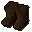 | Leather boots | Comfortable leather boots. | 6 |  |  | Wear |
|  | Leather vambraces | Better than no armour! | 18 |  |  | Wear |
|  | Dragon vambraces | Made from 100% real dragon hide. | 2500 |  |  | Wear |
| 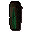 | Leather chaps | Better than no armour! | 20 |  |  | Wear |
| 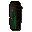 | Studded chaps | Those studs should provide a bit more protection. | 750 |  |  | Wear |
| 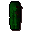 | Dragonhide chaps | Made from 100% real dragon hide. | 3900 |  |  | Wear |
| 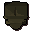 | Leather body | Better than no armour! | 21 |  |  | Wear |
| 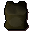 | Hardleather body | Harder than normal leather. | 170 |  |  | Wear |
|  | Studded body | Those studs should provide a bit more protection. | 850 |  |  | Wear |
|  | Dragonhide body | Made from 100% real dragon hide. | 7800 |  |  | Wear |
|  | Leather cowl | Better than no armour! | 24 |  |  | Wear |
| 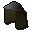 | Coif | Light weight head protection. | 200 |  |  | Wear |
| 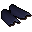 | Dragon vambraces | Made from 100% real dragon hide. | 2500 | yes |  | Wear |
|  | Dragon vambraces | Made from 100% real dragon hide. | 2500 | yes |  | Wear |
|  | Dragon vambraces | Made from 100% real dragon hide. | 2500 | yes |  | Wear |
|  | Dragonhide chaps | Made from 100% real dragon hide. | 3900 | yes |  | Wear |
|  | Dragonhide chaps | Made from 100% real dragon hide. | 3900 | yes |  | Wear |
| 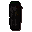 | Dragonhide chaps | Made from 100% real dragon hide. | 3900 | yes |  | Wear |
| 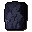 | Dragonhide body | Made from 100% real dragon hide. | 7800 | yes |  | Wear |
|  | Dragonhide body | Made from 100% real dragon hide. | 7800 | yes |  | Wear |
|  | Dragonhide body | Made from 100% real dragon hide. | 7800 | yes |  | Wear |
| 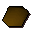 | Soft clay | Clay soft enough to mould. | 2 |  |  |  |
|  | Unfired pot | I need to put this in a pottery oven. | 1 |  |  |  |
|  | Unfired pie dish | I need to put this in a pottery oven. | 3 |  |  |  |
|  | Unfired bowl | I need to put this in a pottery oven. | 2 |  |  |  |
| 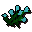 | Flax | I should use this with a spinning wheel. | 5 | yes |  |  |
|  | Wool | I think this came from a sheep. | 0 |  |  |  |
| 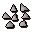 | Steel studs | A set of studs for leather armour. | 150 | yes |  |  |
|  | Tinderbox | Useful for lighting a fire. | 0 |  |  |  |
|  | Ashes | A heap of ashes. | 2 |  |  |  |
| 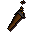 | Torch | A lit home-made torch. | 4 | yes |  |  |
| 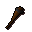 | Torch | An unlit home-made torch. | 4 | yes |  |  |
|  | Unlit arrows | Unlit arrows. | 10 | yes | yes | Wield |
|  | obj_599 |  | 0 |  |  |  |
|  | Logs | A number of wooden logs. | 4 |  |  | Light |
|  | Magic logs | Logs made from magical wood. | 320 | yes |  | Light |
|  | Yew logs | Logs cut from a yew tree. | 160 |  |  | Light |
|  | Maple logs | Logs cut from a maple tree. | 80 |  |  | Light |
|  | Willow logs | Logs cut from a willow tree. | 40 |  |  | Light |
|  | Oak logs | Logs cut from an oak tree. | 20 |  |  | Light |
|  | Lobster pot | Useful for catching lobsters. | 20 |  |  |  |
| 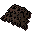 | Small fishing net | Useful for catching small fish. | 5 |  |  |  |
|  | Big fishing net | Useful for catching lots of fish. | 20 | yes |  |  |
| 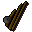 | Fishing rod | Useful for catching sardine or herring. | 5 |  |  |  |
|  | Fly fishing rod | Useful for catching salmon or trout. | 5 |  |  |  |
|  | Harpoon | Useful for catching really big fish. | 5 |  |  |  |
|  | Fishing bait | For use with a fishing rod. | 3 |  | yes |  |
| 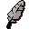 | Feather | Used for fly fishing. | 2 |  | yes |  |
| 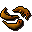 | Shrimps | Some nicely cooked fish. | 5 |  |  | Eat |
| 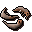 | Raw shrimps | I should try cooking this. | 5 |  |  |  |
|  | Anchovies | Some nicely cooked fish. | 15 |  |  | Eat |
|  | Raw anchovies | I should try cooking this. | 15 |  |  |  |
| 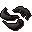 | Burnt fish | Oops! | 1 |  |  |  |
|  | Sardine | Some nicely cooked fish. | 10 |  |  | Eat |
|  | Raw sardine | I should try cooking this. | 10 |  |  |  |
|  | Salmon | Some nicely cooked fish. | 50 |  |  | Eat |
|  | Raw salmon | I should try cooking this. | 50 |  |  |  |
|  | Trout | Some nicely cooked fish. | 20 |  |  | Eat |
|  | Raw trout | I should try cooking this. | 20 |  |  |  |
|  | Giant carp | Some nicely cooked fish. | 50 | yes |  | Eat |
|  | Raw giant carp | I should try cooking this. | 50 | yes |  |  |
|  | Cod | Some nicely cooked fish. | 25 | yes |  | Eat |
| 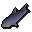 | Raw cod | I should try cooking this. | 25 | yes |  |  |
| 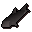 | Burnt fish | Oops! | 1 |  |  |  |
|  | Raw herring | I should try cooking this. | 15 |  |  |  |
|  | Herring | Some nicely cooked fish. | 15 |  |  | Eat |
|  | Raw pike | I should try cooking this. | 25 |  |  |  |
|  | Pike | Some nicely cooked Pike. | 25 |  |  | Eat |
|  | Raw mackerel | I should try cooking this. | 17 | yes |  |  |
|  | Mackerel | Some nicely cooked fish. | 17 | yes |  | Eat |
|  | Burnt fish | Oops! | 1 |  |  |  |
|  | Raw tuna | I should try cooking this. | 100 |  |  |  |
|  | Tuna | Wow, this is a big fish. | 100 |  |  | Eat |
|  | Raw bass | I should try cooking this. | 120 | yes |  |  |
|  | Bass | Wow, this is a big fish. | 120 | yes |  | Eat |
| 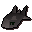 | Burnt fish | Oops! | 1 |  |  |  |
| 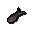 | Burnt fish | Oops! | 0 |  |  |  |
|  | Raw swordfish | I should try cooking this. | 200 |  |  |  |
|  | Swordfish | I'd better be careful eating this! | 200 |  |  | Eat |
|  | Burnt swordfish | Oops! | 1 |  |  |  |
|  | Raw lobster | I should try cooking this. | 150 |  |  |  |
|  | Lobster | This looks tricky to eat. | 150 |  |  | Eat |
| 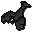 | Burnt lobster | Oops! | 1 |  |  |  |
|  | Raw shark | I should try cooking this. | 300 | yes |  |  |
|  | Shark | I'd better be careful eating this. | 300 | yes |  | Eat |
| 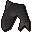 | Burnt shark | Oops! | 1 | yes |  |  |
|  | Raw manta ray | A rare catch. | 500 | yes |  |  |
|  | Manta ray | A rare catch. | 500 | yes |  | Eat |
|  | Burnt manta ray | Oops! | 1 | yes |  |  |
|  | Raw sea turtle | A rare catch. | 500 | yes |  |  |
|  | Sea turtle | Tasty! | 500 | yes |  | Eat |
| 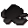 | Burnt sea turtle | Oops! | 1 | yes |  |  |
|  | Seaweed | Slightly damp seaweed. | 2 | yes |  |  |
|  | Edible seaweed | Slightly damp seaweed. | 2 | yes |  | Eat |
|  | Casket | I hope there's treasure in it. | 50 | yes |  | Open |
| 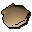 | Oyster | It's a rare oyster. | 200 | yes |  | Open |
|  | Empty oyster | It's empty. | 5 | yes |  |  |
| 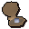 | Oyster pearl | I could work wonders with a chisel on this pearl. | 112 | yes |  |  |
| 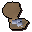 | Oyster pearls | I could work wonders with a chisel on these pearls. | 1400 | yes |  |  |
|  | Bronze arrowtips | I can make an arrow with these. | 1 | yes | yes |  |
|  | Iron arrowtips | I can make an arrow with these. | 2 | yes | yes |  |
|  | Steel arrowtips | I can make an arrow with these. | 6 | yes | yes |  |
| 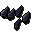 | Mithril arrowtips | I can make an arrow with these. | 16 | yes | yes |  |
| 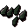 | Adamant arrowtips | I can make an arrow with these. | 40 | yes | yes |  |
| 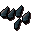 | Rune arrowtips | I can make an arrow with these. | 200 | yes | yes |  |
|  | Arrow shaft | A wooden arrow shaft | 1 | yes | yes |  |
| 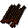 | Headless arrow | A wooden arrow shaft with flights attached | 1 | yes | yes |  |
| 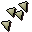 | Opal bolttips | I can make bolts with these. | 30 | yes | yes |  |
|  | Pearl bolttips | I can make bolts with these. | 56 | yes | yes |  |
| 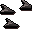 | Barb bolttips | I can make bolts with these. | 95 | yes | yes |  |
| 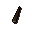 | Bronze dart tip | A deadly looking dart tip made of bronze - needs feathers for flight. | 1 | yes | yes |  |
| 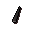 | Iron dart tip | A deadly looking dart tip made of iron - needs feathers for flight. | 3 | yes | yes |  |
|  | Steel dart tip | A deadly looking dart tip made of steel - needs feathers for flight. | 5 | yes | yes |  |
| 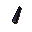 | Mithril dart tip | A deadly looking dart tip made of mithril - needs feathers for flight. | 12 | yes | yes |  |
|  | Adamant dart tip | A deadly looking dart tip made of adamantite - needs feathers for flight. | 36 | yes | yes |  |
| 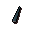 | Rune dart tip | A deadly looking dart tip made of runite - needs feathers for flight. | 175 | yes | yes |  |
|  | Wolfbone arrowtips | I can make an ogre arrow with these. | 3 | yes | yes |  |
| 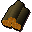 | Achey tree logs | These logs are longer than normal. | 4 | yes |  | Light |
|  | Ogre arrow shaft | A wooden arrow shaft. | 1 | yes | yes |  |
|  | Flighted ogre arrow | A wooden arrow shaft with four flights attached. | 1 | yes | yes |  |
| 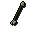 | Ogre arrow | A large ogre arrow with a bone tip. | 25 | yes | yes | Wield |
| 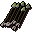 | ogre_arrow_5 |  | 0 |  | yes |  |
|  | ogre_arrow_4 |  | 0 |  | yes |  |
| 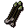 | ogre_arrow_3 |  | 0 |  | yes |  |
|  | ogre_arrow_2 |  | 0 |  | yes |  |
|  | Longbow | I need to find a string for this. | 60 | yes |  |  |
|  | Shortbow | I need to find a string for this. | 23 | yes |  |  |
|  | Oak shortbow | An unstrung oak shortbow, I need a bowstring for this. | 50 | yes |  |  |
|  | Oak longbow | An unstrung oak longbow, I need a bowstring for this. | 80 | yes |  |  |
|  | Willow longbow | An unstrung willow longbow, I need a bowstring for this. | 160 | yes |  |  |
|  | Willow shortbow | An unstrung willow shortbow, I need a bowstring for this. | 100 | yes |  |  |
|  | Maple longbow | An unstrung maple longbow, I need a bowstring for this. | 320 | yes |  |  |
| 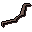 | Maple shortbow | An unstrung maple shortbow, I need a bowstring for this. | 200 | yes |  |  |
|  | Yew longbow | An unstrung yew longbow, I need a bowstring for this. | 640 | yes |  |  |
|  | Yew shortbow | An unstrung yew shortbow, I need a bowstring for this. | 400 | yes |  |  |
|  | Magic longbow | An unstrung magic longbow, I need a bowstring for this. | 1280 | yes |  |  |
|  | Magic shortbow | An unstrung magic shortbow, I need a bowstring for this. | 800 | yes |  |  |
| 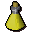 | Strength potion(4) | 4 doses of strength potion. | 14 |  |  | Drink |
|  | Strength potion(3) | 3 doses of strength potion. | 13 |  |  | Drink |
|  | Strength potion(2) | 2 doses of strength potion. | 13 |  |  | Drink |
|  | Strength potion(1) | 1 dose of strength potion. | 11 |  |  | Drink |
|  | Attack potion(3) | 3 doses of attack potion. | 12 | yes |  | Drink |
|  | Attack potion(2) | 2 doses of attack potion. | 9 | yes |  | Drink |
|  | Attack potion(1) | 1 dose of attack potion. | 6 | yes |  | Drink |
|  | Restore potion(3) | 3 doses of stat restoration potion. | 88 | yes |  | Drink |
|  | Restore potion(2) | 2 doses of stat restoration potion. | 66 | yes |  | Drink |
| 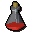 | Restore potion(1) | 1 dose of stat restoration potion. | 44 | yes |  | Drink |
| 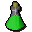 | Defence potion(3) | 3 doses of defence potion. | 120 | yes |  | Drink |
| 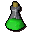 | Defence potion(2) | 2 doses of defence potion. | 90 | yes |  | Drink |
|  | Defence potion(1) | 1 dose of defence potion. | 60 | yes |  | Drink |
|  | Prayer potion(3) | 3 doses of restore prayer potion. | 152 | yes |  | Drink |
|  | Prayer potion(2) | 2 doses of restore prayer potion. | 114 | yes |  | Drink |
|  | Prayer potion(1) | 1 dose of restore prayer potion. | 76 | yes |  | Drink |
|  | Super attack(3) | 3 doses of super attack potion. | 180 | yes |  | Drink |
|  | Super attack(2) | 2 doses of super attack potion. | 135 | yes |  | Drink |
|  | Super attack(1) | 1 dose of super attack potion. | 90 | yes |  | Drink |
|  | Fishing potion(3) | 3 doses of fishing potion. | 200 | yes |  | Drink |
|  | Fishing potion(2) | 2 doses of fishing potion. | 150 | yes |  | Drink |
|  | Fishing potion(1) | 1 dose of fishing potion. | 100 | yes |  | Drink |
|  | Super strength(3) | 3 doses of super strength potion. | 220 | yes |  | Drink |
|  | Super strength(2) | 2 doses of super strength potion. | 165 | yes |  | Drink |
|  | Super strength(1) | 1 dose of super strength potion. | 110 | yes |  | Drink |
|  | Super defence(3) | 3 doses of super defence potion. | 264 | yes |  | Drink |
|  | Super defence(2) | 2 doses of super defence potion. | 198 | yes |  | Drink |
|  | Super defence(1) | 1 dose of super defence potion. | 132 | yes |  | Drink |
|  | Ranging potion(3) | 3 doses of ranging potion. | 288 | yes |  | Drink |
|  | Ranging potion(2) | 2 doses of ranging potion. | 216 | yes |  | Drink |
|  | Ranging potion(1) | 1 dose of ranging potion. | 144 | yes |  | Drink |
|  | Antipoison(3) | 3 doses of antipoison potion. | 288 | yes |  | Drink |
|  | Antipoison(2) | 2 doses of antipoison potion. | 216 | yes |  | Drink |
|  | Antipoison(1) | 1 dose of antipoison potion. | 144 | yes |  | Drink |
|  | Superantipoison(3) | 3 doses of super antipoison potion. | 288 | yes |  | Drink |
|  | Superantipoison(2) | 2 doses of super antipoison potion. | 216 | yes |  | Drink |
|  | Superantipoison(1) | 1 dose of super antipoison potion. | 144 | yes |  | Drink |
|  | Weapon poison | For use on daggers and projectiles. | 144 | yes |  |  |
|  | Zamorak potion(3) | 3 doses of a potion of Zamorak. | 25 | yes |  | Drink |
|  | Zamorak potion(2) | 2 doses of a potion of Zamorak. | 25 | yes |  | Drink |
|  | Zamorak potion(1) | 1 dose of a potion of Zamorak. | 25 | yes |  | Drink |
|  | Attack potion(4) | 4 doses of attack potion. | 15 | yes |  | Drink |
|  | Restore potion(4) | 4 doses of stat restoration potion. | 110 | yes |  | Drink |
|  | Defence potion(4) | 4 doses of defence potion. | 150 | yes |  | Drink |
|  | Prayer potion(4) | 4 doses of restore prayer potion. | 190 | yes |  | Drink |
|  | Super attack(4) | 4 doses of super attack potion. | 225 | yes |  | Drink |
|  | Fishing potion(4) | 4 doses of fishing potion. | 250 | yes |  | Drink |
|  | Super strength(4) | 4 doses of super strength potion. | 275 | yes |  | Drink |
|  | Super defence(4) | 4 doses of super defence potion. | 330 | yes |  | Drink |
|  | Ranging potion(4) | 4 doses of ranging potion. | 360 | yes |  | Drink |
|  | Antipoison(4) | 4 doses of antipoison potion. | 360 | yes |  | Drink |
|  | Superantipoison(4) | 4 doses of super antipoison potion. | 360 | yes |  | Drink |
|  | Zamorak potion(4) | 4 doses of a potion of Zamorak. | 25 | yes |  | Drink |
|  | Antifire potion(4) | 4 doses of anti-firebreath potion. | 330 | yes |  | Drink |
|  | Antifire potion(3) | 3 doses of anti-firebreath potion. | 264 | yes |  | Drink |
|  | Antifire potion(2) | 2 doses of anti-firebreath potion. | 198 | yes |  | Drink |
|  | Antifire potion(1) | 1 dose of anti-firebreath potion. | 132 | yes |  | Drink |
|  | Blamish oil | Made from the finest snail slime. | 10 | yes |  | Drink |
|  | Eye of newt | It seems to be looking at me. | 3 |  |  |  |
|  | Red spiders' eggs | Eewww. | 7 |  |  |  |
|  | Limpwurt root | The root of a limpwurt plant. | 7 |  |  |  |
|  | Snape grass | Strange spikey grass. | 10 | yes |  |  |
|  | Unicorn horn dust | Finely ground horn of Unicorn. | 20 | yes |  |  |
|  | White berries | Sour berries, used in potions. | 10 | yes |  |  |
|  | Dragon scale dust | Finely ground scale of Dragon. | 52 | yes |  |  |
|  | Wine of zamorak | I wonder if stealing Zamorak's wine was a good idea. | 0 |  |  |  |
|  | Jangerberries | They don't look very ripe. | 0 | yes |  | eat |
|  | Blamish snail slime | Yuck. | 5 | yes |  |  |
|  | Ground bat bones | Let's see it fly now! | 20 | yes |  |  |
|  | Unfinished potion | I need another ingredient to finish this Guam potion. | 3 | yes |  |  |
|  | Unfinished potion | I need another ingredient to finish this Marentill potion. | 5 | yes |  |  |
|  | Unfinished potion | I need another ingredient to finish this Tarromin potion. | 11 | yes |  |  |
|  | Unfinished potion | I need another ingredient to finish this Harralander potion. | 20 | yes |  |  |
|  | Unfinished potion | I need another ingredient to finish this Ranarr potion. | 25 | yes |  |  |
|  | Unfinished potion | I need another ingredient to finish this Irit potion. | 40 | yes |  |  |
|  | Unfinished potion | I need another ingredient to finish this Avantoe potion. | 48 | yes |  |  |
|  | Unfinished potion | I need another ingredient to finish this Kwuarm potion. | 54 | yes |  |  |
|  | Unfinished potion | I need another ingredient to finish this Cadantine potion. | 65 | yes |  |  |
|  | Unfinished potion | I need another ingredient to finish this Dwarf Weed potion. | 70 | yes |  |  |
|  | Unfinished potion | I need another ingredient to finish this Torstol potion. | 25 | yes |  |  |
|  | Unfinished potion | I need another ingredient to finish this Lantadyme potion. | 68 | yes |  |  |
|  | Vial of water | A glass vial containing water. | 2 |  |  |  |
|  | Vial | An empty glass vial. | 2 |  |  |  |
|  | Unicorn horn | This horn has restorative properties. | 20 | yes |  |  |
|  | Blue dragon scale | A large shiny scale. | 50 | yes |  |  |
|  | Pestle and mortar | I can grind things for potions in this. | 4 | yes |  |  |
|  | herbbowl |  | 0 |  |  |  |
|  | grinder |  | 0 |  |  |  |
|  | Guam leaf | A bitter green herb. | 3 | yes |  |  |
|  | Marrentill | A herb used in poison cures. | 5 | yes |  |  |
|  | Tarromin | A useful herb. | 11 | yes |  |  |
|  | Harralander | A useful herb. | 20 | yes |  |  |
|  | Ranarr weed | A useful herb. | 25 | yes |  |  |
|  | Irit leaf | A useful herb. | 40 | yes |  |  |
|  | Avantoe | A useful herb. | 48 | yes |  |  |
|  | Kwuarm | A powerful herb. | 54 | yes |  |  |
|  | Cadantine | A powerful herb. | 65 | yes |  |  |
|  | Dwarf weed | A powerful herb. | 70 | yes |  |  |
|  | Torstol | A powerful herb. | 75 | yes |  |  |
|  | Snake weed | This herb is Snake Weed. | 5 | yes |  |  |
|  | Ardrigal | This herb is Ardrigal. | 5 | yes |  |  |
|  | Sito foil | This herb is Sito Foil. | 5 | yes |  |  |
|  | Volencia moss | This herb is Volencia Moss. | 5 | yes |  |  |
|  | Rogues purse | This herb is Rogues Purse. | 5 | yes |  |  |
|  | Lantadyme | A powerful herb. | 68 | yes |  |  |
|  | Herb | I need a closer look to identify this. | 0 | yes |  | Identify |
|  | Herb | I need a closer look to identify this. | 0 | yes |  | Identify |
|  | Herb | I need a closer look to identify this. | 0 | yes |  | Identify |
|  | Herb | I need a closer look to identify this. | 0 | yes |  | Identify |
|  | Herb | I need a closer look to identify this. | 0 | yes |  | Identify |
|  | Herb | I need a closer look to identify this. | 0 | yes |  | Identify |
|  | Herb | I need a closer look to identify this. | 0 | yes |  | Identify |
|  | Herb | I need a closer look to identify this. | 0 | yes |  | Identify |
|  | Herb | I need a closer look to identify this. | 0 | yes |  | Identify |
|  | Herb | I need a closer look to identify this. | 0 | yes |  | Identify |
|  | Herb | I need a closer look to identify this. | 0 | yes |  | Identify |
|  | Unidentified herb | An unidentified herb. | 0 | yes |  | Identify |
|  | Unidentified herb | An unidentified herb. | 1 | yes |  | Identify |
|  | Unidentified herb | An unidentified herb. | 0 | yes |  | Identify |
|  | Unidentified herb | An unidentified herb. | 0 | yes |  | Identify |
|  | Unidentified herb | An unidentified herb. | 0 | yes |  | Identify |
|  | Herb | I need a closer look to identify this. | 0 | yes |  | Identify |
|  | Ring of recoil | An enchanted ring. | 900 | yes |  | Wear |
|  | Ring of dueling(8) | An enchanted ring. | 1275 | yes |  | Wear, Rub |
|  | Ring of dueling(7) | An enchanted ring. | 1275 | yes |  | Wear, Rub |
|  | Ring of dueling(6) | An enchanted ring. | 1275 | yes |  | Wear, Rub |
|  | Ring of dueling(5) | An enchanted ring. | 1275 | yes |  | Wear, Rub |
|  | Ring of dueling(4) | An enchanted ring. | 1275 | yes |  | Wear, Rub |
|  | Ring of dueling(3) | An enchanted ring. | 1275 | yes |  | Wear, Rub |
|  | Ring of dueling(2) | An enchanted ring. | 1275 | yes |  | Wear, Rub |
|  | Ring of dueling(1) | An enchanted ring. | 1275 | yes |  | Wear, Rub |
|  | Ring of forging | An enchanted ring. | 2025 | yes |  | Wear |
|  | Ring of life | An enchanted ring. | 3525 | yes |  | Wear |
|  | Ring of wealth | An enchanted ring. | 17625 |  |  | Wear |
|  | Amulet of glory | A very powerful dragonstone amulet. | 17625 | yes |  | Wear, Rub |
|  | Amulet of glory(1) | A dragonstone amulet with 1 magic charge. | 17625 | yes |  | Wear, Rub |
|  | Amulet of glory(2) | A dragonstone amulet with 2 magic charges. | 17625 | yes |  | Wear, Rub |
|  | Amulet of glory(3) | A dragonstone amulet with 3 magic charges. | 17625 | yes |  | Wear, Rub |
|  | Amulet of glory(4) | A dragonstone amulet with 4 magic charges. | 17625 | yes |  | Wear, Rub |
|  | Amulet of strength | An enchanted ruby amulet. | 2025 |  |  | Wear |
|  | Amulet of magic | An enchanted sapphire amulet of magic. | 900 |  |  | Wear |
|  | Amulet of defence | An enchanted emerald amulet of protection. | 1275 |  |  | Wear |
|  | Amulet of power | An enchanted diamond amulet of power. | 3525 |  |  | Wear |
|  | Wizards robe | I can do magic better in this. | 15 |  |  | Wear |
|  | Wizards hat | A silly pointed hat. | 2 |  |  | Wear |
|  | Black robe | I can do magic better in this. | 13 |  |  | Wear |
|  | Wizards hat | A silly pointed hat. | 2 |  |  | Wear |
|  | Unpowered orb | I'd prefer it if it was powered. | 100, 100 | yes |  |  |
|  | Fire orb | A magic glowing orb. | 300 | yes |  |  |
|  | Water orb | A magic glowing orb. | 300 | yes |  |  |
|  | Air orb | A magic glowing orb. | 300 | yes |  |  |
|  | Earth orb | A magic glowing orb. | 300 | yes |  |  |
|  | Fire rune | One of the 4 basic elemental Runes. | 4 |  | yes |  |
|  | Water rune | One of the 4 basic elemental Runes. | 4 |  | yes |  |
|  | Air rune | One of the 4 basic elemental Runes. | 4 |  | yes |  |
|  | Earth rune | One of the 4 basic elemental Runes. | 4 |  | yes |  |
|  | Mind rune | Used for low level missile spells. | 3 |  | yes |  |
|  | Body rune | Used for curse spells. | 3 |  | yes |  |
|  | Death rune | Used for high level missile spells. | 30 |  | yes |  |
|  | Nature rune | Used for alchemy spells. | 20 |  | yes |  |
|  | Chaos rune | Used for mid level missile spells. | 15 |  | yes |  |
|  | Law rune | Used for teleport spells. | 40 |  | yes |  |
|  | Cosmic rune | Used for enchant spells. | 15 |  | yes |  |
|  | Blood rune | Used for high level missile spells. | 50 | yes | yes |  |
|  | Soul rune | Used for high level curse spells. | 1250 | yes | yes |  |
|  | Rune essence | An uncharged Rune Stone. | 4 |  |  |  |
|  | Clay | Some hard dry clay. | 0 |  |  |  |
|  | Copper ore | This needs refining. | 3 |  |  |  |
|  | Tin ore | This needs refining. | 3 |  |  |  |
|  | Iron ore | This needs refining. | 17 |  |  |  |
|  | Silver ore | This needs refining. | 75 |  |  |  |
|  | Gold ore | This needs refining. | 150 |  |  |  |
|  | 'perfect' gold ore | This needs refining. | 150 | yes |  |  |
|  | Mithril ore | This needs refining. | 162 |  |  |  |
|  | Adamantite ore | This needs refining. | 400 |  |  |  |
|  | Runite ore | This needs refining. | 3200 |  |  |  |
|  | Coal | Hmm a non-renewable energy source! | 45 |  |  |  |
|  | Bronze pickaxe | Used for mining. | 1 |  |  | Wield |
|  | Iron pickaxe | Used for mining. | 140 |  |  | Wield |
|  | Steel pickaxe | Used for mining. | 500 |  |  | Wield |
|  | Adamant pickaxe | Used for mining. | 3200 |  |  | Wield |
|  | Mithril pickaxe | Used for mining. | 1300 |  |  | Wield |
|  | Rune pickaxe | Used for mining. | 32000 |  |  | Wield |
|  | Bones | Bones are for burying! | 0 |  |  | Bury |
|  | Burnt bones | Bones are for burying! | 0 |  |  | Bury |
|  | Bat bones | Bones are for burying! | 0 | yes |  | Bury |
|  | Big bones | Ew it's a pile of bones. | 0 |  |  | Bury |
|  | Babydragon bones | Ew it's a pile of bones. | 0 | yes |  | Bury |
|  | Dragon bones | These would feed a dog for months! | 0 | yes |  | Bury |
|  | Wolf bones | Bones of a recently slain wolf. | 1 | yes |  | Bury |
|  | Druid's robe | Keeps a druids's knees nice and warm. | 30 | yes |  | Wear |
|  | Druid's robe | I feel closer to the Gods when I am wearing this. | 40 | yes |  | Wear |
|  | Monk's robe | Keeps a monk's knees nice and warm. | 30 |  |  | Wear |
|  | Monk's robe | I feel closer to the Gods when I am wearing this. | 40 |  |  | Wear |
|  | Black robe | I feel closer to the Gods when I am wearing this. | 40 |  |  | Wear |
|  | Black robe | Keeps a monk's knees nice and warm. | 30 |  |  | Wear |
|  | Air talisman | A mysterious power emanates from the talisman... | 4 |  |  | Locate |
|  | Earth talisman | A mysterious power emanates from the talisman... | 4 |  |  | Locate |
|  | Fire talisman | A mysterious power emanates from the talisman... | 4 |  |  | Locate |
|  | Water talisman | A mysterious power emanates from the talisman... | 4 |  |  | Locate |
|  | Body talisman | A mysterious power emanates from the talisman... | 4 |  |  | Locate |
|  | Mind talisman | A mysterious power emanates from the talisman... | 4 |  |  | Locate |
|  | Blood talisman | A mysterious power emanates from the talisman... | 4 | yes |  | Locate |
|  | Chaos talisman | A mysterious power emanates from the talisman... | 4 | yes |  | Locate |
|  | Cosmic talisman | A mysterious power emanates from the talisman... | 4 | yes |  | Locate |
|  | Death talisman | A mysterious power emanates from the talisman... | 4 | yes |  | Locate |
|  | Law talisman | A mysterious power emanates from the talisman... | 4 | yes |  | Locate |
|  | Soul talisman | A mysterious power emanates from the talisman... | 4 | yes |  | Locate |
|  | Nature talisman | A mysterious power emanates from the talisman... | 4 | yes |  | Locate |
|  | Bronze bar | It's a bar of bronze. | 8 |  |  |  |
|  | Iron bar | It's a bar of iron. | 28 |  |  |  |
|  | Steel bar | It's a bar of steel. | 100 |  |  |  |
|  | Silver bar | It's a bar of silver. | 150 |  |  |  |
|  | Gold bar | It's a bar of gold. | 300 |  |  |  |
|  | Mithril bar | It's a bar of mithril. | 300 |  |  |  |
|  | Adamantite bar | It's a bar of adamantite. | 640 |  |  |  |
|  | Runite bar | It's a bar of runite. | 5000 |  |  |  |
|  | 'perfect' gold bar | It's a bar of 'perfect' gold. | 300 | yes |  |  |
|  | Shield left half | The left half of a dragon square shield. | 110000 | yes |  |  |
|  | Shield right half | The right half of a dragon square shield. | 500000 | yes |  |  |
|  | Hammer | Good for hitting things! | 0 |  |  |  |
|  | Iron axe | A woodcutters axe. | 56 |  |  | Wield |
|  | Bronze axe | A woodcutters axe. | 16 |  |  | Wield |
|  | Steel axe | A woodcutters axe. | 200 |  |  | Wield |
|  | Mithril axe | A powerful axe. | 520 |  |  | Wield |
|  | Adamant axe | A powerful axe. | 1280 |  |  | Wield |
|  | Rune axe | A powerful axe. | 12800 |  |  | Wield |
|  | Black axe | A sinister looking axe. | 384 |  |  | Wield |
|  | Logs | A number of wooden logs. | 4 |  |  | Light |
|  | Raw shrimps | I should try cooking this. | 5 |  |  |  |
|  | Pot of flour | There is flour in this pot. | 10 |  |  |  |
|  | Bones | Bones are for burying! | 0 |  |  | Bury |
