<!-- GENERATED by tools/docsgen — do not edit; regenerate instead. -->

# Items — page 4 (Iban's shadow – Incomplete stew)

| Icon | Name | Description | Cost | Members | Stackable | Options |
|---|---|---|---|---|---|---|
|  | Iban's shadow | A strange dark liquid. | 2 | yes |  |  |
| 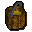 | Dwarf brew | Smells stronger than most spirits. | 2 | yes |  |  |
|  | Iban's ashes | The burnt remains of Iban. | 2 | yes |  |  |
|  | Warrant | A search warrant for a house in Ardougne. | 5 | yes |  |  |
|  | Hangover cure | It doesn't look very tasty. | 2 | yes |  |  |
|  | A magic scroll | Maybe I should read it... | 1 | yes |  | Read |
| 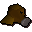 | Gas mask | Stops me from breathing nasty stuff! | 2 | yes |  | Wear |
|  | A small key | Quite a small key. | 1 | yes |  |  |
|  | A scruffy note | It seems to say "hongorer lure"... | 2 | yes |  | Read |
|  | Book | Turnip growing for beginners. | 1 | yes |  |  |
|  | Picture | A picture of a lady called Elena. | 1 | yes |  |  |
|  | Logs | A number of wooden logs. | 4 |  |  | Light |
| 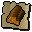 | cert_logs |  | 0 |  |  |  |
|  | Magic logs | Logs made from magical wood. | 320 | yes |  | Light |
|  | cert_magic_logs |  | 0 |  |  |  |
| 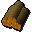 | Yew logs | Logs cut from a yew tree. | 160 |  |  | Light |
| 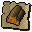 | cert_yew_logs |  | 0 |  |  |  |
| 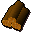 | Maple logs | Logs cut from a maple tree. | 80 |  |  | Light |
|  | cert_maple_logs |  | 0 |  |  |  |
|  | Willow logs | Logs cut from a willow tree. | 40 |  |  | Light |
| 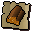 | cert_willow_logs |  | 0 |  |  |  |
|  | Oak logs | Logs cut from an oak tree. | 20 |  |  | Light |
| 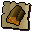 | cert_oak_logs |  | 0 |  |  |  |
| 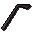 | Lockpick |  | 20 | yes |  |  |
| 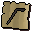 | cert_lockpick |  | 0 |  |  |  |
|  | Unidentified herb | An unidentified herb. | 0 | yes |  | Identify |
|  | Snake weed | This herb is Snake Weed. | 5 | yes |  |  |
|  | Unidentified herb | An unidentified herb. | 1 | yes |  | Identify |
| 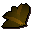 | Ardrigal | This herb is Ardrigal. | 5 | yes |  |  |
|  | Unidentified herb | An unidentified herb. | 0 | yes |  | Identify |
|  | Sito foil | This herb is Sito Foil. | 5 | yes |  |  |
|  | Unidentified herb | An unidentified herb. | 0 | yes |  | Identify |
|  | Volencia moss | This herb is Volencia Moss. | 5 | yes |  |  |
|  | Unidentified herb | An unidentified herb. | 0 | yes |  | Identify |
|  | Rogues purse | This herb is Rogues Purse. | 5 | yes |  |  |
|  | Map part | An incomplete map piece. | 0 |  |  | Study |
|  | Map part | An incomplete map piece. | 0 |  |  | Study |
| 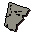 | Map part | An incomplete map piece. | 0 |  |  | Study |
| 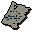 | Crandor map | A map to Crandor. | 0 |  |  | Study |
| 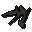 | Nails | Keeps things in place fairly permanently. | 3 |  | yes |  |
|  | Dragonfire shield | This shield is said to have magical properties against dragon flames. | 20 |  |  | Wear |
| 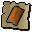 | cert_antidragonbreathshield |  | 0 |  |  |  |
|  | Maze key | A key to Melzars' Maze. | 1 |  |  |  |
| 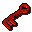 | Key | A red key. | 0 |  |  |  |
|  | Key | An orange key. | 0 |  |  |  |
|  | Key | A yellow key. | 0 |  |  |  |
| 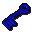 | Key | A blue key. | 0 |  |  |  |
|  | Key | A magenta key. | 0 |  |  |  |
| 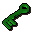 | Key | A green key. | 0 |  |  |  |
|  | Stake | A very pointy stick. | 8 |  |  |  |
| 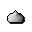 | Garlic | A clove of garlic. | 3 |  |  |  |
| 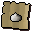 | cert_garlic |  | 0 |  |  |  |
| 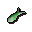 | Seasoned sardine | Sardine flavoured with doogle leaves. | 10 | yes |  |  |
| 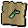 | cert_seasoned_sardine |  | 0 |  |  |  |
|  | Fluffs' kitten | It looks like it's lost. | 0 | yes |  | Use |
|  | Pet kitten | This kitten seems to like you. | 0 | yes |  |  |
|  | Pet kitten | This kitten seems to like you. | 0 | yes |  |  |
|  | Pet kitten | This kitten seems to like you. | 0 | yes |  |  |
|  | Pet kitten | This kitten seems to like you. | 0 | yes |  |  |
|  | Pet kitten | This kitten seems to like you. | 0 | yes |  |  |
|  | Pet kitten | This kitten seems to like you. | 0 | yes |  |  |
|  | Pet cat | This cat definitely likes you. | 0 | yes |  |  |
|  | Pet cat | This cat definitely likes you. | 0 | yes |  |  |
| 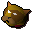 | Pet cat | This cat definitely likes you. | 0 | yes |  |  |
|  | Pet cat | This cat definitely likes you. | 0 | yes |  |  |
|  | Pet cat | This cat definitely likes you. | 0 | yes |  |  |
|  | Pet cat | This cat definitely likes you. | 0 | yes |  |  |
|  | Pet cat | This cat is so well fed it can hardly move. | 0 | yes |  |  |
|  | Pet cat | This cat is so well fed it can hardly move. | 0 | yes |  |  |
|  | Pet cat | This cat is so well fed it can hardly move. | 0 | yes |  |  |
|  | Pet cat | This cat is so well fed it can hardly move. | 0 | yes |  |  |
| 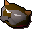 | Pet cat | This cat is so well fed it can hardly move. | 0 | yes |  |  |
| 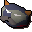 | Pet cat | This cat is so well fed it can hardly move. | 0 | yes |  |  |
|  | Doogle leaves | A tasty herb good for seasoning. | 2 | yes |  |  |
|  | cert_doogleleaves |  | 0 |  |  |  |
|  | Cat training medal | For feline training expertise. | 350 | yes |  | Wear |
| 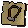 | cert_felinemedal |  | 0 |  |  |  |
| 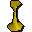 | Pete's candlestick | Scarface Pete's Candlestick. | 5 | yes |  |  |
| 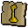 | cert_petecandlestick |  | 0 |  |  |  |
|  | Thieves' armband | This denotes a Master Thief. | 2 | yes |  |  |
|  | Ice gloves | These will keep my hands cold! | 6 | yes |  | Wear |
| 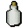 | Blamish snail slime | Yuck. | 5 | yes |  |  |
|  | Blamish oil | Made from the finest snail slime. | 10 | yes |  | Drink |
|  | Fire feather | Firebird feather. | 2 | yes |  |  |
|  | Id papers | Apparently my name is Hartigen. | 0 | yes |  |  |
|  | Oily fishing rod | Useful for catching lava eels. | 15 | yes |  |  |
|  | Miscellaneous key | I wonder what this unlocks? | 0 | yes |  |  |
|  | cert_misc_key |  | 0 |  |  |  |
|  | Grips' keyring | Some keys on a keyring. | 0 | yes |  |  |
|  | obj_1589 |  | 0 |  |  |  |
|  | Dusty key | I wonder what this unlocks? | 0 | yes |  |  |
|  | Jail key | Key to a cell. | 0 | yes |  |  |
| 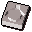 | Ring mould | Used to make gold rings. | 5 |  |  |  |
| 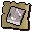 | cert_ring_mould |  | 0 |  |  |  |
| 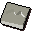 | Unholy mould | Used to make unholy symbols. | 200 | yes |  |  |
| 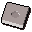 | Amulet mould | Used to make gold amulets | 5 |  |  |  |
| 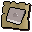 | cert_amulet_mould |  | 0 |  |  |  |
| 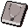 | Necklace mould | Used to make gold necklaces. | 5 |  |  |  |
| 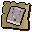 | cert_necklace_mould |  | 0 |  |  |  |
|  | Holy mould | Used to make Holy Symbols of Saradomin. | 5 |  |  |  |
| 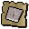 | cert_holy_symbol_mould |  | 0 |  |  |  |
|  | Diamond | This looks valuable. | 2000 |  |  |  |
| 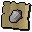 | cert_diamond |  | 0 |  |  |  |
|  | Ruby | This looks valuable. | 1000 |  |  |  |
| 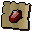 | cert_ruby |  | 0 |  |  |  |
|  | Emerald | This looks valuable. | 500 |  |  |  |
| 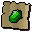 | cert_emerald |  | 0 |  |  |  |
|  | Sapphire | This looks valuable. | 250 |  |  |  |
| 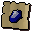 | cert_sapphire |  | 0 |  |  |  |
| 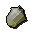 | Opal | A semi precious stone. | 100 | yes |  |  |
| 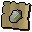 | cert_opal |  | 0 |  |  |  |
|  | Jade | A semi precious stone. | 150 | yes |  |  |
| 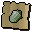 | cert_jade |  | 0 |  |  |  |
| 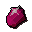 | Red topaz | A semi precious stone. | 200 | yes |  |  |
| 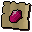 | cert_red_topaz |  | 0 |  |  |  |
|  | Dragonstone | This looks valuable. | 10000 | yes |  |  |
| 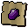 | cert_dragonstone |  | 0 |  |  |  |
|  | Uncut diamond | This would be worth more cut. | 200 |  |  |  |
| 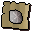 | cert_uncut_diamond |  | 0 |  |  |  |
| 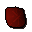 | Uncut ruby | This would be worth more cut. | 100 |  |  |  |
| 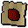 | cert_uncut_ruby |  | 0 |  |  |  |
|  | Uncut emerald | This would be worth more cut. | 50 |  |  |  |
|  | cert_uncut_emerald |  | 0 |  |  |  |
|  | Uncut sapphire | This would be worth more cut. | 25 |  |  |  |
|  | cert_uncut_sapphire |  | 0 |  |  |  |
|  | Uncut opal | This would be worth more cut. | 20 | yes |  |  |
|  | cert_uncut_opal |  | 0 |  |  |  |
|  | Uncut jade | This would be worth more cut. | 30 | yes |  |  |
|  | cert_uncut_jade |  | 0 |  |  |  |
|  | Uncut red topaz | This would be worth more cut. | 40 | yes |  |  |
|  | cert_uncut_red_topaz |  | 0 |  |  |  |
|  | Uncut dragonstone | This would be worth more cut. | 1000 | yes |  |  |
|  | cert_uncut_dragonstone |  | 0 |  |  |  |
|  | Crushed gemstone | A gemstone that has been smashed. | 2 | yes |  |  |
|  | cert_crushed_gemstone |  | 0 |  |  |  |
|  | Gold ring | A valuable ring. | 350 |  |  | Wear |
|  | cert_gold_ring |  | 0 |  |  |  |
|  | Sapphire ring | A valuable ring. | 900 |  |  | Wear |
|  | cert_sapphire_ring |  | 0 |  |  |  |
|  | Emerald ring | A valuable ring. | 1275 |  |  | Wear |
|  | cert_emerald_ring |  | 0 |  |  |  |
|  | Ruby ring | A valuable ring. | 2025 |  |  | Wear |
|  | cert_ruby_ring |  | 0 |  |  |  |
|  | Diamond ring | A valuable ring. | 3525 |  |  | Wear |
|  | cert_diamond_ring |  | 0 |  |  |  |
|  | Dragonstone ring | A valuable ring. | 17625 | yes |  | Wear |
|  | cert_dragonstone_ring |  | 0 |  |  |  |
|  | Black ring |  | 0 |  |  |  |
|  | cert_black_ring |  | 0 |  |  |  |
|  | Sapphire ring |  | 0 |  |  |  |
|  | Emerald ring |  | 0 |  |  |  |
|  | Ruby ring |  | 0 |  |  |  |
|  | Diamond ring |  | 0 |  |  |  |
|  | Dragonstone ring |  | 0 |  |  |  |
|  | Gold necklace | I wonder if this is valuable. | 450 |  |  | Wear |
|  | cert_gold_necklace |  | 0 |  |  |  |
|  | Sapphire necklace | I wonder if this is valuable. | 1050 |  |  | Wear |
|  | cert_sapphire_necklace |  | 0 |  |  |  |
|  | Emerald necklace | I wonder if this is valuable. | 1425 |  |  | Wear |
|  | cert_emerald_necklace |  | 0 |  |  |  |
|  | Ruby necklace | I wonder if this is valuable. | 2175 |  |  | Wear |
|  | cert_ruby_necklace |  | 0 |  |  |  |
|  | Diamond necklace | I wonder if this is valuable. | 3675 |  |  | Wear |
|  | cert_diamond_necklace |  | 0 |  |  |  |
|  | Dragon necklace | I wonder if this is valuable. | 18375 | yes |  | Wear |
|  | cert_dragonstone_necklace |  | 0 |  |  |  |
|  | Black necklace |  | 0 |  |  |  |
|  | cert_black_necklace |  | 0 |  |  |  |
|  | Sapphire necklace |  | 0 |  |  |  |
|  | Emerald necklace |  | 0 |  |  |  |
|  | Ruby necklace |  | 0 |  |  |  |
|  | Diamond necklace |  | 0 |  |  |  |
|  | Dragon necklace |  | 0 |  |  |  |
|  | Gold amulet | It needs a string so I can wear it. | 350 |  |  |  |
|  | cert_unstrung_gold_amulet |  | 0 |  |  |  |
|  | Sapphire amulet | It needs a string so I can wear it. | 900 |  |  |  |
|  | cert_unstrung_sapphire_amulet |  | 0 |  |  |  |
|  | Emerald amulet | It needs a string so I can wear it. | 1275 |  |  |  |
|  | cert_unstrung_emerald_amulet |  | 0 |  |  |  |
|  | Ruby amulet | It needs a string so I can wear it. | 2025 |  |  |  |
|  | cert_unstrung_ruby_amulet |  | 0 |  |  |  |
|  | Diamond amulet | It needs a string so I can wear it. | 3525 |  |  |  |
|  | cert_unstrung_diamond_amulet |  | 0 |  |  |  |
|  | Dragonstoneamulet | It needs a string so I can wear it. | 17625 | yes |  |  |
|  | cert_unstrung_dragonstone_amulet |  | 0 |  |  |  |
|  | Black amulet |  | 0 |  |  |  |
|  | cert_black_amulet |  | 0 |  |  |  |
|  | Sapphire amulet |  | 0 |  |  |  |
|  | Emerald amulet |  | 0 |  |  |  |
|  | Ruby amulet |  | 0 |  |  |  |
|  | Diamond amulet |  | 0 |  |  |  |
|  | Dragonstoneamulet |  | 0 |  |  |  |
|  | Gold amulet | I wonder if I can get this enchanted. | 350 |  |  | Wear |
|  | cert_strung_gold_amulet |  | 0 |  |  |  |
|  | Sapphire amulet | I wonder if I can get this enchanted. | 900 |  |  | Wear |
|  | cert_strung_sapphire_amulet |  | 0 |  |  |  |
|  | Emerald amulet | I wonder if I can get this enchanted. | 1275 |  |  | Wear |
|  | cert_strung_emerald_amulet |  | 0 |  |  |  |
|  | Ruby amulet | I wonder if I can get this enchanted. | 2025 |  |  | Wear |
|  | cert_strung_ruby_amulet |  | 0 |  |  |  |
|  | Diamond amulet | I wonder if I can get this enchanted. | 3525 |  |  | Wear |
|  | cert_strung_diamond_amulet |  | 0 |  |  |  |
|  | Dragonstoneamulet | I wonder if I can get this enchanted. | 17625 | yes |  | Wear |
|  | cert_strung_dragonstone_amulet |  | 0 |  |  |  |
|  | Amulet of glory | A very powerful dragonstone amulet. | 17625 | yes |  | Wear, Rub |
|  | cert_amulet_of_glory |  | 0 |  |  |  |
|  | Amulet of glory(1) | A dragonstone amulet with 1 magic charge. | 17625 | yes |  | Wear, Rub |
|  | cert_amulet_of_glory_1 |  | 0 |  |  |  |
|  | Amulet of glory(2) | A dragonstone amulet with 2 magic charges. | 17625 | yes |  | Wear, Rub |
|  | cert_amulet_of_glory_2 |  | 0 |  |  |  |
|  | Amulet of glory(3) | A dragonstone amulet with 3 magic charges. | 17625 | yes |  | Wear, Rub |
|  | cert_amulet_of_glory_3 |  | 0 |  |  |  |
|  | Amulet of glory(4) | A dragonstone amulet with 4 magic charges. | 17625 | yes |  | Wear, Rub |
|  | cert_amulet_of_glory_4 |  | 0 |  |  |  |
|  | Unstrung symbol | It needs a string so I can wear it. | 200 |  |  |  |
|  | cert_nostringstar |  | 0 |  |  |  |
|  | Unblessed symbol | A symbol of Saradomin. | 200 |  |  | Wear |
|  | cert_stringstar |  | 0 |  |  |  |
|  | Holy symbol | A blessed holy symbol of Saradomin. | 300 |  |  | Wear |
|  | cert_blessedstar |  | 0 |  |  |  |
|  | Unstrung emblem | It needs a string so I can wear it. | 200 | yes |  |  |
|  | cert_nostringsnake |  | 0 |  |  |  |
|  | Unpowered symbol | An unholy symbol of Zamorak. | 200 | yes |  | Wear |
|  | cert_stringsnake |  | 0 |  |  |  |
|  | Unholy symbol | An unholy symbol of Zamorak. | 200 | yes |  | Wear |
|  | Amulet of strength | An enchanted ruby amulet. | 2025 |  |  | Wear |
|  | cert_amulet_of_strength |  | 0 |  |  |  |
|  | Amulet of magic | An enchanted sapphire amulet of magic. | 900 |  |  | Wear |
|  | cert_amulet_of_magic |  | 0 |  |  |  |
|  | Amulet of defence | An enchanted emerald amulet of protection. | 1275 |  |  | Wear |
|  | cert_amulet_of_defence |  | 0 |  |  |  |
|  | Amulet of power | An enchanted diamond amulet of power. | 3525 |  |  | Wear |
|  | cert_amulet_of_power |  | 0 |  |  |  |
|  | Needle | Used with a thread to make clothes. | 0 |  | yes |  |
|  | Thread | Used with a needle to make clothes. | 0 |  | yes |  |
|  | Shears | For shearing sheep. | 0 |  |  |  |
|  | cert_shears |  | 0 |  |  |  |
|  | Wool | I think this came from a sheep. | 0 |  |  |  |
|  | cert_wool |  | 0 |  |  |  |
|  | Cow hide | I should take this to the tannery. | 0 |  |  |  |
|  | cert_cow_hide |  | 0 |  |  |  |
|  | Leather | It's a piece of leather. | 0 |  |  |  |
|  | cert_leather |  | 0 |  |  |  |
|  | Hard leather | It's a piece of hard leather. | 0 |  |  |  |
|  | cert_hard_leather |  | 0 |  |  |  |
|  | Dragon leather | It's a piece of prepared dragonhide. | 0 | yes |  |  |
|  | cert_dragon_leather |  | 0 |  |  |  |
|  | Dragonhide | The scaly rough hide from a Dragon | 0 | yes |  |  |
|  | cert_dragonhide_black |  | 0 |  |  |  |
|  | Dragonhide | The scaly rough hide from a Dragon | 0 | yes |  |  |
|  | cert_dragonhide_red |  | 0 |  |  |  |
|  | Dragonhide | The scaly rough hide from a Dragon | 0 | yes |  |  |
|  | cert_dragonhide_blue |  | 0 |  |  |  |
|  | Dragonhide | The scaly rough hide from a Dragon | 0 | yes |  |  |
|  | cert_dragonhide_green |  | 0 |  |  |  |
|  | Chisel | Good for detailed crafting. | 0 |  |  |  |
|  | cert_chisel |  | 0 |  |  |  |
|  | Brown apron | A mostly clean apron. | 2 |  |  | Wear |
|  | cert_brown_apron |  | 0 |  |  |  |
|  | Ball of wool | Spun from sheeps wool. | 2 |  |  |  |
|  | cert_ball_of_wool |  | 0 |  |  |  |
|  | Soft clay | Clay soft enough to mould. | 2 |  |  |  |
|  | cert_softclay |  | 0 |  |  |  |
|  | Red dye | A little bottle of red dye. | 5 |  |  |  |
|  | cert_reddye |  | 0 |  |  |  |
|  | Yellow dye | A little bottle of yellow dye. | 5 |  |  |  |
|  | cert_yellowdye |  | 0 |  |  |  |
|  | Blue dye | A little bottle of blue dye. | 5 |  |  |  |
|  | cert_bluedye |  | 0 |  |  |  |
|  | Orange dye | A little bottle of orange dye. | 5 |  |  |  |
|  | cert_orangedye |  | 0 |  |  |  |
|  | Green dye | A little bottle of green dye. | 5 |  |  |  |
|  | cert_greendye |  | 0 |  |  |  |
|  | Purple dye | A little bottle of purple dye. | 5 |  |  |  |
|  | cert_purpledye |  | 0 |  |  |  |
|  | Molten glass | Hot glass ready to be blown into useful objects. | 2 | yes |  |  |
|  | cert_molten_glass |  | 0 |  |  |  |
|  | Bow string | I need a bow stave to attach this to. | 10 | yes |  |  |
|  | cert_bow_string |  | 0 |  |  |  |
|  | Flax | I should use this with a spinning wheel. | 5 | yes |  |  |
|  | cert_flax |  | 0 |  |  |  |
|  | Soda ash | One of the ingredients for making glass. | 2 | yes |  |  |
|  | cert_soda_ash |  | 0 |  |  |  |
|  | Bucket of sand | One of the ingredients for making glass. | 2 | yes |  |  |
|  | cert_bucket_sand |  | 0 |  |  |  |
|  | Glassblowing pipe |  | 2 | yes |  |  |
|  | cert_glassblowingpipe |  | 0 |  |  |  |
|  | Unfired pot | I need to put this in a pottery oven. | 1 |  |  |  |
|  | cert_pot_unfired |  | 0 |  |  |  |
|  | Unfired pie dish | I need to put this in a pottery oven. | 3 |  |  |  |
|  | cert_piedish_unfired |  | 0 |  |  |  |
|  | Unfired bowl | I need to put this in a pottery oven. | 2 |  |  |  |
|  | cert_bowl_unfired |  | 0 |  |  |  |
|  | Woad leaf | A slightly bluish leaf. | 1 |  | yes |  |
|  | Bronze wire | Useful for crafting items. | 20 | yes |  |  |
|  | cert_bronzecraftwire |  | 0 |  |  |  |
|  | Silver necklace | Annas' shiny silver coated necklace. | 0 | yes |  | Wear |
|  | Silver necklace | Annas' shiny silver coated necklace coated with a thin layer of flour. | 0 | yes |  | Wear |
|  | Silver cup | Bobs' shiny silver coated tea cup. | 0 | yes |  |  |
|  | Silver cup | Bobs' shiny silver coated tea cup coated with a thin layer of flour. | 0 | yes |  |  |
|  | Silver bottle | Carols' shiny silver coated bottle. | 0 | yes |  |  |
|  | Silver bottle | Carols' shiny silver coated bottle coated with a thin layer of flour. | 0 | yes |  |  |
|  | Silver book | Davids' shiny silver coated book. | 0 | yes |  |  |
|  | Silver book | Davids' shiny silver coated book coated with a thin layer of flour. | 0 | yes |  |  |
|  | Silver needle | Elizabeths' shiny silver coated needle. | 0 | yes |  |  |
|  | Silver needle | Elizabeths' shiny silver coated needle coated with a thin layer of flour. | 0 | yes |  |  |
|  | Silver pot | Franks' shiny silver coated pot. | 0 | yes |  |  |
|  | Silver pot | Franks' shiny silver coated pot coated with a thin layer of flour. | 0 | yes |  |  |
|  | Criminals' thread | Some red thread found at the murder scene. | 0 | yes |  |  |
|  | Criminals' thread | Some green thread found at the murder scene. | 0 | yes |  |  |
|  | Criminals' thread | Some blue thread found at the murder scene. | 0 | yes |  |  |
|  | Flypaper | A piece of fly paper. It's sticky. | 0 | yes |  |  |
|  | Pungent pot | A pot found at the murder scene, with a sickly odour. | 0 | yes |  |  |
|  | Criminals' dagger | A flimsy looking dagger found at the crime scene. | 0 | yes |  |  |
|  | Criminals' dagger | A flimsy looking dagger found at the crime scene coated with a thin layer of flour. | 0 | yes |  |  |
|  | Killers' print | The fingerprints of the murderer. | 0 | yes |  |  |
|  | Annas' print | An imprint of Annas' fingerprint. | 0 | yes |  |  |
|  | Bobs' print | An imprint of Bobs' fingerprint. | 0 | yes |  |  |
|  | Carols' print | An imprint of Carols' fingerprint. | 0 | yes |  |  |
|  | Davids' print | An imprint of Davids' fingerprint. | 0 | yes |  |  |
|  | Elizabeths' print | An imprint of Elizabeths' fingerprint. | 0 | yes |  |  |
|  | Franks' print | An imprint of Franks' fingerprint. | 0 | yes |  |  |
|  | Unknown print | An unidentified fingerprint taken from the murder weapon. | 0 | yes |  |  |
|  | Waterskin(4) | A full waterskin with four portions of water. | 30 | yes |  |  |
|  | cert_water_skin4 |  | 0 |  |  |  |
|  | Waterskin(3) | A nearly full waterskin with three portions of water. | 27 | yes |  |  |
|  | cert_water_skin3 |  | 0 |  |  |  |
|  | Waterskin(2) | A half empty waterskin with two portions of water. | 24 | yes |  |  |
|  | cert_water_skin2 |  | 0 |  |  |  |
|  | Waterskin(1) | A nearly empty waterskin with one portion of water. | 18 | yes |  |  |
|  | cert_water_skin1 |  | 0 |  |  |  |
|  | Waterskin(0) | A totaly empty waterskin - you'll need to fill it up. | 15 | yes |  |  |
|  | cert_water_skin0 |  | 0 |  |  |  |
|  | Desert shirt | A cool, light desert shirt. | 40 | yes |  | Wear |
|  | cert_desert_shirt |  | 0 |  |  |  |
|  | Desert robe | A cool, light desert robe. | 40 | yes |  | Wear |
|  | cert_desert_robe |  | 0 |  |  |  |
|  | Desert boots | Comfortable desert shoes. | 20 | yes |  | Wear |
|  | cert_desert_boots |  | 0 |  |  |  |
|  | Metal key | A metal key, it's very crudely constructed. | 1 |  |  |  |
|  | Cell door key | A metallic key, usually used by prison guards. | 1 | yes |  |  |
|  | Barrel | An empty mining barrel. | 1 | yes |  |  |
|  | Ana in a barrel | A mining barrel with Ana in it. | 1 | yes |  | Look |
|  | Wrought iron key | This key unlocks a very sturdy gate of some sort. | 1 | yes |  |  |
|  | Slaves' shirt | A filthy, smelly, flea infested shirt. | 40 | yes |  | Wear |
|  | Slave robe | A filthy, smelly, flea infested robe. | 40 | yes |  | Wear |
|  | Slave boots | Comfortable desert shoes. | 1 | yes |  | Wear |
|  | Scrumpled paper | A piece of paper with barely legible writing - looks like a recipe! | 10 | yes |  | Read |
|  | Shantay disclaimer | Very important information. | 1 | yes |  | Read |
|  | Prototype dart | An experimental type of weapon., A prototype throwing dart. | 70, 2 | yes | yes |  |
|  | Technical plans | Plans of a technical nature. | 1 | yes |  | Read |
|  | Tenti pineapple | The most delicious of pineapples. | 1 |  |  |  |
|  | Bedobin key | A key to the chest in Captain Siad's room. | 1 | yes |  |  |
|  | Prototype dart tip | A protoype dart tip - it looks deadly. | 1 | yes | yes |  |
|  | Shantay pass | Allows you to pass through the Shantay pass into the Kharid Desert. | 5 | yes | yes |  |
|  | Rock | Looks like a plain rock, must have some ore in it? | 0 | yes |  |  |
|  | Guide book | 'A Tourists Guide To Ardougne'. | 0 | yes |  | Read |
|  | Totem | The Rantuki tribes' totem. | 10 | yes |  |  |
|  | Address label | It says 'To Lord Handelmort, Handelmort Mansion'. | 10 | yes |  |  |
|  | Raw ugthanki meat | I need to cook this first. | 2 | yes |  |  |
|  | cert_raw_ugthanki_meat |  | 0 |  |  |  |
|  | Ugthanki meat | Freshly cooked ugthanki meat. | 5 | yes |  | Eat |
|  | cert_cooked_ugthanki_meat |  | 0 |  |  |  |
|  | Pitta dough | I need to cook this. | 4 | yes |  |  |
|  | cert_uncooked_pitta_bread |  | 0 |  |  |  |
|  | Pitta bread | Mmmm, I need to add some other ingredients yet. | 10 | yes |  |  |
|  | cert_pitta_bread |  | 0 |  |  |  |
|  | Burnt pitta bread | It's all burnt. | 1 | yes |  |  |
|  | cert_burnt_pitta_bread |  | 0 |  |  |  |
|  | Chopped tomato | A mixture of tomatoes in a bowl. | 3 | yes |  |  |
|  | cert_bowl_tomato |  | 0 |  |  |  |
|  | Chopped onion | A mixture of onions in a bowl. | 3 | yes |  |  |
|  | cert_bowl_onion |  | 0 |  |  |  |
|  | Chopped ugthanki | Strips of ugthanki meat in a bowl. | 5 | yes |  |  |
|  | cert_bowl_ugthanki |  | 0 |  |  |  |
|  | Onion & tomato | A mixture of chopped onions and tomatoes in a bowl. | 5 | yes |  |  |
|  | cert_bowl_oniontomato |  | 0 |  |  |  |
|  | Ugthanki & onion | A mixture of chopped onions and ugthanki meat in a bowl. | 7 | yes |  |  |
|  | cert_bowl_ugthankionion |  | 0 |  |  |  |
|  | Ugthanki & tomato | A mixture of chopped tomatoes and ugthanki meat in a bowl. | 7 | yes |  |  |
|  | cert_bowl_ugthankitomato |  | 0 |  |  |  |
|  | Kebab mix | A mixture of chopped tomatoes, onions and ugthanki meat in a bowl. | 9 | yes |  |  |
|  | cert_bowl_oniontomugthanki |  | 0 |  |  |  |
|  | Ugthanki kebab | A strange smelling kebab made from ugthanki meat. | 20 | yes |  | Eat |
|  | cert_ugthanki_kebab_bad |  | 0 |  |  |  |
|  | Ugthanki kebab | A fresh kebab made from ugthanki meat. | 20 | yes |  | Eat |
|  | cert_ugthanki_kebab |  | 0 |  |  |  |
|  | Cake tin | Useful for baking cakes. | 10 |  |  |  |
|  | cert_cake_tin |  | 0 |  |  |  |
|  | Uncooked cake | Now all I need to do is cook it. | 20 |  |  |  |
|  | cert_uncooked_cake |  | 0 |  |  |  |
|  | Cake | A plain sponge cake. | 50 |  |  | Eat |
|  | cert_cake |  | 0 |  |  |  |
|  | 2/3 cake | Someone has eaten a big chunk of this cake. | 30 |  |  | Eat |
|  | cert_partial_cake |  | 0 |  |  |  |
|  | Slice of cake | I'd rather have a whole cake. | 10 |  |  | Eat |
|  | cert_cake_slice |  | 0 |  |  |  |
|  | Chocolate cake | This looks very tasty. | 70 |  |  | Eat |
|  | cert_chocolate_cake |  | 0 |  |  |  |
|  | 2/3 chocolate cake | Someone has eaten a big chunk of this cake. | 50 |  |  | Eat |
|  | cert_partial_chocolate_cake |  | 0 |  |  |  |
|  | Chocolate slice | I'd rather have a whole cake. | 30 |  |  | Eat |
|  | cert_chocolate_slice |  | 0 |  |  |  |
|  | Burnt cake | Argh what a mess! | 1 |  |  |  |
|  | cert_burnt_cake |  | 0 |  |  |  |
|  | Asgarnian ale | Probably the finest ale in Asgarnia. | 2 |  |  | Drink |
|  | cert_asgarnian_ale |  | 0 |  |  |  |
|  | Wizard's mind bomb | It's got strange bubbles in it. | 2 |  |  | Drink |
|  | cert_wizards_mind_bomb |  | 0 |  |  |  |
|  | Greenman's ale | A glass of frothy ale. | 2 | yes |  | Drink |
|  | cert_greenmans_ale |  | 0 |  |  |  |
|  | Dragon bitter | A glass of bitter. | 2 | yes |  | Drink |
|  | cert_dragon_bitter |  | 0 |  |  |  |
|  | Dwarven stout | A pint of thick dark beer. | 2 |  |  | Drink |
|  | cert_dwarven_stout |  | 0 |  |  |  |
|  | Grog | A murky glass of some sort of drink. | 3 | yes |  | Drink |
|  | cert_grog |  | 0 |  |  |  |
|  | Beer | A glass of frothy ale. | 2 |  |  | Drink |
|  | cert_beer |  | 0 |  |  |  |
|  | Beer glass | I need to fill this with beer. | 2 |  |  |  |
|  | cert_beer_glass |  | 0 |  |  |  |
|  | Bowl of water | It's a bowl of water. | 4 |  |  |  |
|  | cert_bowl_water |  | 0 |  |  |  |
|  | Bowl | Useful for mixing things. | 4 |  |  |  |
|  | cert_bowl_empty |  | 0 |  |  |  |
|  | Bucket | It's a wooden bucket. | 2 |  |  |  |
|  | cert_bucket_empty |  | 0 |  |  |  |
|  | Bucket of milk | It's a bucket of milk. | 6 |  |  |  |
|  | cert_bucket_milk |  | 0 |  |  |  |
|  | Bucket of water | It's a bucket of water. | 6 |  |  |  |
|  | cert_bucket_water |  | 0 |  |  |  |
|  | Pot | This pot is empty. | 1 |  |  |  |
|  | cert_pot_empty |  | 0 |  |  |  |
|  | Pot of flour | There is flour in this pot. | 10 |  |  |  |
|  | cert_pot_flour |  | 0 |  |  |  |
|  | Jug | This jug is empty. | 1 |  |  |  |
|  | cert_jug_empty |  | 0 |  |  |  |
|  | Jug of water | It's full of water. | 1 |  |  |  |
|  | cert_jug_water |  | 0 |  |  |  |
|  | Swamp tar | A foul smelling thick tar like substance. | 1 | yes | yes |  |
|  | Raw swamp paste | A thick tar like substance mixed with flour. | 1 | yes | yes |  |
|  | Swamp paste | A tar like substance mixed with flour and warmed. | 30 | yes | yes |  |
|  | Potato | This could be used to make a good stew. | 1 |  |  |  |
|  | cert_potato |  | 0 |  |  |  |
|  | Egg | A nice fresh egg. | 4 |  |  |  |
|  | cert_egg |  | 0 |  |  |  |
|  | Flour | A little heap of flour. | 2 |  |  |  |
|  | Grain | Some wheat heads. | 2 |  |  |  |
|  | cert_grain |  | 0 |  |  |  |
|  | Chef's hat | What a silly hat. | 2 |  |  | Wear |
|  | cert_chefs_hat |  | 0 |  |  |  |
|  | Redberries | Very bright red berries. | 3 |  |  |  |
|  | cert_redberries |  | 0 |  |  |  |
|  | Pastry dough | Potentially pastry. | 1 |  |  |  |
|  | cert_pastry_dough |  | 0 |  |  |  |
|  | Cooking apple | Keeps the doctor away. | 1 |  |  |  |
|  | cert_cooking_apple |  | 0 |  |  |  |
|  | Onion | A strong smelling onion. | 3 |  |  |  |
|  | cert_onion |  | 0 |  |  |  |
|  | Pumpkin | Happy Halloween. | 30 |  |  | Eat |
|  | cert_pumpkin |  | 0 |  |  |  |
|  | Easter egg | Happy Easter. | 10 |  |  | Eat |
|  | cert_easter_egg |  | 0 |  |  |  |
|  | Banana | Mmm this looks tasty. | 2 |  |  | Eat |
|  | cert_banana |  | 0 |  |  |  |
|  | Cabbage | Yuck I don't like cabbage. | 1 |  |  | Eat |
|  | cert_cabbage |  | 0 |  |  |  |
|  | Cabbage | Yuck I don't like cabbage. | 1 |  |  | Eat |
|  | cert_magic_cabbage |  | 0 |  |  |  |
|  | Spinach roll | A home made spinach thing. | 1 |  |  | Eat |
|  | cert_spinach_roll |  | 0 |  |  |  |
|  | Kebab | A meaty kebab. | 3 |  |  | Eat |
|  | cert_kebab |  | 0 |  |  |  |
|  | Chocolate bar | Mmmmmmm chocolate. | 10 |  |  | Eat |
|  | cert_chocolate_bar |  | 0 |  |  |  |
|  | Chocolate dust | It's ground up chocolate. | 2 | yes |  |  |
|  | cert_chocolate_dust |  | 0 |  |  |  |
|  | Chocolaty milk | Milk with chocolate in it. | 2 | yes |  | Drink |
|  | Cup of tea | A nice cup of tea. | 10 | yes |  | Drink |
|  | cert_cup_of_tea |  | 0 |  |  |  |
|  | Empty cup | An empty cup. | 2 | yes |  |  |
|  | cert_cup_empty |  | 0 |  |  |  |
|  | Tomato | This would make good ketchup. | 4 |  |  | Eat |
|  | cert_tomato |  | 0 |  |  |  |
|  | Rotten apples | Rotten! | 1 | yes |  | Eat |
|  | Cheese | It's got holes in it. | 4 |  |  | Eat |
|  | cert_cheese |  | 0 |  |  |  |
|  | Grapes | Good grapes for wine making. | 1 |  |  |  |
|  | cert_grapes |  | 0 |  |  |  |
|  | Half full wine jug | An optimist would say it's half full. | 1 |  |  | Drink |
|  | cert_half_full_wine_jug |  | 0 |  |  |  |
|  | Jug of bad wine | Oh dear, this wine is terrible! | 1 |  |  | Drink |
|  | cert_jug_bad_wine |  | 0 |  |  |  |
|  | Jug of wine | It's full of wine. | 1 |  |  | Drink |
|  | cert_jug_wine |  | 0 |  |  |  |
|  | Unfermented wine | This wine needs to ferment before it can be drunk. | 10 |  |  |  |
|  | cert_jug_unfermented_wine |  | 0 |  |  |  |
|  | Incomplete stew | I need to add some meat too. | 4 |  |  |  |
|  | cert_stew1 |  | 0 |  |  |  |
|  | Incomplete stew | I need to add some potato too. | 4 |  |  |  |
