<!-- GENERATED by tools/docsgen — do not edit; regenerate instead. -->

# Items — page 2 (Broken axe – Coins 5)

| Icon | Name | Description | Cost | Members | Stackable | Options |
|---|---|---|---|---|---|---|
|  | Broken axe | Bob can fix this for me. | 10 |  |  |  |
| 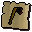 | cert_macro_broken_black_hatchet |  | 0 |  |  |  |
| 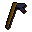 | Broken axe | Bob can fix this for me. | 18 |  |  |  |
|  | cert_macro_broken_mithril_hatchet |  | 0 |  |  |  |
| 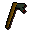 | Broken axe | Bob can fix this for me. | 43 |  |  |  |
| 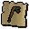 | cert_macro_broken_adamant_hatchet |  | 0 |  |  |  |
|  | Broken axe | Bob can fix this for me. | 427 |  |  |  |
|  | cert_macro_broken_rune_hatchet |  | 0 |  |  |  |
|  | Axe head | It's missing a handle. | 15 |  |  |  |
| 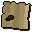 | cert_macro_bronze_hatchethead |  | 0 |  |  |  |
|  | Axe head | It's missing a handle. | 55 |  |  |  |
| 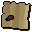 | cert_macro_iron_hatchethead |  | 0 |  |  |  |
| 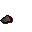 | Axe head | It's missing a handle. | 199 |  |  |  |
| 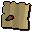 | cert_macro_steel_hatchethead |  | 0 |  |  |  |
|  | Axe head | It's missing a handle. | 383 |  |  |  |
|  | cert_macro_black_hatchethead |  | 0 |  |  |  |
|  | Axe head | It's missing a handle. | 519 |  |  |  |
|  | cert_macro_mithril_hatchethead |  | 0 |  |  |  |
| 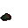 | Axe head | It's missing a handle. | 1279 |  |  |  |
| 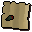 | cert_macro_adamant_hatchethead |  | 0 |  |  |  |
| 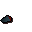 | Axe head | It's missing a handle. | 12799 |  |  |  |
| 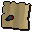 | cert_macro_rune_hatchethead |  | 0 |  |  |  |
|  | Enchanted beef | I don't fancy eating this now. | 1 | yes |  |  |
|  | Enchanted rat | I don't fancy eating this now. | 1 | yes |  |  |
| 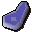 | Enchanted bear | I don't fancy eating this now. | 1 | yes |  |  |
|  | Enchanted chicken | I don't fancy eating this now. | 1 | yes |  |  |
|  | Bones | Bones are for burying! | 0 |  |  | Bury |
| 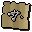 | cert_bones |  | 0 |  |  |  |
| 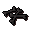 | Burnt bones | Bones are for burying! | 0 |  |  | Bury |
| 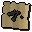 | cert_bones_burnt |  | 0 |  |  |  |
|  | Bat bones | Bones are for burying! | 0 | yes |  | Bury |
|  | cert_bat_bones |  | 0 |  |  |  |
|  | Big bones | Ew it's a pile of bones. | 0 |  |  | Bury |
|  | cert_big_bones |  | 0 |  |  |  |
|  | Babydragon bones | Ew it's a pile of bones. | 0 | yes |  | Bury |
|  | cert_babydragon_bones |  | 0 |  |  |  |
|  | Dragon bones | These would feed a dog for months! | 0 | yes |  | Bury |
|  | cert_dragon_bones |  | 0 |  |  |  |
| 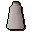 | Druid's robe | Keeps a druids's knees nice and warm. | 30 | yes |  | Wear |
|  | cert_druidrobebottom |  | 0 |  |  |  |
|  | Druid's robe | I feel closer to the Gods when I am wearing this. | 40 | yes |  | Wear |
| 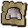 | cert_druidrobetop |  | 0 |  |  |  |
|  | Monk's robe | Keeps a monk's knees nice and warm. | 30 |  |  | Wear |
| 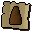 | cert_monkrobebottom |  | 0 |  |  |  |
| 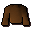 | Monk's robe | I feel closer to the Gods when I am wearing this. | 40 |  |  | Wear |
| 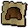 | cert_monkrobetop |  | 0 |  |  |  |
|  | Shade robe | I feel closer to the Gods when I am wearing this. | 40 |  |  | Wear |
|  | cert_blackrobetop |  | 0 |  |  |  |
| 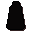 | Shade robe | Keeps a monk's knees nice and warm. | 30 |  |  | Wear |
| 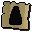 | cert_blackrobebottom |  | 0 |  |  |  |
| 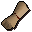 | Newcomer map | Issued by RuneScape Council to all new citizens. | 1 |  |  | Read |
| 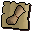 | cert_newcomer_map |  | 0 |  |  |  |
|  | Ghostspeak amulet | It lets me talk to ghosts. | 35 |  |  | Wear |
|  | Skull | Ooooh spooky! | 0 |  |  |  |
| 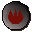 | Fire rune | One of the 4 basic elemental Runes. | 4 |  | yes |  |
|  | Water rune | One of the 4 basic elemental Runes. | 4 |  | yes |  |
|  | Air rune | One of the 4 basic elemental Runes. | 4 |  | yes |  |
| 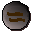 | Earth rune | One of the 4 basic elemental Runes. | 4 |  | yes |  |
|  | Mind rune | Used for low level missile spells. | 3 |  | yes |  |
|  | Body rune | Used for curse spells. | 3 |  | yes |  |
|  | Death rune | Used for medium level missile spells. | 30 |  | yes |  |
|  | Nature rune | Used for alchemy spells. | 20 |  | yes |  |
|  | Chaos rune | Used for mid level missile spells. | 15 |  | yes |  |
|  | Law rune | Used for teleport spells. | 40 |  | yes |  |
|  | Cosmic rune | Used for enchant spells. | 15 |  | yes |  |
| 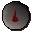 | Blood rune | Used for high level missile spells. | 50 | yes | yes |  |
|  | Soul rune | Used for high level curse spells. | 1250 | yes | yes |  |
|  | Unpowered orb | I'd prefer it if it was powered. | 100, 100 | yes |  |  |
| 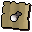 | cert_stafforb |  | 0 |  |  |  |
| 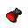 | Fire orb | A magic glowing orb. | 300 | yes |  |  |
| 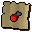 | cert_fire_orb |  | 0 |  |  |  |
| 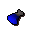 | Water orb | A magic glowing orb. | 300 | yes |  |  |
| 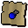 | cert_water_orb |  | 0 |  |  |  |
| 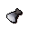 | Air orb | A magic glowing orb. | 300 | yes |  |  |
| 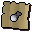 | cert_air_orb |  | 0 |  |  |  |
|  | Earth orb | A magic glowing orb. | 300 | yes |  |  |
| 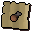 | cert_earth_orb |  | 0 |  |  |  |
| 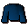 | Wizards robe | I can do magic better in this. | 15 |  |  | Wear |
| 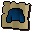 | cert_wizards_robe |  | 0 |  |  |  |
|  | Wizards hat | A silly pointed hat. | 2 |  |  | Wear |
| 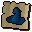 | cert_bluewizhat |  | 0 |  |  |  |
|  | Black robe | I can do magic better in this. | 13 |  |  | Wear |
| 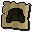 | cert_black_robe |  | 0 |  |  |  |
|  | Bailing bucket | It's a bailing bucket. | 10 | yes |  | Bail-with |
| 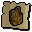 | cert_bucket_bailing |  | 0 |  |  |  |
| 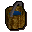 | Bailing bucket | It's a bailing bucket full of salty water. | 10 | yes |  | Empty |
|  | cert_bucket_bailingfull |  | 0 |  |  |  |
|  | Orb of protection | A strange glowing green orb. | 0 | yes |  |  |
|  | Orb of protection | Two strange glowing green orbs. | 0 | yes |  |  |
|  | Gnome amulet | It's an emerald protection amulet given to me by the gnomes. | 0 | yes |  | Wear |
|  | Tinderbox | Useful for lighting a fire. | 0 |  |  |  |
| 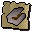 | cert_tinderbox |  | 0 |  |  |  |
|  | Ashes | A heap of ashes. | 2 |  |  |  |
|  | cert_ashes |  | 0 |  |  |  |
|  | Torch | A lit home-made torch. | 4 | yes |  |  |
| 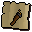 | cert_torch_lit |  | 0 |  |  |  |
|  | Torch | An unlit home-made torch. | 4 | yes |  |  |
| 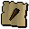 | cert_torch_unlit |  | 0 |  |  |  |
|  | Unlit arrows | Unlit arrows. | 10 | yes | yes | Wield |
|  | obj_599 |  | 0 |  |  |  |
|  | Astrology book | A book on the history of Astrology in RuneScape. | 0 | yes |  | Read |
|  | Keep key | A small key for a jail door. | 0 | yes |  |  |
|  | Lens mould | An unusual clay mould in the shape of a disc. | 0 | yes |  |  |
| 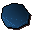 | Lens | A perfectly circular disc of glass. | 0 | yes |  |  |
|  | Bone shard | A slender bone shard given to you by Zadimus. | 0 | yes |  | Inspect |
|  | Bone key | A bone key fashioned from a shard of bone. | 0 | yes |  |  |
|  | Stone-plaque | A stone plaque with carved letters in it. | 0 | yes |  | Read |
| 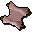 | Tattered scroll | An ancient tattered scroll. | 0 | yes |  | Read |
|  | Crumpled scroll | An ancient crumpled scroll. | 0 | yes |  | Read |
| 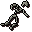 | Rashiliya corpse | The remains of the Zombie Queen. | 0 | yes |  |  |
|  | Zadimus corpse | The remains of Zadimus. | 0 | yes |  | Bury |
| 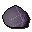 | Locating crystal | A magical crystal sphere. | 0 | yes |  | Activate |
| 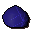 | Locating crystal | A magical crystal sphere. | 0 | yes |  |  |
|  | Locating crystal | A magical crystal sphere. | 1 | yes |  |  |
|  | Locating crystal | A magical crystal sphere. | 1 | yes |  |  |
|  | Locating crystal | A magical crystal sphere. | 1 | yes |  |  |
|  | Beads of the dead | A curious looking neck ornament. | 1 | yes |  | Wear |
|  | Coins | Lovely money! | 1 | yes |  |  |
|  | Bone beads | Beads carved out of a bone. | 0 | yes |  |  |
|  | Paramaya ticket | Allows you to rest in the luxurious Paramayer Inn. | 5 | yes |  |  |
|  | cert_paramayaticket |  | 0 |  |  |  |
|  | Ship ticket | Allows you passage on the 'Lady of the waves' ship. | 5 | yes |  |  |
|  | cert_shiloshipticket |  | 0 |  |  |  |
|  | Sword pommel | An ivory sword pommel. | 1 | yes |  |  |
|  | Bervirius notes | Notes taken from the tomb of Bervirius. | 1 | yes |  | Read |
|  | Wampum belt | A decorated belt used to trade information between distant villages. | 5 | yes |  |  |
|  | Boots | They're soft and silky. | 200 | yes |  | Wear |
|  | cert_gnome_boots_pink |  | 0 |  |  |  |
|  | Boots | They're soft and silky. | 200 | yes |  | Wear |
|  | cert_gnome_boots_green |  | 0 |  |  |  |
|  | Boots | They're soft and silky. | 200 | yes |  | Wear |
|  | cert_gnome_boots_blue |  | 0 |  |  |  |
|  | Boots | They're soft and silky. | 200 | yes |  | Wear |
|  | cert_gnome_boots_cream |  | 0 |  |  |  |
|  | Boots | They're soft and silky. | 200 | yes |  | Wear |
|  | cert_gnome_boots_turquoise |  | 0 |  |  |  |
|  | Robe top | The ultimate in gnome design. | 180 | yes |  | Wear |
|  | cert_gnome_robetop_pink |  | 0 |  |  |  |
|  | Robe top | The ultimate in gnome design. | 180 | yes |  | Wear |
|  | cert_gnome_robetop_green |  | 0 |  |  |  |
|  | Robe top | The ultimate in gnome design. | 180 | yes |  | Wear |
|  | cert_gnome_robetop_blue |  | 0 |  |  |  |
|  | Robe top | The ultimate in gnome design. | 180 | yes |  | Wear |
|  | cert_gnome_robetop_cream |  | 0 |  |  |  |
|  | Robe top | The ultimate in gnome design. | 180 | yes |  | Wear |
|  | cert_gnome_robetop_turquoise |  | 0 |  |  |  |
|  | Robe bottoms | Made by Tree Gnomes. | 180 | yes |  | Wear |
|  | cert_gnome_robebottoms_pink |  | 0 |  |  |  |
|  | Robe bottoms | Made by Tree Gnomes. | 180 | yes |  | Wear |
|  | cert_gnome_robebottoms_green |  | 0 |  |  |  |
|  | Robe bottoms | Made by Tree Gnomes. | 180 | yes |  | Wear |
|  | cert_gnome_robebottoms_blue |  | 0 |  |  |  |
|  | Robe bottoms | Made by Tree Gnomes. | 180 | yes |  | Wear |
|  | cert_gnome_robebottoms_cream |  | 0 |  |  |  |
|  | Robe bottoms | Made by Tree Gnomes. | 180 | yes |  | Wear |
|  | cert_gnome_robebottoms_turquoise |  | 0 |  |  |  |
|  | Hat | A silly pointed hat. | 160 | yes |  | Wear |
|  | cert_gnome_hat_pink |  | 0 |  |  |  |
|  | Hat | A silly pointed hat. | 160 | yes |  | Wear |
|  | cert_gnome_hat_green |  | 0 |  |  |  |
|  | Hat | A silly pointed hat. | 160 | yes |  | Wear |
|  | cert_gnome_hat_blue |  | 0 |  |  |  |
|  | Hat | A silly pointed hat. | 160 | yes |  | Wear |
|  | cert_gnome_hat_cream |  | 0 |  |  |  |
|  | Hat | A silly pointed hat. | 160 | yes |  | Wear |
|  | cert_gnome_hat_turquoise |  | 0 |  |  |  |
|  | Portrait | Picture of a posing Paladin. | 3 |  |  |  |
|  | Blurite sword | A Faladian Knight's sword. | 200 |  |  | Wield |
|  | Blurite ore | Definitely blue. | 3 |  |  |  |
|  | Specimen jar | A receptacle for specimens! | 0 | yes |  |  |
|  | Specimen brush | A small brush used to clean rock samples. | 0 | yes |  |  |
|  | Rock sample 1 | A carefully kept safe rock sample. | 0 | yes |  |  |
|  | Rock sample 2 | A carefully kept safe rock sample. | 0 | yes |  |  |
|  | Rock sample 3 | A carefully kept safe rock sample. | 0 | yes |  |  |
|  | Rock sample | A rough shaped piece of rock. | 0 | yes |  |  |
|  | Rock pick | A small pick for cracking rock samples. | 0 | yes |  |  |
|  | Trowel | Used for digging! | 0 | yes |  |  |
|  | Panning tray | An empty tray for panning. | 0 | yes |  | Search |
|  | Panning tray | This tray contains gold. | 0 | yes |  | Search |
|  | Panning tray | This tray contains mud. | 0 | yes |  | Search |
|  | Nuggets | Pure, lovely gold! | 0 | yes | yes |  |
|  | Talisman of zaros | An unusual symbol of a lesser-known god. | 0 | yes |  |  |
|  | Unstamped letter | A scroll waiting to be stamped. | 0 | yes |  |  |
|  | Stamped letter | A stamped scroll of recommendation. | 0 | yes |  |  |
|  | Belt buckle | Used to hold up trousers! | 0 | yes |  |  |
|  | Old boot | Phew! | 0 | yes |  |  |
|  | Rusty sword | A decent enough weapon gone rusty. | 0 | yes |  |  |
|  | Broken arrow | This must have been shot at high speed. | 0 | yes |  |  |
|  | Buttons | Not Dick Whittingtons' helper at all! | 0 | yes |  |  |
|  | Broken staff | I pity the poor person beaten with this! | 0 | yes |  |  |
|  | Broken glass | Watch those feet! | 0 | yes |  |  |
|  | Level 1 certificate | The owner has passed earth sciences level 1 exam. | 0 | yes |  |  |
|  | Level 2 certificate | The owner has passed earth sciences level 2 exam. | 0 | yes |  |  |
|  | Level 3 certificate | The owner has passed earth sciences level 3 exam. | 0 | yes |  |  |
|  | Ceramic remains | Smashing! | 0 | yes |  |  |
|  | Old tooth | Now if I can just find a tooth fairy to sell this to... | 0 | yes |  |  |
|  | Invitation letter | A letter inviting me to use the private digshafts. | 0 | yes |  | Read |
|  | Damaged armour | Beyond repair. | 0 | yes |  |  |
|  | Broken armour | No use to me... | 0 | yes |  |  |
|  | Stone tablet | An old stone slab with writing on it. | 0 | yes |  | Read |
|  | Chemical powder | An acrid chemical. | 0 | yes |  |  |
|  | Ammonium nitrate | An acrid chemical. | 0 | yes |  |  |
|  | Unidentified liquid | A strong chemical. | 0 | yes |  |  |
|  | Nitroglycerin | A strong chemical. | 0 | yes |  |  |
|  | Ground charcoal | Charcoal, crushed to small pieces! | 0 | yes |  |  |
|  | Mixed chemicals | A mixture of strong chemicals. | 0 | yes |  |  |
|  | Mixed chemicals | A mixture of strong chemicals. | 0 | yes |  |  |
|  | Chemical compound | A mixture of strong chemicals. | 0 | yes |  |  |
|  | Arcenia root | The root of an Arcenia plant. | 0 | yes |  |  |
|  | Chest key | This fits a chest. | 0 | yes |  |  |
|  | Vase | A vessel for holding plants. | 0 | yes |  |  |
|  | Book on chemicals | It's about chemicals, judging from its' cover. | 0 | yes |  | Read |
|  | Cup of tea | A refreshing cuppa. | 0 | yes |  | Drink |
|  | obj_713 |  | 0 |  |  |  |
|  | Radimus notes | Notes given to you by Radimus Erkle, it includes a partially completed map. | 0 | yes |  | Read, Complete |
|  | Radimus notes | Notes given to you by Radimus Erkle, it includes a partially completed map. | 0 | yes |  | Read |
|  | Bull roarer | It makes a loud but interesting sound when swung in the air. | 0 | yes |  | Swing |
|  | Scrawled note | A scrawled note with spidery writing on it. | 0 | yes |  | Read |
|  | A scribbled note | A scrawled note with spidery writing on it. | 0 | yes |  | Read |
|  | Scrumpled note | A scrawled note with spidery writing on it. | 0 | yes |  | Read |
|  | Sketch | A rough sketch of a bowl shaped vessel given to you by Gujuo. | 10 | yes |  | Look |
|  | Gold bowl | A specially made bowl constructed out of pure gold. | 700 | yes |  |  |
|  | Blessed gold bowl | A specially made bowl constructed out of pure gold and blessed. | 700 | yes |  |  |
|  | Golden bowl | A specially made golden bowl with water. | 700 | yes |  | Empty |
|  | Golden bowl | A specially made bowl constructed out of pure gold. It has pure water in it. | 700 | yes |  | Empty |
|  | Golden bowl | A blessed golden bowl. It has water in it. | 700 | yes |  | Empty |
|  | Golden bowl | A blessed golden bowl. It has pure sacred water in it. | 700 | yes |  | Empty |
|  | Hollow reed | One of nature's pipes. | 2 | yes |  |  |
|  | cert_reed_hollow |  | 0 |  |  |  |
|  | Shamans tome | It looks like the Shamans personal notes... | 0 | yes |  | Read |
|  | Book of binding | An ancient tome on Demonology. | 0 | yes |  | Read |
|  | Enchanted vial | An enchanted empty glass vial. | 0 | yes |  |  |
|  | Holy water | A vial of holy water, good against certain demons. | 0 | yes | yes | Wield |
|  | Smashed glass | Fragments of a broken container. | 1 | yes |  |  |
|  | cert_smashed_glass |  | 0 |  |  |  |
|  | Yommi tree seeds | These need to be germinated before they can be used. | 0 | yes | yes | Look |
|  | Yommi tree seeds | These are germinated and ready to be planted in fertile soil. | 0 | yes | yes | Look |
|  | Snakeweed mixture | It's a mixture of Snakeweed and water, I need another ingredient to finish this potion. | 0 | yes |  |  |
|  | Ardrigal mixture | It's a mixture of Ardrigal and water, I need another ingredient to finish this potion. | 0 | yes |  |  |
|  | Bravery potion | A bravery potion which Gujuo gave you the details for, let's hope it works. | 0 | yes |  | Drink |
|  | Blue hat | A strange blue wizards hat. | 2 | yes |  | Wear |
|  | Chunk of crystal | It looks like it's been snapped off of something. | 0 | yes |  |  |
|  | Hunk of crystal | It looks like it's been snapped off of something. | 0 | yes |  |  |
|  | Lump of crystal | It looks like it's been snapped off of something. | 0 | yes |  |  |
|  | Heart crystal | A heart shaped crystal. | 0 | yes |  | Look-at |
|  | Heart crystal | A heart shaped crystal. | 0 | yes |  | Look-at |
|  | Black dagger | A black obsidian dagger, it has a strange aura about it. | 0 | yes |  | Wield |
|  | Glowing dagger | A black obsidian dagger, it has a strange aura about it - it seems to be glowing. | 0 | yes |  | Wield |
|  | Holy force | A powerful spell for good. | 0 | yes |  | Cast Spell |
|  | Yommi totem | A well carved totem pole made from the trunk of a Yommi tree. | 0 | yes |  |  |
|  | Gilded totem | A gilded totem pole from the Kharazi tribe. | 0 | yes |  |  |
|  | Gnomeball | A ball from the game Gnomeball | 0 | yes |  | Hold |
|  | cert_ball_gnomeball_game |  | 0 |  |  |  |
|  | Cadaver berries | Poisonous berries. | 0 |  |  |  |
|  | cert_cadavaberries |  | 0 |  |  |  |
|  | Message | A message from Juliet to Romeo. | 5 |  |  |  |
|  | Cadaver | I'm meant to give this to Juliet. | 0 |  |  |  |
|  | Book | The Shield of Arrav by A R Wright. | 0 |  |  | Read |
|  | Key | The key to get into the Phoenix Gang HQ. | 0 |  |  |  |
|  | Key | The key to the Phoenix Gang's weapons store. | 0 |  |  |  |
|  | cert_phoenixkey2 |  | 0 |  |  |  |
|  | Scroll | An intelligence report. | 5 |  |  |  |
|  | cert_intelligence_report |  | 0 |  |  |  |
|  | Broken shield | Half of the Shield of Arrav. | 0 |  |  |  |
|  | cert_arravshield1 |  | 0 |  |  |  |
|  | Broken shield | Half of the Shield of Arrav. | 0 |  |  |  |
|  | cert_arravshield2 |  | 0 |  |  |  |
|  | Phoenix crossbow | Former property of the Phoenix Gang. | 4 |  |  | Wield |
|  | cert_phoenix_crossbow |  | 0 |  |  |  |
|  | Certificate | I can use this to claim a reward from the King. | 0 |  |  |  |
|  | cert_arravcertificate |  | 0 |  |  |  |
|  | Dramen branch | A limb of the fabled Dramen tree. | 15 | yes |  |  |
|  | Dramen staff | Crafted from a Dramen tree branch. | 15 | yes |  | Wield |
|  | 'perfect' ring | A perfect ruby ring. | 2025 | yes |  | Wear |
|  | 'perfect' necklace | A perfect ruby necklace. | 2175 | yes |  | Wear |
|  | Cooking gauntlets | These gauntlets empower with a greater ability to cook fish. | 0 | yes |  | Wear |
|  | Goldsmith gauntlet | These gauntlets empower the bearer whilst making gold. | 0 | yes |  | Wear |
|  | Chaos gauntlets | These gauntlets empower spell casters. | 0 | yes |  | Wear |
|  | Steel gauntlets | My reward for assisting the Fitzharmon family. | 0 | yes |  | Wear |
|  | Crest part | A fragment of the Fitzharmon family crest. | 0 | yes |  |  |
|  | Crest part | A fragment of the Fitzharmon family crest. | 0 | yes |  |  |
|  | Crest part | A fragment of the Fitzharmon family crest. | 0 | yes |  |  |
|  | Family crest | The Fitzharmon family crest. | 0 | yes |  |  |
|  | Bark sample | A sample of the bark from the Grand Tree. | 2 | yes |  |  |
|  | Translation book | A book to translate the ancient gnome language into English. | 2 | yes |  | Read |
|  | Glough's journal | Perhaps I should read it and see what Glough is up to! | 2 | yes |  | Read |
|  | Hazelmere's scroll | Hazelmere wrote something down on this scroll. | 2 | yes |  | Read |
|  | Lumber order | An order from the Karamja shipyard. | 2 | yes |  | Read |
|  | Glough's key | The key to Glough's chest. | 0 | yes |  |  |
|  | Twigs | Twigs bound together in the shape of a T. | 0 | yes |  |  |
|  | Twigs | Twigs bound together in the shape of a U. | 0 | yes |  |  |
|  | Twigs | Twigs bound together in the shape of a Z. | 0 | yes |  |  |
|  | Twigs | Twigs bound together in the shape of a O. | 0 | yes |  |  |
|  | Daconia rock | An ancient rock with strange magical properties. | 0 | yes |  |  |
|  | Invasion plans | This is plans for an invasion! | 2 | yes |  | Read |
|  | War ship | A model of a Karamja warship. | 2 | yes |  |  |
|  | Explodingvial |  | 0 |  |  |  |
|  | Herbbowl |  | 0 |  |  |  |
|  | Grinder |  | 0 |  |  |  |
|  | Template for cert |  | 0 |  | yes |  |
|  | Bronze thrownaxe | A finely balanced throwing axe. | 3 | yes | yes | Wield |
|  | Iron thrownaxe | A finely balanced throwing axe. | 7 | yes | yes | Wield |
|  | Steel thrownaxe | A finely balanced throwing axe. | 26 | yes | yes | Wield |
|  | Mithril thrownaxe | A finely balanced throwing axe. | 70 | yes | yes | Wield |
|  | Adamnt thrownaxe | A finely balanced throwing axe. | 176 | yes | yes | Wield |
|  | Rune thrownaxe | A finely balanced throwing axe. | 440 | yes | yes | Wield |
|  | Bronze dart | A deadly throwing dart with a bronze tip. | 1 | yes | yes | Wield |
|  | Iron dart | A deadly throwing dart with an iron tip. | 2 | yes | yes | Wield |
|  | Steel dart | A deadly throwing dart with a steel tip. | 10 | yes | yes | Wield |
|  | Mithril dart | A deadly throwing dart with a mithril tip. | 25 | yes | yes | Wield |
|  | Adamant dart | A deadly throwing dart with an adamantite tip. | 65 | yes | yes | Wield |
|  | Rune dart | A deadly throwing dart with a rune tip. | 350 | yes | yes | Wield |
|  | Bronze dart(p) | A deadly poisoned dart with a bronze tip. | 1 | yes | yes | Wield |
|  | Iron dart(p) | A deadly poisoned dart with an iron tip. | 2 | yes | yes | Wield |
|  | Steel dart(p) | A deadly poisoned dart with a steel tip. | 10 | yes | yes | Wield |
|  | Mithril dart(p) | A deadly poisoned dart with a mithril tip. | 25 | yes | yes | Wield |
|  | Adamant dart(p) | A deadly poisoned dart with an adamantite tip. | 65 | yes | yes | Wield |
|  | Rune dart(p) | A deadly poisoned dart with a rune tip. | 350 | yes | yes | Wield |
|  | Poisoned dart(p) | A deadly throwing dart with a poisoned tip. | 0 | yes | yes | Wield |
|  | Bronze dart tip | A deadly looking dart tip made of bronze - needs feathers for flight. | 1 | yes | yes |  |
|  | Iron dart tip | A deadly looking dart tip made of iron - needs feathers for flight. | 3 | yes | yes |  |
|  | Steel dart tip | A deadly looking dart tip made of steel - needs feathers for flight. | 5 | yes | yes |  |
|  | Mithril dart tip | A deadly looking dart tip made of mithril - needs feathers for flight. | 12 | yes | yes |  |
|  | Adamant dart tip | A deadly looking dart tip made of adamantite - needs feathers for flight. | 36 | yes | yes |  |
|  | Rune dart tip | A deadly looking dart tip made of runite - needs feathers for flight. | 175 | yes | yes |  |
|  | Bronze javelin | A bronze tipped javelin. | 4 | yes | yes | Wield |
|  | Iron javelin | An iron tipped javelin. | 6 | yes | yes | Wield |
|  | Steel javelin | A steel tipped javelin. | 24 | yes | yes | Wield |
|  | Mithril javelin | A mithril tipped javelin. | 64 | yes | yes | Wield |
|  | Adamant javelin | An adamantite tipped javelin. | 160 | yes | yes | Wield |
|  | Rune javelin | A rune tipped javelin. | 400 | yes | yes | Wield |
|  | Bronze javelin(p) | A bronze tipped javelin. | 4 | yes | yes | Wield |
|  | Iron javelin(p) | An iron tipped javelin. | 6 | yes | yes | Wield |
|  | Steel javelin(p) | A steel tipped javelin. | 24 | yes | yes | Wield |
|  | Mithril javelin(p) | A mithril tipped javelin. | 64 | yes | yes | Wield |
|  | Adamant javelin(p) | An adamantite tipped javelin. | 160 | yes | yes | Wield |
|  | Rune javelin(p) | A rune tipped javelin. | 400 | yes | yes | Wield |
|  | Crossbow | This fires crossbow bolts. | 70 |  |  | Wield |
|  | cert_crossbow |  | 0 |  |  |  |
|  | Longbow | A nice sturdy bow. | 80 |  |  | Wield |
|  | cert_longbow |  | 0 |  |  |  |
|  | Shortbow | Short but effective. | 50 |  |  | Wield |
|  | cert_shortbow |  | 0 |  |  |  |
|  | Oak shortbow | A shortbow made out of oak, still effective. | 100 |  |  | Wield |
|  | cert_oak_shortbow |  | 0 |  |  |  |
|  | Oak longbow | A nice sturdy bow made out of oak. | 160 |  |  | Wield |
|  | cert_oak_longbow |  | 0 |  |  |  |
|  | Willow longbow | A nice sturdy bow made out of willow. | 320 | yes |  | Wield |
|  | cert_willow_longbow |  | 0 |  |  |  |
|  | Willow shortbow | A shortbow made out of willow, still effective. | 200 | yes |  | Wield |
|  | cert_willow_shortbow |  | 0 |  |  |  |
|  | Maple longbow | A nice sturdy bow made out of Maple. | 640 | yes |  | Wield |
|  | cert_maple_longbow |  | 0 |  |  |  |
|  | Maple shortbow | A shortbow made out of Maple, still effective. | 400 | yes |  | Wield |
|  | cert_maple_shortbow |  | 0 |  |  |  |
|  | Yew longbow | A nice sturdy bow made out of yew. | 1280 | yes |  | Wield |
|  | cert_yew_longbow |  | 0 |  |  |  |
|  | Yew shortbow | A shortbow made out of yew, still effective. | 800 | yes |  | Wield |
|  | cert_yew_shortbow |  | 0 |  |  |  |
|  | Magic longbow | A nice sturdy magical bow. | 2560 | yes |  | Wield |
|  | cert_magic_longbow |  | 0 |  |  |  |
|  | Magic shortbow | Short and magical, but still effective. | 1600 | yes |  | Wield |
|  | cert_magic_shortbow |  | 0 |  |  |  |
|  | Iron knife | A finely balanced throwing knife. | 3 | yes | yes | Wield |
|  | Bronze knife | A finely balanced throwing knife. | 1 | yes | yes | Wield |
|  | Steel knife | A finely balanced throwing knife. | 11 | yes | yes | Wield |
|  | Mithril knife | A finely balanced throwing knife. | 27 | yes | yes | Wield |
|  | Adamant knife | A finely balanced throwing knife. | 66 | yes | yes | Wield |
|  | Rune knife | A finely balanced throwing knife. | 167 | yes | yes | Wield |
|  | Black knife | A finely balanced throwing knife. | 19 | yes | yes | Wield |
|  | Bronze knife(p) | A finely balanced throwing knife. | 1 | yes | yes | Wield |
|  | Iron knife(p) | A finely balanced throwing knife. | 3 | yes | yes | Wield |
|  | Steel knife(p) | A finely balanced throwing knife. | 10 | yes | yes | Wield |
|  | Mithril knife(p) | A finely balanced throwing knife. | 27 | yes | yes | Wield |
|  | Black knife(p) | A finely balanced throwing knife. | 18 | yes | yes | Wield |
|  | Adamant knife(p) | A finely balanced throwing knife. | 66 | yes | yes | Wield |
|  | Rune knife(p) | A finely balanced throwing knife. | 166 | yes | yes | Wield |
|  | Bolt | Good if you have a crossbow! | 3 |  | yes | Wield |
|  | Bolt(p) | Vicious poisoned bolts. | 3 | yes | yes | Wield |
|  | Opal bolt | Great if you have a crossbow! | 60 | yes | yes | Wield |
|  | Pearl bolt | Great if you have a crossbow! | 110 | yes | yes | Wield |
|  | Barbed bolt | Great if you have a crossbow! | 200 | yes | yes | Wield |
|  | Bronze arrow | Arrows with bronze heads. | 1 |  | yes | Wield |
|  | Bronze arrow(p) | Venomous looking arrows. | 1 | yes | yes | Wield |
|  | Iron arrow | Arrows with iron heads. | 3 |  | yes | Wield |
|  | Iron arrow(p) | Venomous looking arrows. | 3 | yes | yes | Wield |
|  | Steel arrow | Arrows with steel heads. | 12 |  | yes | Wield |
|  | Steel arrow(p) | Venomous looking arrows. | 12 | yes | yes | Wield |
|  | Mithril arrow | Arrows with mithril heads. | 32 | yes | yes | Wield |
|  | Mithril arrow(p) | Venomous looking arrows. | 32 | yes | yes | Wield |
|  | Adamant arrow | Arrows with Adamantite heads. | 80 | yes | yes | Wield |
|  | Adamant arrow(p) | Venomous looking arrows. | 80 | yes | yes | Wield |
|  | Rune arrow | Arrows with Rune heads. | 400 | yes | yes | Wield |
|  | Rune arrow(p) | Venomous looking arrows. | 400 | yes | yes | Wield |
|  | Bronze arrow 4 |  | 0 |  | yes |  |
|  | Bronze arrow 3 |  | 0 |  | yes |  |
|  | Bronze arrow 2 |  | 0 |  | yes |  |
|  | Bronze arrow 5 |  | 0 |  | yes |  |
|  | Bronze arrow p 4 |  | 0 |  | yes |  |
|  | Bronze arrow p 3 |  | 0 |  | yes |  |
|  | Bronze arrow p 2 |  | 0 |  | yes |  |
|  | Bronze arrow p 5 |  | 0 |  | yes |  |
|  | Iron arrow 4 |  | 0 |  | yes |  |
|  | Iron arrow 3 |  | 0 |  | yes |  |
|  | Iron arrow 2 |  | 0 |  | yes |  |
|  | Iron arrow 5 |  | 0 |  | yes |  |
|  | Iron arrow p 4 |  | 0 |  | yes |  |
|  | Iron arrow p 3 |  | 0 |  | yes |  |
|  | Iron arrow p 2 |  | 0 |  | yes |  |
|  | Iron arrow p 5 |  | 0 |  | yes |  |
|  | Steel arrow 4 |  | 0 |  | yes |  |
|  | Steel arrow 3 |  | 0 |  | yes |  |
|  | Steel arrow 2 |  | 0 |  | yes |  |
|  | Steel arrow 5 |  | 0 |  | yes |  |
|  | Steel arrow p 4 |  | 0 |  | yes |  |
|  | Steel arrow p 3 |  | 0 |  | yes |  |
|  | Steel arrow p 2 |  | 0 |  | yes |  |
|  | Steel arrow p 5 |  | 0 |  | yes |  |
|  | Mithril arrow 4 |  | 0 |  | yes |  |
|  | Mithril arrow 3 |  | 0 |  | yes |  |
|  | Mithril arrow 2 |  | 0 |  | yes |  |
|  | Mithril arrow 5 |  | 0 |  | yes |  |
|  | Mithril arrow p 4 |  | 0 |  | yes |  |
|  | Mithril arrow p 3 |  | 0 |  | yes |  |
|  | Mithril arrow p 2 |  | 0 |  | yes |  |
|  | Mithril arrow p 5 |  | 0 |  | yes |  |
|  | Adamant arrow 4 |  | 0 |  | yes |  |
|  | Adamant arrow 3 |  | 0 |  | yes |  |
|  | Adamant arrow 2 |  | 0 |  | yes |  |
|  | Adamant arrow 5 |  | 0 |  | yes |  |
|  | Adamant arrow p 4 |  | 0 |  | yes |  |
|  | Adamant arrow p 3 |  | 0 |  | yes |  |
|  | Adamant arrow p 2 |  | 0 |  | yes |  |
|  | Adamant arrow p 5 |  | 0 |  | yes |  |
|  | Rune arrow 4 |  | 0 |  | yes |  |
|  | Rune arrow 3 |  | 0 |  | yes |  |
|  | Rune arrow 2 |  | 0 |  | yes |  |
|  | Rune arrow 5 |  | 0 |  | yes |  |
|  | Rune arrow p 4 |  | 0 |  | yes |  |
|  | Rune arrow p 3 |  | 0 |  | yes |  |
|  | Rune arrow p 2 |  | 0 |  | yes |  |
|  | Rune arrow p 5 |  | 0 |  | yes |  |
|  | Lit arrows | These arrows are ablaze with fire. | 10 | yes | yes | Wield |
|  | Worm | Ugh! It's wriggling! | 0 | yes |  |  |
|  | cert_worm |  | 0 |  |  |  |
|  | Throwingrope |  | 0 |  |  |  |
|  | Knife | A dangerous looking knife. | 6 |  |  |  |
|  | cert_knife |  | 0 |  |  |  |
|  | Fur | This would make warm clothing. | 10 |  |  |  |
|  | cert_fur |  | 0 |  |  |  |
|  | Silk | It's a sheet of silk. | 30 |  |  |  |
|  | cert_silk |  | 0 |  |  |  |
|  | Spade | A slightly muddy spade. | 3 |  |  | Dig |
|  | cert_spade |  | 0 |  |  |  |
|  | Rope | A coil of rope. | 18 |  |  |  |
|  | cert_rope |  | 0 |  |  |  |
|  | Flier | Get your axes from Bob's Axes. | 1 |  |  |  |
|  | cert_flier |  | 0 |  |  |  |
|  | Grey wolf fur | This would make warm clothing. | 50 | yes |  |  |
|  | cert_grey_wolf_fur |  | 0 |  |  |  |
|  | Plank | A plank of wood! | 0 |  |  |  |
|  | cert_woodplank |  | 0 |  |  |  |
|  | Christmas cracker | I need to pull this | 0 |  |  |  |
|  | cert_christmas_cracker |  | 0 |  |  |  |
|  | Skull | Ooooh spooky! | 0 |  |  |  |
|  | cert_skull |  | 0 |  |  |  |
|  | Tile | A fraction of a roof. | 0 |  |  |  |
|  | cert_rooftile |  | 0 |  |  |  |
|  | Rock | A rock | 0 |  |  |  |
|  | cert_rock |  | 0 |  |  |  |
|  | Papyrus | Used for making notes. | 10 | yes |  |  |
|  | cert_papyrus |  | 0 |  |  |  |
|  | Papyrus |  | 0 | yes |  |  |
|  | Charcoal | A lump of charcoal. | 45 |  |  |  |
|  | cert_charcoal |  | 0 |  |  |  |
|  | Machete | A jungle specific slashing device. | 40 | yes |  | Wield |
|  | cert_machette |  | 0 |  |  |  |
|  | Cooking pot |  | 0 |  |  |  |
|  | cert_cooking_pot |  | 0 |  |  |  |
|  | Highwayman mask |  | 0 |  |  |  |
|  | cert_highwayman_mask |  | 0 |  |  |  |
|  | Disk of returning | Used to get out of Thordur's blackhole | 12 |  |  |  |
|  | cert_discofreturning |  | 0 |  |  |  |
|  | Brass key | A mysterious key made of brass. | 0 |  |  |  |
|  | cert_edgevilledungeonkey |  | 0 |  |  |  |
|  | Half of a key | A very shiny key. | 0 | yes |  |  |
|  | cert_keyhalf1 |  | 0 |  |  |  |
|  | Half of a key | A very shiny key. | 0 | yes |  |  |
|  | cert_keyhalf2 |  | 0 |  |  |  |
|  | Crystal key | A very rare and mysterious key. | 0 | yes |  |  |
|  | cert_crystal_key |  | 0 |  |  |  |
|  | Muddy key | It looks like a key to a chest. | 0 |  |  |  |
|  | cert_muddy_key |  | 0 |  |  |  |
|  | Sinister key | You get a sense of dread from this key. | 0 | yes |  |  |
|  | cert_sinister_key |  | 0 |  |  |  |
|  | Coins | Lovely money! | 0 |  | yes |  |
|  | Coins 2 |  | 0 |  | yes |  |
|  | Coins 3 |  | 0 |  | yes |  |
|  | Coins 4 |  | 0 |  | yes |  |
|  | Coins 5 |  | 0 |  | yes |  |
