<!-- GENERATED by tools/docsgen — do not edit; regenerate instead. -->

# Items — page 5 (cert_stew2 – Dragonhide body)

| Icon | Name | Description | Cost | Members | Stackable | Options |
|---|---|---|---|---|---|---|
|  | cert_stew2 |  | 0 |  |  |  |
|  | Uncooked stew | I need to cook this. | 10 |  |  |  |
| 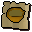 | cert_uncooked_stew |  | 0 |  |  |  |
|  | Stew | It's a meat and potato stew. | 20 |  |  | Eat |
| 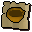 | cert_stew |  | 0 |  |  |  |
|  | Burnt stew | Eew, it's horribly burnt. | 1 |  |  | Empty Bowl |
| 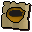 | cert_burnt_stew |  | 0 |  |  |  |
|  | Spice | This could liven up an otherwise bland stew. | 230 | yes |  |  |
|  | cert_spicespot |  | 0 |  |  |  |
|  | Uncooked curry | I need to cook this. | 10 | yes |  |  |
| 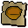 | cert_uncooked_curry |  | 0 |  |  |  |
| 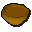 | Curry | It's a spicy hot curry. | 20 | yes |  | Eat |
| 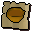 | cert_curry |  | 0 |  |  |  |
| 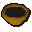 | Burnt curry | Eew, it's horribly burnt. | 1 | yes |  | Empty Bowl |
|  | cert_burnt_curry |  | 0 |  |  |  |
|  | Vodka | A strong spirit. | 5 | yes |  | Drink |
| 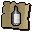 | cert_vodka |  | 0 |  |  |  |
|  | Whisky | A bottle of Draynor Malt. | 5 | yes |  | Drink |
| 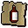 | cert_whisky |  | 0 |  |  |  |
|  | Gin | A strong spirit. | 5 | yes |  | Drink |
| 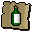 | cert_gin |  | 0 |  |  |  |
| 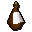 | Brandy | A strong spirit. | 5 | yes |  | Drink |
| 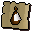 | cert_brandy |  | 0 |  |  |  |
| 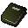 | Cocktail guide | A book on tree gnome cocktails. | 2 | yes |  | Read |
| 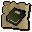 | cert_cocktail_guide |  | 0 |  |  |  |
| 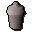 | Cocktail shaker | Used for mixing cocktails. | 2 | yes |  | Inspect |
|  | Cocktail glass | For sipping cocktails. | 1 | yes |  |  |
| 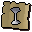 | cert_cocktail_glass_empty |  | 0 |  |  |  |
| 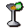 | Blurberry special | Looks good... smells strong. | 30 | yes |  | Drink |
|  | cert_premade_blurberry_special |  | 0 |  |  |  |
|  | Choc saturday | A warm creamy alcoholic beverage. | 30 | yes |  | Drink |
|  | cert_premade_choc_saturday |  | 0 |  |  |  |
|  | Drunk dragon | A warm creamy alcoholic beverage. | 30 | yes |  | Drink |
|  | cert_premade_drunk_dragon |  | 0 |  |  |  |
|  | Fruit blast | A cool refreshing fruit mix. | 30 | yes |  | Drink |
|  | cert_premade_fruit_blast |  | 0 |  |  |  |
|  | Pineapple punch | A fresh healthy fruit mix. | 30 | yes |  | Drink |
|  | cert_premade_pineapple_punch |  | 0 |  |  |  |
|  | Sgg | A Short Green Guy... looks good. | 30 | yes |  | Drink |
|  | cert_premade_sgg |  | 0 |  |  |  |
|  | Wizard blizzard | This looks like a strange mix. | 30 | yes |  | Drink |
|  | cert_premade_wizard_blizzard |  | 0 |  |  |  |
|  | Unfinished cocktail | This cocktail is just missing those little finishing touches. | 2 | yes |  | Drink |
| 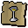 | cert_unfinished_pineapple_punch1 |  | 0 |  |  |  |
|  | Unfinished cocktail | This cocktail is just missing those little finishing touches. | 2 | yes |  | Drink |
|  | cert_unfinished_pineapple_punch2 |  | 0 |  |  |  |
|  | Unfinished cocktail | This cocktail is just missing those little finishing touches. | 2 | yes |  | Drink |
| 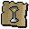 | cert_unfinished_pineapple_punch3 |  | 0 |  |  |  |
|  | Pineapple punch | A fresh healthy fruit mix. | 30 | yes |  | Drink |
| 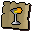 | cert_pineapple_punch |  | 0 |  |  |  |
|  | Unfinished cocktail | This cocktail is just missing those little finishing touches. | 2 | yes |  | Drink |
| 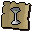 | cert_unfinished_wizard_blizzard1 |  | 0 |  |  |  |
|  | Unfinished cocktail | This cocktail is just missing those little finishing touches. | 2 | yes |  | Drink |
|  | cert_unfinished_wizard_blizzard2 |  | 0 |  |  |  |
|  | Wizard blizzard | This looks like a strange mix. | 30 | yes |  | Drink |
| 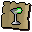 | cert_wizard_blizzard |  | 0 |  |  |  |
|  | Unfinished cocktail | This cocktail is just missing those little finishing touches. | 2 | yes |  | Drink |
| 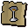 | cert_unfinished_blurberry_special1 |  | 0 |  |  |  |
|  | Unfinished cocktail | This cocktail is just missing those little finishing touches. | 2 | yes |  | Drink |
| 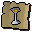 | cert_unfinished_blurberry_special2 |  | 0 |  |  |  |
|  | Unfinished cocktail | This cocktail is just missing those little finishing touches. | 2 | yes |  | Drink |
|  | cert_unfinished_blurberry_special3 |  | 0 |  |  |  |
|  | Unfinished cocktail | This cocktail is just missing those little finishing touches. | 2 | yes |  | Drink |
| 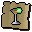 | cert_unfinished_blurberry_special4 |  | 0 |  |  |  |
|  | Blurberry special | Looks good... smells strong. | 30 | yes |  | Drink |
|  | cert_blurberry_special |  | 0 |  |  |  |
|  | Unfinished cocktail | This cocktail is just missing those little finishing touches. | 2 | yes |  | Drink |
| 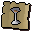 | cert_unfinished_chocolate_saturday1 |  | 0 |  |  |  |
|  | Unfinished cocktail | This cocktail is just missing those little finishing touches. | 2 | yes |  | Drink |
|  | cert_unfinished_chocolate_saturday2 |  | 0 |  |  |  |
|  | Unfinished cocktail | This cocktail is just missing those little finishing touches. | 2 | yes |  | Drink |
|  | cert_unfinished_chocolate_saturday3 |  | 0 |  |  |  |
|  | Unfinished cocktail | This cocktail is just missing those little finishing touches. | 2 | yes |  | Drink |
| 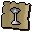 | cert_unfinished_chocolate_saturday4 |  | 0 |  |  |  |
|  | Choc saturday | A warm creamy alcoholic beverage. | 30 | yes |  | Drink |
|  | cert_chocolate_saturday |  | 0 |  |  |  |
|  | Unfinished cocktail | This cocktail is just missing those little finishing touches. | 2 | yes |  | Drink |
| 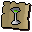 | cert_unfinished_sgg1 |  | 0 |  |  |  |
|  | Unfinished cocktail | This cocktail is just missing those little finishing touches. | 2 | yes |  | Drink |
|  | cert_unfinished_sgg2 |  | 0 |  |  |  |
|  | Sgg | A Short Green Guy... looks good. | 30 | yes |  | Drink |
| 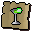 | cert_sgg |  | 0 |  |  |  |
|  | Unfinished cocktail | This cocktail is just missing those little finishing touches. | 2 | yes |  | Drink |
|  | cert_unfinished_fruit_blast1 |  | 0 |  |  |  |
|  | Fruit blast | A cool refreshing fruit mix. | 30 | yes |  | Drink |
|  | cert_fruit_blast |  | 0 |  |  |  |
|  | Unfinished cocktail | This cocktail is just missing those little finishing touches. | 2 | yes |  | Drink |
| 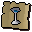 | cert_unfinished_drunk_dragon1 |  | 0 |  |  |  |
|  | Unfinished cocktail | This cocktail is just missing those little finishing touches. | 2 | yes |  | Drink |
| 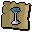 | cert_unfinished_drunk_dragon2 |  | 0 |  |  |  |
|  | Unfinished cocktail | This cocktail is just missing those little finishing touches. | 2 | yes |  | Drink |
|  | cert_unfinished_drunk_dragon3 |  | 0 |  |  |  |
|  | Drunk dragon | A warm creamy alcoholic beverage. | 30 | yes |  | Drink |
| 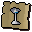 | cert_drunk_dragon |  | 0 |  |  |  |
|  | Odd cocktail | I'm not completely sure what this contains. | 2 | yes |  | Empty, Drink |
|  | cert_spoilt_cocktail |  | 0 |  |  |  |
|  | Odd cocktail | I'm not completely sure what this contains. | 2 | yes |  | Empty, Drink |
| 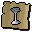 | cert_spoilt_cocktail_fruity |  | 0 |  |  |  |
|  | Odd cocktail | I'm not completely sure what this contains. | 2 | yes |  | Empty, Drink |
| 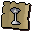 | cert_spoilt_cocktail_creamy |  | 0 |  |  |  |
| 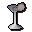 | Odd cocktail | I'm not completely sure what this contains. | 2 | yes |  | Empty, Drink |
| 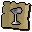 | cert_spoilt_cocktail_slice |  | 0 |  |  |  |
|  | Lemon | A fresh lemon. | 2 | yes |  | Eat |
| 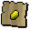 | cert_lemon |  | 0 |  |  |  |
| 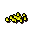 | Lemon chunks | Fresh chunks of lemon. | 2 | yes |  | Eat |
| 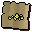 | cert_lemon_chunks |  | 0 |  |  |  |
| 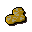 | Lemon slices | Fresh lemon slices. | 2 | yes |  | Eat |
| 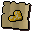 | cert_lemon_slices |  | 0 |  |  |  |
|  | Orange | A fresh orange. | 2 | yes |  | Eat |
| 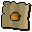 | cert_orange |  | 0 |  |  |  |
|  | Orange chunks | Fresh chunks of orange. | 2 | yes |  | Eat |
|  | cert_orange_chunks |  | 0 |  |  |  |
|  | Orange slices | Fresh orange slices. | 2 | yes |  | Eat |
| 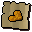 | cert_orange_slices |  | 0 |  |  |  |
|  | Pineapple | It can be cut up into something more manageable with a knife. | 1 | yes |  | Eat |
| 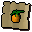 | cert_pineapple |  | 0 |  |  |  |
|  | Pineapple chunks | Fresh chunks of pineapple. | 1 | yes |  | Eat |
| 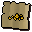 | cert_pineapple_chunks |  | 0 |  |  |  |
|  | Pineapple ring | Exotic fruit. | 1 | yes |  | Eat |
| 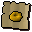 | cert_pineapple_ring |  | 0 |  |  |  |
|  | Lime | A fresh lime. | 2 | yes |  | Eat |
| 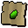 | cert_lime |  | 0 |  |  |  |
| 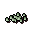 | Lime chunks | Fresh chunks of lime. | 1 | yes |  | Eat |
| 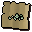 | cert_lime_chunks |  | 0 |  |  |  |
| 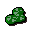 | Lime slices | Fresh lime slices. | 2 | yes |  | Eat |
|  | cert_lime_slices |  | 0 |  |  |  |
|  | Dwellberries | Some rather pretty blue berries. | 4 | yes |  | Eat |
|  | cert_dwellberries |  | 0 |  |  |  |
|  | Equa leaves | Small sweet smelling leaves. | 2 | yes |  | Eat |
|  | cert_equa_leaves |  | 0 |  |  |  |
|  | Pot of cream | Fresh cream. | 2 | yes |  | Eat |
|  | cert_pot_of_cream |  | 0 |  |  |  |
|  | Raw beef | I need to cook this first. | 1 |  |  |  |
|  | cert_raw_beef |  | 0 |  |  |  |
|  | Raw rat meat | I need to cook this first. | 1 |  |  |  |
|  | cert_raw_rat_meat |  | 0 |  |  |  |
|  | Raw bear meat | I need to cook this first. | 1 |  |  |  |
|  | cert_raw_bear_meat |  | 0 |  |  |  |
|  | Raw chicken | I need to cook this first. | 1 |  |  |  |
|  | cert_raw_chicken |  | 0 |  |  |  |
|  | Cooked chicken | Mmm this looks tasty. | 4 |  |  | Eat |
|  | cert_cooked_chicken |  | 0 |  |  |  |
|  | Cooked meat | Mmm this looks tasty. | 4 |  |  | Eat |
|  | cert_cooked_meat |  | 0 |  |  |  |
|  | Burnt chicken | Oh dear, it's totally burnt! | 1 |  |  |  |
|  | cert_burnt_chicken |  | 0 |  |  |  |
|  | Burnt meat | Oh dear, it's totally burnt! | 1 |  |  |  |
|  | cert_burnt_meat |  | 0 |  |  |  |
|  | Raw lava eel | A very strange eel. | 150 | yes |  |  |
|  | Lava eel | Strange, it looks cooler now it's been cooked. | 150 | yes |  | Eat |
|  | Swamp toad | A slippery little blighter. | 2 | yes |  | Remove-legs |
|  | cert_swamp_toad |  | 0 |  |  |  |
|  | Toad's legs | They're a gnome delicacy apparently. | 2 | yes |  | Eat |
|  | cert_toads_legs |  | 0 |  |  |  |
|  | Equa toad's legs | They're a gnome delicacy apparently. | 2 | yes |  | Eat |
|  | cert_equa_toads_legs |  | 0 |  |  |  |
|  | Spicy toad's legs | They're a gnome delicacy apparently. | 2 | yes |  | Eat |
|  | cert_spicy_toads_legs |  | 0 |  |  |  |
|  | Seasoned legs | They're a gnome delicacy apparently. | 2 | yes |  | Eat |
|  | cert_seasoned_toads_legs |  | 0 |  |  |  |
|  | Spicy worm | They're a gnome delicacy apparently. | 2 | yes |  | Eat |
|  | cert_spicy_worm |  | 0 |  |  |  |
|  | King worm | They're a gnome delicacy apparently. | 2 | yes |  | Eat |
|  | cert_king_worm |  | 0 |  |  |  |
|  | Batta tin | A deep tin used for baking gnome battas in. | 0 | yes |  |  |
|  | Crunchy tray | A shallow tray used for baking crunchies in. | 0 | yes |  |  |
|  | Gnomebowl mould | A large ovenproof bowl. | 0 | yes |  |  |
|  | Gianne's cook book | Aluft Gianne's favorite dishes. | 2 | yes |  | Read |
|  | cert_giannes_cook_book |  | 0 |  |  |  |
|  | Gnome spice | It's Aluft Gianne's secret mix of spices. | 2 | yes |  |  |
|  | cert_gnome_spice |  | 0 |  |  |  |
|  | Gianne dough | It's made from a secret recipe. | 2 | yes |  |  |
|  | cert_gianne_dough |  | 0 |  |  |  |
|  | Odd gnomebowl | This gnome bowl doesn't look very appetising. | 2 | yes |  | Eat |
|  | cert_spoilt_gnomebowl |  | 0 |  |  |  |
|  | Burnt gnomebowl | This gnome bowl has been burnt to a cinder. | 1 | yes |  |  |
|  | cert_burnt_gnomebowl |  | 0 |  |  |  |
|  | Half baked bowl | This gnome bowl is in the early stages of preparation. | 2 | yes |  | Inspect |
|  | Raw gnomebowl | This gnome bowl needs cooking. | 2 | yes |  |  |
|  | Unfinished bowl | This dish is just missing those little finishing touches. | 0 | yes |  | Eat |
|  | cert_unfinished_chocolate_bomb1 |  | 0 |  |  |  |
|  | Unfinished bowl | This dish is just missing those little finishing touches. | 0 | yes |  | Eat |
|  | cert_unfinished_chocolate_bomb2 |  | 0 |  |  |  |
|  | Unfinished bowl | This dish is just missing those little finishing touches. | 0 | yes |  | Eat |
|  | cert_unfinished_chocolate_bomb3 |  | 0 |  |  |  |
|  | Chocolate bomb | Looks great! | 2 | yes |  | Eat |
|  | cert_chocolate_bomb |  | 0 |  |  |  |
|  | Tangled toad's legs | It actually smells quite good. | 2 | yes |  | Eat |
|  | cert_tangled_toads_legs |  | 0 |  |  |  |
|  | Unfinished bowl | This dish is just missing those little finishing touches. | 0 | yes |  | Eat |
|  | cert_unfinished_worm_hole |  | 0 |  |  |  |
|  | Worm hole | It actually smells quite good. | 2 | yes |  | Eat |
|  | cert_worm_hole |  | 0 |  |  |  |
|  | Unfinished bowl | This dish is just missing those little finishing touches. | 0 | yes |  | Eat |
|  | cert_unfinished_veg_ball |  | 0 |  |  |  |
|  | Veg ball | This looks pretty healthy. | 2 | yes |  | Eat |
|  | cert_veg_ball |  | 0 |  |  |  |
|  | Odd crunchies | These crunchies don't look very appetising. | 2 | yes |  | Eat |
|  | cert_spoilt_crunchies |  | 0 |  |  |  |
|  | Burnt crunchies | These crunchies have been burnt to a cinder. | 1 | yes |  |  |
|  | cert_burnt_crunchies |  | 0 |  |  |  |
|  | Half baked crunchy | This crunchy is in the early stages of preparation. | 2 | yes |  | Inspect |
|  | Raw crunchies | These crunchies need cooking. | 2 | yes |  |  |
|  | Unfinished crunchy | These crunchies are just missing those little finishing touches. | 0 | yes |  | Eat |
|  | cert_unfinished_worm_crunchies |  | 0 |  |  |  |
|  | Worm crunchies | It actually smells quite good. | 2 | yes |  | Eat |
|  | cert_worm_crunchies |  | 0 |  |  |  |
|  | Unfinished crunchy | These crunchies are just missing those little finishing touches. | 0 | yes |  | Eat |
|  | cert_unfinished_chocchip_crunchies |  | 0 |  |  |  |
|  | Chocchip crunchies | Yum... smells good. | 2 | yes |  | Eat |
|  | cert_chocchip_crunchies |  | 0 |  |  |  |
|  | Unfinished crunchy | These crunchies are just missing those little finishing touches. | 0 | yes |  | Eat |
|  | cert_unfinished_spicy_crunchies |  | 0 |  |  |  |
|  | Spicy crunchies | Yum... smells good. | 2 | yes |  | Eat |
|  | cert_spicy_crunchies |  | 0 |  |  |  |
|  | Unfinished crunchy | These crunchies are just missing those little finishing touches. | 0 | yes |  | Eat |
|  | cert_unfinished_toad_crunchies |  | 0 |  |  |  |
|  | Toad crunchies | It actually smells quite good. | 2 | yes |  | Eat |
|  | cert_toad_crunchies |  | 0 |  |  |  |
|  | Worm batta | It actually smells quite good. | 120 | yes |  | Eat |
|  | cert_premade_worm_batta |  | 0 |  |  |  |
|  | Toad batta | It actually smells quite good. | 120 | yes |  | Eat |
|  | cert_premade_toad_batta |  | 0 |  |  |  |
|  | Cheese+tom batta | This smells really good. | 120 | yes |  | Eat |
|  | cert_premade_cheese+tom_batta |  | 0 |  |  |  |
|  | Fruit batta | It actually smells quite good. | 120 | yes |  | Eat |
|  | cert_premade_fruit_batta |  | 0 |  |  |  |
|  | Vegetable batta | Well... it looks healthy. | 120 | yes |  | Eat |
|  | cert_premade_vegetable_batta |  | 0 |  |  |  |
|  | Chocolate bomb | Looks great! | 160 | yes |  | Eat |
|  | cert_premade_chocolate_bomb |  | 0 |  |  |  |
|  | Tangled toad's legs | It actually smells quite good. | 160 | yes |  | Eat |
|  | cert_premade_tangled_toads_legs |  | 0 |  |  |  |
|  | Worm hole | It actually smells quite good. | 150 | yes |  | Eat |
|  | cert_premade_worm_hole |  | 0 |  |  |  |
|  | Veg ball | This looks pretty healthy. | 150 | yes |  | Eat |
|  | cert_premade_veg_ball |  | 0 |  |  |  |
|  | Worm crunchies | It actually smells quite good. | 85 | yes |  | Eat |
|  | cert_premade_worm_crunchies |  | 0 |  |  |  |
|  | Chocchip crunchies | Yum... smells good. | 85 | yes |  | Eat |
|  | cert_premade_chocchip_crunchies |  | 0 |  |  |  |
|  | Spicy crunchies | Yum... smells good. | 85 | yes |  | Eat |
|  | cert_premade_spicy_crunchies |  | 0 |  |  |  |
|  | Toad crunchies | It actually smells quite good. | 85 | yes |  | Eat |
|  | cert_premade_toad_crunchies |  | 0 |  |  |  |
|  | Odd batta | This batta doesn't look very appetising. | 2 | yes |  | Eat |
|  | cert_spoilt_batta |  | 0 |  |  |  |
|  | Burnt batta | This batta has been burnt to a cinder. | 1 | yes |  |  |
|  | cert_burnt_batta |  | 0 |  |  |  |
|  | Half baked batta | This gnome batta is in the early stages of preparation. | 2 | yes |  | Inspect |
|  | Raw batta | This gnome batta needs cooking. | 2 | yes |  |  |
|  | Unfinished batta | This batta is just missing those little finishing touches. | 0 | yes |  | Eat |
|  | cert_unfinished_worm_batta |  | 0 |  |  |  |
|  | Worm batta | It actually smells quite good. | 0 | yes |  | Eat |
|  | cert_worm_batta |  | 0 |  |  |  |
|  | Toad batta | It actually smells quite good. | 2 | yes |  | Eat |
|  | cert_toad_batta |  | 0 |  |  |  |
|  | Unfinished batta | This batta is just missing those little finishing touches. | 0 | yes |  | Eat |
|  | cert_unfinished_cheese+tom_batta |  | 0 |  |  |  |
|  | Cheese+tom batta | This smells really good. | 2 | yes |  | Eat |
|  | cert_cheese+tom_batta |  | 0 |  |  |  |
|  | Unfinished batta | This batta is just missing those little finishing touches. | 0 | yes |  | Eat |
|  | cert_fruitless_batta |  | 0 |  |  |  |
|  | Unfinished batta | This batta is just missing those little finishing touches. | 0 | yes |  | Eat |
|  | cert_fruit_batta_lime |  | 0 |  |  |  |
|  | Unfinished batta | This batta is just missing those little finishing touches. | 0 | yes |  | Eat |
|  | cert_fruit_batta_orange |  | 0 |  |  |  |
|  | Unfinished batta | This batta is just missing those little finishing touches. | 0 | yes |  | Eat |
|  | cert_fruit_batta_pineapple |  | 0 |  |  |  |
|  | Unfinished batta | This batta is just missing those little finishing touches. | 0 | yes |  | Eat |
|  | cert_fruit_batta_limeorange |  | 0 |  |  |  |
|  | Unfinished batta | This batta is just missing those little finishing touches. | 0 | yes |  | Eat |
|  | cert_fruit_batta_limepineapple |  | 0 |  |  |  |
|  | Unfinished batta | This batta is just missing those little finishing touches. | 0 | yes |  | Eat |
|  | cert_fruit_batta_orangepineapple |  | 0 |  |  |  |
|  | Unfinished batta | This batta is just missing those little finishing touches. | 0 | yes |  | Eat |
|  | cert_unfinished_fruit_batta |  | 0 |  |  |  |
|  | Fruit batta | It actually smells quite good. | 2 | yes |  | Eat |
|  | cert_fruit_batta |  | 0 |  |  |  |
|  | Unfinished batta | This batta is just missing those little finishing touches. | 0 | yes |  | Eat |
|  | cert_unfinished_vegetable_batta |  | 0 |  |  |  |
|  | Vegetable batta | Well... it looks healthy. | 2 | yes |  | Eat |
|  | cert_vegetable_batta |  | 0 |  |  |  |
|  | Pizza base | I need to add some tomato next. | 4 |  |  |  |
|  | cert_pizza_base |  | 0 |  |  |  |
|  | Incomplete pizza | I need to add some cheese next. | 10 |  |  |  |
|  | cert_incomplete_pizza |  | 0 |  |  |  |
|  | Uncooked pizza | This needs cooking. | 25 |  |  |  |
|  | cert_uncooked_pizza |  | 0 |  |  |  |
|  | Plain pizza | A cheese and tomato pizza. | 40 |  |  | Eat |
|  | cert_plain_pizza |  | 0 |  |  |  |
|  | 1/2 plain pizza | Half of this pizza has been eaten. | 20 |  |  | Eat |
|  | cert_half_plain_pizza |  | 0 |  |  |  |
|  | Meat pizza | A pizza with bits of meat on it. | 50 |  |  | Eat |
|  | cert_meat_pizza |  | 0 |  |  |  |
|  | 1/2 meat pizza | Half of this pizza has been eaten. | 25 |  |  | Eat |
|  | cert_half_meat_pizza |  | 0 |  |  |  |
|  | Anchovy pizza | A pizza with anchovies. | 60 |  |  | Eat |
|  | cert_anchovie_pizza |  | 0 |  |  |  |
|  | 1/2 anchovy pizza | Half of this pizza has been eaten. | 30 |  |  | Eat |
|  | cert_half_anchovie_pizza |  | 0 |  |  |  |
|  | Pineapple pizza | A tropicana pizza. | 100 | yes |  | Eat |
|  | cert_pineapple_pizza |  | 0 |  |  |  |
|  | 1/2pineapple pizza | Half of this pizza has been eaten. | 50 | yes |  | Eat |
|  | cert_half_pineapple_pizza |  | 0 |  |  |  |
|  | Burnt pizza | Oh dear! | 1 |  |  |  |
|  | cert_burnt_pizza |  | 0 |  |  |  |
|  | Bread dough | Some uncooked dough. | 4 |  |  |  |
|  | cert_bread_dough |  | 0 |  |  |  |
|  | Bread | Nice crispy bread. | 12 |  |  | Eat |
|  | cert_bread |  | 0 |  |  |  |
|  | Burnt bread | Nice crispy bread.  Possibly too crispy. | 1 |  |  |  |
|  | cert_burnt_bread |  | 0 |  |  |  |
|  | Pie dish | Deceptively pie shaped. | 3 |  |  |  |
|  | cert_piedish |  | 0 |  |  |  |
|  | Pie shell | I need to find a filling for this pie. | 4 |  |  |  |
|  | cert_pie_shell |  | 0 |  |  |  |
|  | Uncooked apple pie | This would be much tastier cooked. | 16 |  |  |  |
|  | cert_uncooked_apple_pie |  | 0 |  |  |  |
|  | Uncooked meat pie | This would be much healthier cooked. | 8 |  |  |  |
|  | cert_uncooked_meat_pie |  | 0 |  |  |  |
|  | Uncooked berry pie | This would be much more appetising cooked. | 6 |  |  |  |
|  | cert_uncooked_redberry_pie |  | 0 |  |  |  |
|  | Apple pie | Mmm Apple pie. | 30 |  |  | Eat |
|  | cert_apple_pie |  | 0 |  |  |  |
|  | Redberry pie | Looks tasty. | 12 |  |  | Eat |
|  | cert_redberry_pie |  | 0 |  |  |  |
|  | Meat pie | Not for vegetarians. | 15 |  |  | Eat |
|  | cert_meat_pie |  | 0 |  |  |  |
|  | Burnt pie | I think I left it on the stove too long. | 1 |  |  | Empty Dish |
|  | cert_burnt_pie |  | 0 |  |  |  |
|  | Half a meat pie | Half of it is suitable for vegetarians. | 8 |  |  | Eat |
|  | cert_half_a_meat_pie |  | 0 |  |  |  |
|  | Half a redberry pie | So tasty I kept some for later. | 6 |  |  | Eat |
|  | cert_half_a_redberry_pie |  | 0 |  |  |  |
|  | Half an apple pie | Mmm half an apple pie. | 15 |  |  | Eat |
|  | cert_half_an_apple_pie |  | 0 |  |  |  |
|  | Raw oomlie | Raw meat from the oomlie bird. | 10 | yes |  |  |
|  | cert_raw_oomlie |  | 0 |  |  |  |
|  | Palm leaf | A thick green palm leaf used by natives to cook meat in. | 5 | yes |  |  |
|  | cert_palm_leaf |  | 0 |  |  |  |
|  | Wrapped oomlie | Oomlie meat in a palm leaf pouch.  It just needs to be cooked. | 16 | yes |  |  |
|  | cert_wrapped_oomlie |  | 0 |  |  |  |
|  | Cooked oomlie wrap | Deliciously cooked oomlie meat in a palm leaf pouch. | 35 | yes |  | Eat |
|  | cert_cooked_oomlie |  | 0 |  |  |  |
|  | Burnt oomlie wrap | Burnt oomlie meat in a palm leaf pouch. | 1 | yes |  |  |
|  | cert_burnt_oomlie |  | 0 |  |  |  |
|  | Hammer | Good for hitting things! | 0 |  |  |  |
|  | cert_hammer |  | 0 |  |  |  |
|  | Bronze bar | It's a bar of bronze. | 8 |  |  |  |
|  | cert_bronze_bar |  | 0 |  |  |  |
|  | Iron bar | It's a bar of iron. | 28 |  |  |  |
|  | cert_iron_bar |  | 0 |  |  |  |
|  | Steel bar | It's a bar of steel. | 100 |  |  |  |
|  | cert_steel_bar |  | 0 |  |  |  |
|  | Silver bar | It's a bar of silver. | 150 |  |  |  |
|  | cert_silver_bar |  | 0 |  |  |  |
|  | Gold bar | It's a bar of gold. | 300 |  |  |  |
|  | cert_gold_bar |  | 0 |  |  |  |
|  | Mithril bar | It's a bar of mithril. | 300 |  |  |  |
|  | cert_mithril_bar |  | 0 |  |  |  |
|  | Adamantite bar | It's a bar of adamantite. | 640 |  |  |  |
|  | cert_adamantite_bar |  | 0 |  |  |  |
|  | Runite bar | It's a bar of runite. | 5000 |  |  |  |
|  | cert_runite_bar |  | 0 |  |  |  |
|  | 'perfect' gold bar | It's a bar of 'perfect' gold. | 300 | yes |  |  |
|  | Shield left half | The left half of a dragon square shield. | 110000 | yes |  |  |
|  | cert_dragonshield_a |  | 0 |  |  |  |
|  | Shield right half | The right half of a dragon square shield. | 500000 | yes |  |  |
|  | cert_dragonshield_b |  | 0 |  |  |  |
|  | Steel studs | A set of studs for leather armour. | 150 | yes |  |  |
|  | cert_studs |  | 0 |  |  |  |
|  | Ogre relic | An old statue of an ogre warrior. | 0 | yes |  |  |
|  | Relic part 1 | Part of an ogre relic. | 0 | yes |  |  |
|  | Relic part 2 | Part of an ogre relic. | 0 | yes |  |  |
|  | Relic part 3 | Part of an ogre relic. | 0 | yes |  |  |
|  | Skavid map | It's a map. | 0 | yes |  |  |
|  | Ogre tooth | Very tooth like. | 0 | yes |  |  |
|  | Toban key |  | 0 | yes |  |  |
|  | Rock cake |  | 0 | yes |  | Eat |
|  | Crystal |  | 0 | yes |  |  |
|  | Crystal |  | 0 | yes |  |  |
|  | Crystal |  | 0 | yes |  |  |
|  | Crystal |  | 0 | yes |  |  |
|  | Finger nails | Eeeeyeeew! | 0 | yes |  |  |
|  | Old robe | I can't wear this old thing. | 0 | yes |  |  |
|  | Unusual armour | Looks kind of useless... | 0 | yes |  |  |
|  | Damaged dagger | Pointy. | 0 | yes |  |  |
|  | Tattered eye patch | Useless as an eyepatch. | 0 | yes |  |  |
|  | Vial | An infusion of water and jangerberries. | 0 | yes |  |  |
|  | Vial | A mixture of jangerberries and guam leaves in a vial. | 0 | yes |  |  |
|  | Ground bat bones | Let's see it fly now! | 20 | yes |  |  |
|  | cert_ground_bat_bones |  | 0 |  |  |  |
|  | Gold | It's a stolen bar of gold. | 300 | yes |  |  |
|  | Potion | A strange brew. | 120 | yes |  |  |
|  | Magic ogre potion | A dangerous magical liquid. | 120 | yes |  |  |
|  | Spell scroll | A spell is written on this parchment. | 5 | yes |  | Read |
|  | Shaman robe | A tattered old robe. | 40 | yes |  | Search |
|  | Nightshade | Deadly! | 30 | yes |  | Eat |
|  | Key | A key given to me by Wizard Traiborn. | 0 |  |  |  |
|  | Key | A key given to me by Captain Rovin. | 0 |  |  |  |
|  | Key | A key I found in a drain. | 0 |  |  |  |
|  | Silverlight | The magical sword 'Silverlight'. | 50 |  |  | Wield |
|  | Scroll of hazeel | Scroll containing a powerful enchantment of restoration. | 0 | yes |  |  |
|  | Key | This key opens a chest in the Carnillean household. | 0 | yes |  |  |
|  | Carnillean armour | Decorative armour; an heirloom of the Carnillean family. | 65 | yes |  | Wear |
|  | Mark of hazeel | Sign of my commitment to Hazeel. | 0 | yes |  | Wear |
|  | Ball | A childs' ball. | 1 | yes |  |  |
|  | Diary | A daily journal. | 0 | yes |  | Read |
|  | Door key | A key to the Witches' house front door. | 0 | yes |  |  |
|  | Magnet | A very attractive magnet. | 3 | yes |  |  |
|  | Key | A key to the Witches' shed. | 0 | yes |  |  |
|  | Cape of saradomin | A cape from the almighty god Saradomin. | 100 | yes |  | Wear |
|  | Cape of guthix | A cape from the almighty god Guthix. | 100 | yes |  | Wear |
|  | Cape of zamorak | A cape from the almighty god Zamorak. | 100 | yes |  | Wear |
|  | Staff of saradomin | It's a stick of the gods. | 80000 | yes |  | Wield |
|  | Staff of guthix | It's a stick of the gods. | 80000 | yes |  | Wield |
|  | Staff of zamorak | It's a stick of the gods. | 80000 | yes |  | Wield |
|  | Bronze key | A heavy key made of bronze. | 0 |  |  |  |
|  | Wig | A wig that has been dyed slightly blonde. | 0 |  |  |  |
|  | obj_2420 |  | 0 |  |  |  |
|  | Wig | A grey woollen wig. | 0 |  |  |  |
|  | obj_2422 |  | 0 |  |  |  |
|  | Key print | An imprint of a key in a lump of clay. | 0 |  |  |  |
|  | Paste | A bottle of skin coloured paste. | 5 |  |  |  |
|  | obj_2425 |  | 0 |  |  |  |
|  | Burnt oomlie | Oh dear, it's totally burnt! | 1 | yes |  |  |
|  | cert_burnt_uw_oomlie |  | 0 |  |  |  |
|  | Attack potion(4) | 4 doses of attack potion. | 15 | yes |  | Drink |
|  | cert_4dose1attack |  | 0 |  |  |  |
|  | Restore potion(4) | 4 doses of stat restoration potion. | 110 | yes |  | Drink |
|  | cert_4dosestatrestore |  | 0 |  |  |  |
|  | Defence potion(4) | 4 doses of defence potion. | 150 | yes |  | Drink |
|  | cert_4dose1defense |  | 0 |  |  |  |
|  | Prayer potion(4) | 4 doses of restore prayer potion. | 190 | yes |  | Drink |
|  | cert_4doseprayerrestore |  | 0 |  |  |  |
|  | Super attack(4) | 4 doses of super attack potion. | 225 | yes |  | Drink |
|  | cert_4dose2attack |  | 0 |  |  |  |
|  | Fishing potion(4) | 4 doses of fishing potion. | 250 | yes |  | Drink |
|  | cert_4dosefisherspotion |  | 0 |  |  |  |
|  | Super strength(4) | 4 doses of super strength potion. | 275 | yes |  | Drink |
|  | cert_4dose2strength |  | 0 |  |  |  |
|  | Super defence(4) | 4 doses of super defence potion. | 330 | yes |  | Drink |
|  | cert_4dose2defense |  | 0 |  |  |  |
|  | Ranging potion(4) | 4 doses of ranging potion. | 360 | yes |  | Drink |
|  | cert_4doserangerspotion |  | 0 |  |  |  |
|  | Antipoison(4) | 4 doses of antipoison potion. | 360 | yes |  | Drink |
|  | cert_4doseantipoison |  | 0 |  |  |  |
|  | Superantipoison(4) | 4 doses of super antipoison potion. | 360 | yes |  | Drink |
|  | cert_4dose2antipoison |  | 0 |  |  |  |
|  | Zamorak potion(4) | 4 doses of a potion of Zamorak. | 25 | yes |  | Drink |
|  | cert_4dosepotionofzamorak |  | 0 |  |  |  |
|  | Antifire potion(4) | 4 doses of anti-firebreath potion. | 330 | yes |  | Drink |
|  | cert_4dose1antidragon |  | 0 |  |  |  |
|  | Antifire potion(3) | 3 doses of anti-firebreath potion. | 264 | yes |  | Drink |
|  | cert_3dose1antidragon |  | 0 |  |  |  |
|  | Antifire potion(2) | 2 doses of anti-firebreath potion. | 198 | yes |  | Drink |
|  | cert_2dose1antidragon |  | 0 |  |  |  |
|  | Antifire potion(1) | 1 dose of anti-firebreath potion. | 132 | yes |  | Drink |
|  | cert_1dose1antidragon |  | 0 |  |  |  |
|  | Flowers | A posy of flowers. | 100 | yes |  | Wield |
|  | cert_flowers_waterfall_quest |  | 0 |  |  |  |
|  | Flowers | A posy of flowers. | 100 | yes |  | Wield |
|  | cert_flowers_waterfall_quest_red |  | 0 |  |  |  |
|  | Flowers | A posy of flowers. | 100 | yes |  | Wield |
|  | cert_flowers_waterfall_quest_blue |  | 0 |  |  |  |
|  | Flowers | A posy of flowers. | 100 | yes |  | Wield |
|  | cert_flowers_waterfall_quest_yellow |  | 0 |  |  |  |
|  | Flowers | A posy of flowers. | 100 | yes |  | Wield |
|  | cert_flowers_waterfall_quest_purple |  | 0 |  |  |  |
|  | Flowers | A posy of flowers. | 100 | yes |  | Wield |
|  | cert_flowers_waterfall_quest_orange |  | 0 |  |  |  |
|  | Flowers | A posy of flowers. | 100 | yes |  | Wield |
|  | cert_flowers_waterfall_quest_mixed |  | 0 |  |  |  |
|  | Flowers | A posy of flowers. | 100 | yes |  | Wield |
|  | cert_flowers_waterfall_quest_white |  | 0 |  |  |  |
|  | Flowers | A posy of flowers. | 100 | yes |  | Wield |
|  | cert_flowers_waterfall_quest_black |  | 0 |  |  |  |
|  | cert_fish_food |  | 0 |  |  |  |
|  | cert_poison |  | 0 |  |  |  |
|  | obj_2480 |  | 0 |  |  |  |
|  | Lantadyme | A powerful herb. | 68 | yes |  |  |
|  | cert_lantadyme |  | 0 |  |  |  |
|  | Unfinished potion | I need another ingredient to finish this Lantadyme potion. | 68 | yes |  |  |
|  | cert_lantadymevial |  | 0 |  |  |  |
|  | Herb | I need a closer look to identify this. | 0 | yes |  | Identify |
|  | cert_unidentified_lantadyme |  | 0 |  |  |  |
|  | Dragon vambraces | Made from 100% real dragon hide. | 3000 | yes |  | Wear |
|  | cert_blue_dragon_vambraces |  | 0 |  |  |  |
|  | Dragon vambraces | Made from 100% real dragon hide. | 3600 | yes |  | Wear |
|  | cert_red_dragon_vambraces |  | 0 |  |  |  |
|  | Dragon vambraces | Made from 100% real dragon hide. | 4320 | yes |  | Wear |
|  | cert_black_dragon_vambraces |  | 0 |  |  |  |
|  | Dragonhide chaps | Made from 100% real dragon hide. | 4320 | yes |  | Wear |
|  | cert_blue_dragonhide_chaps |  | 0 |  |  |  |
|  | Dragonhide chaps | Made from 100% real dragon hide. | 5180 | yes |  | Wear |
|  | cert_red_dragonhide_chaps |  | 0 |  |  |  |
|  | Dragonhide chaps | Made from 100% real dragon hide. | 6220 | yes |  | Wear |
|  | cert_black_dragonhide_chaps |  | 0 |  |  |  |
|  | Dragonhide body | Made from 100% real dragon hide. | 9360 | yes |  | Wear |
