<!-- GENERATED by tools/docsgen — do not edit; regenerate instead. -->

# Items — page 6 (cert_blue_dragonhide_body – cert_toadflax)

| Icon | Name | Description | Cost | Members | Stackable | Options |
|---|---|---|---|---|---|---|
| 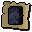 | cert_blue_dragonhide_body |  | 0 |  |  |  |
| 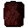 | Dragonhide body | Made from 100% real dragon hide. | 11230 | yes |  | Wear |
| 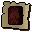 | cert_red_dragonhide_body |  | 0 |  |  |  |
| 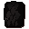 | Dragonhide body | Made from 100% real dragon hide. | 13480 | yes |  | Wear |
| 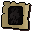 | cert_black_dragonhide_body |  | 0 |  |  |  |
|  | Dragon leather | It's a piece of prepared dragonhide. | 0 | yes |  |  |
| 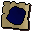 | cert_dragon_leather_blue |  | 0 |  |  |  |
|  | Dragon leather | It's a piece of prepared dragonhide. | 0 | yes |  |  |
| 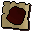 | cert_dragon_leather_red |  | 0 |  |  |  |
| 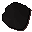 | Dragon leather | It's a piece of prepared dragonhide. | 0 | yes |  |  |
| 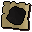 | cert_dragon_leather_black |  | 0 |  |  |  |
|  | Logs | A number of wooden logs. | 4 |  |  | Light |
|  | newbieshrimp |  | 0 |  |  |  |
|  | obj_2513 |  | 0 |  |  |  |
|  | Raw shrimps | I should try cooking this. | 5 |  |  |  |
| 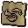 | cert_newbieraw_shrimp |  | 0 |  |  |  |
|  | Pot of flour | There is flour in this pot. | 10 |  |  |  |
| 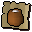 | cert_newbie_pot_flour |  | 0 |  |  |  |
| 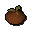 | Rotten tomato | Pretty smelly. | 1 | yes |  |  |
| 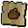 | cert_rotten_tomato |  | 0 |  |  |  |
| 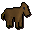 | Toy horsey | A brown toy horse. | 100 |  |  | Play-with |
| 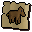 | cert_horsey_brown |  | 0 |  |  |  |
| 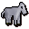 | Toy horsey | A white toy horse. | 100 |  |  | Play-with |
| 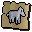 | cert_horsey_white |  | 0 |  |  |  |
|  | Toy horsey | A black toy horse. | 100 |  |  | Play-with |
| 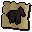 | cert_horsey_black |  | 0 |  |  |  |
|  | Toy horsey | A grey toy horse. | 100 |  |  | Play-with |
| 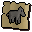 | cert_horsey_grey |  | 0 |  |  |  |
|  | Lamp | Wonder what happens if I rub it... | 0 |  |  | Rub |
|  | Orb of light | A magical sphere that glimmers within. | 1 | yes |  |  |
|  | Bones | Bones are for burying! | 0 |  |  | Bury |
|  | cert_newbiebones |  | 0 |  |  |  |
|  | Iron fire arrows | Arrows with iron heads and oil soaked cloth. | 3 | yes | yes | Wield |
|  | Iron fire arrows | These iron headed arrows are ablaze with fire. | 10 | yes | yes | Wield |
|  | Steel fire arrows | Arrows with steel heads and oil soaked cloth. | 3 | yes | yes | Wield |
|  | Steel fire arrows | These steel headed arrows are ablaze with fire. | 10 | yes | yes | Wield |
|  | Mithril fire arrows | Arrows with mithril heads and oil soaked cloth. | 3 | yes | yes | Wield |
|  | Mithril fire arrows | These mithril headed arrows are ablaze with fire. | 10 | yes | yes | Wield |
| 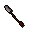 | Adamnt fire arrows | Arrows with adamant heads and oil soaked cloth. | 3 | yes | yes | Wield |
|  | Adamnt fire arrows | These adamant headed arrows are ablaze with fire. | 10 | yes | yes | Wield |
|  | Rune fire arrows | Arrows with rune heads and oil soaked cloth. | 3 | yes | yes | Wield |
|  | Rune fire arrows | These rune headed arrows are ablaze with fire. | 10 | yes | yes | Wield |
|  | Unlitarrow 2 |  | 0 |  | yes |  |
|  | Unlitarrow 3 |  | 0 |  | yes |  |
| 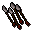 | Unlitarrow 4 |  | 0 |  | yes |  |
|  | Unlitarrow 5 |  | 0 |  | yes |  |
|  | Litarrow 2 |  | 0 |  | yes |  |
| 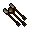 | Litarrow 3 |  | 0 |  | yes |  |
| 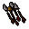 | Litarrow 4 |  | 0 |  | yes |  |
|  | Litarrow 5 |  | 0 |  | yes |  |
|  | Ring of recoil | An enchanted ring. | 900 | yes |  | Wear |
|  | cert_ring_of_recoil |  | 0 |  |  |  |
|  | Ring of dueling(8) | An enchanted ring. | 1275 | yes |  | Wear, Rub |
|  | cert_ring_of_dueling_8 |  | 0 |  |  |  |
|  | Ring of dueling(7) | An enchanted ring. | 1275 | yes |  | Wear, Rub |
|  | cert_ring_of_dueling_7 |  | 0 |  |  |  |
|  | Ring of dueling(6) | An enchanted ring. | 1275 | yes |  | Wear, Rub |
|  | cert_ring_of_dueling_6 |  | 0 |  |  |  |
|  | Ring of dueling(5) | An enchanted ring. | 1275 | yes |  | Wear, Rub |
| 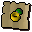 | cert_ring_of_dueling_5 |  | 0 |  |  |  |
|  | Ring of dueling(4) | An enchanted ring. | 1275 | yes |  | Wear, Rub |
|  | cert_ring_of_dueling_4 |  | 0 |  |  |  |
|  | Ring of dueling(3) | An enchanted ring. | 1275 | yes |  | Wear, Rub |
|  | cert_ring_of_dueling_3 |  | 0 |  |  |  |
|  | Ring of dueling(2) | An enchanted ring. | 1275 | yes |  | Wear, Rub |
|  | cert_ring_of_dueling_2 |  | 0 |  |  |  |
|  | Ring of dueling(1) | An enchanted ring. | 1275 | yes |  | Wear, Rub |
|  | cert_ring_of_dueling_1 |  | 0 |  |  |  |
|  | Ring of forging | An enchanted ring. | 2025 | yes |  | Wear |
|  | cert_ring_of_forging |  | 0 |  |  |  |
|  | Ring of life | An enchanted ring. | 3525 | yes |  | Wear |
|  | cert_ring_of_life |  | 0 |  |  |  |
|  | Ring of wealth | An enchanted ring. | 17625 |  |  | Wear |
|  | cert_ring_of_wealth |  | 0 |  |  |  |
|  | Sextant | Used by navigators to find their position in RuneScape. | 50 | yes |  | Look through |
|  | Watch | A fine looking time piece. | 100 | yes |  |  |
|  | Chart | A navigator's chart of RuneScape. | 2 | yes |  |  |
|  | Ranger boots | Lightweight boots ideal for rangers. | 200 | yes |  | Wear |
|  | cert_boots_ranger |  | 0 |  |  |  |
| 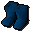 | Wizard's boots | Slightly magical boots. | 200 | yes |  | Wear |
| 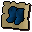 | cert_boots_wizard |  | 0 |  |  |  |
| 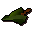 | Robin hood hat | Endorsed by Robin Hood. | 450 | yes |  | Wear |
| 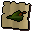 | cert_robinhoodhat |  | 0 |  |  |  |
|  | Black platebody (t) | Black plate body with trim. | 3840 |  |  | Wear |
| 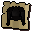 | cert_black_platebody_trim |  | 0 |  |  |  |
|  | Black platelegs (t) | Black platelegs with trim. | 1920 |  |  | Wear |
| 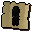 | cert_black_platelegs_trim |  | 0 |  |  |  |
| 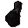 | Black full helm (t) | Black full helm with trim. | 1056 |  |  | Wear |
| 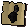 | cert_black_full_helm_trim |  | 0 |  |  |  |
|  | Black kiteshield (t) | Black kiteshield with trim. | 1632 |  |  | Wear |
| 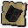 | cert_black_kiteshield_trim |  | 0 |  |  |  |
|  | Black platebody (g) | Black platebody with gold trim. | 3840 |  |  | Wear |
| 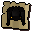 | cert_black_platebody_gold |  | 0 |  |  |  |
| 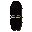 | Black platelegs (g) | Black platelegs with gold trim. | 1920 |  |  | Wear |
| 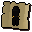 | cert_black_platelegs_gold |  | 0 |  |  |  |
| 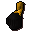 | Black full helm (g) | Black full helm with gold trim. | 1056 |  |  | Wear |
| 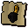 | cert_black_full_helm_gold |  | 0 |  |  |  |
|  | Black kiteshield (g) | Black kiteshield with gold trim. | 1632 |  |  | Wear |
| 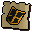 | cert_black_kiteshield_gold |  | 0 |  |  |  |
|  | Adam platebody (t) | Adamant platebody with trim. | 12800 |  |  | Wear |
| 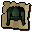 | cert_adamant_platebody_trim |  | 0 |  |  |  |
| 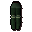 | Adam platelegs (t) | Adamant platelegs with trim. | 6400 |  |  | Wear |
|  | cert_adamant_platelegs_trim |  | 0 |  |  |  |
| 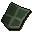 | Adam kiteshield (t) | Adamant kiteshield with trim. | 5440 |  |  | Wear |
| 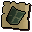 | cert_adamant_kiteshield_trim |  | 0 |  |  |  |
| 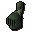 | Adam full helm (t) | Adamant full helm with trim. | 3520 |  |  | Wear |
| 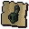 | cert_adamant_full_helm_trim |  | 0 |  |  |  |
|  | Adam platebody (g) | Adamant platebody with gold trim. | 12800 |  |  | Wear |
| 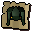 | cert_adamant_platebody_gold |  | 0 |  |  |  |
| 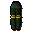 | Adam platelegs (g) | Adamant platelegs with gold trim. | 6400 |  |  | Wear |
| 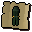 | cert_adamant_platelegs_gold |  | 0 |  |  |  |
|  | Adam kiteshield (g) | Adamant kiteshield with gold trim. | 5440 |  |  | Wear |
| 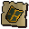 | cert_adamant_kiteshield_gold |  | 0 |  |  |  |
|  | Adam full helm (g) | Adamant full helm with gold trim. | 3520 |  |  | Wear |
| 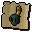 | cert_adamant_full_helm_gold |  | 0 |  |  |  |
|  | Rune platebody (g) | Rune plate body with gold trim. | 65000 |  |  | Wear |
|  | cert_rune_platebody_gold |  | 0 |  |  |  |
|  | Rune platelegs (g) | Rune platelegs with gold trim. | 64000 |  |  | Wear |
|  | cert_rune_platelegs_gold |  | 0 |  |  |  |
|  | Rune full helm (g) | Rune full helm with gold trim. | 35200 |  |  | Wear |
|  | cert_rune_full_helm_gold |  | 0 |  |  |  |
|  | Rune kiteshield (g) | Rune kiteshield with gold trim. | 54400 |  |  | Wear |
|  | cert_rune_kiteshield_gold |  | 0 |  |  |  |
|  | Rune platebody (t) | Rune platebody with trim. | 65000 |  |  | Wear |
|  | cert_rune_platebody_trim |  | 0 |  |  |  |
|  | Rune platelegs (t) | Rune platelegs with trim. | 64000 |  |  | Wear |
|  | cert_rune_platelegs_trim |  | 0 |  |  |  |
|  | Rune full helm (t) | Rune full helm with trim. | 35200 |  |  | Wear |
|  | cert_rune_full_helm_trim |  | 0 |  |  |  |
|  | Rune kiteshield (t) | Rune kiteshield with trim. | 54400 |  |  | Wear |
|  | cert_rune_kiteshield_trim |  | 0 |  |  |  |
|  | Highwayman mask | Your money or your life! | 40 | yes |  | Wear |
|  | cert_highwaymanmask |  | 0 |  |  |  |
|  | Berret | Pouvez-vous parler francais? | 80 | yes |  | Wear |
|  | cert_berret_blue |  | 0 |  |  |  |
|  | Berret | Pouvez-vous parler francais? | 80 | yes |  | Wear |
|  | cert_berret_black |  | 0 |  |  |  |
|  | Berret | Pouvez-vous parler francais? | 80 | yes |  | Wear |
|  | cert_berret_white |  | 0 |  |  |  |
|  | Cavalier | All for one and one for all! | 200 | yes |  | Wear |
|  | cert_cavalier_brown |  | 0 |  |  |  |
|  | Cavalier | All for one and one for all! | 200 | yes |  | Wear |
|  | cert_cavalier_dark |  | 0 |  |  |  |
|  | Cavalier | All for one and one for all! | 200 | yes |  | Wear |
|  | cert_cavalier_black |  | 0 |  |  |  |
|  | Headband | A minimilist's hat. | 40 | yes |  | Wear |
|  | cert_headband_red |  | 0 |  |  |  |
|  | Headband | A minimilist's hat. | 40 | yes |  | Wear |
|  | cert_headband_black |  | 0 |  |  |  |
|  | Headband | A minimilist's hat. | 40 | yes |  | Wear |
|  | cert_headband_brown |  | 0 |  |  |  |
|  | Pirate's hat | Shiver me timbers! | 180 | yes |  | Wear |
|  | cert_piratehat |  | 0 |  |  |  |
|  | Zamorak platebody | Rune platebody in the colours of Zamorak. | 65000 |  |  | Wear |
|  | cert_rune_platebody_zamorak |  | 0 |  |  |  |
|  | Zamorak platelegs | Rune platelegs in the colours of zamorak. | 64000 |  |  | Wear |
|  | cert_rune_platelegs_zamorak |  | 0 |  |  |  |
|  | Zamorak full helm | Rune full helm in the colours of Zamorak. | 35200 |  |  | Wear |
|  | cert_rune_full_helm_zamorak |  | 0 |  |  |  |
|  | Zamorak kiteshield | Rune kiteshield in the colours of Zamorak. | 54400 |  |  | Wear |
|  | cert_rune_kiteshield_zamorak |  | 0 |  |  |  |
|  | Saradomin plate | Rune platebody in the colours of Saradomin. | 65000 |  |  | Wear |
|  | cert_rune_platebody_saradomin |  | 0 |  |  |  |
|  | Saradomin legs | Rune platelegs in the colours of Saradomin. | 64000 |  |  | Wear |
|  | cert_rune_platelegs_saradomin |  | 0 |  |  |  |
|  | Saradomin full | Rune full helm in the colours of Saradomin. | 35200 |  |  | Wear |
|  | cert_rune_full_helm_saradomin |  | 0 |  |  |  |
|  | Saradomin kite | Rune kiteshield in the colours of Saradomin. | 54400 |  |  | Wear |
|  | cert_rune_kiteshield_saradomin |  | 0 |  |  |  |
|  | Guthix platebody | Rune plate body in the colours of Guthix. | 65000 |  |  | Wear |
|  | cert_rune_platebody_guthix |  | 0 |  |  |  |
|  | Guthix platelegs | Rune plate legs in the colours of Guthix. | 64000 |  |  | Wear |
|  | cert_rune_platelegs_guthix |  | 0 |  |  |  |
|  | Guthix full helm | A rune full face helmet in the colours of Guthix. | 35200 |  |  | Wear |
|  | cert_rune_full_helm_guthix |  | 0 |  |  |  |
|  | Guthix kiteshield | Rune kiteshield in the colours of Guthix. | 54400 |  |  | Wear |
|  | cert_rune_kiteshield_guthix |  | 0 |  |  |  |
|  | Clue scroll | A clue! | 1 | yes |  | Read |
|  | Clue scroll | A clue! | 1 | yes |  | Read |
|  | Clue scroll | A clue! | 1 | yes |  | Read |
|  | Clue scroll | A clue! | 1 | yes |  | Read |
|  | Clue scroll | A clue! | 1 | yes |  | Read |
|  | Clue scroll | A clue! | 1 | yes |  | Read |
|  | Clue scroll | A clue! | 1 | yes |  | Read |
|  | Clue scroll | A clue! | 1 | yes |  | Read |
|  | Clue scroll | A clue! | 1 | yes |  | Read |
|  | Clue scroll | A clue! | 1 | yes |  | Read |
|  | Clue scroll | A clue! | 1 | yes |  | Read |
|  | Clue scroll | A clue! | 1 | yes |  | Read |
|  | Clue scroll | A clue! | 1 | yes |  | Read |
|  | Clue scroll | A clue! | 1 | yes |  | Read |
|  | Clue scroll | A clue! | 1 | yes |  | Read |
|  | Clue scroll | A clue! | 1 | yes |  | Read |
|  | Clue scroll | A clue! | 1 | yes |  | Read |
|  | Clue scroll | A clue! | 1 | yes |  | Read |
|  | Clue scroll | A clue! | 1 | yes |  | Read |
|  | Clue scroll | A clue! | 1 | yes |  | Read |
|  | Clue scroll | A clue! | 1 | yes |  | Read |
|  | Clue scroll | A clue! | 1 | yes |  | Read |
|  | Clue scroll | A clue! | 1 | yes |  | Read |
|  | Clue scroll | A clue! | 1 | yes |  | Read |
|  | Clue scroll | A clue! | 1 | yes |  | Read |
|  | Clue scroll | A clue! | 1 | yes |  | Read |
|  | Clue scroll | A clue! | 1 | yes |  | Read |
|  | Clue scroll | A clue! | 1 | yes |  | Read |
|  | Clue scroll | A clue! | 1 | yes |  | Read |
|  | Clue scroll | A clue! | 1 | yes |  | Read |
|  | Clue scroll | A clue! | 1 | yes |  | Read |
|  | Clue scroll | A clue! | 1 | yes |  | Read |
|  | Clue scroll | A clue! | 1 | yes |  | Read |
|  | Clue scroll | A clue! | 1 | yes |  | Read |
|  | Clue scroll | A clue! | 1 | yes |  | Read |
|  | Clue scroll | A clue! | 1 | yes |  | Read |
|  | Clue scroll | Part of the world map, but where? | 1 | yes |  | Read |
|  | Casket | I hope there's treasure in it. | 50 | yes |  | Open |
|  | Casket | I hope there's treasure in it. | 50 | yes | yes | Open |
|  | Clue scroll | Part of the world map, but where? | 1 | yes |  | Read |
|  | Casket | I hope there's treasure in it. | 50 | yes |  | Open |
|  | Casket | I hope there's treasure in it. | 50 | yes | yes | Open |
|  | Clue scroll | Part of the world map, but where? | 1 | yes |  | Read |
|  | Casket | I hope there's treasure in it. | 50 | yes |  | Open |
|  | Casket | I hope there's treasure in it. | 50 | yes | yes | Open |
|  | Clue scroll | Part of the world map, but where? | 1 | yes |  | Read |
|  | Clue scroll | Perhaps someone at the observatory can teach me to navigate? | 1 | yes |  | Read |
|  | Casket | I hope there's treasure in it. | 50 | yes |  | Open |
|  | Clue scroll | Perhaps someone at the observatory can teach me to navigate? | 1 | yes |  | Read |
|  | Casket | I hope there's treasure in it. | 50 | yes |  | Open |
|  | Clue scroll | Perhaps someone at the observatory can teach me to navigate? | 1 | yes |  | Read |
|  | Casket | I hope there's treasure in it. | 50 | yes |  | Open |
|  | Clue scroll | Perhaps someone at the observatory can teach me to navigate? | 1 | yes |  | Read |
|  | Casket | I hope there's treasure in it. | 50 | yes |  | Open |
|  | Clue scroll | Perhaps someone at the observatory can teach me to navigate? | 1 | yes |  | Read |
|  | Casket | I hope there's treasure in it. | 50 | yes |  | Open |
|  | Clue scroll | Perhaps someone at the observatory can teach me to navigate? | 1 | yes |  | Read |
|  | Casket | I hope there's treasure in it. | 50 | yes |  | Open |
|  | Clue scroll | Perhaps someone at the observatory can teach me to navigate? | 1 | yes |  | Read |
|  | Casket | I hope there's treasure in it. | 50 | yes |  | Open |
|  | Clue scroll | Perhaps someone at the observatory can teach me to navigate? | 1 | yes |  | Read |
|  | Casket | I hope there's treasure in it. | 50 | yes |  | Open |
|  | Clue scroll | Perhaps someone at the observatory can teach me to navigate? | 1 | yes |  | Read |
|  | Casket | I hope there's treasure in it. | 50 | yes |  | Open |
|  | Clue scroll | Perhaps someone at the observatory can teach me to navigate? | 1 | yes |  | Read |
|  | Casket | I hope there's treasure in it. | 50 | yes |  | Open |
|  | Clue scroll | Perhaps someone at the observatory can teach me to navigate? | 1 | yes |  | Read |
|  | Casket | I hope there's treasure in it. | 50 | yes |  | Open |
|  | Clue scroll | Perhaps someone at the observatory can teach me to navigate? | 1 | yes |  | Read |
|  | Casket | I hope there's treasure in it. | 50 | yes |  | Open |
|  | Clue scroll | Perhaps someone at the observatory can teach me to navigate? | 1 | yes |  | Read |
|  | Casket | I hope there's treasure in it. | 50 | yes |  | Open |
|  | Sliding piece |  | 0 | yes |  | Move |
|  | Sliding piece |  | 0 | yes |  | Move |
|  | Sliding piece |  | 0 | yes |  | Move |
|  | Sliding piece |  | 0 | yes |  | Move |
|  | Sliding piece |  | 0 | yes |  | Move |
|  | Sliding piece |  | 0 | yes |  | Move |
|  | Sliding piece |  | 0 | yes |  | Move |
|  | Sliding piece |  | 0 | yes |  | Move |
|  | Sliding piece |  | 0 | yes |  | Move |
|  | Sliding piece |  | 0 | yes |  | Move |
|  | Sliding piece |  | 0 | yes |  | Move |
|  | Sliding piece |  | 0 | yes |  | Move |
|  | Sliding piece |  | 0 | yes |  | Move |
|  | Sliding piece |  | 0 | yes |  | Move |
|  | Sliding piece |  | 0 | yes |  | Move |
|  | Sliding piece |  | 0 | yes |  | Move |
|  | Sliding piece |  | 0 | yes |  | Move |
|  | Sliding piece |  | 0 | yes |  | Move |
|  | Sliding piece |  | 0 | yes |  | Move |
|  | Sliding piece |  | 0 | yes |  | Move |
|  | Sliding piece |  | 0 | yes |  | Move |
|  | Sliding piece |  | 0 | yes |  | Move |
|  | Sliding piece |  | 0 | yes |  | Move |
|  | Sliding piece |  | 0 | yes |  | Move |
|  | Clue scroll | A clue! | 1 | yes |  | Read |
|  | Clue scroll | A clue! | 1 | yes |  | Read |
|  | Casket | I hope there's treasure in it. | 50 | yes |  | Open |
|  | Clue scroll | A clue! | 1 | yes |  | Read |
|  | Casket | I hope there's treasure in it. | 50 | yes |  | Open |
|  | Clue scroll | A clue! | 1 | yes |  | Read |
|  | Casket | I hope there's treasure in it. | 50 | yes |  | Open |
|  | Clue scroll | A clue! | 1 | yes |  | Read |
|  | Casket | I hope there's treasure in it. | 50 | yes |  | Open |
|  | Clue scroll | A clue! | 1 | yes |  | Read |
|  | Clue scroll | A clue! | 1 | yes |  | Read |
|  | Casket | I hope there's treasure in it. | 50 | yes |  | Open |
|  | Clue scroll | A clue! | 1 | yes |  | Read |
|  | Clue scroll | A clue! | 1 | yes |  | Read |
|  | Casket | I hope there's treasure in it. | 50 | yes |  | Open |
|  | Clue scroll | A clue! | 1 | yes |  | Read |
|  | Casket | I hope there's treasure in it. | 50 | yes |  | Open |
|  | Clue scroll | A clue! | 1 | yes |  | Read |
|  | Casket | I hope there's treasure in it. | 50 | yes |  | Open |
|  | Clue scroll | A clue! | 1 | yes |  | Read |
|  | Clue scroll | A clue! | 1 | yes |  | Read |
|  | Clue scroll | A clue! | 1 | yes |  | Read |
|  | Puzzle box | I need to solve this! | 100 | yes |  | Open |
|  | Clue scroll | A clue! | 1 | yes |  | Read |
|  | Clue scroll | A clue! | 1 | yes |  | Read |
|  | Puzzle box | I need to solve this! | 100 | yes |  | Open |
|  | Clue scroll | A clue! | 1 | yes |  | Read |
|  | Puzzle box | I need to solve this! | 100 | yes |  | Open |
|  | Clue scroll | Perhaps someone at the observatory can teach me to navigate? | 1 | yes |  | Read |
|  | Casket | I hope there's treasure in it. | 50 | yes |  | Open |
|  | Clue scroll | Perhaps someone at the observatory can teach me to navigate? | 1 | yes |  | Read |
|  | Casket | I hope there's treasure in it. | 50 | yes |  | Open |
|  | Clue scroll | Perhaps someone at the observatory can teach me to navigate? | 1 | yes |  | Read |
|  | Casket | I hope there's treasure in it. | 50 | yes |  | Open |
|  | Clue scroll | Perhaps someone at the observatory can teach me to navigate? | 1 | yes |  | Read |
|  | Casket | I hope there's treasure in it. | 50 | yes |  | Open |
|  | Clue scroll | Perhaps someone at the observatory can teach me to navigate? | 1 | yes |  | Read |
|  | Casket | I hope there's treasure in it. | 50 | yes |  | Open |
|  | Clue scroll | Perhaps someone at the observatory can teach me to navigate? | 1 | yes |  | Read |
|  | Casket | I hope there's treasure in it. | 50 | yes |  | Open |
|  | Clue scroll | Perhaps someone at the observatory can teach me to navigate? | 1 | yes |  | Read |
|  | Casket | I hope there's treasure in it. | 50 | yes |  | Open |
|  | Clue scroll | Perhaps someone at the observatory can teach me to navigate? | 1 | yes |  | Read |
|  | Casket | I hope there's treasure in it. | 50 | yes |  | Open |
|  | Clue scroll | Perhaps someone at the observatory can teach me to navigate? | 1 | yes |  | Read |
|  | Casket | I hope there's treasure in it. | 50 | yes |  | Open |
|  | Clue scroll | Perhaps someone at the observatory can teach me to navigate? | 1 | yes |  | Read |
|  | Casket | I hope there's treasure in it. | 50 | yes |  | Open |
|  | Clue scroll | Perhaps someone at the observatory can teach me to navigate? | 1 | yes |  | Read |
|  | Casket | I hope there's treasure in it. | 50 | yes |  | Open |
|  | Clue scroll | Perhaps someone at the observatory can teach me to navigate? | 1 | yes |  | Read |
|  | Casket | I hope there's treasure in it. | 50 | yes |  | Open |
|  | Clue scroll | Perhaps someone at the observatory can teach me to navigate? | 1 | yes |  | Read |
|  | Casket | I hope there's treasure in it. | 50 | yes |  | Open |
|  | Clue scroll | Part of the world map, but where? | 1 | yes |  | Read |
|  | Casket | I hope there's treasure in it. | 50 | yes |  | Open |
|  | Clue scroll | Part of the world map, but where? | 1 | yes |  | Read |
|  | Casket | I hope there's treasure in it. | 50 | yes |  | Open |
|  | Clue scroll | A clue! | 1 | yes |  | Read |
|  | Key | A key to unlock a treasure chest. | 1 | yes |  |  |
|  | Clue scroll | A clue! | 1 | yes |  | Read |
|  | Key | A key to some drawers. | 1 | yes |  |  |
|  | Clue scroll | A clue! | 1 | yes |  | Read |
|  | Key | A key to some drawers. | 1 | yes |  |  |
|  | Clue scroll | A clue! | 1 | yes |  | Read |
|  | Key | A key to some drawers. | 1 | yes |  |  |
|  | Clue scroll | A clue! | 1 | yes |  | Read |
|  | Key | A key to some drawers. | 1 | yes |  |  |
|  | Clue scroll | A clue! | 1 | yes |  | Read |
|  | Challenge scroll | I need to answer this correctly. | 1 | yes |  | Read |
|  | Clue scroll | A clue! | 1 | yes |  | Read |
|  | Challenge scroll | I need to answer this correctly. | 1 | yes |  | Read |
|  | Clue scroll | A clue! | 1 | yes |  | Read |
|  | Challenge scroll | I need to answer this correctly. | 1 | yes |  | Read |
|  | Clue scroll | A clue! | 1 | yes |  | Read |
|  | Clue scroll | A clue! | 1 | yes |  | Read |
|  | Clue scroll | A clue! | 1 | yes |  | Read |
|  | Challenge scroll | I need to answer this correctly. | 1 | yes |  | Read |
|  | Clue scroll | A clue! | 1 | yes |  | Read |
|  | Challenge scroll | I need to answer this correctly. | 1 | yes |  | Read |
|  | Clue scroll | A clue! | 1 | yes |  | Read |
|  | Challenge scroll | I need to answer this correctly. | 1 | yes |  | Read |
|  | Clue scroll | A clue! | 1 | yes |  | Read |
|  | Clue scroll | A clue! | 1 | yes |  | Read |
|  | Clue scroll | A clue! | 1 | yes |  | Read |
|  | Clue scroll | A clue! | 1 | yes |  | Read |
|  | Wolf bones | Bones of a recently slain wolf. | 1 | yes |  | Bury |
|  | cert_wolf_bones |  | 0 |  |  |  |
|  | Wolfbone arrowtips | I can make an ogre arrow with these. | 3 | yes | yes |  |
|  | Achey tree logs | These logs are longer than normal. | 4 | yes |  | Light |
|  | cert_achey_tree_logs |  | 0 |  |  |  |
|  | Ogre arrow shaft | A wooden arrow shaft. | 1 | yes | yes |  |
|  | Flighted ogre arrow | A wooden arrow shaft with four flights attached. | 1 | yes | yes |  |
|  | Ogre arrow | A large ogre arrow with a bone tip. | 25 | yes | yes | Wield |
|  | Ogre arrow 5 |  | 0 |  | yes |  |
|  | Ogre arrow 4 |  | 0 |  | yes |  |
|  | Ogre arrow 3 |  | 0 |  | yes |  |
|  | Ogre arrow 2 |  | 0 |  | yes |  |
|  | Ogre bellows | A large pair of ogre bellows. | 0 | yes |  |  |
|  | Ogre bellows (3) | A large pair of ogre bellows, it has three loads of swamp gas in it. | 0 | yes |  |  |
|  | Ogre bellows (2) | A large pair of ogre bellows, it has two loads of swamp gas in it. | 0 | yes |  |  |
|  | Ogre bellows (1) | A large pair of ogre bellows, it has one load of swamp gas in it. | 0 | yes |  |  |
|  | Bloated toad | An inflated toad. | 0 | yes |  | Drop, Release All, Release |
|  | Raw chompy | I need to cook this first. | 5 | yes |  |  |
|  | cert_raw_chompy |  | 0 |  |  |  |
|  | Cooked chompy | It might look delicious to an ogre. | 10 | yes |  | Eat |
|  | cert_cooked_chompy |  | 0 |  |  |  |
|  | Ruined chompy | It's really burnt. | 0 | yes |  |  |
|  | cert_ruined_chompy |  | 0 |  |  |  |
|  | Seasoned chompy | It has been deliciously seasoned to taste wonderful for ogres. | 10 | yes |  |  |
|  | Ogre bow | More powerful than a normal bow, useful against large game birds. | 500 | yes |  | Wield, Check kills |
|  | Chompy bird obj |  | 0 |  |  |  |
|  | cert_chompy_bird_obj |  | 0 |  |  |  |
|  | Battered book | A very thickley bound book. | 10 | yes |  | Read |
|  | Battered key | An old battered key. | 1 | yes |  |  |
|  | A stone bowl | This is an empty stone bowl. | 1 | yes |  |  |
|  | A stone bowl | This is a stone bowl full of lava. | 1 | yes |  |  |
|  | Elemental shield | A magic shield. | 20 | yes |  | Wield |
|  | cert_elemental_shield |  | 0 |  |  |  |
|  | Elemental ore | This needs refining. | 5 | yes |  |  |
|  | Elemental metal | It's a bar of refined elemental ore. | 8 | yes |  |  |
|  | Boots | Very stylish! | 500 | yes |  | Wear |
|  | cert_wolfenboots_grey |  | 0 |  |  |  |
|  | Robe top | Some fine werewolf clothing. | 500 | yes |  | Wear |
|  | cert_wolfenrobetop_grey |  | 0 |  |  |  |
|  | Robe bottoms | Made by werewolves for werewolves. | 500 | yes |  | Wear |
|  | cert_wolfenrobebottom_grey |  | 0 |  |  |  |
|  | Hat | A silly pointed hat. | 500 | yes |  | Wear |
|  | cert_wolfenhat_grey |  | 0 |  |  |  |
|  | Gloves | These will keep my hands warm! | 500 |  |  | Wear |
|  | cert_wolfengloves_grey |  | 0 |  |  |  |
|  | Boots | Very stylish! | 500 | yes |  | Wear |
|  | cert_wolfenboots_crimson |  | 0 |  |  |  |
|  | Robe top | Some fine werewolf clothing. | 500 | yes |  | Wear |
|  | cert_wolfenrobetop_crimson |  | 0 |  |  |  |
|  | Robe bottoms | Made by werewolves for werewolves. | 500 | yes |  | Wear |
|  | cert_wolfenrobebottom_crimson |  | 0 |  |  |  |
|  | Hat | A silly pointed hat. | 500 | yes |  | Wear |
|  | cert_wolfenhat_crimson |  | 0 |  |  |  |
|  | Gloves | These will keep my hands warm! | 500 |  |  | Wear |
|  | cert_wolfengloves_crimson |  | 0 |  |  |  |
|  | Boots | Very stylish! | 500 | yes |  | Wear |
|  | cert_wolfenboots_tangerine |  | 0 |  |  |  |
|  | Robe top | Some fine werewolf clothing. | 500 | yes |  | Wear |
|  | cert_wolfenrobetop_tangerine |  | 0 |  |  |  |
|  | Robe bottoms | Made by werewolves for werewolves. | 500 | yes |  | Wear |
|  | cert_wolfenrobebottom_tangerine |  | 0 |  |  |  |
|  | Hat | A silly pointed hat. | 500 | yes |  | Wear |
|  | cert_wolfenhat_tangerine |  | 0 |  |  |  |
|  | Gloves | These will keep my hands warm! | 500 |  |  | Wear |
|  | cert_wolfengloves_tangerine |  | 0 |  |  |  |
|  | Boots | Very stylish! | 500 | yes |  | Wear |
|  | cert_wolfenboots_ocean |  | 0 |  |  |  |
|  | Robe top | Some fine werewolf clothing. | 500 | yes |  | Wear |
|  | cert_wolfenrobetop_ocean |  | 0 |  |  |  |
|  | Robe bottoms | Made by werewolves for werewolves. | 500 | yes |  | Wear |
|  | cert_wolfenrobebottom_ocean |  | 0 |  |  |  |
|  | Hat | A silly pointed hat. | 500 | yes |  | Wear |
|  | cert_wolfenhat_ocean |  | 0 |  |  |  |
|  | Gloves | These will keep my hands warm! | 500 |  |  | Wear |
|  | cert_wolfengloves_ocean |  | 0 |  |  |  |
|  | Boots | Very stylish! | 500 | yes |  | Wear |
|  | cert_wolfenboots_purple |  | 0 |  |  |  |
|  | Robe top | Some fine werewolf clothing. | 500 | yes |  | Wear |
|  | cert_wolfenrobetop_purple |  | 0 |  |  |  |
|  | Robe bottoms | Made by werewolves for werewolves. | 500 | yes |  | Wear |
|  | cert_wolfenrobebottom_purple |  | 0 |  |  |  |
|  | Hat | A silly pointed hat. | 500 | yes |  | Wear |
|  | cert_wolfenhat_purple |  | 0 |  |  |  |
|  | Gloves | These will keep my hands warm! | 500 |  |  | Wear |
|  | cert_wolfengloves_purple |  | 0 |  |  |  |
|  | Golden key | A replica key made of solid gold. | 300 | yes |  |  |
|  | Iron key | A key made of solid Iron. | 2 | yes |  |  |
|  | Golden tinderbox | A replica tinderbox made of solid gold. | 300 | yes |  |  |
|  | Golden candle | A replica candle made of solid gold. | 300 | yes |  |  |
|  | Golden pot | A replica pot made of solid gold. | 300 | yes |  |  |
|  | Golden hammer | A replica hammer made of solid gold. | 300 | yes |  |  |
|  | Golden feather | A replica feather made of solid gold. | 300 | yes |  |  |
|  | Golden needle | A replica needle made of solid gold. | 300 | yes |  |  |
|  | Wolfbane | A silver dagger that can prevent werewolves changing form. | 350, 300 |  |  | Wield |
|  | Bucket of water | It's a bucket of murky water. | 6 | yes |  |  |
|  | Bucket of water | It's a bucket of blessed water. | 6 | yes |  |  |
|  | Moonlight mead | A foul smelling brew. | 5 | yes |  | Drink |
|  | cert_moonlight_mead |  | 0 |  |  |  |
|  | Druid pouch | An empty druid pouch. | 5 | yes |  | Fill |
|  | Druid pouch | A druid pouch. | 5 | yes | yes | Fill |
|  | Rotten food | Erhhh! It stinks. | 1 | yes |  |  |
|  | cert_rotten_food |  | 0 |  |  |  |
|  | Silver sickle | It's a silver sickle. | 175 | yes |  | Wield |
|  | cert_silver_sickle |  | 0 |  |  |  |
|  | Silver sickle(b) | It's a blessed silver sickle. | 250 | yes |  | Wield, Cast Bloom |
|  | Washing bowl | Used for washing your face, amongst other things. | 4 | yes |  |  |
|  | cert_bowl_empty_filliman |  | 0 |  |  |  |
|  | Mirror | A small mirror, probably used for grooming. | 0 | yes |  |  |
|  | Journal | This must be Filliman Tarlocks personal journal. | 0 | yes |  | Read |
|  | Druidic spell | A druidic spell given to you freely by the spirit of Filliman Tarlock. | 0 | yes |  | Cast |
|  | A used spell | A used druidic spell given to you freely by the spirit of Filliman Tarlock. | 0 | yes |  |  |
|  | Mort myre fungi | A mushroom from the swamps of Mort Myre. | 0 | yes |  |  |
|  | cert_mortmyremushroom |  | 0 |  |  |  |
|  | Mort myre stem | A cutting from a budding branch. | 0 | yes |  |  |
|  | cert_mortmyrebuddingstem |  | 0 |  |  |  |
|  | Mort myre pear | A pear picked from a dying bush in Mort Myre. | 0 | yes |  |  |
|  | cert_mortmyrepear |  | 0 |  |  |  |
|  | Sickle mould | Used to make sickles | 10 | yes |  |  |
|  | cert_sickle_mould |  | 0 |  |  |  |
|  | Chompy bird hat | A symbol of your chompy bird hunting prowess. | 0 | yes |  | Wear |
|  | Chompy bird hat | A symbol of your chompy bird hunting prowess. | 0 | yes |  | Wear |
|  | Chompy bird hat | A symbol of your chompy bird hunting prowess. | 0 | yes |  | Wear |
|  | Chompy bird hat | A symbol of your chompy bird hunting prowess. | 0 | yes |  | Wear |
|  | Chompy bird hat | A symbol of your chompy bird hunting prowess. | 0 | yes |  | Wear |
|  | Chompy bird hat | A symbol of your chompy bird hunting prowess. | 0 | yes |  | Wear |
|  | Chompy bird hat | A symbol of your chompy bird hunting prowess. | 0 | yes |  | Wear |
|  | Chompy bird hat | A symbol of your chompy bird hunting prowess. | 0 | yes |  | Wear |
|  | Chompy bird hat | A symbol of your chompy bird hunting prowess. | 0 | yes |  | Wear |
|  | Chompy bird hat | A symbol of your chompy bird hunting prowess. | 0 | yes |  | Wear |
|  | Chompy bird hat | A symbol of your chompy bird hunting prowess. | 0 | yes |  | Wear |
|  | Chompy bird hat | A symbol of your chompy bird hunting prowess. | 0 | yes |  | Wear |
|  | Chompy bird hat | A symbol of your chompy bird hunting prowess. | 0 | yes |  | Wear |
|  | Chompy bird hat | A symbol of your chompy bird hunting prowess. | 0 | yes |  | Wear |
|  | Chompy bird hat | A symbol of your chompy bird hunting prowess. | 0 | yes |  | Wear |
|  | Chompy bird hat | A symbol of your chompy bird hunting prowess. | 0 | yes |  | Wear |
|  | Chompy bird hat | A symbol of your chompy bird hunting prowess. | 0 | yes |  | Wear |
|  | Chompy bird hat | A symbol of your chompy bird hunting prowess. | 0 | yes |  | Wear |
|  | Agility arena ticket | I can exchange these for further experience or items. | 1 | yes | yes |  |
|  | Pirate's hook | You should see the shark... | 89 | yes |  | Wear |
|  | Toadflax | A useful herb. | 48 | yes |  |  |
|  | cert_toadflax |  | 0 |  |  |  |
