<!-- GENERATED by tools/docsgen — do not edit; regenerate instead. -->

# Items — page 7 (Snapdragon – cert_dragon_chainbody)

| Icon | Name | Description | Cost | Members | Stackable | Options |
|---|---|---|---|---|---|---|
|  | Snapdragon | A powerful herb. | 59 | yes |  |  |
| 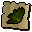 | cert_snapdragon |  | 0 |  |  |  |
| 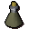 | Unfinished potion | I need another ingredient to finish this Toadflax potion. | 48 | yes |  |  |
| 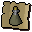 | cert_toadflaxvial |  | 0 |  |  |  |
| 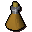 | Unfinished potion | I need another ingredient to finish this Snapdragon potion. | 59 | yes |  |  |
| 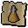 | cert_snapdragonvial |  | 0 |  |  |  |
|  | Firework | A firework potion, this'll look pretty! | 60 | yes |  | hidden, Light |
| 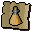 | cert_firework |  | 0 |  |  |  |
|  | Energy potion(4) | 4 doses of energy potion. | 146 | yes |  | Drink |
| 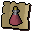 | cert_4dose1energy |  | 0 |  |  |  |
|  | Energy potion(3) | 3 doses of energy potion. | 110 | yes |  | Drink |
| 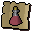 | cert_3dose1energy |  | 0 |  |  |  |
| 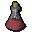 | Energy potion(2) | 2 doses of energy potion. | 72 | yes |  | Drink |
| 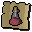 | cert_2dose1energy |  | 0 |  |  |  |
| 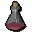 | Energy potion(1) | 1 dose of energy potion. | 36 | yes |  | Drink |
| 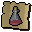 | cert_1dose1energy |  | 0 |  |  |  |
|  | Super energy(4) | 4 doses of super energy potion. | 300 | yes |  | Drink |
|  | cert_4dose2energy |  | 0 |  |  |  |
| 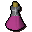 | Super energy(3) | 3 doses of super energy potion. | 230 | yes |  | Drink |
|  | cert_3dose2energy |  | 0 |  |  |  |
| 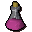 | Super energy(2) | 2 doses of super energy potion. | 160 | yes |  | Drink |
| 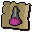 | cert_2dose2energy |  | 0 |  |  |  |
|  | Super energy(1) | 1 dose of super energy potion. | 90 | yes |  | Drink |
|  | cert_1dose2energy |  | 0 |  |  |  |
| 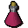 | Super restore(4) | 4 doses of super restore potion. | 300 | yes |  | Drink |
|  | cert_4dose2restore |  | 0 |  |  |  |
|  | Super restore(3) | 3 doses of super restore potion. | 240 | yes |  | Drink |
| 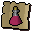 | cert_3dose2restore |  | 0 |  |  |  |
|  | Super restore(2) | 2 doses of super restore potion. | 180 | yes |  | Drink |
|  | cert_2dose2restore |  | 0 |  |  |  |
| 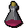 | Super restore(1) | 1 dose of super restore potion. | 120 | yes |  | Drink |
| 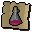 | cert_1dose2restore |  | 0 |  |  |  |
|  | Agility potion(4) | 4 doses of agility potion. | 200 | yes |  | Drink |
|  | cert_4dose1agility |  | 0 |  |  |  |
|  | Agility potion(3) | 3 doses of agility potion. | 150 | yes |  | Drink |
| 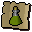 | cert_3dose1agility |  | 0 |  |  |  |
| 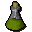 | Agility potion(2) | 2 doses of agility potion. | 50 | yes |  | Drink |
| 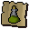 | cert_2dose1agility |  | 0 |  |  |  |
| 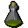 | Agility potion(1) | 1 dose of agility potion. | 50 | yes |  | Drink |
|  | cert_1dose1agility |  | 0 |  |  |  |
| 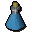 | Magic potion(4) | 4 doses of magic potion. | 300 | yes |  | Drink |
|  | cert_4dose1magic |  | 0 |  |  |  |
| 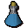 | Magic potion(3) | 3 doses of magic potion. | 250 | yes |  | Drink |
| 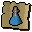 | cert_3dose1magic |  | 0 |  |  |  |
| 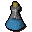 | Magic potion(2) | 2 doses of magic potion. | 200 | yes |  | Drink |
|  | cert_2dose1magic |  | 0 |  |  |  |
|  | Magic potion(1) | 1 dose of magic potion. | 150 | yes |  | Drink |
| 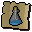 | cert_1dose1magic |  | 0 |  |  |  |
|  | cert_piratehook |  | 0 |  |  |  |
|  | Herb | I need a closer look to identify this. | 0 | yes |  | Identify |
|  | cert_unidentified_toadflax |  | 0 |  |  |  |
|  | Herb | I need a closer look to identify this. | 0 | yes |  | Identify |
|  | cert_unidentified_snapdragon |  | 0 |  |  |  |
|  | Lava battlestaff | It's a slightly magical stick. | 17000 | yes |  | Wield |
|  | Mystic lava staff | It's a slightly magical stick. | 45000 | yes |  | Wield |
| 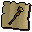 | cert_lava_battlestaff |  | 0 |  |  |  |
|  | cert_mystic_lava_staff |  | 0 |  |  |  |
|  | Mime mask | A mime would wear this. | 0 |  |  | Wear |
|  | Mime top | A mime would wear this. | 0 |  |  | Wear |
|  | Mime legs | A mime would wear these. | 0 |  |  | Wear |
|  | Mime gloves | A mime would wear these. | 0 |  |  | Wear |
|  | Mime boots | A mime would wear these. | 0 |  |  | Wear |
|  | Strange box | It seems to be humming... | 0 |  | yes | Open |
| 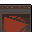 | Cube part |  | 0 |  |  |  |
|  | cert_macro_cube_redtriangle |  | 0 |  |  |  |
|  | Cube part |  | 0 |  |  |  |
|  | cert_macro_cube_bluetriangle |  | 0 |  |  |  |
| 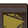 | Cube part |  | 0 |  |  |  |
| 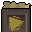 | cert_macro_cube_yellowtriangle |  | 0 |  |  |  |
|  | Cube part |  | 0 |  |  |  |
| 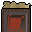 | cert_macro_cube_redsquare |  | 0 |  |  |  |
|  | Cube part |  | 0 |  |  |  |
|  | cert_macro_cube_bluesquare |  | 0 |  |  |  |
|  | Cube part |  | 0 |  |  |  |
|  | cert_macro_cube_yellowsquare |  | 0 |  |  |  |
|  | Cube part |  | 0 |  |  |  |
|  | cert_macro_cube_redcircle |  | 0 |  |  |  |
|  | Cube part |  | 0 |  |  |  |
|  | cert_macro_cube_bluecircle |  | 0 |  |  |  |
| 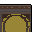 | Cube part |  | 0 |  |  |  |
| 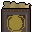 | cert_macro_cube_yellowcircle |  | 0 |  |  |  |
| 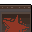 | Cube part |  | 0 |  |  |  |
| 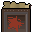 | cert_macro_cube_redstar |  | 0 |  |  |  |
| 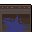 | Cube part |  | 0 |  |  |  |
|  | cert_macro_cube_bluestar |  | 0 |  |  |  |
| 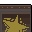 | Cube part |  | 0 |  |  |  |
| 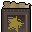 | cert_macro_cube_yellowstar |  | 0 |  |  |  |
|  | Cube part |  | 0 |  |  |  |
| 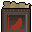 | cert_macro_cube_redhalfmoon |  | 0 |  |  |  |
|  | Cube part |  | 0 |  |  |  |
|  | cert_macro_cube_bluehalfmoon |  | 0 |  |  |  |
| 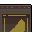 | Cube part |  | 0 |  |  |  |
|  | cert_macro_cube_yellowhalfmoon |  | 0 |  |  |  |
|  | Black dart | A deadly throwing dart with a black tip. | 18 | yes | yes | Wield |
| 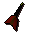 | Black dart(p) | A deadly poisoned dart with a black tip. | 18 | yes | yes | Wield |
| 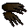 | Bronze claws | A set of fighting claws. | 15 | yes |  | Wear |
| 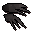 | Iron claws | A set of fighting claws. | 50 | yes |  | Wear |
|  | Steel claws | A set of fighting claws. | 175 | yes |  | Wear |
|  | Black claws | A set of fighting claws. | 360 | yes |  | Wear |
|  | Mithril claws | A set of fighting claws. | 475 | yes |  | Wear |
| 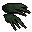 | Adamant claws | A set of fighting claws. | 1200 | yes |  | Wear |
| 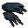 | Rune claws | A set of fighting claws. | 12000 | yes |  | Wear |
| 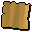 | Combination | The combination to Burthorpe Castle's equipment room. | 1 | yes |  | Read |
| 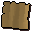 | Iou | The guard wrote the IOU on the back of some paper. | 1 | yes |  | Read |
|  | Secret way map | This map shows the secret way up to Death Plateau. | 1 | yes |  |  |
| 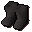 | Climbing boots | Boots made for climbing. | 12 | yes |  | Wear |
|  | cert_death_climbingboots |  | 0 |  |  |  |
|  | Spiked boots | Climbing boots with spikes. | 30 |  |  | Wear |
|  | cert_death_spikedboots |  | 0 |  |  |  |
|  | Stone ball | Place on the stone mechanism in the right order to open the door. | 1 | yes |  |  |
|  | Stone ball | Place on the stone mechanism in the right order to open the door. | 1 | yes |  |  |
|  | Stone ball | Place on the stone mechanism in the right order to open the door. | 1 | yes |  |  |
|  | Stone ball | Place on the stone mechanism in the right order to open the door. | 1 | yes |  |  |
|  | Stone ball | Place on the stone mechanism in the right order to open the door. | 1 | yes |  |  |
|  | Certificate | Entrance certificate to the Imperial Guard. | 1 | yes |  |  |
|  | cert_bronze_claws |  | 0 |  |  |  |
|  | cert_iron_claws |  | 0 |  |  |  |
|  | cert_steel_claws |  | 0 |  |  |  |
|  | cert_black_claws |  | 0 |  |  |  |
|  | cert_mithril_claws |  | 0 |  |  |  |
|  | cert_adamant_claws |  | 0 |  |  |  |
|  | cert_rune_claws |  | 0 |  |  |  |
|  | Granite shield | A solid stone shield. | 56000 | yes |  | Wear |
|  | Shaikahan bones | Large glistening bones which glow with a pale yellow aura. | 0 | yes |  | Bury |
|  | cert_tbwt_beast_bones |  | 0 |  |  |  |
|  | Jogre bones | Fairly big bones which smell distinctly of Jogre. | 0 | yes |  | Bury |
|  | cert_tbwt_jogre_bones |  | 0 |  |  |  |
|  | Burnt jogre bones | These blackened Jogre bones have been somehow burnt. | 0 | yes |  | Bury |
|  | Pasty jogre bones | Burnt Jogre bones smothered with raw Karambwanji Paste. | 0 | yes |  | Bury |
|  | Pasty jogre bones | Burnt Jogre bones smothered with cooked Karambwanji paste. | 0 | yes |  | Bury |
|  | Marinated j' bones | Burnt Jogre bones marinated in a lovely Karambwanji sauce. Perfect. | 0 | yes |  | Bury |
|  | Pasty jogre bones | Jogre bones smothered with raw Karambwanji paste. | 0 | yes |  | Bury |
|  | Pasty jogre bones | Jogre bones smothered with cooked Karambwanji paste. | 0 | yes |  | Bury |
|  | Marinated j' bones | Jogre Bones marinated in Karambwanji sauce. Not quite right. | 0 | yes |  | Bury |
|  | cert_granite_shield |  | 0 |  |  |  |
|  | Prison key | The key to the troll prison. | 1 | yes |  |  |
|  | Cell key 1 | The key to Godric's cell in the troll prison. | 1 | yes |  |  |
|  | Cell key 2 | The key to Mad Eadgar's cell in the troll prison. | 1 | yes |  |  |
|  | Potato cactus | How am I supposed to eat that?! | 0 | yes |  |  |
|  | cert_cactus_potato |  | 0 |  |  |  |
|  | Dragon chainbody | A series of connected metal rings. | 250000 | yes |  | Wear |
|  | cert_dragon_chainbody |  | 0 |  |  |  |
