<!-- GENERATED by tools/docsgen — do not edit; regenerate instead. -->

# Items — page 1 (Dwarf remains – cert_macro_broken_steel_hatchet)

| Icon | Name | Description | Cost | Members | Stackable | Options |
|---|---|---|---|---|---|---|
|  | Dwarf remains | The body of a Dwarf savaged by Goblins. | 0 | yes |  |  |
|  | Tool kit | These could be handy. | 0 | yes |  |  |
|  | Cannonball | Ammo for the Dwarf Cannon. | 5 | yes | yes |  |
| 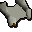 | Nulodion's notes. | Construction notes for Dwarf cannon ammo. | 0 | yes |  | Read |
| 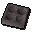 | Ammo mould | Used to make cannon ammunition. | 5 | yes |  |  |
|  | Instruction manual | An old note book. | 10 | yes |  | Read |
| 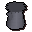 | Cannon base | The cannon is built on this. | 187500 | yes |  | Set-up |
| 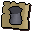 | cert_twpart1 |  | 0 |  |  |  |
|  | Cannon stand | The mounting for the multicannon. | 187500 | yes |  |  |
| 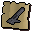 | cert_twpart2 |  | 0 |  |  |  |
| 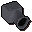 | Cannon barrels | The barrels of the multicannon. | 187500 | yes |  |  |
| 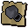 | cert_twpart3 |  | 0 |  |  |  |
| 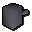 | Cannon furnace | This powers the multicannon. | 187500 | yes |  |  |
| 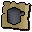 | cert_twpart4 |  | 0 |  |  |  |
|  | Railing | A metal railing replacement. | 0 | yes |  |  |
| 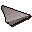 | Holy table napkin | A cloth given to me by Sir Galahad. | 10 | yes |  |  |
|  | Magic whistle | A small tin whistle. | 10 | yes |  | Blow |
|  | Grail bell | I wonder what happens when I ring it? | 10 | yes |  | Ring |
| 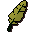 | Magic gold feather | It will point the way for me. | 2 | yes |  | Blow-on |
| 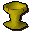 | Holy grail | A holy and powerful artifact. | 3 | yes |  |  |
|  | Cog | A cog from some machinery. | 0 | yes |  |  |
| 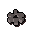 | Cog | A cog from some machinery. | 0 | yes |  |  |
| 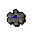 | Cog | A cog from some machinery. | 0 | yes |  |  |
|  | Cog | A cog from some machinery. | 0 | yes |  |  |
| 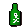 | Rat poison | Doesn't look very tasty. | 0 | yes |  |  |
| 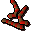 | Red vine worm | Wormy. | 0 | yes | yes |  |
|  | Fishing trophy | Hemenster fishing contest trophy. | 0 | yes |  |  |
|  | Fishing pass | Pass to the Hemenster fishing contest. | 0 | yes |  |  |
| 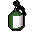 | Insect repellent | Drives away all known 6 legged creatures. | 3 | yes |  |  |
| 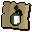 | cert_insect_repellent |  | 0 |  |  |  |
| 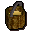 | Bucket of wax | It's a bucket of wax. | 6 | yes |  |  |
| 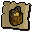 | cert_bucket_wax |  | 0 |  |  |  |
| 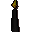 | Lit black candle | A lit spooky candle. | 3 | yes |  |  |
| 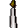 | Lit candle | A lit candle. | 3 | yes |  |  |
| 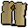 | cert_lit_candle |  | 0 |  |  |  |
| 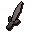 | Excalibur | This used to belong to King Arthur. | 200 | yes |  | Wield |
|  | Candle | A candle. | 3 | yes |  |  |
|  | cert_unlit_candle |  | 0 |  |  |  |
|  | Black candle | A spooky candle. | 3 | yes |  |  |
| 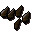 | Bronze arrowtips | I can make an arrow with these. | 1 | yes | yes |  |
| 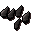 | Iron arrowtips | I can make an arrow with these. | 2 | yes | yes |  |
| 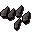 | Steel arrowtips | I can make an arrow with these. | 6 | yes | yes |  |
|  | Mithril arrowtips | I can make an arrow with these. | 16 | yes | yes |  |
|  | Adamant arrowtips | I can make an arrow with these. | 40 | yes | yes |  |
|  | Rune arrowtips | I can make an arrow with these. | 200 | yes | yes |  |
|  | Opal bolttips | I can make bolts with these. | 30 | yes | yes |  |
|  | Pearl bolttips | I can make bolts with these. | 56 | yes | yes |  |
|  | Barb bolttips | I can make bolts with these. | 95 | yes | yes |  |
| 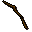 | Longbow | I need to find a string for this. | 60 | yes |  |  |
|  | cert_unstrung_longbow |  | 0 |  |  |  |
|  | Shortbow | I need to find a string for this. | 23 | yes |  |  |
| 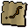 | cert_unstrung_shortbow |  | 0 |  |  |  |
|  | Arrow shaft | A wooden arrow shaft | 1 | yes | yes |  |
|  | Headless arrow | A wooden arrow shaft with flights attached | 1 | yes | yes |  |
|  | Oak shortbow | An unstrung oak shortbow, I need a bowstring for this. | 50 | yes |  |  |
| 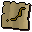 | cert_unstrung_oak_shortbow |  | 0 |  |  |  |
|  | Oak longbow | An unstrung oak longbow, I need a bowstring for this. | 80 | yes |  |  |
|  | cert_unstrung_oak_longbow |  | 0 |  |  |  |
| 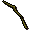 | Willow longbow | An unstrung willow longbow, I need a bowstring for this. | 160 | yes |  |  |
| 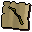 | cert_unstrung_willow_longbow |  | 0 |  |  |  |
|  | Willow shortbow | An unstrung willow shortbow, I need a bowstring for this. | 100 | yes |  |  |
|  | cert_unstrung_willow_shortbow |  | 0 |  |  |  |
|  | Maple longbow | An unstrung maple longbow, I need a bowstring for this. | 320 | yes |  |  |
|  | cert_unstrung_maple_longbow |  | 0 |  |  |  |
|  | Maple shortbow | An unstrung maple shortbow, I need a bowstring for this. | 200 | yes |  |  |
| 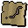 | cert_unstrung_maple_shortbow |  | 0 |  |  |  |
|  | Yew longbow | An unstrung yew longbow, I need a bowstring for this. | 640 | yes |  |  |
|  | cert_unstrung_yew_longbow |  | 0 |  |  |  |
| 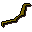 | Yew shortbow | An unstrung yew shortbow, I need a bowstring for this. | 400 | yes |  |  |
| 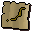 | cert_unstrung_yew_shortbow |  | 0 |  |  |  |
|  | Magic longbow | An unstrung magic longbow, I need a bowstring for this. | 1280 | yes |  |  |
| 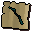 | cert_unstrung_magic_longbow |  | 0 |  |  |  |
| 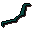 | Magic shortbow | An unstrung magic shortbow, I need a bowstring for this. | 800 | yes |  |  |
| 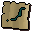 | cert_unstrung_magic_shortbow |  | 0 |  |  |  |
|  | Khazard helmet | A helmet, as worn by the minions of General Khazard. | 10 | yes |  | Wear |
| 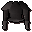 | Khazard armour | Armour, as worn by the minions of General Khazard. | 12 | yes |  | Wear |
| 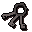 | Khazard cell keys | These keys open the cells at the Khazard fight arena. | 0 | yes |  |  |
| 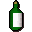 | Khali brew | A bottle of Khazard's worst brew. | 5 | yes |  |  |
|  | Ice arrows | Can only be fired with yew or magic bows. | 2 | yes | yes | Wield |
|  | Ice arrow 4 |  | 0 |  | yes |  |
| 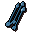 | Ice arrow 3 |  | 0 |  | yes |  |
| 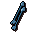 | Ice arrow 2 |  | 0 |  | yes |  |
|  | Ice arrow 5 |  | 0 |  | yes |  |
| 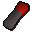 | Lever | A lever to open something perhaps? | 15 | yes |  |  |
|  | Staff of armadyl | The power in this staff causes it to vibrate gently. | 15 | yes |  |  |
|  | Shiny key | It catches the light! | 1 | yes |  |  |
| 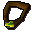 | Pendant of lucien | The amulet that Lucien gave you. | 12 | yes |  | Wear |
| 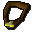 | Armadyl pendant | Yet another amulet. | 12 | yes |  | Wear |
| 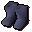 | Boots of lightness | Magic boots that make you lighter than normal. | 6 | yes |  | Wear |
|  | Boots of lightness | Magic boots that make you lighter than normal. | 6 | yes |  | Wear |
|  | Child's blanket | It's very soft! | 5 | yes |  |  |
| 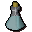 | Unfinished potion | I need another ingredient to finish this Guam potion. | 3 | yes |  | Empty |
|  | cert_guamvial |  | 0 |  |  |  |
| 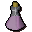 | Unfinished potion | I need another ingredient to finish this Marrentill potion. | 5 | yes |  | Empty |
| 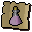 | cert_marrentillvial |  | 0 |  |  |  |
|  | Unfinished potion | I need another ingredient to finish this Tarromin potion. | 11 | yes |  | Empty |
|  | cert_tarrominvial |  | 0 |  |  |  |
|  | Unfinished potion | I need another ingredient to finish this Harralander potion. | 20 | yes |  | Empty |
|  | cert_harralandervial |  | 0 |  |  |  |
|  | Unfinished potion | I need another ingredient to finish this Ranarr potion. | 25 | yes |  | Empty |
|  | cert_ranarrvial |  | 0 |  |  |  |
|  | Unfinished potion | I need another ingredient to finish this Irit potion. | 40 | yes |  | Empty |
|  | cert_iritvial |  | 0 |  |  |  |
|  | Unfinished potion | I need another ingredient to finish this Avantoe potion. | 48 | yes |  | Empty |
|  | cert_avantoevial |  | 0 |  |  |  |
|  | Unfinished potion | I need another ingredient to finish this Kwuarm potion. | 54 | yes |  | Empty |
|  | cert_kwuarmvial |  | 0 |  |  |  |
|  | Unfinished potion | I need another ingredient to finish this Cadantine potion. | 65 | yes |  | Empty |
|  | cert_cadantinevial |  | 0 |  |  |  |
|  | Unfinished potion | I need another ingredient to finish this Dwarf Weed potion. | 70 | yes |  | Empty |
|  | cert_dwarfweedvial |  | 0 |  |  |  |
|  | Unfinished potion | I need another ingredient to finish this Torstol potion. | 25 | yes |  | Empty |
|  | cert_torstolvial |  | 0 |  |  |  |
|  | Strength potion(4) | 4 doses of strength potion. | 14 |  |  | Drink, Empty |
|  | cert_strength4 |  | 0 |  |  |  |
|  | Strength potion(3) | 3 doses of strength potion. | 13 |  |  | Drink, Empty |
|  | cert_3dose1strength |  | 0 |  |  |  |
|  | Strength potion(2) | 2 doses of strength potion. | 13 |  |  | Drink, Empty |
|  | cert_2dose1strength |  | 0 |  |  |  |
|  | Strength potion(1) | 1 dose of strength potion. | 11 |  |  | Drink, Empty |
|  | cert_1dose1strength |  | 0 |  |  |  |
|  | Attack potion(3) | 3 doses of attack potion. | 12 | yes |  | Drink, Empty |
|  | cert_3dose1attack |  | 0 |  |  |  |
|  | Attack potion(2) | 2 doses of attack potion. | 9 | yes |  | Drink, Empty |
|  | cert_2dose1attack |  | 0 |  |  |  |
|  | Attack potion(1) | 1 dose of attack potion. | 6 | yes |  | Drink, Empty |
|  | cert_1dose1attack |  | 0 |  |  |  |
|  | Restore potion(3) | 3 doses of stat restoration potion. | 88 | yes |  | Drink, Empty |
|  | cert_3dosestatrestore |  | 0 |  |  |  |
|  | Restore potion(2) | 2 doses of stat restoration potion. | 66 | yes |  | Drink, Empty |
|  | cert_2dosestatrestore |  | 0 |  |  |  |
|  | Restore potion(1) | 1 dose of stat restoration potion. | 44 | yes |  | Drink, Empty |
|  | cert_1dosestatrestore |  | 0 |  |  |  |
|  | Defence potion(3) | 3 doses of defence potion. | 120 | yes |  | Drink, Empty |
|  | cert_3dose1defense |  | 0 |  |  |  |
|  | Defence potion(2) | 2 doses of defence potion. | 90 | yes |  | Drink, Empty |
|  | cert_2dose1defense |  | 0 |  |  |  |
|  | Defence potion(1) | 1 dose of defence potion. | 60 | yes |  | Drink, Empty |
|  | cert_1dose1defense |  | 0 |  |  |  |
|  | Prayer potion(3) | 3 doses of restore prayer potion. | 152 | yes |  | Drink, Empty |
|  | cert_3doseprayerrestore |  | 0 |  |  |  |
|  | Prayer potion(2) | 2 doses of restore prayer potion. | 114 | yes |  | Drink, Empty |
|  | cert_2doseprayerrestore |  | 0 |  |  |  |
|  | Prayer potion(1) | 1 dose of restore prayer potion. | 76 | yes |  | Drink, Empty |
|  | cert_1doseprayerrestore |  | 0 |  |  |  |
|  | Super attack(3) | 3 doses of super attack potion. | 180 | yes |  | Drink, Empty |
|  | cert_3dose2attack |  | 0 |  |  |  |
|  | Super attack(2) | 2 doses of super attack potion. | 135 | yes |  | Drink, Empty |
|  | cert_2dose2attack |  | 0 |  |  |  |
|  | Super attack(1) | 1 dose of super attack potion. | 90 | yes |  | Drink, Empty |
|  | cert_1dose2attack |  | 0 |  |  |  |
|  | Fishing potion(3) | 3 doses of fishing potion. | 200 | yes |  | Drink, Empty |
|  | cert_3dosefisherspotion |  | 0 |  |  |  |
|  | Fishing potion(2) | 2 doses of fishing potion. | 150 | yes |  | Drink, Empty |
|  | cert_2dosefisherspotion |  | 0 |  |  |  |
|  | Fishing potion(1) | 1 dose of fishing potion. | 100 | yes |  | Drink, Empty |
|  | cert_1dosefisherspotion |  | 0 |  |  |  |
|  | Super strength(3) | 3 doses of super strength potion. | 220 | yes |  | Drink, Empty |
|  | cert_3dose2strength |  | 0 |  |  |  |
|  | Super strength(2) | 2 doses of super strength potion. | 165 | yes |  | Drink, Empty |
|  | cert_2dose2strength |  | 0 |  |  |  |
|  | Super strength(1) | 1 dose of super strength potion. | 110 | yes |  | Drink, Empty |
|  | cert_1dose2strength |  | 0 |  |  |  |
|  | Super defence(3) | 3 doses of super defence potion. | 264 | yes |  | Drink, Empty |
|  | cert_3dose2defense |  | 0 |  |  |  |
|  | Super defence(2) | 2 doses of super defence potion. | 198 | yes |  | Drink, Empty |
|  | cert_2dose2defense |  | 0 |  |  |  |
|  | Super defence(1) | 1 dose of super defence potion. | 132 | yes |  | Drink, Empty |
|  | cert_1dose2defense |  | 0 |  |  |  |
|  | Ranging potion(3) | 3 doses of ranging potion. | 288 | yes |  | Drink, Empty |
|  | cert_3doserangerspotion |  | 0 |  |  |  |
|  | Ranging potion(2) | 2 doses of ranging potion. | 216 | yes |  | Drink, Empty |
|  | cert_2doserangerspotion |  | 0 |  |  |  |
|  | Ranging potion(1) | 1 dose of ranging potion. | 144 | yes |  | Drink, Empty |
|  | cert_1doserangerspotion |  | 0 |  |  |  |
|  | Antipoison(3) | 3 doses of antipoison potion. | 288 | yes |  | Drink, Empty |
|  | cert_3doseantipoison |  | 0 |  |  |  |
|  | Antipoison(2) | 2 doses of antipoison potion. | 216 | yes |  | Drink, Empty |
|  | cert_2doseantipoison |  | 0 |  |  |  |
|  | Antipoison(1) | 1 dose of antipoison potion. | 144 | yes |  | Drink, Empty |
|  | cert_1doseantipoison |  | 0 |  |  |  |
|  | Superantipoison(3) | 3 doses of super antipoison potion. | 288 | yes |  | Drink, Empty |
|  | cert_3dose2antipoison |  | 0 |  |  |  |
|  | Superantipoison(2) | 2 doses of super antipoison potion. | 216 | yes |  | Drink, Empty |
|  | cert_2dose2antipoison |  | 0 |  |  |  |
|  | Superantipoison(1) | 1 dose of super antipoison potion. | 144 | yes |  | Drink, Empty |
|  | cert_1dose2antipoison |  | 0 |  |  |  |
|  | Weapon poison | For use on daggers and projectiles. | 144 | yes |  | Empty |
|  | cert_weapon_poison |  | 0 |  |  |  |
|  | Zamorak potion(3) | 3 doses of a potion of Zamorak. | 25 | yes |  | Drink, Empty |
|  | cert_3dosepotionofzamorak |  | 0 |  |  |  |
|  | Zamorak potion(2) | 2 doses of a potion of Zamorak. | 25 | yes |  | Drink, Empty |
|  | cert_2dosepotionofzamorak |  | 0 |  |  |  |
|  | Zamorak potion(1) | 1 dose of a potion of Zamorak. | 25 | yes |  | Drink, Empty |
|  | cert_1dosepotionofzamorak |  | 0 |  |  |  |
|  | Potion | This is meant to be good for spots. | 0 |  |  |  |
|  | cert_acne_potion |  | 0 |  |  |  |
|  | Poison chalice | A cup of a strange brew... | 20 | yes |  | Drink |
|  | cert_poison_chalice |  | 0 |  |  |  |
|  | Herb | I need a closer look to identify this. | 0 | yes |  | Identify |
|  | cert_unidentified_guam |  | 0 |  |  |  |
|  | Herb | I need a closer look to identify this. | 0 | yes |  | Identify |
|  | cert_unidentified_marentill |  | 0 |  |  |  |
|  | Herb | I need a closer look to identify this. | 0 | yes |  | Identify |
|  | cert_unidentified_tarromin |  | 0 |  |  |  |
|  | Herb | I need a closer look to identify this. | 0 | yes |  | Identify |
|  | cert_unidentified_harralander |  | 0 |  |  |  |
|  | Herb | I need a closer look to identify this. | 0 | yes |  | Identify |
|  | cert_unidentified_ranarr |  | 0 |  |  |  |
|  | Herb | I need a closer look to identify this. | 0 | yes |  | Identify |
|  | cert_unidentified_irit |  | 0 |  |  |  |
|  | Herb | I need a closer look to identify this. | 0 | yes |  | Identify |
|  | cert_unidentified_avantoe |  | 0 |  |  |  |
|  | Herb | I need a closer look to identify this. | 0 | yes |  | Identify |
|  | cert_unidentified_kwuarm |  | 0 |  |  |  |
|  | Herb | I need a closer look to identify this. | 0 | yes |  | Identify |
|  | cert_unidentified_cadantine |  | 0 |  |  |  |
|  | Herb | I need a closer look to identify this. | 0 | yes |  | Identify |
|  | cert_unidentified_dwarf_weed |  | 0 |  |  |  |
|  | Herb | I need a closer look to identify this. | 0 | yes |  | Identify |
|  | cert_unidentified_torstol |  | 0 |  |  |  |
|  | Eye of newt | It seems to be looking at me. | 3 |  |  |  |
|  | cert_eye_of_newt |  | 0 |  |  |  |
|  | Red spiders' eggs | Eewww. | 7 |  |  |  |
|  | cert_red_spiders_eggs |  | 0 |  |  |  |
|  | Limpwurt root | The root of a limpwurt plant. | 7 |  |  |  |
|  | cert_limpwurt_root |  | 0 |  |  |  |
|  | Vial of water | A glass vial containing water. | 2 |  |  | Empty |
|  | cert_vial_water |  | 0 |  |  |  |
|  | Vial | An empty glass vial. | 2 |  |  |  |
|  | cert_vial_empty |  | 0 |  |  |  |
|  | Snape grass | Strange spikey grass. | 10 | yes |  |  |
|  | cert_snape_grass |  | 0 |  |  |  |
|  | Pestle and mortar | I can grind things for potions in this. | 4 | yes |  |  |
|  | cert_pestle_and_mortar |  | 0 |  |  |  |
|  | Unicorn horn dust | Finely ground horn of Unicorn. | 20 | yes |  |  |
|  | cert_unicorn_horn_dust |  | 0 |  |  |  |
|  | Unicorn horn | This horn has restorative properties. | 20 | yes |  |  |
|  | cert_unicorn_horn |  | 0 |  |  |  |
|  | White berries | Sour berries, used in potions. | 10 | yes |  |  |
|  | cert_white_berries |  | 0 |  |  |  |
|  | Dragon scale dust | Finely ground scale of Dragon. | 52 | yes |  |  |
|  | cert_dragon_scale_dust |  | 0 |  |  |  |
|  | Blue dragon scale | A large shiny scale. | 50 | yes |  |  |
|  | cert_blue_dragon_scale |  | 0 |  |  |  |
|  | Wine of zamorak | An evil wine for an evil god. | 0 |  |  |  |
|  | cert_wine_of_zamorak |  | 0 |  |  |  |
|  | Jangerberries | They don't look very ripe. | 0 | yes |  | Eat |
|  | cert_jangerberries |  | 0 |  |  |  |
|  | Guam leaf | A bitter green herb. | 3 | yes |  |  |
|  | cert_guam_leaf |  | 0 |  |  |  |
|  | Marrentill | A herb used in poison cures. | 5 | yes |  |  |
|  | cert_marentill |  | 0 |  |  |  |
|  | Tarromin | A useful herb. | 11 | yes |  |  |
|  | cert_tarromin |  | 0 |  |  |  |
|  | Harralander | A useful herb. | 20 | yes |  |  |
|  | cert_harralander |  | 0 |  |  |  |
|  | Ranarr weed | A useful herb. | 25 | yes |  |  |
|  | cert_ranarr_weed |  | 0 |  |  |  |
|  | Irit leaf | A useful herb. | 40 | yes |  |  |
|  | cert_irit_leaf |  | 0 |  |  |  |
|  | Avantoe | A useful herb. | 48 | yes |  |  |
|  | cert_avantoe |  | 0 |  |  |  |
|  | Kwuarm | A powerful herb. | 54 | yes |  |  |
|  | cert_kwuarm |  | 0 |  |  |  |
|  | Cadantine | A powerful herb. | 65 | yes |  |  |
|  | cert_cadantine |  | 0 |  |  |  |
|  | Dwarf weed | A powerful herb. | 70 | yes |  |  |
|  | cert_dwarf_weed |  | 0 |  |  |  |
|  | Torstol | A powerful herb. | 75 | yes |  |  |
|  | cert_torstol |  | 0 |  |  |  |
|  | Pressure gauge | It looks like part of a machine. | 0 |  |  |  |
|  | Fish food | Keeps your pet fish strong and healthy. | 0 |  |  |  |
|  | Poison | This stuff looks nasty. | 0 |  |  |  |
|  | Poisoned fish food | Doesn't seem very nice to the poor fishes. | 0 |  |  |  |
|  | Key | A slightly smelly key. | 0 |  |  |  |
|  | Rubber tube | Its slightly charred. | 3 |  |  |  |
|  | Oil can | It's pretty full. | 3 |  |  |  |
|  | Prod | An old cattle prod. | 3 | yes |  | Equip |
|  | Feed | This looks nasty. | 3 | yes |  |  |
|  | Bones | These sheep remains are infected. | 0 | yes |  |  |
|  | Bones | These sheep remains are infected. | 0 | yes |  |  |
|  | Bones | These sheep remains are infected. | 0 | yes |  |  |
|  | Bones | These sheep remains are infected. | 0 | yes |  |  |
|  | Plague jacket | A thick heavy leather top. | 50 | yes |  | Wear |
|  | Plague trousers | A thick pair of leather trousers. | 50 | yes |  | Wear |
|  | Orange goblin mail | Armour designed to fit goblins. | 40 |  |  |  |
|  | Blue goblin mail | Armour designed to fit goblins. | 40 |  |  |  |
|  | Goblin mail | Armour designed to fit goblins. | 40 |  |  |  |
|  | cert_goblin_armour |  | 0 |  |  |  |
|  | Research package | This contains some vital research results. | 2 |  |  |  |
|  | Notes | It seems to be written in some kind of code. | 5 |  |  |  |
|  | Book on baxtorian | A book on elven history in north runescape. | 2 | yes |  | Read |
|  | A key | This will unlock something | 0 | yes |  |  |
|  | Glarial's pebble | A small pebble with elven inscription. | 0 | yes |  |  |
|  | Glarial's amulet | A bright green gem set in a necklace. | 0 | yes |  | Wear |
|  | Glarial's urn | An urn containing Glarial's ashes | 0 | yes |  |  |
|  | Glarial's urn | An empty urn made for Glarial's ashes | 0 | yes |  |  |
|  | A key | This will unlock something | 0 | yes |  |  |
|  | Mithril seeds | Magical seeds in a mithril case. | 200 | yes | yes | Plant |
|  | Rats tail | A bit of rat. | 3 |  |  |  |
|  | Lobster pot | Useful for catching lobsters. | 20 |  |  |  |
|  | cert_lobster_pot |  | 0 |  |  |  |
|  | Small fishing net | Useful for catching small fish. | 5 |  |  |  |
|  | cert_net |  | 0 |  |  |  |
|  | Big fishing net | Useful for catching lots of fish. | 20 | yes |  |  |
|  | cert_big_net |  | 0 |  |  |  |
|  | Fishing rod | Useful for catching sardine or herring. | 5 |  |  |  |
|  | cert_fishing_rod |  | 0 |  |  |  |
|  | Fly fishing rod | Useful for catching salmon or trout. | 5 |  |  |  |
|  | cert_fly_fishing_rod |  | 0 |  |  |  |
|  | Harpoon | Useful for catching really big fish. | 5 |  |  |  |
|  | cert_harpoon |  | 0 |  |  |  |
|  | Fishing bait | For use with a fishing rod. | 3 |  | yes |  |
|  | Feather | Used for fly fishing. | 2 |  | yes |  |
|  | Shrimps | Some nicely cooked fish. | 5 |  |  | Eat |
|  | cert_shrimp |  | 0 |  |  |  |
|  | Raw shrimps | I should try cooking this. | 5 |  |  |  |
|  | cert_raw_shrimp |  | 0 |  |  |  |
|  | Anchovies | Some nicely cooked fish. | 15 |  |  | Eat |
|  | cert_anchovies |  | 0 |  |  |  |
|  | Raw anchovies | I should try cooking this. | 15 |  |  |  |
|  | cert_raw_anchovies |  | 0 |  |  |  |
|  | Burnt fish | Oops! | 1 |  |  |  |
|  | cert_burntfish1 |  | 0 |  |  |  |
|  | Sardine | Some nicely cooked fish. | 10 |  |  | Eat |
|  | cert_sardine |  | 0 |  |  |  |
|  | Raw sardine | I should try cooking this. | 10 |  |  |  |
|  | cert_raw_sardine |  | 0 |  |  |  |
|  | Salmon | Some nicely cooked fish. | 50 |  |  | Eat |
|  | cert_salmon |  | 0 |  |  |  |
|  | Raw salmon | I should try cooking this. | 50 |  |  |  |
|  | cert_raw_salmon |  | 0 |  |  |  |
|  | Trout | Some nicely cooked fish. | 20 |  |  | Eat |
|  | cert_trout |  | 0 |  |  |  |
|  | Raw trout | I should try cooking this. | 20 |  |  |  |
|  | cert_raw_trout |  | 0 |  |  |  |
|  | Giant carp | Some nicely cooked fish. | 50 | yes |  | Eat |
|  | Raw giant carp | I should try cooking this. | 50 | yes |  |  |
|  | Cod | Some nicely cooked fish. | 25 | yes |  | Eat |
|  | cert_cod |  | 0 |  |  |  |
|  | Raw cod | I should try cooking this. | 25 | yes |  |  |
|  | cert_raw_cod |  | 0 |  |  |  |
|  | Burnt fish | Oops! | 1 |  |  |  |
|  | cert_burntfish2 |  | 0 |  |  |  |
|  | Raw herring | I should try cooking this. | 15 |  |  |  |
|  | cert_raw_herring |  | 0 |  |  |  |
|  | Herring | Some nicely cooked fish. | 15 |  |  | Eat |
|  | cert_herring |  | 0 |  |  |  |
|  | Raw pike | I should try cooking this. | 25 |  |  |  |
|  | cert_raw_pike |  | 0 |  |  |  |
|  | Pike | Some nicely cooked Pike. | 25 |  |  | Eat |
|  | cert_pike |  | 0 |  |  |  |
|  | Raw mackerel | I should try cooking this. | 17 | yes |  |  |
|  | cert_raw_mackerel |  | 0 |  |  |  |
|  | Mackerel | Some nicely cooked fish. | 17 | yes |  | Eat |
|  | cert_mackerel |  | 0 |  |  |  |
|  | Burnt fish | Oops! | 1 |  |  |  |
|  | cert_burntfish3 |  | 0 |  |  |  |
|  | Raw tuna | I should try cooking this. | 100 |  |  |  |
|  | cert_raw_tuna |  | 0 |  |  |  |
|  | Tuna | Wow, this is a big fish. | 100 |  |  | Eat |
|  | cert_tuna |  | 0 |  |  |  |
|  | Raw bass | I should try cooking this. | 120 | yes |  |  |
|  | cert_raw_bass |  | 0 |  |  |  |
|  | Bass | Wow, this is a big fish. | 120 | yes |  | Eat |
|  | cert_bass |  | 0 |  |  |  |
|  | Burnt fish | Oops! | 1 |  |  |  |
|  | cert_burntfish4 |  | 0 |  |  |  |
|  | Burnt fish | Oops! | 0 |  |  |  |
|  | cert_burntfish5 |  | 0 |  |  |  |
|  | Raw swordfish | I should try cooking this. | 200 |  |  |  |
|  | cert_raw_swordfish |  | 0 |  |  |  |
|  | Swordfish | I'd better be careful eating this! | 200 |  |  | Eat |
|  | cert_swordfish |  | 0 |  |  |  |
|  | Burnt swordfish | Oops! | 1 |  |  |  |
|  | cert_burnt_swordfish |  | 0 |  |  |  |
|  | Raw lobster | I should try cooking this. | 150 |  |  |  |
|  | cert_raw_lobster |  | 0 |  |  |  |
|  | Lobster | This looks tricky to eat. | 150 |  |  | Eat |
|  | cert_lobster |  | 0 |  |  |  |
|  | Burnt lobster | Oops! | 1 |  |  |  |
|  | cert_burnt_lobster |  | 0 |  |  |  |
|  | Raw shark | I should try cooking this. | 300 | yes |  |  |
|  | cert_raw_shark |  | 0 |  |  |  |
|  | Shark | I'd better be careful eating this. | 300 | yes |  | Eat |
|  | cert_shark |  | 0 |  |  |  |
|  | Burnt shark | Oops! | 1 | yes |  |  |
|  | cert_burnt_shark |  | 0 |  |  |  |
|  | Raw manta ray | A rare catch. | 500 | yes |  |  |
|  | cert_raw_mantaray |  | 0 |  |  |  |
|  | Manta ray | A rare catch. | 500 | yes |  | Eat |
|  | cert_mantaray |  | 0 |  |  |  |
|  | Burnt manta ray | Oops! | 1 | yes |  |  |
|  | cert_burnt_mantaray |  | 0 |  |  |  |
|  | Raw sea turtle | A rare catch. | 500 | yes |  |  |
|  | cert_raw_seaturtle |  | 0 |  |  |  |
|  | Sea turtle | Tasty! | 500 | yes |  | Eat |
|  | cert_seaturtle |  | 0 |  |  |  |
|  | Burnt sea turtle | Oops! | 1 | yes |  |  |
|  | cert_burnt_seaturtle |  | 0 |  |  |  |
|  | Seaweed | Slightly damp seaweed. | 2 | yes |  |  |
|  | cert_seaweed |  | 0 |  |  |  |
|  | Edible seaweed | Slightly damp seaweed. | 2 | yes |  | Eat |
|  | cert_edible_seaweed |  | 0 |  |  |  |
|  | Casket | I hope there's treasure in it. | 50 | yes |  | Open |
|  | cert_casket |  | 0 |  |  |  |
|  | Oyster | It's a rare oyster. | 200 | yes |  | Open |
|  | cert_oystershell |  | 0 |  |  |  |
|  | Empty oyster | It's empty. | 5 | yes |  |  |
|  | cert_oysterempty |  | 0 |  |  |  |
|  | Oyster pearl | I could work wonders with a chisel on this pearl. | 112 | yes |  |  |
|  | cert_smalloysterpearls |  | 0 |  |  |  |
|  | Oyster pearls | I could work wonders with a chisel on these pearls. | 1400 | yes |  |  |
|  | cert_bigoysterpearls |  | 0 |  |  |  |
|  | Ethanea | An expensive colourless liquid. | 10 | yes |  |  |
|  | Liquid honey | This isn't worth much. | 0 | yes |  |  |
|  | Sulphuric broline | It's highly poisonous. | 1 | yes |  |  |
|  | Plague sample | Probably best I don't keep this too long. | 1 | yes |  |  |
|  | Touch paper | A special kind of paper. | 1 | yes |  |  |
|  | Distillator | Apparently it distills. | 1 | yes |  |  |
|  | Lathas' amulet | Yup. It's an amulet. | 10 | yes |  | Wear |
|  | Bird feed | Birds love this stuff! | 1 | yes |  |  |
|  | Key | Opens things. | 1 | yes |  |  |
|  | Pigeon cage | It's full of pigeons. | 1 | yes |  | Open |
|  | Pigeon cage | It's empty... | 1 | yes |  |  |
|  | Priest gown | Top half of a priest suit. | 5 |  |  | Wear |
|  | cert_priest_gown |  | 0 |  |  |  |
|  | Priest gown | Bottom half of a priest suit. | 5 |  |  | Wear |
|  | cert_priest_robe |  | 0 |  |  |  |
|  | Doctors' gown | Medical looking. | 40 | yes |  | Wear |
|  | Karamjan rum | A very strong spirit brewed in Karamja. | 30 |  |  |  |
|  | Chest key | A key to One eyed Hector's chest. | 1 |  |  |  |
|  | Pirate message | Pirates don't have the best handwriting... | 1 |  |  | Read |
|  | Clay | Some hard dry clay. | 0 |  |  |  |
|  | cert_clay |  | 0 |  |  |  |
|  | Copper ore | This needs refining. | 3 |  |  |  |
|  | cert_copper_ore |  | 0 |  |  |  |
|  | Tin ore | This needs refining. | 3 |  |  |  |
|  | cert_tin_ore |  | 0 |  |  |  |
|  | Iron ore | This needs refining. | 17 |  |  |  |
|  | cert_iron_ore |  | 0 |  |  |  |
|  | Silver ore | This needs refining. | 75 |  |  |  |
|  | cert_silver_ore |  | 0 |  |  |  |
|  | Gold ore | This needs refining. | 150 |  |  |  |
|  | cert_gold_ore |  | 0 |  |  |  |
|  | 'perfect' gold ore | This needs refining. | 150 | yes |  |  |
|  | Mithril ore | This needs refining. | 162 |  |  |  |
|  | cert_mithril_ore |  | 0 |  |  |  |
|  | Adamantite ore | This needs refining. | 400 |  |  |  |
|  | cert_adamantite_ore |  | 0 |  |  |  |
|  | Runite ore | This needs refining. | 3200 |  |  |  |
|  | cert_runite_ore |  | 0 |  |  |  |
|  | Coal | Hmm a non-renewable energy source! | 45 |  |  |  |
|  | cert_coal |  | 0 |  |  |  |
|  | Barcrawl card | The official Alfred Grimhand bar crawl card. | 10 | yes |  | Read |
|  | Scorpion cage | It's empty! | 10 | yes |  |  |
|  | Scorpion cage | There is 1 scorpion inside. | 10 | yes |  |  |
|  | Scorpion cage | There are 2 scorpions inside. | 10 | yes |  |  |
|  | Scorpion cage | There are 2 scorpions inside. | 10 | yes |  |  |
|  | Scorpion cage | There is 1 scorpion inside. | 10 | yes |  |  |
|  | Scorpion cage | There are 2 scorpions inside. | 10 | yes |  |  |
|  | Scorpion cage | There is 1 scorpion inside. | 10 | yes |  |  |
|  | Scorpion cage | There are 3 scorpions inside. | 10 | yes |  |  |
|  | Strange fruit | I wonder what this tastes like? | 0 | yes |  | Eat |
|  | cert_macro_triffidfruit |  | 0 |  |  |  |
|  | Pickaxe handle | Useless without the head. | 1 |  |  |  |
|  | cert_macro_pickaxehandle |  | 0 |  |  |  |
|  | Broken pickaxe | Nurmof can fix this for me. | 0 |  |  |  |
|  | cert_macro_broken_bronze_pickaxe |  | 0 |  |  |  |
|  | Broken pickaxe | Nurmof can fix this for me. | 0 |  |  |  |
|  | cert_macro_broken_iron_pickaxe |  | 0 |  |  |  |
|  | Broken pickaxe | Nurmof can fix this for me. | 17 |  |  |  |
|  | cert_macro_broken_steel_pickaxe |  | 0 |  |  |  |
|  | Broken pickaxe | Nurmof can fix this for me. | 43 |  |  |  |
|  | cert_macro_broken_mithril_pickaxe |  | 0 |  |  |  |
|  | Broken pickaxe | Nurmof can fix this for me. | 107 |  |  |  |
|  | cert_macro_broken_adamant_pickaxe |  | 0 |  |  |  |
|  | Broken pickaxe | Nurmof can fix this for me. | 1100 |  |  |  |
|  | cert_macro_broken_rune_pickaxe |  | 0 |  |  |  |
|  | Pickaxe head | It's missing a handle. | 1 |  |  |  |
|  | cert_macro_bronze_pickaxehead |  | 0 |  |  |  |
|  | Pickaxe head | It's missing a handle. | 139 |  |  |  |
|  | cert_macro_iron_pickaxehead |  | 0 |  |  |  |
|  | Pickaxe head | It's missing a handle. | 499 |  |  |  |
|  | cert_macro_steel_pickaxehead |  | 0 |  |  |  |
|  | Pickaxe head | It's missing a handle. | 1299 |  |  |  |
|  | cert_macro_mithril_pickaxehead |  | 0 |  |  |  |
|  | Pickaxe head | It's missing a handle. | 3199 |  |  |  |
|  | cert_macro_adamant_pickaxehead |  | 0 |  |  |  |
|  | Pickaxe head | It's missing a handle. | 31999 |  |  |  |
|  | cert_macro_rune_pickaxehead |  | 0 |  |  |  |
|  | Axe handle | Useless without the head. | 1 |  |  |  |
|  | cert_macro_hatchethandle |  | 0 |  |  |  |
|  | Broken axe | Bob can fix this for me. | 0 |  |  |  |
|  | cert_macro_broken_bronze_hatchet |  | 0 |  |  |  |
|  | Broken axe | Bob can fix this for me. | 0 |  |  |  |
|  | cert_macro_broken_iron_hatchet |  | 0 |  |  |  |
|  | Broken axe | Bob can fix this for me. | 0 |  |  |  |
|  | cert_macro_broken_steel_hatchet |  | 0 |  |  |  |
