<!-- GENERATED by tools/docsgen — do not edit; regenerate instead. -->

# Items — page 3 (Coins 25 – Amulet of holthion)

| Icon | Name | Description | Cost | Members | Stackable | Options |
|---|---|---|---|---|---|---|
|  | Coins 25 |  | 0 |  | yes |  |
|  | Coins 100 |  | 0 |  | yes |  |
|  | Coins 250 |  | 0 |  | yes |  |
|  | Coins 1000 |  | 0 |  | yes |  |
|  | Coins 10000 |  | 0 |  | yes |  |
|  | White apron | A mostly clean apron. | 2 |  |  | Wear |
| 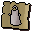 | cert_white_apron |  | 0 |  |  |  |
|  | Cape | A bright red cape. | 2 |  |  | Wear |
| 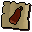 | cert_red_cape |  | 0 |  |  |  |
| 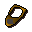 | Brass necklace | I'd prefer a gold one. | 30 |  |  | Wear |
| 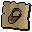 | cert_brass_necklace |  | 0 |  |  |  |
|  | Blue skirt | Leg covering favoured by women and wizards. | 2 |  |  | Wear |
|  | cert_blue_skirt |  | 0 |  |  |  |
|  | Pink skirt | A ladies skirt. | 2 |  |  | Wear |
|  | cert_pink_skirt |  | 0 |  |  |  |
|  | Black skirt | Clothing favoured by women and dark wizards. | 2 |  |  | Wear |
| 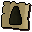 | cert_black_skirt |  | 0 |  |  |  |
|  | Wizards hat | A silly pointed hat. | 2 |  |  | Wear |
|  | cert_blackwizhat |  | 0 |  |  |  |
|  | Cape | A warm black cape. | 7 |  |  | Wear |
| 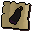 | cert_black_cape |  | 0 |  |  |  |
| 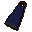 | Cape | A thick blue cape. | 32 |  |  | Wear |
| 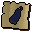 | cert_blue_cape |  | 0 |  |  |  |
| 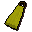 | Cape | A thick yellow cape. | 32 |  |  | Wear |
| 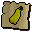 | cert_yellow_cape |  | 0 |  |  |  |
|  | Eye patch | A black piece of cloth on a string. | 2 | yes |  | Wear |
|  | cert_eye_patch |  | 0 |  |  |  |
| 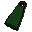 | Cape | A thick green cape. | 32 |  |  | Wear |
| 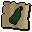 | cert_green_cape |  | 0 |  |  |  |
|  | Cape | A thick purple cape. | 32 |  |  | Wear |
| 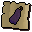 | cert_purple_cape |  | 0 |  |  |  |
| 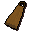 | Cape | A thick orange cape. | 32 |  |  | Wear |
| 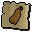 | cert_orange_cape |  | 0 |  |  |  |
|  | Robe of zamorak | A robe worn by worshippers of Zamorak. | 30 | yes |  | Wear |
| 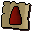 | cert_zamrobebottom |  | 0 |  |  |  |
|  | Robe of zamorak | A robe worn by worshippers of Zamorak. | 40 | yes |  | Wear |
|  | cert_zamrobetop |  | 0 |  |  |  |
| 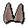 | Bunny ears | A rabbit-like adornment. | 0 |  |  | Wear |
|  | Red partyhat | A nice hat from a cracker. | 0 |  |  | Wear |
|  | cert_red_partyhat |  | 0 |  |  |  |
|  | Yellow partyhat | A nice hat from a cracker. | 0 |  |  | Wear |
|  | cert_yellow_partyhat |  | 0 |  |  |  |
|  | Blue partyhat | A nice hat from a cracker. | 0 |  |  | Wear |
|  | cert_blue_partyhat |  | 0 |  |  |  |
|  | Green partyhat | A nice hat from a cracker. | 0 |  |  | Wear |
|  | cert_green_partyhat |  | 0 |  |  |  |
|  | Purple partyhat | A nice hat from a cracker. | 0 |  |  | Wear |
|  | cert_purple_partyhat |  | 0 |  |  |  |
|  | White partyhat | A nice hat from a cracker. | 0 |  |  | Wear |
|  | cert_white_partyhat |  | 0 |  |  |  |
|  | Santa hat |  | 160 |  |  | Wear, Wear |
|  | cert_santa_hat |  | 0 |  |  |  |
|  | Cape of legends | The cape worn by members of the Legends Guild. | 450 | yes |  | Wear |
|  | Halloween mask | Aaaarrrghhh ... i'm a monster. | 15 |  |  | Wear |
| 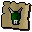 | cert_halloweenmask_green |  | 0 |  |  |  |
|  | Halloween mask | Aaaarrrghhh ... i'm a monster. | 15 |  |  | Wear |
| 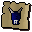 | cert_halloweenmask_blue |  | 0 |  |  |  |
|  | Halloween mask | Aaaarrrghhh ... i'm a monster. | 15 |  |  | Wear |
| 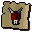 | cert_halloweenmask_red |  | 0 |  |  |  |
|  | Leather gloves | These will keep my hands warm! | 6 |  |  | Wear |
| 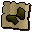 | cert_leather_gloves |  | 0 |  |  |  |
|  | Leather boots | Comfortable leather boots. | 6 |  |  | Wear |
| 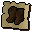 | cert_leather_boots |  | 0 |  |  |  |
| 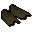 | Leather vambraces | Better than no armour! | 18 |  |  | Wear |
| 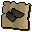 | cert_leather_vambraces |  | 0 |  |  |  |
| 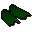 | Dragon vambraces | Made from 100% real dragon hide. | 2500 |  |  | Wear |
| 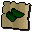 | cert_dragon_vambraces |  | 0 |  |  |  |
|  | Iron platelegs | These look pretty heavy. | 280 |  |  | Wear |
| 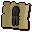 | cert_iron_platelegs |  | 0 |  |  |  |
| 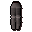 | Steel platelegs | These look pretty heavy. | 1000 |  |  | Wear |
| 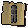 | cert_steel_platelegs |  | 0 |  |  |  |
|  | Mithril platelegs | These look pretty heavy. | 2600 |  |  | Wear |
|  | cert_mithril_platelegs |  | 0 |  |  |  |
|  | Adamant platelegs | These look pretty heavy. | 6400 |  |  | Wear |
| 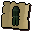 | cert_adamant_platelegs |  | 0 |  |  |  |
|  | Bronze platelegs | These look pretty heavy. | 80 |  |  | Wear |
| 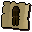 | cert_bronze_platelegs |  | 0 |  |  |  |
| 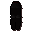 | Black platelegs | Big, black and heavy looking. | 1920 |  |  | Wear |
|  | cert_black_platelegs |  | 0 |  |  |  |
|  | Rune platelegs | These look pretty heavy. | 64000 |  |  | Wear |
|  | cert_rune_platelegs |  | 0 |  |  |  |
|  | Iron plateskirt | Designer leg protection. | 280 |  |  | Wear |
| 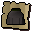 | cert_iron_plateskirt |  | 0 |  |  |  |
|  | Steel plateskirt | Designer leg protection. | 1000 |  |  | Wear |
| 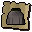 | cert_steel_plateskirt |  | 0 |  |  |  |
|  | Mithril plateskirt | Designer leg protection. | 2600 |  |  | Wear |
| 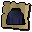 | cert_mithril_plateskirt |  | 0 |  |  |  |
|  | Bronze plateskirt | Designer leg protection. | 80 |  |  | Wear |
| 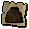 | cert_bronze_plateskirt |  | 0 |  |  |  |
|  | Black plateskirt | Big, black and heavy looking. | 1920 |  |  | Wear |
| 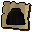 | cert_black_plateskirt |  | 0 |  |  |  |
| 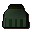 | Adamant plateskirt | Designer leg protection. | 6400 |  |  | Wear |
| 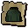 | cert_adamant_plateskirt |  | 0 |  |  |  |
|  | Rune plateskirt | Designer leg protection. | 64000 |  |  | Wear |
|  | cert_rune_plateskirt |  | 0 |  |  |  |
|  | Leather chaps | Better than no armour! | 20 |  |  | Wear |
| 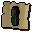 | cert_leather_chaps |  | 0 |  |  |  |
|  | Studded chaps | Those studs should provide a bit more protection. | 750 |  |  | Wear |
|  | cert_studded_chaps |  | 0 |  |  |  |
|  | Dragonhide chaps | Made from 100% real dragon hide. | 3900 |  |  | Wear |
| 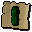 | cert_dragonhide_chaps |  | 0 |  |  |  |
|  | Iron chainbody | A series of connected metal rings. | 210 |  |  | Wear |
|  | cert_iron_chainbody |  | 0 |  |  |  |
| 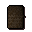 | Bronze chainbody | A series of connected metal rings. | 60 |  |  | Wear |
| 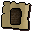 | cert_bronze_chainbody |  | 0 |  |  |  |
|  | Steel chainbody | A series of connected metal rings. | 750 |  |  | Wear |
| 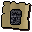 | cert_steel_chainbody |  | 0 |  |  |  |
|  | Black chainbody | A series of connected metal rings. | 1440 |  |  | Wear |
| 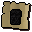 | cert_black_chainbody |  | 0 |  |  |  |
|  | Mithril chainbody | A series of connected metal rings. | 1950 |  |  | Wear |
| 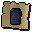 | cert_mithril_chainbody |  | 0 |  |  |  |
| 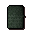 | Adamant chainbody | A series of connected metal rings. | 4800 |  |  | Wear |
| 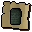 | cert_adamant_chainbody |  | 0 |  |  |  |
|  | Rune chainbody | A series of connected metal rings. | 50000 |  |  | Wear |
| 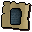 | cert_rune_chainbody |  | 0 |  |  |  |
|  | Iron platebody | Provides excellent protection. | 560 |  |  | Wear |
| 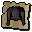 | cert_iron_platebody |  | 0 |  |  |  |
|  | Bronze platebody | Provides excellent protection. | 160 |  |  | Wear |
|  | cert_bronze_platebody |  | 0 |  |  |  |
|  | Steel platebody | Provides excellent protection. | 2000 |  |  | Wear |
|  | cert_steel_platebody |  | 0 |  |  |  |
|  | Mithril platebody | Provides excellent protection. | 5200 |  |  | Wear |
|  | cert_mithril_platebody |  | 0 |  |  |  |
|  | Adamant platebody | Provides excellent protection. | 12800 |  |  | Wear |
|  | cert_adamant_platebody |  | 0 |  |  |  |
|  | Black platebody | Provides excellent protection. | 3840 |  |  | Wear |
|  | cert_black_platebody |  | 0 |  |  |  |
|  | Rune platebody |  | 65000 |  |  | Wear |
|  | cert_rune_platebody |  | 0 |  |  |  |
|  | Leather body | Better than no armour! | 21 |  |  | Wear |
|  | cert_leather_armour |  | 0 |  |  |  |
|  | Hardleather body | Harder than normal leather. | 170 |  |  | Wear |
|  | cert_hardleather_body |  | 0 |  |  |  |
|  | Studded body | Those studs should provide a bit more protection. | 850 |  |  | Wear |
|  | cert_studded_body |  | 0 |  |  |  |
|  | Dragonhide body | Made from 100% real dragon hide. | 7800 |  |  | Wear |
|  | cert_dragonhide_body |  | 0 |  |  |  |
|  | Iron med helm | A medium sized helmet. | 84 |  |  | Wear |
|  | cert_iron_med_helm |  | 0 |  |  |  |
|  | Bronze med helm | A medium sized helmet. | 24 |  |  | Wear |
|  | cert_bronze_med_helm |  | 0 |  |  |  |
|  | Steel med helm | A medium sized helmet. | 300 |  |  | Wear |
|  | cert_steel_med_helm |  | 0 |  |  |  |
|  | Mithril med helm | A medium sized helmet. | 780 |  |  | Wear |
|  | cert_mithril_med_helm |  | 0 |  |  |  |
|  | Adamant med helm | A medium sized helmet. | 1920 |  |  | Wear |
|  | cert_adamant_med_helm |  | 0 |  |  |  |
|  | Rune med helm | A medium sized helmet. | 19200 |  |  | Wear |
|  | cert_rune_med_helm |  | 0 |  |  |  |
|  | Dragon med helm | Makes the wearer pretty intimidating. | 100000 | yes |  | Wear |
|  | cert_dragon_med_helm |  | 0 |  |  |  |
|  | Black med helm | A medium sized helmet. | 576 |  |  | Wear |
|  | cert_black_med_helm |  | 0 |  |  |  |
|  | Iron full helm | A full face helmet. | 154 |  |  | Wear |
|  | cert_iron_full_helm |  | 0 |  |  |  |
|  | Bronze full helm | A full face helmet. | 44 |  |  | Wear |
|  | cert_bronze_full_helm |  | 0 |  |  |  |
|  | Steel full helm | A full face helmet. | 550 |  |  | Wear |
|  | cert_steel_full_helm |  | 0 |  |  |  |
|  | Mithril full helm | A full face helmet. | 1430 |  |  | Wear |
|  | cert_mithril_full_helm |  | 0 |  |  |  |
|  | Adamant full helm | A full face helmet. | 3520 |  |  | Wear |
|  | cert_adamant_full_helm |  | 0 |  |  |  |
|  | Rune full helm | A full face helmet. | 35200 |  |  | Wear |
|  | cert_rune_full_helm |  | 0 |  |  |  |
|  | Black full helm | A full face helmet. | 1056 |  |  | Wear |
|  | cert_black_full_helm |  | 0 |  |  |  |
|  | Leather cowl | Better than no armour! | 24 |  |  | Wear |
|  | cert_leather_cowl |  | 0 |  |  |  |
|  | Coif | Light weight head protection. | 200 |  |  | Wear |
|  | cert_coif |  | 0 |  |  |  |
|  | Wooden shield | A solid wooden shield. | 20 |  |  | Wield |
|  | cert_wooden_shield |  | 0 |  |  |  |
|  | Bronze sq shield | A medium square shield. | 48 |  |  | Wield |
|  | cert_bronze_sq_shield |  | 0 |  |  |  |
|  | Iron sq shield | A medium square shield. | 168 |  |  | Wield |
|  | cert_iron_sq_shield |  | 0 |  |  |  |
|  | Steel sq shield | A medium square shield. | 600 |  |  | Wield |
|  | cert_steel_sq_shield |  | 0 |  |  |  |
|  | Black sq shield | A medium square shield. | 1152 |  |  | Wield |
|  | cert_black_sq_shield |  | 0 |  |  |  |
|  | Mithril sq shield | A medium square shield. | 1560 |  |  | Wield |
|  | cert_mithril_sq_shield |  | 0 |  |  |  |
|  | Adamant sq shield | A medium square shield. | 3840 |  |  | Wield |
|  | cert_adamant_sq_shield |  | 0 |  |  |  |
|  | Rune sq shield | A medium square shield. | 38400 |  |  | Wield |
|  | cert_rune_sq_shield |  | 0 |  |  |  |
|  | Dragon sq shield | An ancient and powerful looking Dragon Square shield. | 500000 | yes |  | Wield |
|  | cert_dragon_sq_shield |  | 0 |  |  |  |
|  | Bronze kiteshield | A large metal shield. | 68 |  |  | Wear |
|  | cert_bronze_kiteshield |  | 0 |  |  |  |
|  | Iron kiteshield | A large metal shield. | 238 |  |  | Wear |
|  | cert_iron_kiteshield |  | 0 |  |  |  |
|  | Steel kiteshield | A large metal shield. | 850 |  |  | Wear |
|  | cert_steel_kiteshield |  | 0 |  |  |  |
|  | Black kiteshield | A large metal shield. | 1632 |  |  | Wear |
|  | cert_black_kiteshield |  | 0 |  |  |  |
|  | Mithril kiteshield | A large metal shield. | 2210 |  |  | Wear |
|  | cert_mithril_kiteshield |  | 0 |  |  |  |
|  | Adamant kiteshield | A large metal shield. | 5440 |  |  | Wear |
|  | cert_adamant_kiteshield |  | 0 |  |  |  |
|  | Rune kiteshield | A large metal shield. | 54400 |  |  | Wear |
|  | cert_rune_kiteshield |  | 0 |  |  |  |
|  | Iron dagger | Short but pointy. | 35 |  |  | Wield |
|  | cert_iron_dagger |  | 0 |  |  |  |
|  | Bronze dagger | Short but pointy. | 10 |  |  | Wield |
|  | cert_bronze_dagger |  | 0 |  |  |  |
|  | Steel dagger | Short but pointy. | 125 |  |  | Wield |
|  | cert_steel_dagger |  | 0 |  |  |  |
|  | Mithril dagger | A dangerous dagger. | 325 |  |  | Wield |
|  | cert_mithril_dagger |  | 0 |  |  |  |
|  | Adamant dagger | Short and deadly. | 800 |  |  | Wield |
|  | cert_adamant_dagger |  | 0 |  |  |  |
|  | Rune dagger | A powerful dagger. | 8000 |  |  | Wield |
|  | cert_rune_dagger |  | 0 |  |  |  |
|  | Dragon dagger | A powerful dagger. | 30000 | yes |  | Wield |
|  | cert_dragon_dagger |  | 0 |  |  |  |
|  | Black dagger | A vicious black dagger. | 240 |  |  | Wield |
|  | cert_black_dagger |  | 0 |  |  |  |
|  | Iron dagger(p) | The blade is covered with poison. | 35 | yes |  | Wield |
|  | cert_iron_dagger_p |  | 0 |  |  |  |
|  | Bronze dagger(p) | This dagger is poisoned. | 10 | yes |  | Wield |
|  | cert_bronze_dagger_p |  | 0 |  |  |  |
|  | Steel dagger(p) | The blade has been poisoned. | 125 | yes |  | Wield |
|  | cert_steel_dagger_p |  | 0 |  |  |  |
|  | Mithril dagger(p) | A poisoned Mithril dagger. | 325 | yes |  | Wield |
|  | cert_mithril_dagger_p |  | 0 |  |  |  |
|  | Adamant dagger(p) | A very dangerous poisoned dagger. | 800 | yes |  | Wield |
|  | cert_adamant_dagger_p |  | 0 |  |  |  |
|  | Rune dagger(p) | The blade is covered with a nasty poison. | 8000 | yes |  | Wield |
|  | cert_rune_dagger_p |  | 0 |  |  |  |
|  | Dragon dagger(p) | A powerful dagger. | 24000 | yes |  | Wield |
|  | cert_dragon_dagger_p |  | 0 |  |  |  |
|  | Black dagger(p) | This dagger is poisoned. | 240 | yes |  | Wield |
|  | cert_black_dagger_p |  | 0 |  |  |  |
|  | Poisoned dagger(p) | The blade is covered with poison. | 565 | yes |  | Wield |
|  | cert_poisoned_dagger_p |  | 0 |  |  |  |
|  | Bronze spear | A bronze tipped spear. | 26 | yes |  | Wield |
|  | cert_bronze_spear |  | 0 |  |  |  |
|  | Iron spear | An iron tipped spear. | 91 | yes |  | Wield |
|  | cert_iron_spear |  | 0 |  |  |  |
|  | Steel spear | A steel tipped spear. | 325 | yes |  | Wield |
|  | cert_steel_spear |  | 0 |  |  |  |
|  | Mithril spear | A mithril tipped spear. | 845 | yes |  | Wield |
|  | cert_mithril_spear |  | 0 |  |  |  |
|  | Adamant spear | An adamantite tipped spear. | 2080 | yes |  | Wield |
|  | cert_adamant_spear |  | 0 |  |  |  |
|  | Rune spear | A rune tipped spear. | 20800 | yes |  | Wield |
|  | cert_rune_spear |  | 0 |  |  |  |
|  | Dragon spear | A dragon tipped spear. | 62400 | yes |  | Wield |
|  | cert_dragon_spear |  | 0 |  |  |  |
|  | Bronze spear(p) | A poisoned bronze tipped spear. | 26 | yes |  | Wield |
|  | cert_bronze_spear_p |  | 0 |  |  |  |
|  | Iron spear(p) | A poisoned iron tipped spear. | 91 | yes |  | Wield |
|  | cert_iron_spear_p |  | 0 |  |  |  |
|  | Steel spear(p) | A poisoned steel tipped spear. | 325 | yes |  | Wield |
|  | cert_steel_spear_p |  | 0 |  |  |  |
|  | Mithril spear(p) | A poisoned mithril tipped spear. | 845 | yes |  | Wield |
|  | cert_mithril_spear_p |  | 0 |  |  |  |
|  | Adamant spear(p) | A poisoned adamantite tipped spear. | 2080 | yes |  | Wield |
|  | cert_adamant_spear_p |  | 0 |  |  |  |
|  | Rune spear(p) | A poisoned rune tipped spear. | 20800 | yes |  | Wield |
|  | cert_rune_spear_p |  | 0 |  |  |  |
|  | Dragon spear(p) | A poisoned dragon tipped spear. | 62400 | yes |  | Wield |
|  | cert_dragon_spear_p |  | 0 |  |  |  |
|  | Bronze pickaxe | Used for mining. | 1 |  |  | Wield |
|  | cert_bronze_pickaxe |  | 0 |  |  |  |
|  | Iron pickaxe | Used for mining. | 140 |  |  | Wield |
|  | cert_iron_pickaxe |  | 0 |  |  |  |
|  | Steel pickaxe | Used for mining. | 500 |  |  | Wield |
|  | cert_steel_pickaxe |  | 0 |  |  |  |
|  | Adamant pickaxe | Used for mining. | 3200 |  |  | Wield |
|  | cert_adamant_pickaxe |  | 0 |  |  |  |
|  | Mithril pickaxe | Used for mining. | 1300 |  |  | Wield |
|  | cert_mithril_pickaxe |  | 0 |  |  |  |
|  | Rune pickaxe | Used for mining. | 32000 |  |  | Wield |
|  | cert_rune_pickaxe |  | 0 |  |  |  |
|  | Bronze sword | A razor sharp sword. | 26 |  |  | Wield |
|  | cert_bronze_sword |  | 0 |  |  |  |
|  | Iron sword | A razor sharp sword. | 91 |  |  | Wield |
|  | cert_iron_sword |  | 0 |  |  |  |
|  | Steel sword | A razor sharp sword. | 325 |  |  | Wield |
|  | cert_steel_sword |  | 0 |  |  |  |
|  | Black sword | A razor sharp sword. | 624 |  |  | Wield |
|  | cert_black_sword |  | 0 |  |  |  |
|  | Mithril sword | A razor sharp sword. | 845 |  |  | Wield |
|  | cert_mithril_sword |  | 0 |  |  |  |
|  | Adamant sword | A razor sharp sword. | 2080 |  |  | Wield |
|  | cert_adamant_sword |  | 0 |  |  |  |
|  | Rune sword | A razor sharp sword. | 20800 |  |  | Wield |
|  | cert_rune_sword |  | 0 |  |  |  |
|  | Bronze longsword | A razor sharp longsword. | 40 |  |  | Wield |
|  | cert_bronze_longsword |  | 0 |  |  |  |
|  | Iron longsword | A razor sharp longsword. | 140 |  |  | Wield |
|  | cert_iron_longsword |  | 0 |  |  |  |
|  | Steel longsword | A razor sharp longsword. | 500 |  |  | Wield |
|  | cert_steel_longsword |  | 0 |  |  |  |
|  | Black longsword | A razor sharp longsword. | 960 |  |  | Wield |
|  | cert_black_longsword |  | 0 |  |  |  |
|  | Mithril longsword | A razor sharp longsword. | 1300 |  |  | Wield |
|  | cert_mithril_longsword |  | 0 |  |  |  |
|  | Adamant longsword | A razor sharp longsword. | 3200 |  |  | Wield |
|  | cert_adamant_longsword |  | 0 |  |  |  |
|  | Rune longsword | A razor sharp longsword. | 32000 |  |  | Wield |
|  | cert_rune_longsword |  | 0 |  |  |  |
|  | Dragon longsword | A very powerful sword. | 100000 | yes |  | Wield |
|  | cert_dragon_longsword |  | 0 |  |  |  |
|  | Bronze 2h sword | A two handed sword. | 80 |  |  | Wield |
|  | cert_bronze_2h_sword |  | 0 |  |  |  |
|  | Iron 2h sword | A two handed sword. | 280 |  |  | Wield |
|  | cert_iron_2h_sword |  | 0 |  |  |  |
|  | Steel 2h sword | A two handed sword. | 1000 |  |  | Wield |
|  | cert_steel_2h_sword |  | 0 |  |  |  |
|  | Black 2h sword | A two handed sword. | 1920 |  |  | Wield |
|  | cert_black_2h_sword |  | 0 |  |  |  |
|  | Mithril 2h sword | A two handed sword. | 2600 |  |  | Wield |
|  | cert_mithril_2h_sword |  | 0 |  |  |  |
|  | Adamant 2h sword | A two handed sword. | 6400 |  |  | Wield |
|  | cert_adamant_2h_sword |  | 0 |  |  |  |
|  | Rune 2h sword | A two handed sword. | 64000 |  |  | Wield |
|  | cert_rune_2h_sword |  | 0 |  |  |  |
|  | Bronze scimitar | A vicious curved sword. | 32 |  |  | Wield |
|  | cert_bronze_scimitar |  | 0 |  |  |  |
|  | Iron scimitar | A vicious curved sword. | 112 |  |  | Wield |
|  | cert_iron_scimitar |  | 0 |  |  |  |
|  | Steel scimitar | A vicious curved sword. | 400 |  |  | Wield |
|  | cert_steel_scimitar |  | 0 |  |  |  |
|  | Black scimitar | A vicious curved sword. | 768 |  |  | Wield |
|  | cert_black_scimitar |  | 0 |  |  |  |
|  | Mithril scimitar | A vicious curved sword. | 1040 |  |  | Wield |
|  | cert_mithril_scimitar |  | 0 |  |  |  |
|  | Adamant scimitar | A vicious curved sword. | 2560 |  |  | Wield |
|  | cert_adamant_scimitar |  | 0 |  |  |  |
|  | Rune scimitar | A vicious curved sword. | 25600 |  |  | Wield |
|  | cert_rune_scimitar |  | 0 |  |  |  |
|  | Iron warhammer | I don't think it's intended for joinery. | 173 |  |  | Wield |
|  | cert_iron_warhammer |  | 0 |  |  |  |
|  | Bronze warhammer | I don't think it's intended for joinery. | 47 |  |  | Wield |
|  | cert_bronze_warhammer |  | 0 |  |  |  |
|  | Steel warhammer | I don't think it's intended for joinery. | 640 |  |  | Wield |
|  | cert_steel_warhammer |  | 0 |  |  |  |
|  | Black warhammer | I don't think it's intended for joinery. | 640 |  |  | Wield |
|  | cert_black_warhammer |  | 0 |  |  |  |
|  | Mithril warhammer | I don't think it's intended for joinery. | 1660 |  |  | Wield |
|  | cert_mithril_warhammer |  | 0 |  |  |  |
|  | Adamnt warhammer | I don't think it's intended for joinery. | 4120 |  |  | Wield |
|  | cert_adamnt_warhammer |  | 0 |  |  |  |
|  | Rune warhammer | I don't think it's intended for joinery. | 41500 |  |  | Wield |
|  | cert_rune_warhammer |  | 0 |  |  |  |
|  | Iron axe | A woodcutters axe. | 56 |  |  | Wield |
|  | cert_iron_axe |  | 0 |  |  |  |
|  | Bronze axe | A woodcutters axe. | 16 |  |  | Wield |
|  | cert_bronze_axe |  | 0 |  |  |  |
|  | Steel axe | A woodcutters axe. | 200 |  |  | Wield |
|  | cert_steel_axe |  | 0 |  |  |  |
|  | Mithril axe | A powerful axe. | 520 |  |  | Wield |
|  | cert_mithril_axe |  | 0 |  |  |  |
|  | Adamant axe | A powerful axe. | 1280 |  |  | Wield |
|  | cert_adamant_axe |  | 0 |  |  |  |
|  | Rune axe | A powerful axe. | 12800 |  |  | Wield |
|  | cert_rune_axe |  | 0 |  |  |  |
|  | Black axe | A sinister looking axe. | 384 |  |  | Wield |
|  | cert_black_axe |  | 0 |  |  |  |
|  | Iron battleaxe | A vicious looking axe. | 182 |  |  | Wield |
|  | cert_iron_battleaxe |  | 0 |  |  |  |
|  | Steel battleaxe | A vicious looking axe. | 650 |  |  | Wield |
|  | cert_steel_battleaxe |  | 0 |  |  |  |
|  | Black battleaxe | A vicious looking axe. | 1248 |  |  | Wield |
|  | cert_black_battleaxe |  | 0 |  |  |  |
|  | Mithril battleaxe | A vicious looking axe. | 1690 |  |  | Wield |
|  | cert_mithril_battleaxe |  | 0 |  |  |  |
|  | Adamant battleaxe | A vicious looking axe. | 4160 |  |  | Wield |
|  | cert_adamant_battleaxe |  | 0 |  |  |  |
|  | Rune battleaxe | A vicious looking axe. | 41600 |  |  | Wield |
|  | cert_rune_battleaxe |  | 0 |  |  |  |
|  | Bronze battleaxe | A vicious looking axe. | 52 |  |  | Wield |
|  | cert_bronze_battleaxe |  | 0 |  |  |  |
|  | Dragon battleaxe | A vicious looking axe. | 200000 | yes |  | Wield |
|  | cert_dragon_battleaxe |  | 0 |  |  |  |
|  | Staff | It's a slightly magical stick. | 15 |  |  | Wield |
|  | cert_plainstaff |  | 0 |  |  |  |
|  | Staff of air | A Magical staff. | 1500 |  |  | Wield |
|  | cert_staff_of_air |  | 0 |  |  |  |
|  | Staff of water | A Magical staff. | 1500 |  |  | Wield |
|  | cert_staff_of_water |  | 0 |  |  |  |
|  | Staff of earth | A Magical staff. | 1500 |  |  | Wield |
|  | cert_staff_of_earth |  | 0 |  |  |  |
|  | Staff of fire | A Magical staff. | 1500 |  |  | Wield |
|  | cert_staff_of_fire |  | 0 |  |  |  |
|  | Magic staff | A Magical staff. | 200 |  |  | Wield |
|  | cert_magic_staff |  | 0 |  |  |  |
|  | Battlestaff | It's a slightly magical stick. | 7000 | yes |  | Wield |
|  | cert_battlestaff |  | 0 |  |  |  |
|  | Fire battlestaff | It's a slightly magical stick. | 15500 | yes |  | Wield |
|  | cert_fire_battlestaff |  | 0 |  |  |  |
|  | Water battlestaff | It's a slightly magical stick. | 15500 | yes |  | Wield |
|  | cert_water_battlestaff |  | 0 |  |  |  |
|  | Air battlestaff | It's a slightly magical stick. | 15500 | yes |  | Wield |
|  | cert_air_battlestaff |  | 0 |  |  |  |
|  | Earth battlestaff | It's a slightly magical stick. | 15500 | yes |  | Wield |
|  | cert_earth_battlestaff |  | 0 |  |  |  |
|  | Mystic fire staff | It's a slightly magical stick. | 42500 | yes |  | Wield |
|  | cert_mystic_fire_staff |  | 0 |  |  |  |
|  | Mystic water staff | It's a slightly magical stick. | 42500 | yes |  | Wield |
|  | cert_mystic_water_staff |  | 0 |  |  |  |
|  | Mystic air staff | It's a slightly magical stick. | 42500 | yes |  | Wield |
|  | cert_mystic_air_staff |  | 0 |  |  |  |
|  | Mystic earth staff | It's a slightly magical stick. | 42500 | yes |  | Wield |
|  | cert_mystic_earth_staff |  | 0 |  |  |  |
|  | Staff of iban | A Magical staff., A highly magical staff. | 42500 | yes |  | Wield |
|  | Broken iban staff | The staff is unusable in this state. | 20 | yes |  |  |
|  | Farmers fork |  | 0 |  |  |  |
|  | cert_farmers_fork |  | 0 |  |  |  |
|  | Halberd |  | 0 |  |  |  |
|  | cert_halberd |  | 0 |  |  |  |
|  | Warhammer |  | 0 |  |  |  |
|  | cert_warhammer |  | 0 |  |  |  |
|  | Javelin |  | 0 |  |  |  |
|  | cert_javelin |  | 0 |  |  |  |
|  | Scythe |  | 0 |  |  | Wield |
|  | Iron mace | A spiky mace. | 63 |  |  | Wield |
|  | cert_iron_mace |  | 0 |  |  |  |
|  | Bronze mace | A spiky mace. | 18 |  |  | Wield |
|  | cert_bronze_mace |  | 0 |  |  |  |
|  | Steel mace | A spiky mace. | 225 |  |  | Wield |
|  | cert_steel_mace |  | 0 |  |  |  |
|  | Black mace | A spiky mace. | 432 |  |  | Wield |
|  | cert_black_mace |  | 0 |  |  |  |
|  | Mithril mace | A spiky mace. | 585 |  |  | Wield |
|  | cert_mithril_mace |  | 0 |  |  |  |
|  | Adamant mace | A spiky mace. | 1440 |  |  | Wield |
|  | cert_adamant_mace |  | 0 |  |  |  |
|  | Rune mace | A spiky mace. | 14400 |  |  | Wield |
|  | cert_rune_mace |  | 0 |  |  |  |
|  | Dragon mace | A spiky mace. | 50000 | yes |  | Wield |
|  | cert_dragon_mace |  | 0 |  |  |  |
|  | Rune essence | An uncharged Rune Stone. | 4 |  |  |  |
|  | cert_blankrune |  | 0 |  |  |  |
|  | Air talisman | A mysterious power emanates from the talisman... | 4 |  |  | Locate |
|  | cert_air_talisman |  | 0 |  |  |  |
|  | Earth talisman | A mysterious power emanates from the talisman... | 4 |  |  | Locate |
|  | cert_earth_talisman |  | 0 |  |  |  |
|  | Fire talisman | A mysterious power emanates from the talisman... | 4 |  |  | Locate |
|  | cert_fire_talisman |  | 0 |  |  |  |
|  | Water talisman | A mysterious power emanates from the talisman... | 4 |  |  | Locate |
|  | cert_water_talisman |  | 0 |  |  |  |
|  | Body talisman | A mysterious power emanates from the talisman... | 4 |  |  | Locate |
|  | cert_body_talisman |  | 0 |  |  |  |
|  | Mind talisman | A mysterious power emanates from the talisman... | 4 |  |  | Locate |
|  | cert_mind_talisman |  | 0 |  |  |  |
|  | Blood talisman | A mysterious power emanates from the talisman... | 4 | yes |  | Locate |
|  | cert_blood_talisman |  | 0 |  |  |  |
|  | Chaos talisman | A mysterious power emanates from the talisman... | 4 | yes |  | Locate |
|  | cert_chaos_talisman |  | 0 |  |  |  |
|  | Cosmic talisman | A mysterious power emanates from the talisman... | 4 | yes |  | Locate |
|  | cert_cosmic_talisman |  | 0 |  |  |  |
|  | Death talisman | A mysterious power emanates from the talisman... | 4 | yes |  | Locate |
|  | cert_death_talisman |  | 0 |  |  |  |
|  | Law talisman | A mysterious power emanates from the talisman... | 4 | yes |  | Locate |
|  | obj_1459 |  | 0 |  |  |  |
|  | Soul talisman | A mysterious power emanates from the talisman... | 4 | yes |  | Locate |
|  | cert_soul_talisman |  | 0 |  |  |  |
|  | Nature talisman | A mysterious power emanates from the talisman... | 4 | yes |  | Locate |
|  | cert_nature_talisman |  | 0 |  |  |  |
|  | Archery ticket | I can exchange this for equipment. | 25 | yes | yes |  |
|  | Weapon poison | For use on daggers and projectiles. | 11 | yes |  |  |
|  | Sea slug | A rather nasty looking crustacean. | 4 | yes |  |  |
|  | Damp sticks | Some damp wooden sticks. | 0 | yes |  |  |
|  | Dry sticks | Some dry wooden sticks. | 0 | yes |  | Rub-together |
|  | Broken glass | Smashed glass. | 0 | yes |  |  |
|  | Red bead | A small round red bead. | 4 |  |  |  |
|  | cert_red_bead |  | 0 |  |  |  |
|  | Yellow bead | A small round yellow bead. | 4 |  |  |  |
|  | cert_yellow_bead |  | 0 |  |  |  |
|  | Black bead | A small round black bead. | 4 |  |  |  |
|  | cert_black_bead |  | 0 |  |  |  |
|  | White bead | A small round white bead. | 4 |  |  |  |
|  | cert_white_bead |  | 0 |  |  |  |
|  | Amulet of accuracy | It increases my aim. | 100 |  |  | Wear |
|  | cert_amulet_of_accuracy |  | 0 |  |  |  |
|  | Rock | A chunk of rock. | 0 | yes |  |  |
|  | Orb of light | A magical sphere that glimmers within. | 10 | yes |  |  |
|  | Orb of light | A magical sphere that glimmers within. | 10 | yes |  |  |
|  | Orb of light | A magical sphere that glimmers within. | 10 | yes |  |  |
|  | Orb of light | A magical sphere that glimmers within. | 20 | yes |  |  |
|  | Damp cloth | A damp, wet cloth. | 10 | yes |  |  |
|  | Piece of railing | A broken piece of railing. | 10 | yes |  |  |
|  | Unicorn horn | A withered unicorn horn. | 20 | yes |  |  |
|  | Paladin's badge | A coat of arms of the Ardougne Paladins. | 10 | yes |  |  |
|  | Paladin's badge | A coat of arms of the Ardougne Paladins. | 10 | yes |  |  |
|  | Paladin's badge | A coat of arms of the Ardougne Paladins. | 10 | yes |  |  |
|  | Witches cat | A cat. | 0 | yes |  |  |
|  | Doll of iban | A simple doll with Iban's likeness. | 2 | yes |  | Search |
|  | Old journal | An account of the last times of someone. | 1 | yes |  | Read |
|  | History of iban | The tale of Iban. | 1 | yes |  | Read |
|  | Klank's gauntlets | Strong dwarvish gloves. | 6 | yes |  | Wear |
|  | Iban's dove | I thought you only saw these in pairs? | 1 | yes |  |  |
|  | Amulet of othanian | A mystical demonic amulet. | 0 | yes |  |  |
|  | Amulet of doomion | A mystical demonic amulet. | 0 | yes |  |  |
|  | Amulet of holthion | A mystical demonic amulet. | 0 | yes |  |  |
