<!-- GENERATED by tools/docsgen — do not edit; regenerate instead. -->

# Items — page 7 (Snapdragon – Clue scroll)

| Icon | Name | Description | Cost | Members | Stackable | Options |
|---|---|---|---|---|---|---|
| 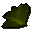 | Snapdragon | A powerful herb. | 59 | yes |  |  |
|  | cert_snapdragon |  | 0 |  |  |  |
| 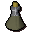 | Unfinished potion | I need another ingredient to finish this Toadflax potion. | 48 | yes |  | Empty |
| 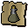 | cert_toadflaxvial |  | 0 |  |  |  |
| 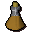 | Unfinished potion | I need another ingredient to finish this Snapdragon potion. | 59 | yes |  | Empty |
| 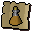 | cert_snapdragonvial |  | 0 |  |  |  |
| 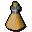 | Firework | A firework potion, this'll look pretty! | 60 | yes |  | hidden, Light |
|  | cert_firework |  | 0 |  |  |  |
| 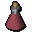 | Energy potion(4) | 4 doses of energy potion. | 146 | yes |  | Drink, Empty |
|  | cert_4dose1energy |  | 0 |  |  |  |
| 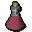 | Energy potion(3) | 3 doses of energy potion. | 110 | yes |  | Drink, Empty |
|  | cert_3dose1energy |  | 0 |  |  |  |
|  | Energy potion(2) | 2 doses of energy potion. | 72 | yes |  | Drink, Empty |
|  | cert_2dose1energy |  | 0 |  |  |  |
|  | Energy potion(1) | 1 dose of energy potion. | 36 | yes |  | Drink, Empty |
|  | cert_1dose1energy |  | 0 |  |  |  |
|  | Super energy(4) | 4 doses of super energy potion. | 300 | yes |  | Drink, Empty |
| 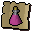 | cert_4dose2energy |  | 0 |  |  |  |
|  | Super energy(3) | 3 doses of super energy potion. | 230 | yes |  | Drink, Empty |
| 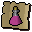 | cert_3dose2energy |  | 0 |  |  |  |
|  | Super energy(2) | 2 doses of super energy potion. | 160 | yes |  | Drink, Empty |
|  | cert_2dose2energy |  | 0 |  |  |  |
| 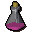 | Super energy(1) | 1 dose of super energy potion. | 90 | yes |  | Drink, Empty |
| 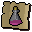 | cert_1dose2energy |  | 0 |  |  |  |
|  | Super restore(4) | 4 doses of super restore potion. | 300 | yes |  | Drink, Empty |
| 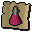 | cert_4dose2restore |  | 0 |  |  |  |
|  | Super restore(3) | 3 doses of super restore potion. | 240 | yes |  | Drink, Empty |
|  | cert_3dose2restore |  | 0 |  |  |  |
| 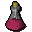 | Super restore(2) | 2 doses of super restore potion. | 180 | yes |  | Drink, Empty |
| 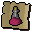 | cert_2dose2restore |  | 0 |  |  |  |
|  | Super restore(1) | 1 dose of super restore potion. | 120 | yes |  | Drink, Empty |
|  | cert_1dose2restore |  | 0 |  |  |  |
| 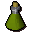 | Agility potion(4) | 4 doses of agility potion. | 200 | yes |  | Drink, Empty |
| 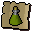 | cert_4dose1agility |  | 0 |  |  |  |
| 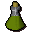 | Agility potion(3) | 3 doses of agility potion. | 150 | yes |  | Drink, Empty |
|  | cert_3dose1agility |  | 0 |  |  |  |
|  | Agility potion(2) | 2 doses of agility potion. | 50 | yes |  | Drink, Empty |
|  | cert_2dose1agility |  | 0 |  |  |  |
|  | Agility potion(1) | 1 dose of agility potion. | 50 | yes |  | Drink, Empty |
|  | cert_1dose1agility |  | 0 |  |  |  |
|  | Magic potion(4) | 4 doses of magic potion. | 300 | yes |  | Drink, Empty |
| 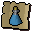 | cert_4dose1magic |  | 0 |  |  |  |
|  | Magic potion(3) | 3 doses of magic potion. | 250 | yes |  | Drink, Empty |
|  | cert_3dose1magic |  | 0 |  |  |  |
|  | Magic potion(2) | 2 doses of magic potion. | 200 | yes |  | Drink, Empty |
| 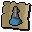 | cert_2dose1magic |  | 0 |  |  |  |
| 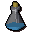 | Magic potion(1) | 1 dose of magic potion. | 150 | yes |  | Drink, Empty |
|  | cert_1dose1magic |  | 0 |  |  |  |
| 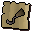 | cert_piratehook |  | 0 |  |  |  |
|  | Herb | I need a closer look to identify this. | 0 | yes |  | Identify |
| 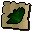 | cert_unidentified_toadflax |  | 0 |  |  |  |
|  | Herb | I need a closer look to identify this. | 0 | yes |  | Identify |
|  | cert_unidentified_snapdragon |  | 0 |  |  |  |
|  | Lava battlestaff | It's a slightly magical stick. | 17000 | yes |  | Wield |
| 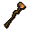 | Mystic lava staff | It's a slightly magical stick. | 45000 | yes |  | Wield |
|  | cert_lava_battlestaff |  | 0 |  |  |  |
|  | cert_mystic_lava_staff |  | 0 |  |  |  |
|  | Mime mask | A mime would wear this. | 0 |  |  | Wear |
|  | Mime top | A mime would wear this. | 0 |  |  | Wear |
| 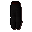 | Mime legs | A mime would wear these. | 0 |  |  | Wear |
| 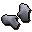 | Mime gloves | A mime would wear these. | 0 |  |  | Wear |
| 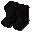 | Mime boots | A mime would wear these. | 0 |  |  | Wear |
| 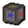 | Strange box | It seems to be humming... | 0 |  | yes | Open |
|  | Cube part |  | 0 |  |  |  |
| 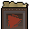 | cert_macro_cube_redtriangle |  | 0 |  |  |  |
| 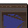 | Cube part |  | 0 |  |  |  |
| 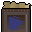 | cert_macro_cube_bluetriangle |  | 0 |  |  |  |
|  | Cube part |  | 0 |  |  |  |
|  | cert_macro_cube_yellowtriangle |  | 0 |  |  |  |
| 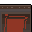 | Cube part |  | 0 |  |  |  |
|  | cert_macro_cube_redsquare |  | 0 |  |  |  |
| 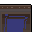 | Cube part |  | 0 |  |  |  |
|  | cert_macro_cube_bluesquare |  | 0 |  |  |  |
| 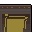 | Cube part |  | 0 |  |  |  |
| 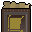 | cert_macro_cube_yellowsquare |  | 0 |  |  |  |
| 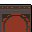 | Cube part |  | 0 |  |  |  |
|  | cert_macro_cube_redcircle |  | 0 |  |  |  |
| 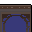 | Cube part |  | 0 |  |  |  |
|  | cert_macro_cube_bluecircle |  | 0 |  |  |  |
|  | Cube part |  | 0 |  |  |  |
|  | cert_macro_cube_yellowcircle |  | 0 |  |  |  |
|  | Cube part |  | 0 |  |  |  |
|  | cert_macro_cube_redstar |  | 0 |  |  |  |
|  | Cube part |  | 0 |  |  |  |
| 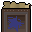 | cert_macro_cube_bluestar |  | 0 |  |  |  |
|  | Cube part |  | 0 |  |  |  |
|  | cert_macro_cube_yellowstar |  | 0 |  |  |  |
| 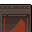 | Cube part |  | 0 |  |  |  |
|  | cert_macro_cube_redhalfmoon |  | 0 |  |  |  |
| 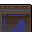 | Cube part |  | 0 |  |  |  |
| 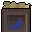 | cert_macro_cube_bluehalfmoon |  | 0 |  |  |  |
|  | Cube part |  | 0 |  |  |  |
| 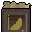 | cert_macro_cube_yellowhalfmoon |  | 0 |  |  |  |
| 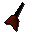 | Black dart | A deadly throwing dart with a black tip. | 18 | yes | yes | Wield |
|  | Black dart(p) | A deadly poisoned dart with a black tip. | 18 | yes | yes | Wield |
|  | Bronze claws | A set of fighting claws. | 15 | yes |  | Wear |
|  | Iron claws | A set of fighting claws. | 50 | yes |  | Wear |
| 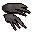 | Steel claws | A set of fighting claws. | 175 | yes |  | Wear |
|  | Black claws | A set of fighting claws. | 360 | yes |  | Wear |
| 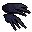 | Mithril claws | A set of fighting claws. | 475 | yes |  | Wear |
|  | Adamant claws | A set of fighting claws. | 1200 | yes |  | Wear |
|  | Rune claws | A set of fighting claws. | 12000 | yes |  | Wear |
|  | Combination | The combination to Burthorpe Castle's equipment room. | 1 | yes |  | Read |
|  | Iou | The guard wrote the IOU on the back of some paper. | 1 | yes |  | Read |
| 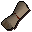 | Secret way map | This map shows the secret way up to Death Plateau. | 1 | yes |  |  |
|  | Climbing boots | Boots made for climbing. | 12 | yes |  | Wear |
| 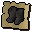 | cert_death_climbingboots |  | 0 |  |  |  |
|  | Spiked boots | Climbing boots with spikes. | 30 |  |  | Wear |
|  | cert_death_spikedboots |  | 0 |  |  |  |
|  | Stone ball | Place on the stone mechanism in the right order to open the door. | 1 | yes |  |  |
|  | Stone ball | Place on the stone mechanism in the right order to open the door. | 1 | yes |  |  |
| 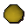 | Stone ball | Place on the stone mechanism in the right order to open the door. | 1 | yes |  |  |
|  | Stone ball | Place on the stone mechanism in the right order to open the door. | 1 | yes |  |  |
|  | Stone ball | Place on the stone mechanism in the right order to open the door. | 1 | yes |  |  |
|  | Certificate | Entrance certificate to the Imperial Guard. | 1 | yes |  |  |
|  | cert_bronze_claws |  | 0 |  |  |  |
| 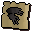 | cert_iron_claws |  | 0 |  |  |  |
| 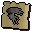 | cert_steel_claws |  | 0 |  |  |  |
|  | cert_black_claws |  | 0 |  |  |  |
|  | cert_mithril_claws |  | 0 |  |  |  |
|  | cert_adamant_claws |  | 0 |  |  |  |
|  | cert_rune_claws |  | 0 |  |  |  |
|  | Granite shield | A solid stone shield. | 56000 | yes |  | Wear |
|  | Shaikahan bones | Large glistening bones which glow with a pale yellow aura. | 0 | yes |  | Bury |
|  | cert_tbwt_beast_bones |  | 0 |  |  |  |
|  | Jogre bones | Fairly big bones which smell distinctly of Jogre. | 0 | yes |  | Bury |
|  | cert_tbwt_jogre_bones |  | 0 |  |  |  |
|  | Burnt jogre bones | These blackened Jogre bones have been somehow burnt. | 0 | yes |  | Bury |
|  | Pasty jogre bones | Burnt Jogre bones smothered with raw Karambwanji Paste. | 0 | yes |  | Bury |
|  | Pasty jogre bones | Burnt Jogre bones smothered with cooked Karambwanji paste. | 0 | yes |  | Bury |
|  | Marinated j' bones | Burnt Jogre bones marinated in a lovely Karambwanji sauce. Perfect. | 0 | yes |  | Bury |
|  | Pasty jogre bones | Jogre bones smothered with raw Karambwanji paste. | 0 | yes |  | Bury |
|  | Pasty jogre bones | Jogre bones smothered with cooked Karambwanji paste. | 0 | yes |  | Bury |
|  | Marinated j' bones | Jogre Bones marinated in Karambwanji sauce. Not quite right. | 0 | yes |  | Bury |
|  | cert_granite_shield |  | 0 |  |  |  |
|  | Prison key | The key to the troll prison. | 1 | yes |  |  |
|  | Cell key 1 | The key to Godric's cell in the troll prison. | 1 | yes |  |  |
|  | Cell key 2 | The key to Mad Eadgar's cell in the troll prison. | 1 | yes |  |  |
|  | Potato cactus | How am I supposed to eat that?! | 0 | yes |  |  |
|  | cert_cactus_potato |  | 0 |  |  |  |
|  | Dragon chainbody | A series of connected metal rings. | 250000 | yes |  | Wear |
|  | cert_dragon_chainbody |  | 0 |  |  |  |
|  | Raw karambwan | A raw green octopus. | 200 | yes |  |  |
|  | cert_tbwt_raw_karambwan |  | 0 |  |  |  |
|  | Cooked karambwan | Cooked octopus. It looks very nutritious. | 250 | yes |  | Eat |
|  | cert_tbwt_cooked_karambwan |  | 0 |  |  |  |
|  | Cooked karambwan | Cooked octopus. It looks a little suspect. | 250 | yes |  | Eat |
|  | cert_tbwt_poorly_cooked_karambwan |  | 0 |  |  |  |
|  | Burnt karambwan | Burnt octopus. | 1 | yes |  |  |
|  | cert_tbwt_burnt_karambwan |  | 0 |  |  |  |
|  | Raw karambwanji | Small brightly coloured tropical fish. | 10 | yes |  |  |
|  | Karambwanji | Small brightly coloured tropical fish. Looks tasty. | 10 | yes |  | Eat |
|  | Karambwan paste | Freshly made octopus paste. | 15 | yes |  |  |
|  | Karambwan paste | Freshly made octopus paste. This smells quite nauseating. | 15 | yes |  |  |
|  | Karambwan paste | Freshly made octopus paste. | 15 | yes |  |  |
|  | Karambwanji paste | This paste smells of raw fish. | 15 | yes |  |  |
|  | Karambwanji paste | This paste smells of cooked fish. | 15 | yes |  |  |
|  | Karambwan vessel | A wide bodied and thin necked vessel, encrusted with sea salt. | 5 | yes |  |  |
|  | cert_tbwt_karambwan_vessel |  | 0 |  |  |  |
|  | Karambwan vessel | This Karambwan Vessel is loaded with Karambwanji. | 40 | yes |  |  |
|  | cert_tbwt_karambwan_vessel_loaded_with_karambwanji |  | 0 |  |  |  |
|  | Crafting manual | A set of instructions explaining how to construct a Karambwan vessel. | 5 | yes |  |  |
|  | Sliced banana | You swear you had more than three slices before. | 2 |  |  | Eat |
|  | cert_tbwt_sliced_banana |  | 0 |  |  |  |
|  | Karamjan rum | The Karamjan rum has slices of banana floating in it. | 30 |  |  |  |
|  | Karamjan rum | A banana has been stuffed into the neck of this bottle. | 30 |  |  |  |
|  | Monkey corpse | It's the body of a dead monkey. | 0 | yes |  |  |
|  | Monkey skin | It's the skin of a (hopefully) dead monkey. | 10 | yes |  |  |
|  | Seaweed sandwich | A 'Seaweed in Monkey Skin' sandwich. Perfect for statue repair. | 0 | yes |  | Eat |
|  | Stuffed monkey | A body of a dead monkey, tastefully stuffed with seaweed. | 0 | yes |  |  |
|  | Bronze spear(kp) | A Karambwan poisoned bronze tipped spear. | 26 | yes |  | Wield |
|  | Iron spear(kp) | A Karambwan poisoned iron tipped spear. | 91 | yes |  | Wield |
|  | Steel spear(kp) | A Karambwan poisoned steel tipped spear. | 325 | yes |  | Wield |
|  | Mithril spear(kp) | A Karambwan poisoned mithril tipped spear. | 845 | yes |  | Wield |
|  | Adamant spear(kp) | A Karambwan poisoned adamantite tipped spear. | 2080 | yes |  | Wield |
|  | Rune spear(kp) | A Karambwan poisoned rune tipped spear. | 20800 | yes |  | Wield |
|  | Dragon spear(kp) | A Karambwan poisoned dragon tipped spear. | 62400 | yes |  | Wield |
|  | Banana left | Mmm this looks tasty. | 2 |  |  | Eat |
|  | cert_banana_left |  | 0 |  |  |  |
|  | Monkey bones | These are smallish monkey bones. | 0 | yes |  | Bury |
|  | Monkey bones | These are medium sized monkey bones. | 0 | yes |  | Bury |
|  | Monkey bones | These are quite large monkey bones. | 0 | yes |  | Bury |
|  | Monkey bones | These are quite large monkey bones. | 0 | yes |  | Bury |
|  | Monkey bones | These are small monkey bones. | 0 |  |  | Bury |
|  | cert_mm_normal_monkey_bones |  | 0 |  |  |  |
|  | Monkey bones | These are smallish monkey bones. They smell extremely nauseating. | 0 | yes |  | Bury |
|  | Monkey bones | These are smallish monkey bones. They smell extremely nauseating. | 0 | yes |  | Bury |
|  | Bones | They seem to shake slightly... It might be a good idea to bury them. | 0 | yes |  | Bury |
|  | Cleaning cloth | A spirit soaked piece of silk which can be used to remove poison. | 60 | yes |  |  |
|  | cert_tbwt_cleaning_cloth |  | 0 |  |  |  |
|  | Bronze halberd | A bronze halberd. | 80 | yes |  | Wield |
|  | cert_bronze_halberd |  | 0 |  |  |  |
|  | Iron halberd | An iron halberd. | 280 | yes |  | Wield |
|  | cert_iron_halberd |  | 0 |  |  |  |
|  | Steel halberd | A steel halberd. | 1000 | yes |  | Wield |
|  | cert_steel_halberd |  | 0 |  |  |  |
|  | Black halberd | A black halberd. | 1920 | yes |  | Wield |
|  | cert_black_halberd |  | 0 |  |  |  |
|  | Mithril halberd | A mithril halberd. | 2600 | yes |  | Wield |
|  | cert_mithril_halberd |  | 0 |  |  |  |
|  | Adamant halberd | An adamant halberd. | 6400 | yes |  | Wield |
|  | cert_adamant_halberd |  | 0 |  |  |  |
|  | Rune halberd | A rune halberd. | 64000 | yes |  | Wield |
|  | cert_rune_halberd |  | 0 |  |  |  |
|  | Dragon halberd | A dragon halberd. | 250000 | yes |  | Wield |
|  | cert_dragon_halberd |  | 0 |  |  |  |
|  | King's message | A summons from King Lathas. | 1 |  |  | Read |
|  | Iorwerths message | A letter for King Lathas from Lord Iorwerth. | 1 | yes |  | Read |
|  | Crystal pendant | Lord Iorwerth's crystal pendant. | 10 | yes |  | Wear |
|  | Sulphur | A piece of Sulphur formation. | 0 | yes |  |  |
|  | cert_regicide_sulphar |  | 0 |  |  |  |
|  | Limestone | Some limestone. | 10 | yes |  |  |
|  | cert_limestone |  | 0 |  |  |  |
|  | Quicklime | Some quicklime. | 4 | yes |  |  |
|  | Pot of quicklime | A pot of ground quicklime. | 5 | yes |  |  |
|  | Ground sulphur | A pile of ground Sulphur. | 5 | yes |  |  |
|  | Barrel | An empty barrel. | 0 | yes |  |  |
|  | cert_regicide_barrel_empty |  | 0 |  |  |  |
|  | Barrel bomb | A barrel full of fire oil. | 0 | yes |  |  |
|  | Barrel bomb | A fused barrel full of fire oil. | 0 | yes |  |  |
|  | Barrel of coal-tar | A barrel full of coal-tar. | 0 | yes |  |  |
|  | Barrel of naphtha | A barrel full of naphtha. | 0 | yes |  |  |
|  | Naphtha mix | A barrel full of naphtha and sulphur. | 0 | yes |  |  |
|  | Naphtha mix | A barrel full of naphtha and quicklime. | 0 | yes |  |  |
|  | Cloth | A bolt of cloth. | 10 | yes |  |  |
|  | cert_regicide_cloth |  | 0 |  |  |  |
|  | Raw rabbit | I need to cook this first. | 1 | yes |  |  |
|  | cert_raw_rabbit |  | 0 |  |  |  |
|  | Cooked rabbit | Mmm this looks tasty. | 4 | yes |  | Eat |
|  | cert_cooked_rabbit |  | 0 |  |  |  |
|  | Big book of bangs | A book by Mel Achy. | 1 | yes |  | Read |
|  | Symbol1 |  | 0 |  |  |  |
|  | cert_regicide_alchemy_symbol1 |  | 0 |  |  |  |
|  | Symbol2 |  | 0 |  |  |  |
|  | cert_regicide_alchemy_symbol2 |  | 0 |  |  |  |
|  | Symbol3 |  | 0 |  |  |  |
|  | cert_regicide_alchemy_symbol3 |  | 0 |  |  |  |
|  | Symbol4 |  | 0 |  |  |  |
|  | cert_regicide_alchemy_symbol4 |  | 0 |  |  |  |
|  | Bark | Bark from a hollow tree. | 0 | yes |  |  |
|  | cert_hollow_bark |  | 0 |  |  |  |
|  | Man | One of RuneScape's many citizens. | 0 |  |  |  |
|  | cert_pickpocket_guide_man |  | 0 |  |  |  |
|  | Farmer | He grows the crops. | 0 |  |  |  |
|  | cert_pickpocket_guide_farmer |  | 0 |  |  |  |
|  | Warrior woman | Not very fashion conscious. | 0 |  |  |  |
|  | cert_pickpocket_guide_warrior |  | 0 |  |  |  |
|  | Rogue | Rogueish. | 0 |  |  |  |
|  | cert_pickpocket_guide_rogue |  | 0 |  |  |  |
|  | Guard | He tries to keep order. | 0 |  |  |  |
|  | cert_pickpocket_guide_guard |  | 0 |  |  |  |
|  | Knight of ardougne | A member of Ardougne's militia. | 0 |  |  |  |
|  | cert_pickpocket_guide_knight |  | 0 |  |  |  |
|  | Watchman | Watches stuff. But who watches him? | 0 |  |  |  |
|  | cert_pickpocket_guide_watchman |  | 0 |  |  |  |
|  | Paladin | A holy warrior! | 0 |  |  |  |
|  | cert_pickpocket_guide_paladin |  | 0 |  |  |  |
|  | Gnome | Looks like a gnome to me. | 0 |  |  |  |
|  | cert_pickpocket_guide_gnome |  | 0 |  |  |  |
|  | Hero | Heroic! | 0 |  |  |  |
|  | cert_pickpocket_guide_hero |  | 0 |  |  |  |
|  | Goutweed | A pale, tough looking herb. | 1 | yes |  |  |
|  | Troll thistle | It's tough and spiky. | 1 | yes |  |  |
|  | Dried thistle | It'll be easier to grind now. | 1 | yes |  |  |
|  | Ground thistle | It's ready for mixing. | 1 | yes |  |  |
|  | Troll potion | It's part of Eadgar's plan. | 1 | yes |  |  |
|  | Drunk parrot | It's rather drunk. | 1 | yes |  |  |
|  | Dirty robe | It's dirty and smelly. | 1 | yes |  |  |
|  | Fake man | It's good enough to fool a troll. | 1 | yes |  |  |
|  | Storeroom key | The key to the Troll storeroom. | 1 | yes |  |  |
|  | Alco-chunks | Pineapple chunks dipped in strong liquor. | 1 | yes |  |  |
|  | Dummy |  | 0 |  |  |  |
|  | cert_eadgar_fade_to_black_inv |  | 0 |  |  |  |
|  | Spell |  | 0 |  |  |  |
|  | Spell |  | 0 |  |  |  |
|  | Spell |  | 0 |  |  |  |
|  | Spell |  | 0 |  |  |  |
|  | Spell |  | 0 |  |  |  |
|  | Spell |  | 0 |  |  |  |
|  | Spell |  | 0 |  |  |  |
|  | Spell |  | 0 |  |  |  |
|  | Spell |  | 0 |  |  |  |
|  | Spell |  | 0 |  |  |  |
|  | Spell |  | 0 |  |  |  |
|  | Spell |  | 0 |  |  |  |
|  | Spell |  | 0 |  |  |  |
|  | Spell |  | 0 |  |  |  |
|  | Spell |  | 0 |  |  |  |
|  | Spell |  | 0 |  |  |  |
|  | Spell |  | 0 |  |  |  |
|  | Spell |  | 0 |  |  |  |
|  | Spell |  | 0 |  |  |  |
|  | Spell |  | 0 |  |  |  |
|  | Spell |  | 0 |  |  |  |
|  | Spell |  | 0 |  |  |  |
|  | Spell |  | 0 |  |  |  |
|  | Spell |  | 0 |  |  |  |
|  | Spell |  | 0 |  |  |  |
|  | Spell |  | 0 |  |  |  |
|  | Spell |  | 0 |  |  |  |
|  | Spell |  | 0 |  |  |  |
|  | Spell |  | 0 |  |  |  |
|  | Spell |  | 0 |  |  |  |
|  | Spell |  | 0 |  |  |  |
|  | Spell |  | 0 |  |  |  |
|  | Spell |  | 0 |  |  |  |
|  | Spell |  | 0 |  |  |  |
|  | Spell |  | 0 |  |  |  |
|  | Spell |  | 0 |  |  |  |
|  | Spell |  | 0 |  |  |  |
|  | Spell |  | 0 |  |  |  |
|  | Spell |  | 0 |  |  |  |
|  | Spell |  | 0 |  |  |  |
|  | Spell |  | 0 |  |  |  |
|  | Spell |  | 0 |  |  |  |
|  | Spell |  | 0 |  |  |  |
|  | Spell |  | 0 |  |  |  |
|  | Spell |  | 0 |  |  |  |
|  | Spell |  | 0 |  |  |  |
|  | Spell |  | 0 |  |  |  |
|  | Spell |  | 0 |  |  |  |
|  | Spell |  | 0 |  |  |  |
|  | Spell |  | 0 |  |  |  |
|  | Spell |  | 0 |  |  |  |
|  | Spell |  | 0 |  |  |  |
|  | Vampire dust | That used to be a vampire! | 2 | yes |  |  |
|  | cert_vampire_dust |  | 0 |  |  |  |
|  | Myre snelm | A marshy coloured snail shell helmet. | 300 |  |  | Wear |
|  | cert_snelm_round_swamp |  | 0 |  |  |  |
|  | Blood'n'tar snelm | A red and black Snail shell helmet. | 300 |  |  | Wear |
|  | cert_snelm_round_red+black |  | 0 |  |  |  |
|  | Ochre snelm | A muddy yellow snail shell helmet. | 300 |  |  | Wear |
|  | cert_snelm_round_yellow |  | 0 |  |  |  |
|  | Bruise blue snelm | A moody blue snail shell helmet. | 300 |  |  | Wear |
|  | cert_snelm_round_blue |  | 0 |  |  |  |
|  | Broken bark snelm | An orange and bark coloured snail shell helmet. | 300 |  |  | Wear |
|  | cert_snelm_round_orange |  | 0 |  |  |  |
|  | Myre snelm | A swamp coloured pointed snail shell helmet. | 300 |  |  | Wear |
|  | cert_snelm_point_swamp |  | 0 |  |  |  |
|  | Blood'n'tar snelm | A red and black pointed snail shell helmet. | 300 |  |  | Wear |
|  | cert_snelm_point_red+black |  | 0 |  |  |  |
|  | Ochre snelm | A muddy yellow coloured pointed snail shell helmet. | 300 |  |  | Wear |
|  | cert_snelm_point_yellow |  | 0 |  |  |  |
|  | Bruise blue snelm | A moody blue pointed snail shell helmet. | 300 |  |  | Wear |
|  | cert_snelm_point_blue |  | 0 |  |  |  |
|  | Blamish myre shell | A large 'Myre' coloured blamish snail shell, looks protective. | 150 | yes |  |  |
|  | cert_shellround_swamp |  | 0 |  |  |  |
|  | Blamish red shell | A large red and black blamish snail shell, looks protective. | 150 | yes |  |  |
|  | cert_shellround_red+black |  | 0 |  |  |  |
|  | Blamish ochre shell | A large muddy yellow coloured blamish snail shell, looks protective. | 150 | yes |  |  |
|  | cert_shellround_yellow |  | 0 |  |  |  |
|  | Blamish blue shell | A large blue coloured blamish snail shell, looks protective. | 150 | yes |  |  |
|  | cert_shellround_blue |  | 0 |  |  |  |
|  | Blamish bark shell | A large bark coloured blamish snail shell, looks protective. | 150 | yes |  |  |
|  | cert_shellround_orange |  | 0 |  |  |  |
|  | Blamish myre shell | A large 'Myre' coloured blamish snail shell, looks protective. | 150 | yes |  |  |
|  | cert_shellpoint_swamp |  | 0 |  |  |  |
|  | Blamish red shell | A large red coloured blamish snail shell, looks protective. | 150 | yes |  |  |
|  | cert_shellpoint_red+black |  | 0 |  |  |  |
|  | Blamish ochre shell | A large ochre coloured blamish snail shell, looks protective. | 150 | yes |  |  |
|  | cert_shellpoint_yellow |  | 0 |  |  |  |
|  | Blamish blue shell | A large blue coloured blamish snail shell, looks protective. | 150 | yes |  |  |
|  | cert_shellpoint_blue |  | 0 |  |  |  |
|  | Thin snail | The thin, slimey corpse of a deceased giant snail. | 5 | yes |  |  |
|  | cert_snail_corpse1 |  | 0 |  |  |  |
|  | Lean snail | The lean, slimey corpse of a deceased giant snail. | 10 | yes |  |  |
|  | cert_snail_corpse2 |  | 0 |  |  |  |
|  | Fat snail | The fat, slimey corpse of a deceased giant snail. | 15 | yes |  |  |
|  | cert_snail_corpse3 |  | 0 |  |  |  |
|  | Thin snail meat | A succulently slimey slice of sumptuous snail. | 10 | yes |  | Eat |
|  | cert_snail_corpse_cooked1 |  | 0 |  |  |  |
|  | Lean snail meat | A succulently slimey slice of sumptuous snail. | 20 | yes |  | Eat |
|  | cert_snail_corpse_cooked2 |  | 0 |  |  |  |
|  | Fat snail meat | A succulently slimey slice of sumptuous snail. | 30 | yes |  | Eat |
|  | cert_snail_corpse_cooked3 |  | 0 |  |  |  |
|  | Burnt snail | A slightly super-saute'ed snail. | 10 | yes |  |  |
|  | cert_burnt_snail |  | 0 |  |  |  |
|  | Sample bottle | An empty sample bottle. | 5 | yes |  |  |
|  | cert_empty_dye_bottle |  | 0 |  |  |  |
|  | Slimey eel | A slime covered eel - yuck! | 0 | yes |  |  |
|  | cert_mort_slimey_eel |  | 0 |  |  |  |
|  | Cooked slimey eel | A cooked slimey eel - not delicious, but pretty nutritious. | 0 | yes |  | Eat |
|  | cert_mort_slimey_eel_cooked |  | 0 |  |  |  |
|  | Burnt eel | It looks like it's seen one too many fires. | 0 | yes |  |  |
|  | cert_burnt_eel |  | 0 |  |  |  |
|  | Splitbark helm | A wooden helmet. | 10000 | yes |  | Wear |
|  | cert_splitbark_helm |  | 0 |  |  |  |
|  | Splitbark body | Provides good protection. | 45000 | yes |  | Wear |
|  | cert_splitbark_body |  | 0 |  |  |  |
|  | Splitbark legs | These should protect my legs. | 40000 | yes |  | Wear |
|  | cert_splitbark_legs |  | 0 |  |  |  |
|  | Splitbark gauntlets | These should keep my hands safe. | 5000 | yes |  | Wear |
|  | cert_splitbark_gauntlets |  | 0 |  |  |  |
|  | Splitbark greaves | Wooden foot protection. | 5000 | yes |  | Wear |
|  | cert_splitbark_greaves |  | 0 |  |  |  |
|  | Diary | A diary belonging to Herbi Flax. | 0 | yes |  | Read |
|  | Loar remains | The remains of a deadly shade. | 0 | yes |  |  |
|  | cert_shade_bones1 |  | 0 |  |  |  |
|  | Phrin remains | The remains of a deadly shade. | 0 | yes |  |  |
|  | cert_shade_bones2 |  | 0 |  |  |  |
|  | Riyl remains | The remains of a deadly shade. | 0 | yes |  |  |
|  | cert_shade_bones3 |  | 0 |  |  |  |
|  | Asyn remains | The remains of a deadly shade. | 0 | yes |  |  |
|  | cert_shade_bones4 |  | 0 |  |  |  |
|  | Fiyr remains | The remains of a deadly shade. | 0 | yes |  |  |
|  | cert_shade_bones5 |  | 0 |  |  |  |
|  | Unfinished potion | I need another ingredient to finish this potion. | 11 | yes |  |  |
|  | cert_ashesvial |  | 0 |  |  |  |
|  | Serum 207 (4) | 4 doses serum 207 as described in Herbi Flax's diary. | 14 | yes |  |  |
|  | cert_mort_serum4 |  | 0 |  |  |  |
|  | Serum 207 (3) | 3 doses serum 207 as described in Herbi Flax's diary. | 13 | yes |  |  |
|  | cert_mort_serum3 |  | 0 |  |  |  |
|  | Serum 207 (2) | 2 doses serum 207 as described in Herbi Flax's diary. | 13 | yes |  |  |
|  | cert_mort_serum2 |  | 0 |  |  |  |
|  | Serum 207 (1) | 1 dose serum 207 as described in Herbi Flax's diary. | 11 | yes |  |  |
|  | cert_mort_serum1 |  | 0 |  |  |  |
|  | Serum 207(p) (4) | 4 doses permanent serum 207 as described in Herbi Flax's diary. | 14 | yes |  |  |
|  | Serum 207(p) (3) | 3 doses permanent serum 207 as described in Herbi Flax's diary. | 13 | yes |  |  |
|  | Serum 207(p) (2) | 2 doses permanent serum 207 as described in Herbi Flax's diary. | 13 | yes |  |  |
|  | Serum 207(p) (1) | 1 dose permanent serum 207 as described in Herbi Flax's diary. | 11 | yes |  |  |
|  | Limestone brick | A well carved lime stone brick. | 20 | yes |  |  |
|  | cert_limestonebrick |  | 0 |  |  |  |
|  | Olive oil(4) | 4 doses of olive oil | 22 | yes |  |  |
|  | cert_oliveoil4 |  | 0 |  |  |  |
|  | Olive oil(3) | 3 doses of olive oil | 20 | yes |  |  |
|  | cert_oliveoil3 |  | 0 |  |  |  |
|  | Olive oil(2) | 2 doses of olive oil | 17 | yes |  |  |
|  | cert_oliveoil2 |  | 0 |  |  |  |
|  | Olive oil(1) | 1 dose of olive oil | 14 | yes |  |  |
|  | cert_oliveoil1 |  | 0 |  |  |  |
|  | Sacred oil(4) | 4 doses of sacred Oil | 100 | yes |  |  |
|  | cert_sacred_oil4 |  | 0 |  |  |  |
|  | Sacred oil(3) | 3 doses of sacred Oil | 90 | yes |  |  |
|  | cert_sacred_oil3 |  | 0 |  |  |  |
|  | Sacred oil(2) | 2 doses of sacred Oil | 75 | yes |  |  |
|  | cert_sacred_oil2 |  | 0 |  |  |  |
|  | Sacred oil(1) | 1 dose of sacred Oil | 60 | yes |  |  |
|  | cert_sacred_oil1 |  | 0 |  |  |  |
|  | Pyre logs | Logs prepared with sacred oil for a funeral pyre. | 8 | yes |  |  |
|  | cert_logs_pyre |  | 0 |  |  |  |
|  | Oak pyre logs | Oak logs prepared with sacred oil for a funeral pyre. | 40 | yes |  |  |
|  | cert_oak_logs_pyre |  | 0 |  |  |  |
|  | Willow pyre logs | Willow logs prepared with sacred oil for a funeral pyre. | 80 | yes |  |  |
|  | cert_willow_logs_pyre |  | 0 |  |  |  |
|  | Maple pyre logs | Maple logs prepared with sacred oil for a funeral pyre. | 160 | yes |  |  |
|  | cert_maple_logs_pyre |  | 0 |  |  |  |
|  | Yew pyre logs | Yew logs prepared with sacred oil for a funeral pyre. | 320 | yes |  |  |
|  | cert_yew_logs_pyre |  | 0 |  |  |  |
|  | Magic pyre logs | Magic logs prepared with sacred oil for a funeral pyre. | 640 |  |  |  |
|  | cert_magic_logs_pyre |  | 0 |  |  |  |
|  | Bronze key red | A bronze key with a blood-red painted eyelet. | 81 | yes |  |  |
|  | Bronze key brown | A bronze key with a brown painted eyelet. | 82 | yes |  |  |
|  | Bronze key crimson | A bronze key with a crimson painted eyelet. | 83 | yes |  |  |
|  | Bronze key black | A bronze key with a black painted eyelet. | 84 | yes |  |  |
|  | Bronze key purple | A bronze key with a purple painted eyelet. | 85 | yes |  |  |
|  | Steel key red | A steel key with a blood-red painted eyelet. | 86 | yes |  |  |
|  | Steel key brown | A steel key with a brown painted eyelet. | 87 | yes |  |  |
|  | Steel key crimson | A steel key with a crimson painted eyelet. | 88 | yes |  |  |
|  | Steel key black | A steel key with a black painted eyelet. | 89 | yes |  |  |
|  | Steel key purple | A steel key with a purple painted eyelet. | 90 | yes |  |  |
|  | Black key red | A black key with a blood-red painted eyelet. | 91 | yes |  |  |
|  | Black key brown | A black key with a brown painted eyelet. | 92 | yes |  |  |
|  | Black key crimson | A black key with a crimson painted eyelet. | 93 | yes |  |  |
|  | Black key black | A black key with a black painted eyelet. | 94 | yes |  |  |
|  | Black key purple | A black key with a purple painted eyelet. | 95 | yes |  |  |
|  | Silver key red | A silver key with a blood-red painted eyelet. | 96 | yes |  |  |
|  | Silver key brown | A silver key with a brown painted eyelet. | 97 | yes |  |  |
|  | Silver key crimson | A silver key with a crimson painted eyelet. | 98 | yes |  |  |
|  | Silver key black | A silver key with a black painted eyelet. | 99 | yes |  |  |
|  | Silver key purple | A silver key with a purple painted eyelet. | 100 | yes |  |  |
|  | Fine cloth | Amazingly untouched by time. | 500 | yes |  |  |
|  | cert_fine_cloth |  | 0 |  |  |  |
|  | Black plateskirt (t) | Black plateskirt with trim. | 1920 |  |  | Wear |
|  | Black plateskirt (g) | Black plateskirt with gold trim. | 1920 |  |  | Wear |
|  | Adam plateskirt (t) | Adamant plateskirt with trim. | 6400 |  |  | Wear |
|  | Adam plateskirt (g) | Adamant plateskirt with gold trim. | 6400 |  |  | Wear |
|  | Rune plateskirt (g) | Rune plateskirt with gold trim. | 64000 |  |  | Wear |
|  | Rune plateskirt (t) | Rune plateskirt with trim. | 64000 |  |  | Wear |
|  | Zamorak plateskirt | Rune plateskirt in the colours of Zamorak. | 64000 |  |  | Wear |
|  | Saradomin skirt | Rune plateskirt in the colours of Saradomin. | 64000 |  |  | Wear |
|  | Guthix plateskirt | Rune plateskirt in the colours of Guthix. | 64000 |  |  | Wear |
|  | Gilded platebody | Rune platebody with gold plate. | 65000 | yes |  | Wear |
|  | cert_rune_platebody_goldplate |  | 0 |  |  |  |
|  | Gilded platelegs | Rune platelegs with gold plate. | 64000 | yes |  | Wear |
|  | cert_rune_platelegs_goldplate |  | 0 |  |  |  |
|  | Gilded plateskirt | Rune plateskirt with gold plate. | 64000 | yes |  | Wear |
|  | Gilded full helm | Rune full helm with gold plate. | 35200 | yes |  | Wear |
|  | cert_rune_full_helm_goldplate |  | 0 |  |  |  |
|  | Gilded kiteshield | Rune kiteshield with gold plate. | 54400 | yes |  | Wear |
|  | cert_rune_kiteshield_goldplate |  | 0 |  |  |  |
|  | Clue scroll | A clue! | 1 | yes |  | Read |
|  | Clue scroll | A clue! | 1 | yes |  | Read |
|  | Clue scroll | A clue! | 1 | yes |  | Read |
|  | Clue scroll | A clue! | 1 | yes |  | Read |
|  | Clue scroll | A clue! | 1 | yes |  | Read |
|  | Clue scroll | A clue! | 1 | yes |  | Read |
|  | Clue scroll | A clue! | 1 | yes |  | Read |
|  | Clue scroll | A clue! | 1 | yes |  | Read |
|  | Clue scroll | A clue! | 1 | yes |  | Read |
|  | Clue scroll | A clue! | 1 | yes |  | Read |
