<!-- GENERATED by tools/docsgen — do not edit; regenerate instead. -->

# Items — page 8 (Clue scroll – Stool)

| Icon | Name | Description | Cost | Members | Stackable | Options |
|---|---|---|---|---|---|---|
|  | Clue scroll | A clue! | 1 | yes |  | Read |
|  | Clue scroll | A clue! | 1 | yes |  | Read |
|  | Clue scroll | A clue! | 1 | yes |  | Read |
|  | Clue scroll | A clue! | 1 | yes |  | Read |
|  | Clue scroll | A clue! | 1 | yes |  | Read |
|  | Clue scroll | A clue! | 1 | yes |  | Read |
|  | Clue scroll | A clue! | 1 | yes |  | Read |
|  | Clue scroll | A clue! | 1 | yes |  | Read |
|  | Clue scroll | A clue! | 1 | yes |  | Read |
|  | Clue scroll | A clue! | 1 | yes |  | Read |
|  | Clue scroll | A clue! | 1 | yes |  | Read |
|  | Casket | I hope there's treasure in it. | 50 | yes |  | Open |
|  | Clue scroll | A clue! | 1 | yes |  | Read |
|  | Clue scroll | A clue! | 1 | yes |  | Read |
|  | Clue scroll | A clue! | 1 | yes |  | Read |
|  | Clue scroll | A clue! | 1 | yes |  | Read |
|  | Clue scroll | Part of the world map, but where? | 1 | yes |  | Read |
|  | Casket | I hope there's treasure in it. | 50 | yes |  | Open |
|  | Clue scroll | Part of the world map, but where? | 1 | yes |  | Read |
|  | Casket | I hope there's treasure in it. | 50 | yes |  | Open |
|  | Clue scroll | Part of the world map, but where? | 1 | yes |  | Read |
|  | Casket | I hope there's treasure in it. | 50 | yes |  | Open |
|  | Clue scroll | Part of the world map, but where? | 1 | yes |  | Read |
|  | Casket | I hope there's treasure in it. | 50 | yes |  | Open |
|  | Clue scroll | Part of the world map, but where? | 1 | yes |  | Read |
|  | Clue scroll | Part of the world map, but where? | 1 | yes |  | Read |
|  | Clue scroll | Perhaps someone at the observatory can teach me to navigate? | 1 | yes |  | Read |
|  | Casket | I hope there's treasure in it. | 50 | yes |  | Open |
|  | Clue scroll | Perhaps someone at the observatory can teach me to navigate? | 1 | yes |  | Read |
|  | Casket | I hope there's treasure in it. | 50 | yes |  | Open |
|  | Clue scroll | Perhaps someone at the observatory can teach me to navigate? | 1 | yes |  | Read |
|  | Casket | I hope there's treasure in it. | 50 | yes |  | Open |
|  | Clue scroll | Perhaps someone at the observatory can teach me to navigate? | 1 | yes |  | Read |
|  | Casket | I hope there's treasure in it. | 50 | yes |  | Open |
|  | Clue scroll | Perhaps someone at the observatory can teach me to navigate? | 1 | yes |  | Read |
|  | Casket | I hope there's treasure in it. | 50 | yes |  | Open |
|  | Clue scroll | Perhaps someone at the observatory can teach me to navigate? | 1 | yes |  | Read |
|  | Casket | I hope there's treasure in it. | 50 | yes |  | Open |
|  | Clue scroll | Perhaps someone at the observatory can teach me to navigate? | 1 | yes |  | Read |
|  | Casket | I hope there's treasure in it. | 50 | yes |  | Open |
|  | Clue scroll | Perhaps someone at the observatory can teach me to navigate? | 1 | yes |  | Read |
|  | Casket | I hope there's treasure in it. | 50 | yes |  | Open |
|  | Clue scroll | Perhaps someone at the observatory can teach me to navigate? | 1 | yes |  | Read |
|  | Casket | I hope there's treasure in it. | 50 | yes |  | Open |
|  | Clue scroll | Perhaps someone at the observatory can teach me to navigate? | 1 | yes |  | Read |
|  | Casket | I hope there's treasure in it. | 50 | yes |  | Open |
|  | Clue scroll | Perhaps someone at the observatory can teach me to navigate? | 1 | yes |  | Read |
|  | Casket | I hope there's treasure in it. | 50 | yes |  | Open |
|  | Clue scroll | Perhaps someone at the observatory can teach me to navigate? | 1 | yes |  | Read |
|  | Casket | I hope there's treasure in it. | 50 | yes |  | Open |
|  | Clue scroll | Perhaps someone at the observatory can teach me to navigate? | 1 | yes |  | Read |
|  | Casket | I hope there's treasure in it. | 50 | yes |  | Open |
|  | Clue scroll | Perhaps someone at the observatory can teach me to navigate? | 1 | yes |  | Read |
|  | Casket | I hope there's treasure in it. | 50 | yes |  | Open |
|  | Clue scroll | Perhaps someone at the observatory can teach me to navigate? | 1 | yes |  | Read |
|  | Casket | I hope there's treasure in it. | 50 | yes |  | Open |
|  | Clue scroll | Perhaps someone at the observatory can teach me to navigate? | 1 | yes |  | Read |
|  | Casket | I hope there's treasure in it. | 50 | yes |  | Open |
|  | Clue scroll | Perhaps someone at the observatory can teach me to navigate? | 1 | yes |  | Read |
|  | Casket | I hope there's treasure in it. | 50 | yes |  | Open |
|  | Clue scroll | Perhaps someone at the observatory can teach me to navigate? | 1 | yes |  | Read |
|  | Casket | I hope there's treasure in it. | 50 | yes |  | Open |
|  | Clue scroll | Perhaps someone at the observatory can teach me to navigate? | 1 | yes |  | Read |
|  | Casket | I hope there's treasure in it. | 50 | yes |  | Open |
|  | Clue scroll | A clue! | 1 | yes |  | Read |
|  | Puzzle box | I need to solve this! | 100 | yes |  | Open |
|  | Clue scroll | A clue! | 1 | yes |  | Read |
|  | Puzzle box | I need to solve this! | 100 | yes |  | Open |
|  | Clue scroll | A clue! | 1 | yes |  | Read |
| 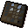 | Puzzle box | I need to solve this! | 100 | yes |  | Open |
|  | Clue scroll | A clue! | 1 | yes |  | Read |
|  | Puzzle box | I need to solve this! | 100 | yes |  | Open |
|  | Clue scroll | A clue! | 1 | yes |  | Read |
|  | Clue scroll | A clue! | 1 | yes |  | Read |
|  | Clue scroll | A clue! | 1 | yes |  | Read |
|  | Clue scroll | A clue! | 1 | yes |  | Read |
|  | Puzzle box | I need to solve this! | 100 | yes |  | Open |
|  | Clue scroll | A clue! | 1 | yes |  | Read |
| 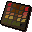 | Puzzle box | I need to solve this! | 100 | yes |  | Open |
|  | Clue scroll | A clue! | 1 | yes |  | Read |
|  | Clue scroll | A clue! | 1 | yes |  | Read |
|  | Casket | I hope there's treasure in it. | 50 | yes |  | Open |
|  | Clue scroll | Perhaps someone at the observatory can teach me to navigate? | 1 | yes |  | Read |
|  | Casket | I hope there's treasure in it. | 50 | yes |  | Open |
|  | Clue scroll | Perhaps someone at the observatory can teach me to navigate? | 1 | yes |  | Read |
|  | Casket | I hope there's treasure in it. | 50 | yes |  | Open |
| 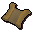 | Clue scroll | Perhaps someone at the observatory can teach me to navigate? | 1 | yes |  | Read |
|  | Casket | I hope there's treasure in it. | 50 | yes |  | Open |
|  | Clue scroll | Perhaps someone at the observatory can teach me to navigate? | 1 | yes |  | Read |
|  | Casket | I hope there's treasure in it. | 50 | yes |  | Open |
|  | Clue scroll | Perhaps someone at the observatory can teach me to navigate? | 1 | yes |  | Read |
|  | Casket | I hope there's treasure in it. | 50 | yes |  | Open |
|  | Clue scroll | Perhaps someone at the observatory can teach me to navigate? | 1 | yes |  | Read |
|  | Casket | I hope there's treasure in it. | 50 | yes |  | Open |
|  | Clue scroll | Perhaps someone at the observatory can teach me to navigate? | 1 | yes |  | Read |
|  | Casket | I hope there's treasure in it. | 50 | yes |  | Open |
|  | Clue scroll | Part of the world map, but where? | 1 | yes |  | Read |
|  | Casket | I hope there's treasure in it. | 50 | yes |  | Open |
|  | Clue scroll | Part of the world map, but where? | 1 | yes |  | Read |
|  | Clue scroll | Part of the world map, but where? | 1 | yes |  | Read |
|  | Casket | I hope there's treasure in it. | 50 | yes |  | Open |
|  | Clue scroll | Part of the world map, but where? | 1 | yes |  | Read |
|  | Clue scroll | Part of the world map, but where? | 1 | yes |  | Read |
|  | Casket | I hope there's treasure in it. | 50 | yes |  | Open |
|  | Clue scroll | A clue! | 1 | yes |  | Read |
|  | Clue scroll | A clue! | 1 | yes |  | Read |
|  | Key | A key to some drawers. | 1 | yes |  |  |
|  | Clue scroll | A clue! | 1 | yes |  | Read |
|  | Key | A key to some drawers. | 1 | yes |  |  |
|  | Clue scroll | A clue! | 1 | yes |  | Read |
|  | Clue scroll | A clue! | 1 | yes |  | Read |
|  | Clue scroll | A clue! | 1 | yes |  | Read |
|  | Clue scroll | A clue! | 1 | yes |  | Read |
|  | Clue scroll | A clue! | 1 | yes |  | Read |
|  | Clue scroll | A clue! | 1 | yes |  | Read |
|  | Clue scroll | A clue! | 1 | yes |  | Read |
|  | Clue scroll | A clue! | 1 | yes |  | Read |
|  | Clue scroll | A clue! | 1 | yes |  | Read |
|  | Clue scroll | A clue! | 1 | yes |  | Read |
|  | Sliding piece |  | 0 | yes |  | Move |
|  | Sliding piece |  | 0 | yes |  | Move |
| 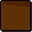 | Sliding piece |  | 0 | yes |  | Move |
|  | Sliding piece |  | 0 | yes |  | Move |
|  | Sliding piece |  | 0 | yes |  | Move |
|  | Sliding piece |  | 0 | yes |  | Move |
|  | Sliding piece |  | 0 | yes |  | Move |
|  | Sliding piece |  | 0 | yes |  | Move |
|  | Sliding piece |  | 0 | yes |  | Move |
|  | Sliding piece |  | 0 | yes |  | Move |
|  | Sliding piece |  | 0 | yes |  | Move |
|  | Sliding piece |  | 0 | yes |  | Move |
| 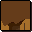 | Sliding piece |  | 0 | yes |  | Move |
| 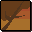 | Sliding piece |  | 0 | yes |  | Move |
|  | Sliding piece |  | 0 | yes |  | Move |
| 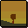 | Sliding piece |  | 0 | yes |  | Move |
| 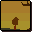 | Sliding piece |  | 0 | yes |  | Move |
| 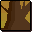 | Sliding piece |  | 0 | yes |  | Move |
| 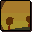 | Sliding piece |  | 0 | yes |  | Move |
| 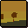 | Sliding piece |  | 0 | yes |  | Move |
| 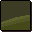 | Sliding piece |  | 0 | yes |  | Move |
| 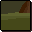 | Sliding piece |  | 0 | yes |  | Move |
|  | Sliding piece |  | 0 | yes |  | Move |
| 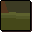 | Sliding piece |  | 0 | yes |  | Move |
|  | Sliding piece |  | 0 | yes |  | Move |
|  | Sliding piece |  | 0 | yes |  | Move |
|  | Sliding piece |  | 0 | yes |  | Move |
| 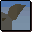 | Sliding piece |  | 0 | yes |  | Move |
|  | Sliding piece |  | 0 | yes |  | Move |
|  | Sliding piece |  | 0 | yes |  | Move |
| 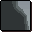 | Sliding piece |  | 0 | yes |  | Move |
| 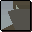 | Sliding piece |  | 0 | yes |  | Move |
| 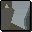 | Sliding piece |  | 0 | yes |  | Move |
| 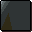 | Sliding piece |  | 0 | yes |  | Move |
|  | Sliding piece |  | 0 | yes |  | Move |
| 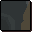 | Sliding piece |  | 0 | yes |  | Move |
| 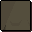 | Sliding piece |  | 0 | yes |  | Move |
| 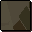 | Sliding piece |  | 0 | yes |  | Move |
|  | Sliding piece |  | 0 | yes |  | Move |
| 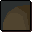 | Sliding piece |  | 0 | yes |  | Move |
| 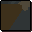 | Sliding piece |  | 0 | yes |  | Move |
| 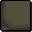 | Sliding piece |  | 0 | yes |  | Move |
| 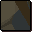 | Sliding piece |  | 0 | yes |  | Move |
|  | Sliding piece |  | 0 | yes |  | Move |
| 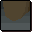 | Sliding piece |  | 0 | yes |  | Move |
|  | Sliding piece |  | 0 | yes |  | Move |
|  | Sliding piece |  | 0 | yes |  | Move |
| 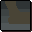 | Sliding piece |  | 0 | yes |  | Move |
|  | viking_toyship |  | 0 |  |  |  |
| 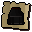 | cert_black_plateskirt_trim |  | 0 |  |  |  |
| 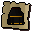 | cert_black_plateskirt_gold |  | 0 |  |  |  |
| 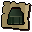 | cert_adamant_plateskirt_trim |  | 0 |  |  |  |
| 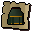 | cert_adamant_plateskirt_gold |  | 0 |  |  |  |
| 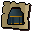 | cert_rune_plateskirt_gold |  | 0 |  |  |  |
| 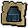 | cert_rune_plateskirt_trim |  | 0 |  |  |  |
| 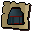 | cert_rune_plateskirt_zamorak |  | 0 |  |  |  |
| 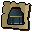 | cert_rune_plateskirt_saradomin |  | 0 |  |  |  |
|  | cert_rune_plateskirt_guthix |  | 0 |  |  |  |
| 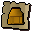 | cert_rune_plateskirt_goldplate |  | 0 |  |  |  |
| 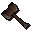 | Flamtaer hammer | An exquisitely shaped tool specially designed for fixing temples. | 10000 | yes |  |  |
| 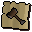 | cert_flamtaer_hammer |  | 0 |  |  |  |
| 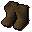 | Dummy shoe1 |  | 0 | yes |  |  |
| 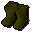 | Dummy shoe2 |  | 0 | yes |  |  |
| 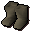 | Dummy shoe3 |  | 0 | yes |  |  |
| 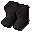 | Dummy shoe4 |  | 0 | yes |  |  |
| 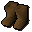 | Dummy shoe5 |  | 0 | yes |  |  |
| 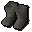 | Dummy shoe6 |  | 0 | yes |  |  |
| 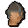 | Fremennik | One of Rellekka's many citizens. | 0 |  |  |  |
| 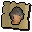 | cert_pickpocket_guide_fremennik_citizen |  | 0 |  |  |  |
|  | Unstrung lyre | It's almost a musical instrument. | 0 | yes |  |  |
| 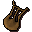 | Lyre | It's a musical instrument I don't know how to play. | 0 | yes |  | Play |
|  | Enchanted lyre | A musical instrument that I can magically play. | 0 | yes |  | Play |
|  | Enchanted lyre | This will teleport me to Rellekka when I play it. | 1000 | yes |  | Play |
| 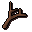 | Branch | I can use this to make a lyre. | 0 | yes |  |  |
| 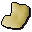 | Golden fleece | I can spin this into golden wool... | 0 | yes |  |  |
|  | Golden wool | I can use this to make a lyre. | 0 | yes |  |  |
|  | Pet rock | The lowest maintenance pet you will ever have. | 0 | yes |  | Feed, Stroke, Talk-to |
|  | Hunters' talisman | Talisman to bind the draugen | 4 | yes |  | Locate |
|  | Hunters' talisman | Talisman to bind the draugen | 4 | yes |  | Locate |
|  | Exotic flower | Some flowers from a distant land. | 0 | yes |  |  |
|  | Fremennik ballad | A hauntingly beautiful love ballad. | 0 | yes |  |  |
|  | Sturdy boots | A pair of sturdy custom made boots. | 0 | yes |  |  |
|  | Hunters map | A map showing very active hunting spots. | 0 | yes |  |  |
|  | Custom bow string | A finely crafted string for a custom bow. | 0 | yes |  |  |
|  | Unusual fish | An extremely rare, non edible fish. | 0 | yes |  |  |
|  | Sea fishing map | Map showing the best fishing spots out at sea. | 0 | yes |  |  |
|  | Weather forecast | An estimate of expected local weather patterns. | 0 | yes |  |  |
|  | Champions token | Shows the wearer is worthy of the Champions table. | 0 | yes |  |  |
|  | Legendary cocktail | Probably the greatest cocktail in the world. | 0 | yes |  |  |
|  | Fiscal statement | A signed statement promising a reduction on sales tax. | 0 | yes |  |  |
|  | Promissory note | A legally binding contract promising not to enter the longhall. | 0 | yes |  |  |
|  | Warriors' contract | This employment contract is for a warrior to act as a bodyguard. | 0 | yes |  |  |
|  | Keg of beer | A lot of beer in a barrel. | 0 | yes |  |  |
|  | Low alcohol keg | Suspiciously close to beer, but without the side effects. | 0 | yes |  |  |
|  | Strange object | It's some kind of weird little parcel thing. | 0 | yes |  |  |
|  | Lit strange object | It's some kind of weird little parcel thing. On fire. | 0 | yes |  |  |
|  | Red disk | A red coloured disk, apparently made of wood. | 0 | yes |  |  |
|  | Red disk | A red coloured disk, apparently made of wood. | 0 | yes |  |  |
|  | Viking dummy lid |  | 0 | yes |  |  |
|  | Magnet | A very attractive magnet. | 3 | yes |  |  |
|  | Blue thread | Some blue thread. | 0 | yes |  |  |
|  | Small pick | A small pick for cracking small objects. | 0 | yes |  |  |
|  | Toy ship | Might be fun to play with in the bath. | 2 | yes |  |  |
|  | Full bucket | This bucket is completely full. It has a 5 painted on it's side. | 0 | yes |  |  |
|  | 4/5ths full bucket | This bucket is eighty percent full. It has a 5 painted on it's side. | 0 | yes |  |  |
|  | 3/5ths full bucket | This bucket is sixty percent full. It has a 5 painted on it's side. | 0 | yes |  |  |
|  | 2/5ths full bucket | This bucket is forty percent full. It has a 5 painted on it's side. | 0 | yes |  |  |
|  | 1/5ths full bucket | This bucket is twenty percent full. It has a 5 painted on it's side. | 0 | yes |  |  |
|  | Empty bucket | This bucket is completely empty. It has a 5 painted on it's side. | 0 | yes |  |  |
|  | Frozen bucket | This bucket of water is frozen solid. | 0 | yes |  |  |
|  | Full jug | This jug is completely full. It has a 3 painted on it's side. | 0 | yes |  |  |
|  | 2/3rds full jug | This jug is two thirds full. It has a 3 painted on it's side. | 0 | yes |  |  |
|  | 1/3rds full jug | This jug is one thirds full. It has a 3 painted on it's side. | 0 | yes |  |  |
|  | Empty jug | This jug is completely empty. It has a 3 painted on it's side. | 0 | yes |  |  |
|  | Frozen jug | This jug of water is frozen solid. | 0 | yes |  |  |
|  | Vase | An unusually shaped vase. You can see something glinting inside. | 0 | yes |  | Shake |
|  | Vase of water | An unusually shaped vase full of water. You can see something glinting inside. | 0 | yes |  | Shake |
|  | Frozen vase | An unusually shaped vase full of ice. You can see something glinting inside. | 0 | yes |  | Shake |
|  | Vase lid | This looks like a lid to some kind of container... | 0 | yes |  |  |
|  | Sealed vase | The lid is screwed on tightly. | 0 | yes |  | Remove-lid |
|  | Sealed vase | The lid is screwed on tightly. It is very cold. | 0 | yes |  | Remove-lid |
|  | Sealed vase | The lid is screwed on tightly. It is full of water. | 0 | yes |  | Remove-lid |
|  | Frozen key | A key encased in ice. | 0 | yes |  |  |
|  | Red herring | The colouring on it seems to be some kind of sticky goop... | 0 | yes |  |  |
|  | Red disk | A red coloured disk, apparently made of wood. | 0 | yes |  |  |
|  | Wooden disk | A simple looking disk made of wood. | 0 | yes |  |  |
|  | Seers' key | The key to leave the Seers' house. | 0 | yes |  |  |
|  | Sticky red goop | Yup, it's sticky, it's red and it's goop. | 0 |  |  |  |
|  | cert_viking_red_splat |  | 0 |  |  |  |
|  | Fremennik helm | A sturdy helm worn only by Fremennik clan members. | 5000 | yes |  | Wear |
|  | Archer helm | This helmet is worn by archers. | 60000 | yes |  | Wear |
|  | cert_viking_helmet_range |  | 0 |  |  |  |
|  | Berserker helm | This helmet is worn by berserkers. | 60000 | yes |  | Wear |
|  | cert_viking_helmet_crush |  | 0 |  |  |  |
|  | Warrior helm | This helmet is worn by warriors. | 60000 | yes |  | Wear |
|  | cert_viking_helmet_slash |  | 0 |  |  |  |
|  | Farseer helm | This helmet is worn by farseers. | 60000 | yes |  | Wear |
|  | cert_viking_helmet_magic |  | 0 |  |  |  |
|  | Fremennik blade | A sword used only by Fremennik warriors. | 5000 | yes |  | Wield |
|  | Fremennik shield | A shield worn by Fremennik warriors. | 5000 | yes |  | Wield |
|  | Fremennik cloak | The latest fashion in Rellekka. | 250 | yes |  | Wear |
|  | cert_viking_cloak_green |  | 0 |  |  |  |
|  | Fremennik cloak | The latest fashion in Rellekka. | 250 | yes |  | Wear |
|  | cert_viking_cloak_darkbrown |  | 0 |  |  |  |
|  | Fremennik cloak | The latest fashion in Rellekka. | 250 | yes |  | Wear |
|  | cert_viking_cloak_lightbrown |  | 0 |  |  |  |
|  | Fremennik cloak | The latest fashion in Rellekka. | 250 | yes |  | Wear |
|  | cert_viking_cloak_brown |  | 0 |  |  |  |
|  | Fremennik shirt | The latest in Fremennik fashion. | 250 | yes |  | Wear |
|  | cert_viking_top_darkbrown |  | 0 |  |  |  |
|  | Fremennik shirt | The latest in Fremennik fashion. | 250 | yes |  | Wear |
|  | cert_viking_top_green |  | 0 |  |  |  |
|  | Fremennik shirt | The latest in Fremennik fashion. | 250 | yes |  | Wear |
|  | cert_viking_top_beige |  | 0 |  |  |  |
|  | Fremennik shirt | The latest in Fremennik fashion. | 250 | yes |  | Wear |
|  | cert_viking_top_red |  | 0 |  |  |  |
|  | Fremennik shirt | The latest in Fremennik fashion. | 250 | yes |  | Wear |
|  | cert_viking_top_blue |  | 0 |  |  |  |
|  | Fremennik cloak | The latest fashion in Rellekka. | 250 | yes |  | Wear |
|  | cert_viking_cloak_red |  | 0 |  |  |  |
|  | Fremennik cloak | The latest fashion in Rellekka. | 250 | yes |  | Wear |
|  | cert_viking_cloak_grey |  | 0 |  |  |  |
|  | Fremennik cloak | The latest fashion in Rellekka. | 250 | yes |  | Wear |
|  | cert_viking_cloak_tangerine |  | 0 |  |  |  |
|  | Fremennik cloak | The latest fashion in Rellekka. | 250 | yes |  | Wear |
|  | cert_viking_cloak_ocean |  | 0 |  |  |  |
|  | Fremennik cloak | The latest fashion in Rellekka. | 250 | yes |  | Wear |
|  | cert_viking_cloak_purple |  | 0 |  |  |  |
|  | Fremennik cloak | The latest fashion in Rellekka. | 250 | yes |  | Wear |
|  | cert_viking_cloak_pink |  | 0 |  |  |  |
|  | Fremennik cloak | The latest fashion in Rellekka. | 250 | yes |  | Wear |
|  | cert_viking_cloak_black |  | 0 |  |  |  |
|  | Fremennik boots | Very stylish! | 500 | yes |  | Wear |
|  | cert_vikingboots |  | 0 |  |  |  |
|  | Fremennik robe | The latest fashion in Rellekka. | 500 | yes |  | Wear |
|  | cert_vikingrobetop |  | 0 |  |  |  |
|  | Fremennik skirt | The latest fashion in Rellekka. | 500 | yes |  | Wear |
|  | cert_vikingrobebottom |  | 0 |  |  |  |
|  | Fremennik hat | A silly pointed hat. | 500 | yes |  | Wear |
|  | cert_vikinghat |  | 0 |  |  |  |
|  | Gloves | These will keep my hands warm! | 500 | yes |  | Wear |
|  | cert_vikinggloves |  | 0 |  |  |  |
|  | Keg of beer | A lot of beer in a barrel. | 250 | yes |  | Drink |
|  | cert_keg_of_beer |  | 0 |  |  |  |
|  | Beer | Frothy and alcoholic. | 20 | yes |  | Drink |
|  | cert_viking_tankard_full |  | 0 |  |  |  |
|  | Tankard | A big cup for a big thirst. | 5 | yes |  |  |
|  | cert_viking_tankard_empty |  | 0 |  |  |  |
|  | Bolt2 |  | 0 |  | yes |  |
|  | Bolt3 |  | 0 |  | yes |  |
|  | Bolt4 |  | 0 |  | yes |  |
|  | Bolts |  | 0 |  | yes |  |
|  | Poison bolt2 |  | 0 |  | yes |  |
|  | Poison bolt3 |  | 0 |  | yes |  |
|  | Poison bolt4 |  | 0 |  | yes |  |
|  | Poison bolts |  | 0 |  | yes |  |
|  | Opal bolt2 |  | 0 |  | yes |  |
|  | Opal bolt3 |  | 0 |  | yes |  |
|  | Opal bolt4 |  | 0 |  | yes |  |
|  | Opal bolts |  | 0 |  | yes |  |
|  | Pearl bolt2 |  | 0 |  | yes |  |
|  | Pearl bolt3 |  | 0 |  | yes |  |
|  | Pearl bolt4 |  | 0 |  | yes |  |
|  | Pearl bolts |  | 0 |  | yes |  |
|  | Barbed bolt2 |  | 0 |  | yes |  |
|  | Barbed bolt3 |  | 0 |  | yes |  |
|  | Barbed bolt4 |  | 0 |  | yes |  |
|  | Barbed bolts |  | 0 |  | yes |  |
|  | Torn page 1 | This seems to have been torn from a book... | 200 | yes | yes |  |
|  | Torn page 2 | This seems to have been torn from a book... | 200 | yes | yes |  |
|  | Torn page 3 | This seems to have been torn from a book... | 200 | yes | yes |  |
|  | Torn page 4 | This seems to have been torn from a book... | 200 | yes | yes |  |
|  | Torn page 1 | This seems to have been torn from a book... | 200 | yes | yes |  |
|  | Torn page 2 | This seems to have been torn from a book... | 200 | yes | yes |  |
|  | Torn page 3 | This seems to have been torn from a book... | 200 | yes | yes |  |
|  | Torn page 4 | This seems to have been torn from a book... | 200 | yes | yes |  |
|  | Torn page 1 | This seems to have been torn from a book... | 200 | yes | yes |  |
|  | Torn page 2 | This seems to have been torn from a book... | 200 | yes | yes |  |
|  | Torn page 3 | This seems to have been torn from a book... | 200 | yes | yes |  |
|  | Torn page 4 | This seems to have been torn from a book... | 200 | yes | yes |  |
|  | Damaged book | An incomplete book of Saradomin. | 200 | yes |  | Wield |
|  | Holy book | The holy book of Saradomin. | 1000, 200 | yes |  | Wield, Preach |
|  | Damaged book | An incomplete book of Zamorak. | 200 | yes |  | Wield |
|  | Unholy book | The holy book of Zamorak. | 200 | yes |  | Wield, Preach |
|  | Damaged book | An incomplete book of Guthix. | 200 | yes |  | Wield |
|  | Book of balance | The holy book of Guthix. | 200 | yes |  | Wield, Preach |
|  | Journal | A daily journal. | 0 | yes |  | Read |
|  | Diary | Someone's Diary. | 0 | yes |  | Read |
|  | Manual | Looks like some kind of manual. | 0 | yes |  | Read |
|  | Lighthouse key | The key to the front door of the lighthouse. | 0 | yes |  |  |
|  | Rusty casket | Looks old and rusty... | 0 | yes |  |  |
|  | Readbook dummy |  | 0 |  |  |  |
|  | cert_readbook_dummy |  | 0 |  |  |  |
|  | cert_blessedsnake |  | 0 |  |  |  |
|  | Games necklace(8) | An enchanted necklace. | 1050 |  |  | Wear, Rub |
|  | cert_necklace_of_minigames_8 |  | 0 |  |  |  |
|  | Games necklace(7) | An enchanted necklace. | 1050 |  |  | Wear, Rub |
|  | cert_necklace_of_minigames_7 |  | 0 |  |  |  |
|  | Games necklace(6) | An enchanted necklace. | 1050 |  |  | Wear, Rub |
|  | cert_necklace_of_minigames_6 |  | 0 |  |  |  |
|  | Games necklace(5) | An enchanted necklace. | 1050 |  |  | Wear, Rub |
|  | cert_necklace_of_minigames_5 |  | 0 |  |  |  |
|  | Games necklace(4) | An enchanted necklace. | 1050 |  |  | Wear, Rub |
|  | cert_necklace_of_minigames_4 |  | 0 |  |  |  |
|  | Games necklace(3) | An enchanted necklace. | 1050 |  |  | Wear, Rub |
|  | cert_necklace_of_minigames_3 |  | 0 |  |  |  |
|  | Games necklace(2) | An enchanted necklace. | 1050 |  |  | Wear, Rub |
|  | cert_necklace_of_minigames_2 |  | 0 |  |  |  |
|  | Games necklace(1) | An enchanted necklace. | 1050 |  |  | Wear, Rub |
|  | cert_necklace_of_minigames_1 |  | 0 |  |  |  |
|  | Board game piece | A piece used in board games. | 0 | yes |  |  |
|  | Board game piece | A piece used in board games. | 0 | yes |  |  |
|  | Board game piece | A piece used in board games. | 0 | yes |  |  |
|  | Board game piece | A piece used in board games. | 0 | yes |  |  |
|  | Board game piece | A piece used in board games. | 0 | yes |  |  |
|  | Board game piece | A piece used in board games. | 0 | yes |  |  |
|  | Board game piece | A piece used in board games. | 0 | yes |  |  |
|  | Board game piece | A piece used in board games. | 0 | yes |  |  |
|  | Board game piece | A piece used in board games. | 0 | yes |  |  |
|  | Board game piece | A piece used in board games. | 0 | yes |  |  |
|  | Board game piece | A piece used in board games. | 0 | yes |  |  |
|  | Board game piece | A piece used in board games. | 0 | yes |  |  |
|  | Board game piece | A piece used in board games. | 0 | yes |  |  |
|  | Board game piece | A piece used in board games. | 0 | yes |  |  |
|  | Board game piece | A piece used in board games. | 0 | yes |  |  |
|  | Board game piece | A piece used in board games. | 0 | yes |  |  |
|  | Board game piece | A piece used in board games. | 0 | yes |  |  |
|  | Board game piece | A piece used in board games. | 0 | yes |  |  |
|  | Board game piece | A piece used in board games. | 0 | yes |  |  |
|  | Board game piece | A piece used in board games. | 0 | yes |  |  |
|  | Board game piece | A piece used in board games. | 0 | yes |  |  |
|  | Board game piece | A piece used in board games. | 0 | yes |  |  |
|  | Board game piece | A piece used in board games. | 0 | yes |  |  |
|  | Board game piece | A piece used in board games. | 0 | yes |  |  |
|  | Stool | A comfy stool. | 800 | yes |  |  |
